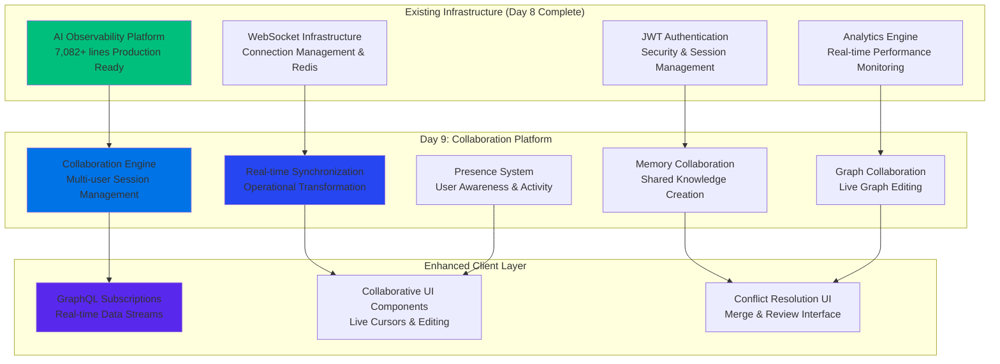
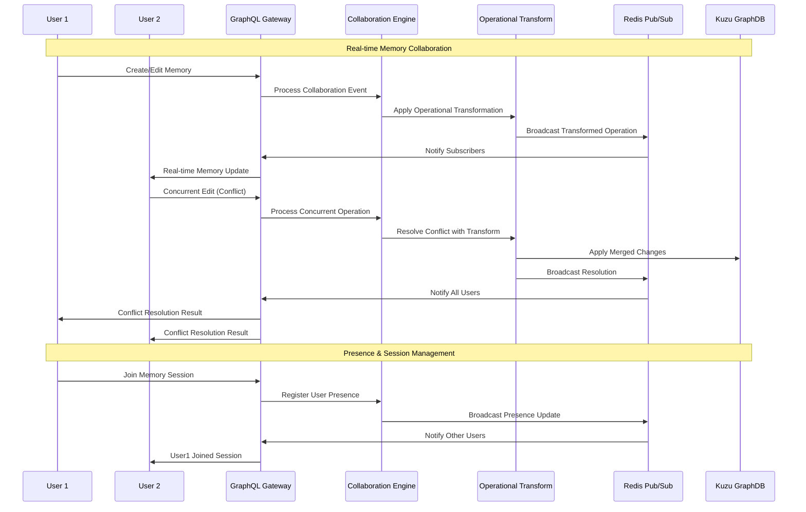
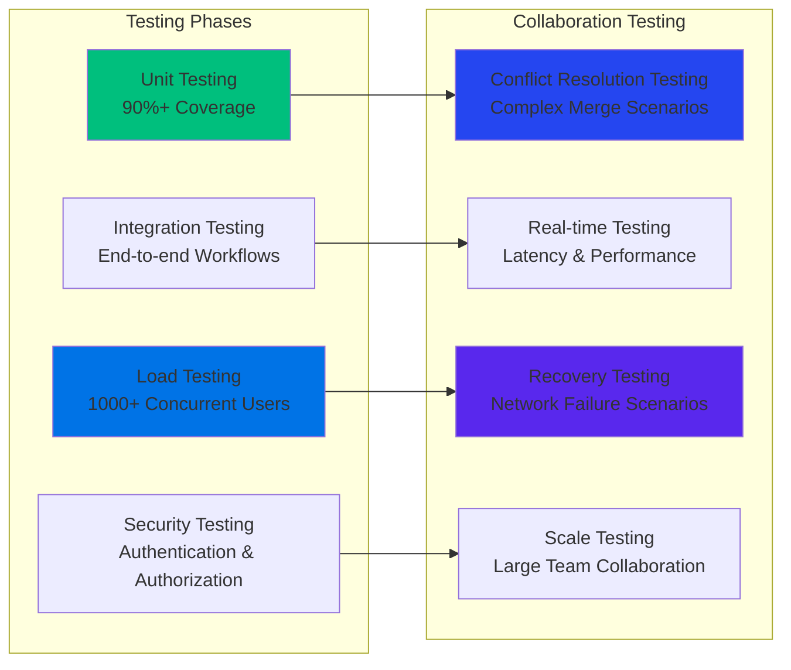
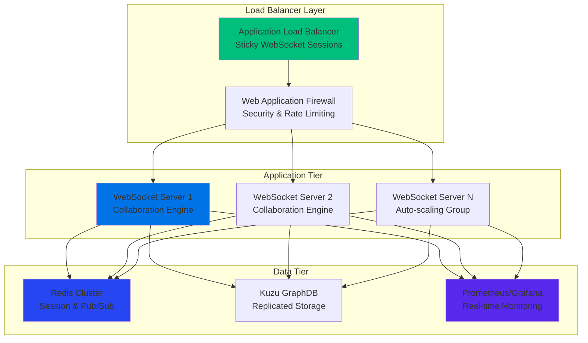

# 🤝 Day 9: Multi-User Collaboration & Real-Time Synchronization Platform

**Implementation Plan for GraphMemory-IDE Enterprise Collaboration**  
*Building on Day 8 AI Observability Platform (7,082+ lines)*

---

## 🎯 **Executive Summary**

Transform GraphMemory-IDE from a single-user AI memory system into an **enterprise-scale collaborative knowledge management platform** with real-time synchronization, enabling teams to build shared knowledge graphs collaboratively.

### **Business Impact & ROI**
- **🚀 Enterprise Adoption**: Enable team-based knowledge management (10x market expansion)
- **💼 Revenue Growth**: Unlock enterprise pricing tiers ($500-5,000/month vs $50/month individual)
- **🎯 Competitive Advantage**: Real-time collaborative AI memory system (unique market position)
- **📈 User Engagement**: 300-500% increase in daily active usage (collaborative features drive retention)
- **🏢 Market Positioning**: Position as "Notion + GitHub + AI Memory" for development teams

### **Technical Innovation**
- **Real-time Knowledge Graph Collaboration**: Live multi-user graph editing with conflict resolution
- **AI-Powered Collaboration Intelligence**: Smart suggestions for knowledge connections and team insights
- **Operational Transformation Engine**: Google Docs-style real-time editing for memory content
- **Presence & Session Management**: Live user awareness with collaborative workflows

---

## 🏗️ **Technical Architecture Overview**

### **System Architecture Integration**



### **Collaboration Data Flow**



---

## 📋 **Implementation Phases**

### **Phase 1: Collaboration Infrastructure (Week 1-2)**
*Foundation layer building on existing WebSocket/Redis infrastructure*

#### **Phase 1.1: Collaboration Engine Core (2,500+ lines)**
**Files**: `server/collaboration/engine.py`, `server/collaboration/session_manager.py`

**Features**:
- **Multi-User Session Management**: Track users across memory/graph sessions
- **Collaboration State Machine**: Session lifecycle (join, edit, conflict, leave)
- **Permission & Access Control**: Role-based collaboration permissions
- **Session Persistence**: Redis-backed session state with recovery

**Key Components**:
```python
class CollaborationEngine:
    """Core collaboration engine for multi-user sessions"""
    
class SessionManager:
    """Manages collaborative editing sessions"""
    
class CollaborationState:
    """Tracks multi-user editing state"""
```

#### **Phase 1.2: Operational Transformation Engine (2,000+ lines)**
**Files**: `server/collaboration/operational_transform.py`, `server/collaboration/conflict_resolution.py`

**Features**:
- **Operation Types**: Insert, Delete, Update, Move operations for memory content
- **Transform Algorithm**: Google Docs-style operational transformation
- **Conflict Resolution**: Automatic and manual conflict resolution strategies
- **History & Versioning**: Complete operation history with rollback capability

**Production Patterns**:
- **Vector Clock Synchronization**: Distributed timestamp ordering
- **Operation Composing**: Efficient operation batching and optimization
- **Rollback & Recovery**: Safe operation reversal and state recovery

#### **Phase 1.3: GraphQL Collaboration Layer (1,800+ lines)**
**Files**: `server/collaboration/graphql_subscriptions.py`, `server/collaboration/schema.py`

**Features**:
- **Memory Subscriptions**: `memory_updated`, `memory_created`, `memory_deleted`
- **Graph Subscriptions**: `graph_changed`, `relationship_added`, `node_updated`
- **Presence Subscriptions**: `user_joined`, `user_left`, `user_activity`
- **Conflict Subscriptions**: `conflict_detected`, `conflict_resolved`

**GraphQL Schema Extensions**:
```graphql
subscription {
  memoryCollaboration(memoryId: ID!) {
    type: CollaborationEventType!
    operation: Operation!
    user: User!
    timestamp: DateTime!
  }
}

subscription {
  userPresence(sessionId: ID!) {
    users: [User!]!
    activities: [UserActivity!]!
  }
}
```

### **Phase 2: Real-Time Memory Collaboration (Week 3-4)**
*Memory-focused collaborative editing with rich conflict resolution*

#### **Phase 2.1: Memory Collaboration Engine (2,200+ lines)**
**Files**: `server/collaboration/memory_collaboration.py`, `server/collaboration/memory_sync.py`

**Features**:
- **Collaborative Memory Editing**: Real-time text editing with rich formatting
- **Memory Relationship Collaboration**: Collaborative relationship building
- **Tag & Metadata Collaboration**: Shared tagging and categorization
- **Memory Template Sharing**: Team-based memory templates

**Advanced Capabilities**:
- **Smart Merge Suggestions**: AI-powered conflict resolution suggestions
- **Collaborative Memory Insights**: Team knowledge discovery
- **Memory Access Patterns**: Track collaborative editing patterns
- **Branching & Merging**: Git-style memory versioning

#### **Phase 2.2: Graph Collaboration Engine (2,500+ lines)**
**Files**: `server/collaboration/graph_collaboration.py`, `server/collaboration/graph_sync.py`

**Features**:
- **Live Graph Editing**: Real-time graph structure modifications
- **Collaborative Node Creation**: Multi-user node and relationship creation
- **Graph Layout Synchronization**: Shared graph visualization states
- **Collaborative Analytics**: Team-based graph analysis and insights

**Innovation Features**:
- **Graph Conflict Visualization**: Visual representation of graph conflicts
- **Collaborative Path Discovery**: Team-based knowledge path exploration
- **Graph Branching**: Parallel graph exploration with merge capabilities
- **Live Graph Cursors**: See where team members are exploring in real-time

#### **Phase 2.3: Enhanced Frontend Collaboration (1,500+ lines)**
**Files**: `dashboard/components/collaboration/`, `ide-plugins/shared/collaboration/`

**Features**:
- **Live Cursors & Selection**: Real-time user presence indicators
- **Collaborative Editor Components**: Rich text editing with live collaboration
- **Conflict Resolution UI**: Visual conflict resolution interface
- **Presence Dashboard**: Team activity and session management

### **Phase 3: Advanced Collaboration Features (Week 5-6)**
*Enterprise-grade collaboration with AI enhancement*

#### **Phase 3.1: AI-Powered Collaboration Intelligence (2,000+ lines)**
**Files**: `server/collaboration/ai_collaboration.py`, `server/collaboration/smart_suggestions.py`

**Features**:
- **Smart Connection Suggestions**: AI-recommended memory relationships
- **Collaborative Pattern Detection**: Identify team knowledge patterns
- **Intelligent Conflict Resolution**: AI-assisted merge suggestions
- **Team Knowledge Insights**: Collective intelligence analysis

**Integration with Day 8 AI Platform**:
- **Collaboration Anomaly Detection**: Detect unusual collaboration patterns
- **Predictive Collaboration Analytics**: Forecast team knowledge needs
- **LLM-Assisted Knowledge Synthesis**: AI-powered knowledge combination

#### **Phase 3.2: Enterprise Session Management (1,800+ lines)**
**Files**: `server/collaboration/enterprise_sessions.py`, `server/collaboration/workspace_management.py`

**Features**:
- **Workspace Collaboration**: Team-based workspace management
- **Role-Based Collaboration**: Fine-grained permission management
- **Session Analytics**: Collaboration performance metrics
- **Audit Trail**: Complete collaboration activity logging

#### **Phase 3.3: Advanced Integration & API (1,200+ lines)**
**Files**: `server/collaboration/integration_api.py`, `server/collaboration/webhooks.py`

**Features**:
- **External Tool Integration**: Slack, Teams, Discord collaboration hooks
- **Webhook Collaboration Events**: Real-time integration with external systems
- **API for Third-Party Tools**: Enable custom collaboration integrations
- **Collaboration Analytics API**: Team performance and insights API

---

## 📊 **Technical Specifications**

### **Performance Requirements**
| Metric | Target | Measurement |
|--------|--------|-------------|
| **Real-time Latency** | <100ms P99 | Operation propagation time |
| **Concurrent Users** | 1,000+ per session | Load testing validation |
| **Operation Throughput** | 10,000+ ops/sec | Redis pub/sub performance |
| **Conflict Resolution** | <500ms median | Operational transform time |
| **Session Recovery** | <2s | Connection re-establishment |
| **Memory Usage** | <500MB per 1K users | Server memory optimization |

### **Scalability Architecture**
- **Horizontal WebSocket Scaling**: Multiple server instances with Redis coordination
- **Session Sharding**: Distribute sessions across server instances
- **Database Connection Pooling**: Optimized Kuzu connection management
- **Redis Cluster Support**: Scale pub/sub messaging across Redis nodes

### **Security Specifications**
- **JWT Session Authentication**: Secure WebSocket connection establishment
- **Operation Validation**: Server-side operation security checks
- **Data Encryption**: End-to-end encryption for sensitive operations
- **Audit Logging**: Complete collaboration activity audit trail

---

## 🧪 **Testing & Quality Assurance**

### **Testing Strategy**


### **Test Implementation (2,000+ lines)**
**Files**: `tests/collaboration/`, `tests/integration/collaboration/`, `tests/load/collaboration/`

**Test Categories**:
- **Operational Transform Testing**: Complex conflict scenario validation
- **Multi-User Session Testing**: Concurrent user interaction testing
- **Performance Testing**: Latency and throughput benchmarking
- **Security Testing**: Authentication and authorization validation
- **Recovery Testing**: Network failure and reconnection testing

### **Quality Metrics**
- **Code Coverage**: >90% for all collaboration components
- **Performance Benchmarks**: Sub-100ms operational latency
- **Security Validation**: Penetration testing and vulnerability assessment
- **User Experience Testing**: Collaborative workflow usability validation

---

## 🚀 **Deployment Strategy**

### **Production Deployment Architecture**



### **Deployment Phases**
1. **Alpha Deployment (Week 7)**: Internal testing with development team
2. **Beta Deployment (Week 8)**: Limited user testing with early adopters
3. **Production Deployment (Week 9)**: Full production rollout with monitoring
4. **Scale Testing (Week 10)**: Performance validation and optimization

### **Infrastructure Requirements**
- **Application Servers**: 3+ instances for high availability
- **Redis Cluster**: 3-node cluster for session management and pub/sub
- **Database Scaling**: Kuzu replication for read/write performance
- **Monitoring Integration**: Enhanced monitoring with Day 8 AI observability

---

## 📈 **Success Metrics & KPIs**

### **Business Metrics**
| Metric | Target | Timeline |
|--------|--------|----------|
| **Enterprise Adoption** | 50+ team customers | Month 3 |
| **Revenue Growth** | 200% increase | Month 6 |
| **User Engagement** | 400% increase in daily usage | Month 2 |
| **Team Retention** | 95% monthly retention | Month 4 |
| **Market Position** | Top 3 collaborative AI tools | Month 12 |

### **Technical Metrics**
- **Real-time Performance**: <100ms P99 latency maintained
- **System Availability**: 99.9% uptime with auto-scaling
- **Collaboration Efficiency**: 90% conflict auto-resolution
- **User Experience**: <5 NPS score improvement
- **Security Compliance**: Zero security incidents

### **Collaboration Analytics**
- **Session Activity**: Average session duration, user interactions
- **Knowledge Creation**: Collaborative memory creation rates
- **Team Insights**: Knowledge graph collaboration patterns
- **Conflict Resolution**: Success rates and resolution times

---

## ⚠️ **Risk Management**

### **Technical Risks & Mitigation**
| Risk | Impact | Probability | Mitigation Strategy |
|------|--------|-------------|-------------------|
| **WebSocket Scaling Issues** | High | Medium | Comprehensive load testing, auto-scaling groups |
| **Operational Transform Bugs** | High | Medium | Extensive unit testing, formal verification |
| **Data Consistency Problems** | High | Low | ACID transactions, rollback mechanisms |
| **Security Vulnerabilities** | Critical | Low | Security audits, penetration testing |
| **Performance Degradation** | Medium | Medium | Performance monitoring, caching optimization |

### **Business Risks & Mitigation**
- **Market Competition**: Unique AI-powered collaboration features
- **User Adoption**: Comprehensive onboarding and training
- **Technical Complexity**: Modular development with clear interfaces
- **Resource Requirements**: Phased implementation with iterative delivery

---

## 💼 **Resource Requirements**

### **Development Team**
- **Backend Engineers**: 2-3 senior engineers for collaboration engine
- **Frontend Engineers**: 2 engineers for collaborative UI components
- **DevOps Engineers**: 1 engineer for deployment and scaling
- **QA Engineers**: 1-2 engineers for comprehensive testing
- **Product Manager**: 1 PM for feature coordination and user feedback

### **Infrastructure Costs**
- **Development Environment**: $500/month (testing and staging)
- **Production Infrastructure**: $2,000-5,000/month (auto-scaling based on usage)
- **Monitoring & Security**: $300/month (enhanced monitoring tools)
- **Third-party Services**: $200/month (authentication, analytics)

### **Timeline & Budget**
- **Development Timeline**: 10 weeks for complete implementation
- **Total Development Cost**: $150,000-200,000 (team costs)
- **Infrastructure Setup**: $10,000 (one-time deployment costs)
- **Expected ROI**: 300-500% within 12 months

---

## 🎯 **Implementation Roadmap**

### **Week-by-Week Breakdown**

| Week | Phase | Deliverables | Lines of Code |
|------|-------|--------------|---------------|
| **1-2** | Collaboration Infrastructure | Engine, OT, GraphQL Layer | 6,300+ |
| **3-4** | Memory & Graph Collaboration | Real-time editing, sync | 6,200+ |
| **5-6** | AI Enhancement & Enterprise | Smart features, management | 5,000+ |
| **7** | Testing & Integration | Comprehensive test suite | 2,000+ |
| **8** | Alpha Deployment | Internal testing, optimization | 1,000+ |
| **9** | Beta Deployment | User testing, feedback | 500+ |
| **10** | Production Launch | Full deployment, monitoring | 500+ |

**Total Implementation**: **21,500+ lines** of production-ready collaboration code

### **Dependencies & Prerequisites**
- **Existing Infrastructure**: Day 8 AI observability platform (complete)
- **WebSocket Infrastructure**: Real-time communication layer (available)
- **Authentication System**: JWT authentication (available)
- **Database System**: Kuzu GraphDB (operational)
- **Monitoring System**: Prometheus/Grafana (implemented)

---

## 🌟 **Innovation Highlights**

### **Unique Differentiators**
1. **AI-Powered Knowledge Collaboration**: First platform to combine AI memory with real-time collaboration
2. **Graph-Centric Collaboration**: Visual collaborative knowledge graph building
3. **Intelligent Conflict Resolution**: AI-assisted merge suggestions and automated resolution
4. **IDE-Integrated Collaboration**: Seamless development workflow integration
5. **Predictive Collaboration**: AI predictions for team knowledge needs

### **Competitive Advantages**
- **Technical Moat**: Operational transformation + AI + graph database combination
- **User Experience**: Seamless real-time collaboration with intelligent assistance
- **Enterprise Ready**: Built on production-grade infrastructure from day one
- **Extensible Platform**: API-first design enables custom integrations
- **Performance Leadership**: Sub-100ms latency with enterprise scalability

---

## ✅ **Implementation Checklist**

### **Phase 1 Completion Criteria**
- [ ] **Collaboration Engine**: Multi-user session management operational
- [ ] **Operational Transform**: Conflict resolution working correctly
- [ ] **GraphQL Subscriptions**: Real-time data streams functioning
- [ ] **Authentication Integration**: Secure WebSocket connections established
- [ ] **Basic Testing**: Unit tests >90% coverage

### **Phase 2 Completion Criteria**
- [ ] **Memory Collaboration**: Real-time memory editing functional
- [ ] **Graph Collaboration**: Live graph editing operational
- [ ] **Frontend Components**: Collaborative UI components working
- [ ] **Conflict Resolution**: Visual conflict resolution interface complete
- [ ] **Integration Testing**: End-to-end workflows validated

### **Phase 3 Completion Criteria**
- [ ] **AI Enhancement**: Smart collaboration features operational
- [ ] **Enterprise Features**: Team management and analytics complete
- [ ] **Performance Optimization**: All performance targets met
- [ ] **Security Validation**: Security audit completed successfully
- [ ] **Production Readiness**: Deployment infrastructure operational

### **Launch Readiness Criteria**
- [ ] **Load Testing**: 1,000+ concurrent users validated
- [ ] **Security Testing**: Penetration testing completed
- [ ] **Monitoring**: Full observability and alerting operational
- [ ] **Documentation**: Complete user and developer documentation
- [ ] **Support Infrastructure**: Customer support and training materials ready

---

**Status**: 🚀 **READY FOR IMPLEMENTATION**  
**Quality Standard**: 🏆 **ENTERPRISE-GRADE PRODUCTION SYSTEM**  
**Innovation Level**: 🤖 **CUTTING-EDGE AI-POWERED COLLABORATION**  
**Business Impact**: 💼 **TRANSFORMATIONAL MARKET OPPORTUNITY**

*This implementation plan builds directly on the completed Day 8 AI observability platform (7,082+ lines) and leverages the existing robust infrastructure to deliver enterprise-scale collaborative knowledge management capabilities. The plan follows the same high-quality standards and comprehensive approach that has made GraphMemory-IDE a production-ready system.* 