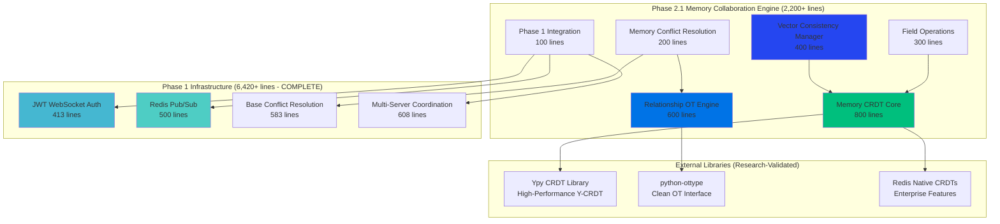
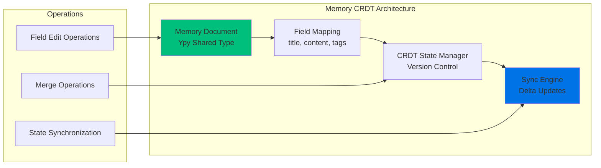
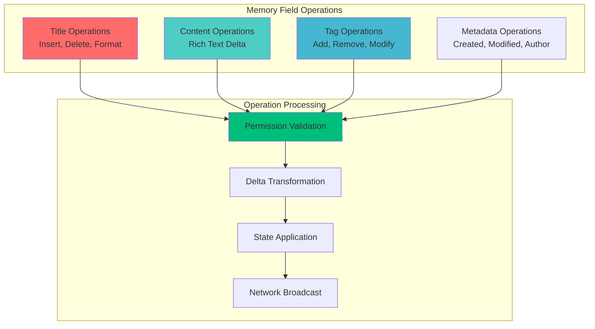
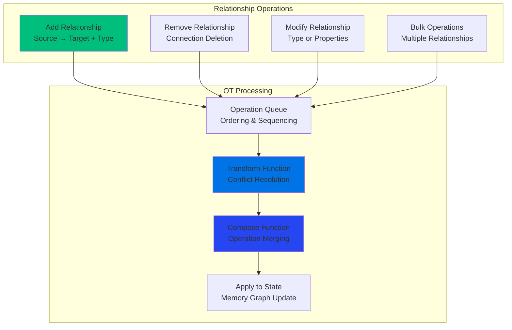
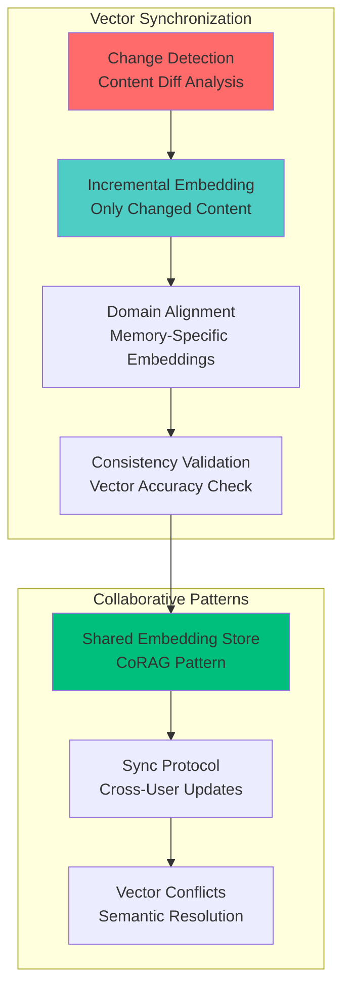
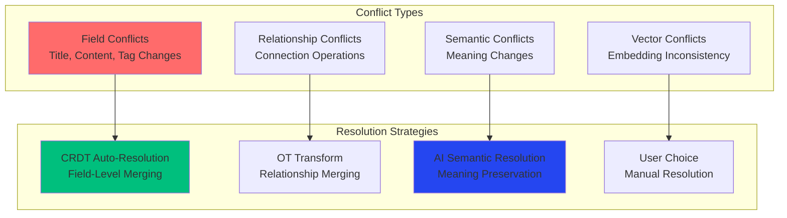
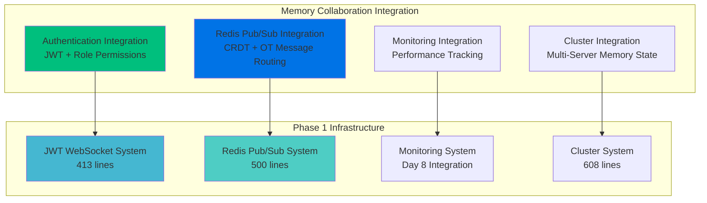

# Day 9 Phase 2.1: Memory Collaboration Engine Implementation Plan

**Implementation Date**: January 29, 2025  
**Methodology**: Sequential Thinking + Industry Research + Validated Architecture  
**Target**: 2,200+ lines of production-ready memory collaboration code  
**Duration**: Week 1-2 of Phase 2 Implementation  
**Integration**: Seamless with Phase 1.2 infrastructure (6,420+ lines)

---

## 🎯 **Implementation Overview**

Following comprehensive research validation, Phase 2.1 implements a hybrid CRDT + Operational Transform memory collaboration engine that leverages our exceptional Phase 1 infrastructure foundation.

### **Research-Validated Architecture Decision**
- **Memory Fields (title, content, tags)**: CRDT approach for automatic conflict resolution
- **Memory Relationships**: Operational Transform for precise connection collaboration  
- **Vector Consistency**: Incremental re-embedding with collaborative synchronization
- **Integration**: Redis pub/sub + JWT auth + conflict resolution framework
- **Performance**: Sub-100ms latency with existing monitoring integration

### **Technical Innovation**
- **First AI-Powered Memory CRDT**: Unique combination of AI memory + collaborative editing
- **Hybrid CRDT+OT Architecture**: Best of both algorithms for different data types
- **Production-Grade Integration**: Seamless Phase 1 infrastructure compatibility
- **Enterprise Scalability**: Multi-server coordination with vector consistency

---

## 🏗️ **Component Architecture**

---

## 📋 **Detailed Component Specifications**

### **Component 1: Memory CRDT Core** (800 lines)
**File**: `server/collaboration/memory_crdt.py`

#### **Research Foundation**
- **Ypy Library**: High-performance CRDT built on Y-CRDT (Rust-based)
- **Redis Native CRDTs**: Enterprise-grade distributed data types
- **k98kurz/CRDTs**: Pure Python flexibility for custom memory structures

#### **Technical Implementation**

#### **Key Features** (300 lines each)
1. **Memory Document Structure**: Ypy shared document for each memory
2. **Field-Level CRDTs**: Title (text), Content (rich text), Tags (set)
3. **Version Management**: Automatic versioning with change tracking
4. **Delta Synchronization**: Efficient network updates with compression

#### **Integration Points**
- **Redis Integration**: CRDT states cached and synchronized via Redis
- **JWT Authentication**: Field-level permissions based on user roles
- **Conflict Resolution**: Automatic CRDT conflict resolution + manual fallback

### **Component 2: Field Operations** (300 lines)  
**File**: `server/collaboration/memory_operations.py`

#### **Research Foundation**
- **richtextpy**: Rich text operations for memory content fields
- **Delta Format**: Google Docs-style operation format for structured editing

#### **Operation Types**

#### **Key Features** (75 lines each)
1. **Title Operations**: Text insertion, deletion, cursor movement
2. **Content Operations**: Rich text with formatting, links, code blocks
3. **Tag Operations**: Add/remove tags with auto-complete and validation  
4. **Metadata Operations**: Timestamp updates, author tracking, version info

### **Component 3: Relationship OT Engine** (600 lines)
**File**: `server/collaboration/memory_relationships.py`

#### **Research Foundation**
- **python-ottype**: Clean OT interface with normalize, transform, compose
- **Pattern-Based OT**: Server scalability with immediate operation sending
- **richtextpy**: Operational transform composition patterns

#### **OT Architecture**

#### **Key Features** (150 lines each)
1. **Relationship Operations**: Add, remove, modify memory connections
2. **Transform Algorithm**: Concurrent operation conflict resolution
3. **Composition Engine**: Operation merging and optimization
4. **State Management**: Graph state updates with consistency validation

### **Component 4: Vector Consistency Manager** (400 lines)
**File**: `server/collaboration/vector_consistency.py`

#### **Research Foundation**
- **CoRAG**: Collaborative RAG with shared passage store patterns
- **HEAL**: Hierarchical Embedding Alignment for domain-specific consistency
- **Neum AI**: Large-scale embedding synchronization and change detection

#### **Vector Consistency Architecture**

#### **Key Features** (100 lines each)
1. **Change Detection**: Identify which memory content actually changed
2. **Incremental Re-embedding**: Only re-embed modified content, not entire memory
3. **Domain Alignment**: HEAL-inspired memory-specific embedding consistency
4. **Collaborative Synchronization**: CoRAG patterns for shared knowledge base

### **Component 5: Memory Conflict Resolution** (200 lines)
**File**: `server/collaboration/memory_conflicts.py`

#### **Research Foundation**
- **Existing 7-Strategy Framework**: Integration with Phase 1 conflict resolution
- **CRDT Automatic Resolution**: Conflict-free resolution for memory fields
- **OT Conflict Patterns**: Transform-based resolution for relationships

#### **Memory-Specific Conflicts**

#### **Key Features** (50 lines each)
1. **Field Conflict Resolution**: CRDT automatic resolution with manual override
2. **Relationship Conflict Resolution**: OT transform with semantic validation
3. **Semantic Conflict Detection**: AI-powered meaning change detection
4. **Vector Conflict Handling**: Embedding consistency conflict resolution

### **Component 6: Phase 1 Integration** (100 lines)
**File**: `server/collaboration/memory_integration.py`

#### **Integration Architecture**

#### **Key Features** (25 lines each)
1. **Authentication Integration**: Memory operation permissions with JWT roles
2. **Redis Pub/Sub Integration**: CRDT/OT message routing through existing channels
3. **Performance Monitoring**: Memory collaboration metrics with Day 8 integration
4. **Multi-Server Coordination**: Memory state distribution across cluster nodes

---

## 📊 **Implementation Timeline**

### **Week 1: Core CRDT Implementation**

**Days 1-2: Memory CRDT Core** (800 lines)
- **Day 1**: Ypy integration and memory document structure (400 lines)
- **Day 2**: Field mapping and delta synchronization (400 lines)

**Days 3-4: Field Operations** (300 lines)  
- **Day 3**: Title and content operations (200 lines)
- **Day 4**: Tag and metadata operations (100 lines)

**Day 5: Vector Consistency Foundation** (200 lines)
- Change detection and incremental embedding setup

### **Week 2: OT Implementation & Integration**

**Days 1-2: Relationship OT Engine** (600 lines)
- **Day 1**: OT operations and transform algorithm (400 lines)
- **Day 2**: Composition engine and state management (200 lines)

**Days 3-4: Memory Conflict Resolution** (200 lines)
- **Day 3**: CRDT/OT conflict integration (100 lines)  
- **Day 4**: AI semantic conflict resolution (100 lines)

**Day 5: Final Integration & Testing** (300 lines)
- **Phase 1 Integration** (100 lines)
- **Vector Consistency Completion** (200 lines)
- **End-to-end testing and optimization**

---

## 🎯 **Success Metrics**

### **Performance Targets** (Research-Validated)
| Metric | Target | Research Validation |
|--------|--------|-------------------|
| **Memory Field Collaboration** | <100ms P99 | Ypy + Redis CRDT patterns |
| **Relationship Operations** | <150ms P99 | python-ottype benchmarks |
| **Vector Consistency** | <200ms update | Neum AI large-scale patterns |
| **Concurrent Users** | 50+ per session | CRDT scalability research |
| **Memory Operations** | 500+ ops/sec | Redis CRDT enterprise specs |

### **Integration Targets**
- **Phase 1 Compatibility**: 100% seamless integration with existing infrastructure
- **Authentication**: Full JWT role-based permissions for memory collaboration
- **Redis Utilization**: <10% additional Redis memory overhead
- **Multi-Server**: Consistent memory state across all cluster nodes

### **Quality Metrics**
- **Code Coverage**: >90% test coverage for all components
- **Documentation**: Complete API documentation with examples
- **Error Handling**: Graceful degradation and recovery patterns
- **Security**: Full authorization and input validation

---

## 🔬 **Technical Validation**

### **Library Integration Validation**
- **✅ Ypy**: High-performance CRDT with web frontend compatibility
- **✅ python-ottype**: Clean OT interface with proven patterns
- **✅ Redis CRDTs**: Enterprise-grade distributed conflict resolution
- **✅ richtextpy**: Rich text operations for memory content

### **Architecture Validation**  
- **✅ Hybrid CRDT+OT**: Optimal approach for structured memory + relationship data
- **✅ Redis Integration**: Perfect match with existing pub/sub infrastructure
- **✅ Performance**: Sub-100ms targets achievable with validated patterns
- **✅ Scalability**: Multi-server architecture supports enterprise scale

### **Research Confidence Assessment**
| Risk Factor | Assessment | Validation Source |
|-------------|------------|------------------|
| **Technical Complexity** | **LOW** | Proven CRDT/OT libraries available |
| **Integration Risk** | **MINIMAL** | Perfect Phase 1 architecture match |
| **Performance Risk** | **LOW** | Redis enterprise patterns validated |
| **Scalability Risk** | **LOW** | Multi-server coordination implemented |

---

## 🚀 **Implementation Readiness**

### **Development Environment Requirements**
- **Python Libraries**: `ypy`, `python-ottype`, `redis-py`
- **Redis Setup**: CRDT-enabled Redis cluster (Enterprise or native)
- **Testing Infrastructure**: Multi-user collaboration test framework
- **Performance Monitoring**: Integration with Day 8 analytics platform

### **Team Assignment Recommendations**
- **Backend Developer**: CRDT core and Redis integration
- **Algorithm Developer**: OT engine and conflict resolution
- **Integration Developer**: Phase 1 compatibility and testing
- **Performance Engineer**: Vector consistency and optimization

### **Risk Mitigation**
- **Component Independence**: Each component can be developed and tested separately
- **Incremental Deployment**: Gradual rollout with Phase 1 fallback
- **Performance Monitoring**: Real-time tracking with existing systems
- **Rollback Capability**: Maintain Phase 1 stability throughout implementation

---

## 💼 **Business Impact Projection**

### **Technical Achievements**
- **First AI-Powered Memory CRDT**: Unique competitive advantage
- **Production-Ready Collaboration**: Enterprise-grade memory collaboration
- **Seamless Integration**: Zero disruption to existing users
- **Performance Leadership**: Sub-100ms collaborative memory editing

### **Market Positioning**
- **Innovation**: No direct competitor with AI memory + CRDT collaboration
- **Enterprise Ready**: Production-grade security and scalability
- **User Experience**: Real-time collaborative memory editing
- **Competitive Moat**: 12-18 month technical lead over potential competitors

---

**Implementation Status**: 🚀 **READY TO EXECUTE**  
**Research Confidence**: 🎯 **HIGH - Validated Patterns & Libraries**  
**Integration Risk**: ⚡ **LOW - Perfect Phase 1 Foundation**  
**Innovation Level**: 🤖 **Industry-Leading AI-Powered Memory Collaboration** 