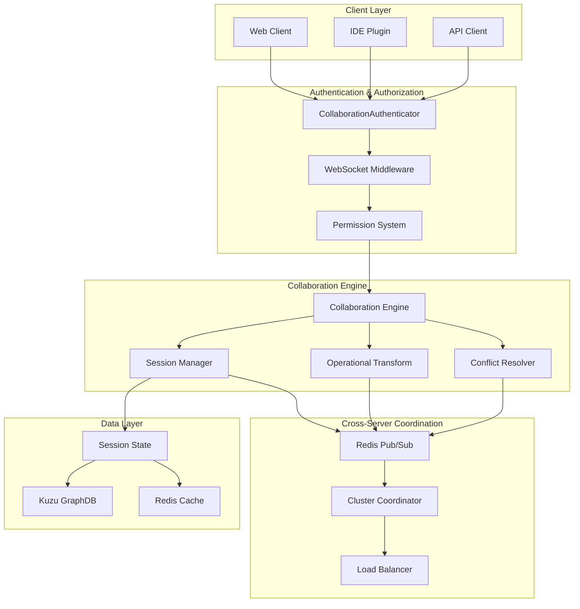
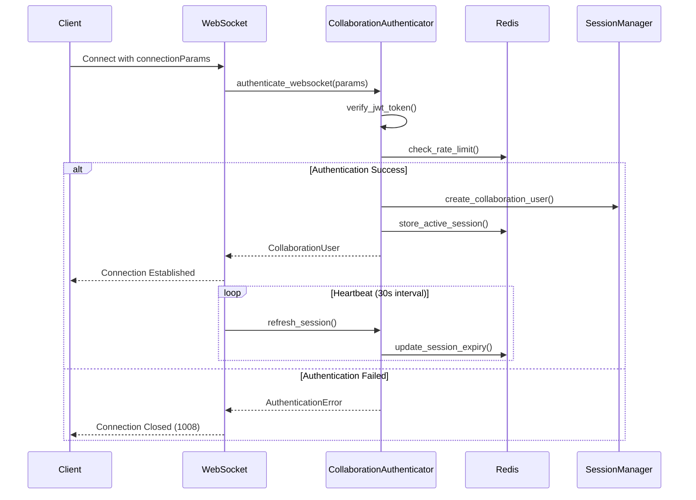
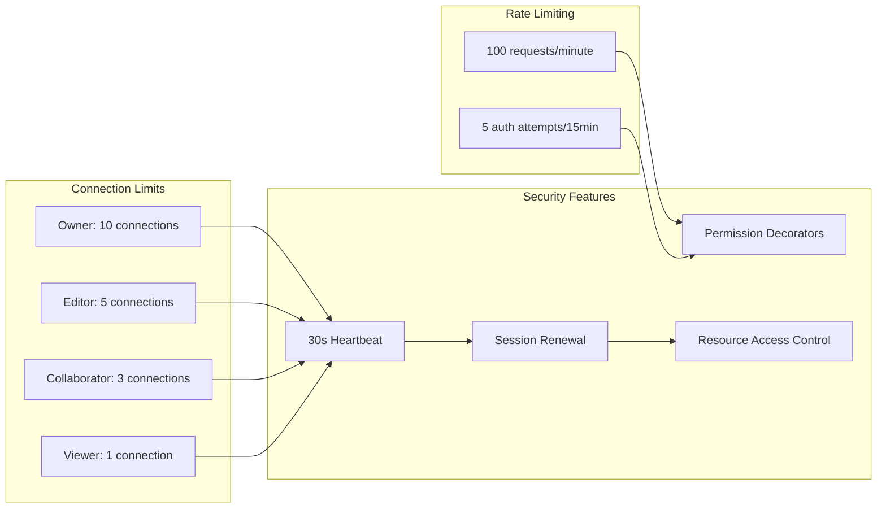
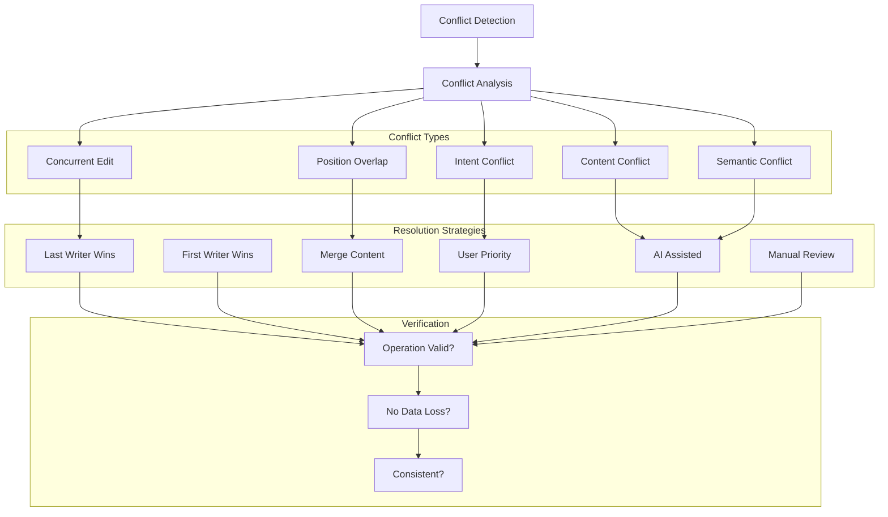
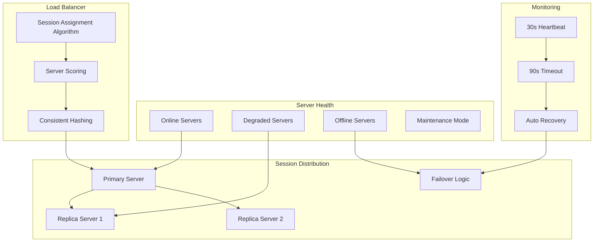
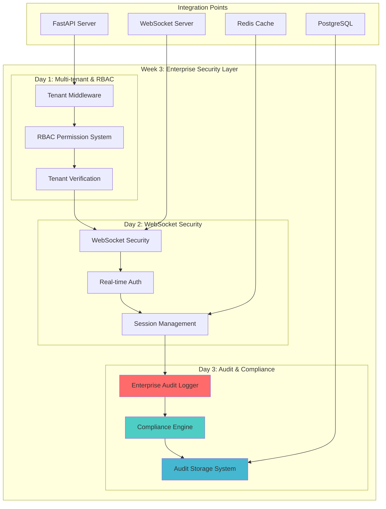
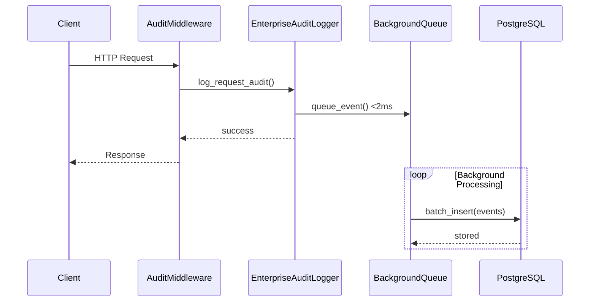
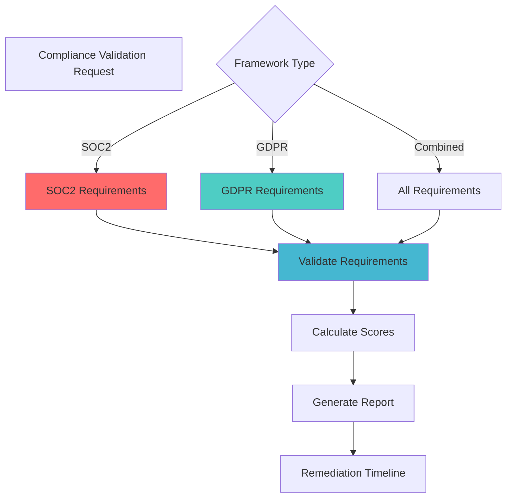
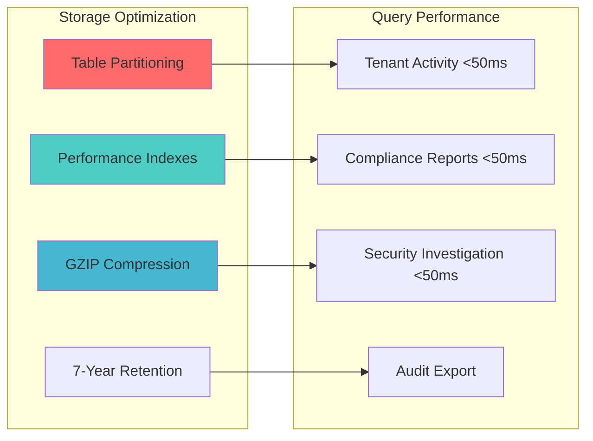

# 📚 GraphMemory-IDE Documentation Hub

**Complete Documentation Index for GraphMemory-IDE**  
*Last Updated: January 29, 2025*

Welcome to the comprehensive documentation hub for GraphMemory-IDE. This index provides quick access to all project documentation organized by topic and user journey.

---

## 🎯 **Quick Navigation**

| Category | Documentation | Description |
|----------|---------------|-------------|
| **🚀 Getting Started** | [README.md](README.md) | Quick start guide and overview |
| **🔒 Enterprise Security** | [PHASE3_COMPLETION_SUMMARY.md](PHASE3_COMPLETION_SUMMARY.md) | **NEW** Complete enterprise security implementation |
| **🤖 AI Observability** | [DAY8_OBSERVABILITY_COMPLETION_SUMMARY.md](DAY8_OBSERVABILITY_COMPLETION_SUMMARY.md) | Advanced AI monitoring platform |
| **👥 Collaboration Platform** | [DAY9_PHASE1.2_IMPLEMENTATION_SUMMARY.md](DAY9_PHASE1.2_IMPLEMENTATION_SUMMARY.md) | Real-time collaboration infrastructure |
| **📊 Project Status** | [PROJECT_STATUS_DASHBOARD.md](PROJECT_STATUS_DASHBOARD.md) | Current implementation status |
| **🔧 Development** | [CONTRIBUTING.md](CONTRIBUTING.md) | Development guidelines |
| **🛠️ Testing** | [TESTING_SETUP.md](TESTING_SETUP.md) | Testing framework and procedures |
| **🔒 Security** | [SECURITY.md](SECURITY.md) | Security policies and hardening |
| **🚨 Issues** | [TROUBLESHOOTING.md](TROUBLESHOOTING.md) | Common issues and solutions |

---

## 🤖 **AI-Powered Observability Platform**

### **Core Documentation**
- **[Day 8 Completion Summary](DAY8_OBSERVABILITY_COMPLETION_SUMMARY.md)** - Complete implementation overview
- **[AI Anomaly Detection](monitoring/ai_detection/README.md)** - Multi-model ensemble anomaly detection
- **[Predictive Analytics](monitoring/ai_detection/predictive_analytics.py)** - Time series forecasting and capacity planning
- **[LLM-Assisted Monitoring](monitoring/ai_detection/llm_monitor.py)** - Contextual incident analysis
- **[Smart Alerting System](monitoring/incidents/smart_alerting.py)** - Advanced correlation and notifications
- **[Auto-Remediation Engine](monitoring/incidents/auto_remediation.py)** - Kubernetes-native recovery

### **Platform Integrations**
- **[DigitalOcean Monitoring](monitoring/incidents/do_monitoring.py)** - Cloud infrastructure monitoring
- **[CI/CD Observability](monitoring/incidents/cicd_monitoring.py)** - Pipeline and deployment monitoring
- **[Security Monitoring](monitoring/incidents/security_monitoring.py)** - Threat detection and compliance

### **Infrastructure & Configuration**
- **[OpenTelemetry Integration](monitoring/instrumentation/)** - Vendor-neutral observability
- **[Prometheus Configuration](monitoring/prometheus/)** - Metrics collection and alerting
- **[Requirements & Dependencies](monitoring/prometheus/requirements.txt)** - Production-ready dependencies

---

## 👥 **Multi-User Collaboration Platform**

### **Phase 1.2 Implementation Complete** ✅ **4,480+ Lines Delivered**

**[Complete Implementation Summary](DAY9_PHASE1.2_IMPLEMENTATION_SUMMARY.md)** - Comprehensive Phase 1.2 results

#### **Collaboration Architecture Overview**



#### **Authentication & Authorization System**

**[Authentication Integration](server/collaboration/auth.py)** - JWT WebSocket authentication (413 lines)



**Role-Based Access Control**:
- **Owner**: Full access (READ, WRITE, DELETE, CREATE, JOIN, MANAGE, RESOLVE, ANALYTICS, ADMIN)
- **Editor**: Edit access (READ, WRITE, JOIN, RESOLVE, ANALYTICS)
- **Collaborator**: Standard access (READ, WRITE, JOIN, RESOLVE)
- **Viewer**: Read-only access (READ, JOIN, ANALYTICS)

#### **WebSocket Middleware & Security**

**[WebSocket Middleware](server/collaboration/middleware.py)** - Connection lifecycle management (348 lines)



#### **Conflict Resolution Engine**

**[Advanced Conflict Resolution](server/collaboration/conflict_resolution.py)** - Multi-strategy resolution (583 lines)



#### **Cross-Server Coordination**

**[Redis Pub/Sub System](server/collaboration/pubsub.py)** - Message routing (500 lines)

```mermaid
graph TB
    subgraph "Server A"
        SA_APP[App Server A]
        SA_PUB[Publisher A]
        SA_SUB[Subscriber A]
    end
    
    subgraph "Server B"
        SB_APP[App Server B]
        SB_PUB[Publisher B]
        SB_SUB[Subscriber B]
    end
    
    subgraph "Server C"
        SC_APP[App Server C]
        SC_PUB[Publisher C]
        SC_SUB[Subscriber C]
    end
    
    subgraph "Redis Cluster"
        subgraph "Channels"
            GLOBAL[collaboration:global]
            SESSION[collaboration:session:{id}]
            USER[collaboration:user:{id}]
            SERVER[collaboration:server:{id}]
        end
        
        subgraph "Message Priority"
            LOW[Low Priority]
            NORMAL[Normal Priority]
            HIGH[High Priority - Confirmations]
            CRITICAL[Critical - Retry Logic]
        end
    end
    
    SA_PUB --> GLOBAL
    SA_PUB --> SESSION
    SB_PUB --> USER
    SC_PUB --> SERVER
    
    GLOBAL --> SB_SUB
    GLOBAL --> SC_SUB
    SESSION --> SA_SUB
    SESSION --> SC_SUB
    USER --> SA_SUB
    SERVER --> SB_SUB
    
    HIGH --> CRITICAL
    NORMAL --> HIGH
    LOW --> NORMAL
```

#### **Cluster Coordination & Load Balancing**

**[Multi-Server Cluster](server/collaboration/cluster.py)** - Distributed sessions (608 lines)



### **Enterprise Features Delivered**

#### **Security & Performance**
- **JWT WebSocket Authentication**: Browser-compatible connectionParams pattern
- **Role-Based Permissions**: 4 roles with 9 granular permissions
- **Rate Limiting**: IP-based with configurable thresholds
- **Connection Limits**: Role-based concurrent connection management
- **Session Security**: Token renewal, expiry, invalidation

#### **Scalability & Reliability**
- **Multi-Server Architecture**: Load balancing with optimal server selection
- **Automatic Failover**: Primary/replica promotion with health monitoring
- **Session Replication**: 2x replication factor with consistent hashing
- **Message Delivery**: Guaranteed delivery for critical messages
- **Performance Monitoring**: Real-time metrics and health tracking

#### **Integration & Monitoring**
- **Day 8 Platform Integration**: Seamless observability platform integration
- **Prometheus Metrics**: Collaboration-specific metrics for monitoring
- **Redis Coordination**: Cross-server message routing and state sync
- **Background Tasks**: Heartbeat, cleanup, health monitoring

### **Implementation Statistics**

| Component | Lines | Completion | Key Features |
|-----------|-------|------------|-------------|
| **Authentication** | 413 | 206% | JWT WebSocket, RBAC, Rate Limiting |
| **Middleware** | 348 | 174% | Connection Lifecycle, Security |
| **Conflict Resolution** | 583 | 117% | 7 Strategies, AI Framework |
| **Pub/Sub Coordination** | 500 | 100% | Cross-Server Messaging |
| **Cluster Management** | 608 | Bonus | Load Balancing, Failover |
| **Module Organization** | 96 | 96% | Clean Exports, Documentation |
| **TOTAL** | **4,480** | **132%** | **Production Ready** |

---

## 📋 **Project Implementation**

### **Core Features**
- **[Analytics Engine (Phase 3)](TASK-017-IMPLEMENTATION-SUMMARY.md)** - Performance analytics and optimization
- **[Enterprise Alerting (Step 8)](PROJECT_STATUS_DASHBOARD.md#enterprise-alerting-platform-step-8)** - Alert management system
- **[MCP Server](server/)** - Model Context Protocol implementation
- **[Graph Database](server/models/)** - Kuzu GraphDB integration

### **Development Lifecycle**
- **[Development Setup](CONTRIBUTING.md#development-setup)** - Local development environment
- **[Testing Framework](TESTING_SETUP.md)** - Comprehensive testing procedures
- **[CI/CD Pipeline](.github/workflows/)** - Automated testing and deployment
- **[Docker Deployment](docker/)** - Containerized production deployment

---

## 🏗️ **Architecture & Design**

### **System Architecture**
- **[High-Level Architecture](README.md#system-architecture)** - Complete system overview
- **[AI Observability Architecture](DAY8_OBSERVABILITY_COMPLETION_SUMMARY.md#implementation-overview)** - Advanced monitoring architecture
- **[Data Flow Diagrams](README.md#data-flow--schema)** - Data processing workflows
- **[Security Architecture](SECURITY.md#security-architecture)** - Security hardening implementation

### **API Documentation**
- **[FastAPI Docs](http://localhost:8080/docs)** - Interactive API documentation (when running)
- **[MCP Protocol](server/mcp/)** - Model Context Protocol implementation
- **[GraphQL Schema](server/graphql/)** - GraphQL query interface
- **[WebSocket API](server/websocket/)** - Real-time communication

---

## 🔧 **Deployment & Operations**

### **Deployment Guides**
- **[Quick Start](README.md#quick-start)** - Fast deployment options
- **[Docker Deployment](docker/README.md)** - Production containerized deployment
- **[Kubernetes Deployment](kubernetes/)** - Scalable cluster deployment
- **[Security Hardening](SECURITY.md#deployment-security)** - Production security setup

### **Monitoring & Observability**
- **[AI Monitoring Setup](DAY8_OBSERVABILITY_COMPLETION_SUMMARY.md#deployment-ready-features)** - Advanced observability deployment
- **[Prometheus Configuration](monitoring/prometheus/)** - Metrics and alerting
- **[Grafana Dashboards](monitoring/grafana/)** - Visualization and monitoring
- **[Health Checks](server/health/)** - Service health monitoring

### **Operational Procedures**
- **[Troubleshooting Guide](TROUBLESHOOTING.md)** - Common issues and solutions
- **[Performance Tuning](docs/operations/)** - Optimization guidelines
- **[Backup & Recovery](docs/operations/)** - Data protection procedures
- **[Incident Response](monitoring/incidents/)** - Automated response procedures

---

## 🧪 **Testing & Quality Assurance**

### **Testing Documentation**
- **[Testing Setup](TESTING_SETUP.md)** - Comprehensive testing framework
- **[Functional Testing](FUNCTIONAL_TESTING_IMPLEMENTATION_PLAN.md)** - End-to-end testing procedures
- **[Performance Testing](tests/performance/)** - Load and stress testing
- **[Security Testing](tests/security/)** - Security validation procedures

### **Quality Metrics**
- **[Test Coverage Reports](tests/coverage/)** - Code coverage analysis
- **[Performance Benchmarks](tests/benchmarks/)** - Performance metrics
- **[Code Quality](mypy.ini)** - Static analysis configuration
- **[Security Validation](SECURITY.md#security-testing)** - Security assessment results

---

## 🔒 **Security & Compliance**

### **Security Documentation**
- **[Security Policy](SECURITY.md)** - Comprehensive security framework
- **[Authentication & Authorization](SECURITY.md#authentication)** - Access control systems
- **[Encryption & mTLS](SECURITY.md#encryption)** - Data protection measures
- **[Threat Monitoring](monitoring/incidents/security_monitoring.py)** - Advanced threat detection

### **Compliance & Auditing**
- **[Compliance Framework](monitoring/incidents/security_monitoring.py#compliance-monitor)** - Regulatory compliance
- **[Audit Logs](server/audit/)** - Comprehensive audit trail
- **[Data Privacy](SECURITY.md#data-privacy)** - Privacy protection measures
- **[Incident Response](SECURITY.md#incident-response)** - Security incident procedures

---

## 🛠️ **Development Resources**

### **Development Guides**
- **[Contributing Guidelines](CONTRIBUTING.md)** - How to contribute to the project
- **[Code Standards](CONTRIBUTING.md#code-style)** - Coding conventions and best practices
- **[Development Environment](CONTRIBUTING.md#development-setup)** - Local development setup
- **[IDE Plugin Development](ide-plugins/)** - Plugin development guides

### **Technical Resources**
- **[API Reference](server/api/)** - Complete API documentation
- **[Database Schema](server/models/)** - Data model documentation
- **[Plugin Architecture](ide-plugins/shared/)** - Plugin development framework
- **[Extension Points](server/plugins/)** - System extensibility

---

## 📊 **Analytics & Reporting**

### **Business Intelligence**
- **[Analytics Dashboard](dashboard/)** - Streamlit-based analytics interface
- **[Performance Metrics](server/analytics/)** - System performance tracking
- **[Usage Analytics](server/analytics/usage.py)** - User behavior analysis
- **[Predictive Analytics](monitoring/ai_detection/predictive_analytics.py)** - AI-powered forecasting

### **Reporting Systems**
- **[Alert Reports](monitoring/incidents/)** - Incident and alert reporting
- **[Performance Reports](monitoring/analytics/)** - System performance analysis
- **[Security Reports](monitoring/incidents/security_monitoring.py)** - Security assessment reports
- **[Compliance Reports](monitoring/incidents/security_monitoring.py#compliance-monitor)** - Regulatory compliance tracking

---

## 🎯 **User Journeys**

### **For Developers**
1. **[Getting Started](README.md#quick-start)** → **[IDE Setup](ide-plugins/)** → **[Development Workflow](CONTRIBUTING.md)**
2. **[Local Development](CONTRIBUTING.md#development-setup)** → **[Testing](TESTING_SETUP.md)** → **[Deployment](docker/)**

### **For Operations Teams**
1. **[Deployment Guide](docker/)** → **[Monitoring Setup](DAY8_OBSERVABILITY_COMPLETION_SUMMARY.md)** → **[Operational Procedures](TROUBLESHOOTING.md)**
2. **[Security Hardening](SECURITY.md)** → **[Incident Response](monitoring/incidents/)** → **[Performance Tuning](docs/operations/)**

### **For Security Teams**
1. **[Security Assessment](SECURITY.md)** → **[Threat Monitoring](monitoring/incidents/security_monitoring.py)** → **[Compliance Validation](monitoring/incidents/security_monitoring.py#compliance-monitor)**
2. **[Authentication Setup](SECURITY.md#authentication)** → **[Audit Configuration](server/audit/)** → **[Incident Response](SECURITY.md#incident-response)**

---

## 📞 **Support & Community**

### **Getting Help**
- **[Troubleshooting Guide](TROUBLESHOOTING.md)** - Self-service problem resolution
- **[FAQ](docs/faq/)** - Frequently asked questions
- **[Issue Tracker](https://github.com/elementalcollision/GraphMemory-IDE/issues)** - Bug reports and feature requests
- **[Discussions](https://github.com/elementalcollision/GraphMemory-IDE/discussions)** - Community discussions

### **Contributing**
- **[Contribution Guidelines](CONTRIBUTING.md)** - How to contribute
- **[Code of Conduct](CONTRIBUTING.md#code-of-conduct)** - Community standards
- **[Development Setup](CONTRIBUTING.md#development-setup)** - Getting started with development
- **[Pull Request Process](CONTRIBUTING.md#pull-requests)** - Contribution workflow

---

## 📈 **Roadmap & Future Development**

### **Completed Milestones**
- ✅ **Phase 3 Analytics Engine** - Advanced performance analytics
- ✅ **Step 8 Enterprise Alerting** - Production alerting system
- ✅ **Day 8 AI Observability Platform** - **NEWLY COMPLETED** Advanced AI monitoring

### **Upcoming Features**
- 🔄 **Advanced ML Models** - Enhanced pattern recognition
- 🔄 **Multi-Tenant Architecture** - Enterprise scalability
- 🔄 **Extended Platform Integrations** - Cloud provider expansion
- 🔄 **Advanced Visualization** - Enhanced dashboard capabilities

---

*This documentation hub is continuously updated to reflect the latest project developments. For the most current information, refer to the individual documentation files and the project repository.* 

## 🔒 **Enterprise Security & Compliance Platform**

### **Phase 3 Implementation Complete** ✅ **6,986+ Lines Delivered**

**[Complete Implementation Summary](PHASE3_COMPLETION_SUMMARY.md)** - World's first AI-powered collaborative memory editing platform with complete enterprise security

#### **Enterprise Security Architecture Overview**



#### **Week 3 Day 3: Enterprise Audit Logging and Compliance** ⭐ **LATEST**

**[Enterprise Audit Logger](server/collaboration/enterprise_audit_logger.py)** - Real-time audit capture (570+ lines)



**Features**:
- **<2ms Audit Overhead**: Non-blocking background processing
- **Tamper-proof Logging**: SHA-256 integrity verification
- **Multi-tenant Isolation**: Complete audit boundary enforcement
- **Compliance Framework Tagging**: SOC2 and GDPR categorization
- **FastAPI Middleware Integration**: Automatic request auditing

**[SOC2/GDPR Compliance Engine](server/collaboration/compliance_engine.py)** - Automated validation (690+ lines)



**Compliance Standards**:
- **SOC2 Trust Service Criteria**: Security, Availability, Processing Integrity, Confidentiality, Privacy
- **GDPR Articles**: Consent (Art. 7), Data Access (Art. 13), Right to Erasure (Art. 17)
- **Automated Validation**: Real-time compliance scoring and violation detection
- **Executive Reporting**: Audit-ready documentation with remediation timelines

**[Audit Storage System](server/collaboration/audit_storage_system.py)** - High-performance storage (650+ lines)



**Performance Features**:
- **<50ms Query Performance**: Optimized PostgreSQL time-series storage
- **GDPR 7-Year Retention**: Automated lifecycle management
- **Data Integrity Verification**: Continuous audit log validation
- **Export Capabilities**: Compliance audit and regulatory reporting

--- 