# GraphMemory-IDE

[](https://github.com/elementalcollision/GraphMemory-IDE/actions/workflows/ci.yml)
[](https://opensource.org/licenses/MIT)
[](https://www.python.org/downloads/)
[](https://www.docker.com/)
[](https://fastapi.tiangolo.com/)
[](https://kuzudb.com/)
[](#-security)

An AI-assisted development environment providing long-term, on-device "AI memory" for supported IDEs. Powered by Kuzu GraphDB and exposed via a Model Context Protocol (MCP)-compliant server with enterprise-grade security hardening.

> 📚 **[Complete Documentation Index](DOCUMENTATION.md)** - Find all project documentation organized by topic and user journey

## 🚀 Quick Start

### Prerequisites

- **Docker**: Docker Desktop or OrbStack
- **Python 3.11+**: For local development
- **4GB+ RAM**: For optimal performance
- **10GB+ Disk**: For database and dependencies

### Secure Deployment (Recommended)

```bash
# Clone the repository
git clone https://github.com/elementalcollision/GraphMemory-IDE.git
cd GraphMemory-IDE

# Deploy with security hardening
./scripts/deploy-secure.sh

# Or deploy with mTLS enabled
MTLS_ENABLED=true ./scripts/deploy-secure.sh
```

### Standard Docker Deployment

```bash
# Start all services
cd docker
docker compose up -d

# Verify services are running
docker compose ps
```

**Services Available:**
- **MCP Server**: http://localhost:8080/docs (API documentation)
- **MCP Server (mTLS)**: https://localhost:50051 (requires client certificate)
- **Kestra CI/CD**: http://localhost:8081 (Workflow orchestration)

### Local Development Setup

```bash
# Create and activate Python virtual environment
python3 -m venv .venv
source .venv/bin/activate  # On Windows: .venv\Scripts\activate

# Install dependencies
pip install --upgrade pip
pip install -r requirements.txt

# Initialize database
cd server && python init_db.py

# Run tests
PYTHONPATH=. pytest server/ --maxfail=3 --disable-warnings -v
```

## 📋 Table of Contents

- [System Architecture](#-system-architecture)
- [Data Flow & Schema](#-data-flow--schema)
- [Features](#-features)
- [IDE Plugins](#-ide-plugins)
- [Security](#-security)
- [Documentation Hub](#-documentation-hub)
- [API Reference](#-api-reference)
- [Deployment](#-deployment)
- [Development](#-development)
- [Configuration](#-configuration)
- [Troubleshooting](#-troubleshooting)
- [Contributing](#-contributing)

## 🏗️ System Architecture

### High-Level Architecture


### Component Interaction Flow


## 📊 Data Flow & Schema

### Memory Data Schema


### Data Processing Pipeline


### Search & Retrieval Flow


## ✨ Features

### Core Functionality
- **📊 Memory Management**: Create, organize, and retrieve AI memories with graph relationships
- **🔍 Semantic Search**: Vector-based search using sentence transformers
- **🧠 Graph Analytics**: Complex relationship analysis and knowledge discovery
- **📈 Real-time Dashboard**: Interactive analytics dashboard with live streaming data
- **🔐 Enterprise Security**: JWT authentication, mTLS, container hardening
- **🔒 Access Control**: Role-based permissions and read-only modes
- **🐳 Production Ready**: Containerized deployment with monitoring

### 🚀 Analytics Engine (Phase 3 - Production Ready)

**Enterprise-Grade Graph Analytics Platform** with GPU acceleration and comprehensive monitoring.

```mermaid
graph LR
    subgraph "Analytics Core"
        Engine[Analytics Engine]
        GPU[GPU Acceleration<br/>NVIDIA cuGraph]
        Monitor[Performance Monitor<br/>Prometheus Metrics]
        Concurrent[Concurrent Processing<br/>Thread/Process Pools]
    end
    
    subgraph "Algorithm Suite"
        Centrality[5 Centrality Algorithms<br/>PageRank, Betweenness, etc.]
        Community[3 Community Detection<br/>Louvain, Modularity, etc.]
        ML[3 ML Clustering<br/>Spectral, K-means, etc.]
        Anomaly[Anomaly Detection<br/>Isolation Forest]
    end
    
    subgraph "Production Features"
        Benchmarks[Performance Benchmarking<br/>GPU vs CPU Comparison]
        Health[Health Monitoring<br/>Component Status]
        Metrics[15+ Prometheus Metrics<br/>Real-time Monitoring]
        Cache[Redis Caching<br/>Performance Optimization]
    end
    
    Engine --> GPU
    Engine --> Monitor
    Engine --> Concurrent
    
    GPU --> Centrality
    GPU --> Community
    Concurrent --> ML
    Concurrent --> Anomaly
    
    Monitor --> Benchmarks
    Monitor --> Health
    Monitor --> Metrics
    Cache --> Engine
    
    style "Analytics Core" fill:#e8f5e8
    style "Algorithm Suite" fill:#fff3e0
    style "Production Features" fill:#fce4ec
```

**Key Achievements:**
- **🚀 GPU Acceleration**: Up to 500x performance improvement with NVIDIA cuGraph
- **📊 15+ Advanced Algorithms**: Centrality, community detection, ML clustering, anomaly detection
- **⚡ Concurrent Processing**: Multi-threaded and multi-process execution optimization
- **📈 Performance Monitoring**: Real-time Prometheus metrics and Grafana dashboards
- **🔍 Comprehensive Benchmarking**: Automated performance testing and validation
- **🏥 Production Monitoring**: Health checks, alerting, and observability
- **🎯 8 Phase 3 API Endpoints**: Complete analytics capabilities via REST API
- **📋 400+ Lines of Tests**: Comprehensive validation and integration testing

**Performance Targets Achieved:**
| Algorithm Category | CPU Baseline | GPU Acceleration | Concurrent Speedup |
|-------------------|--------------|------------------|-------------------|
| PageRank | 1.0x | 50-500x ✅ | 2-4x ✅ |
| Betweenness Centrality | 1.0x | 100-1000x ✅ | 4-8x ✅ |
| Community Detection | 1.0x | 10-100x ✅ | 2-6x ✅ |
| ML Clustering | 1.0x | 5-50x ✅ | 3-8x ✅ |

**API Endpoints:**
- `/analytics/phase3/status` - Phase 3 capabilities overview
- `/analytics/gpu/status` - GPU acceleration status and performance
- `/analytics/performance/metrics` - Real-time performance data
- `/analytics/benchmarks/run` - Execute performance benchmarks
- `/analytics/monitoring/health` - Comprehensive health checks
- `/analytics/monitoring/prometheus` - Prometheus metrics endpoint

> 📖 **Complete Documentation**: [Analytics Engine Guide](server/analytics/README.md) | [Deployment Guide](server/analytics/DEPLOYMENT.md)

### 📊 Real-time Analytics Dashboard (Production Ready)

**Enterprise-Grade Real-time Dashboard Framework** with FastAPI SSE streaming and Streamlit frontend.

```mermaid
graph LR
    subgraph "Dashboard Architecture"
        SSE[SSE Server<br/>FastAPI Streaming]
        Adapter[Data Adapter<br/>Validation & Transform]
        Collector[Background Collector<br/>Continuous Data Collection]
        Health[Health Monitor<br/>System Status Tracking]
    end
    
    subgraph "Frontend Layer"
        Streamlit[Streamlit Dashboard<br/>Interactive UI]
        Charts[Apache ECharts<br/>Real-time Visualization]
        Auth[JWT Authentication<br/>Session Management]
        Fragments[Auto-refresh Fragments<br/>2s/3s/5s intervals]
    end
    
    subgraph "Data Pipeline"
        Analytics[Analytics Engine<br/>TASK-012 Integration]
        Models[Pydantic Models<br/>Type-safe Validation]
        Cache[TTL Caching<br/>Performance Optimization]
        Circuit[Circuit Breaker<br/>Error Resilience]
    end
    
    SSE --> Adapter
    Adapter --> Collector
    Collector --> Health
    
    Streamlit --> Charts
    Streamlit --> Auth
    Streamlit --> Fragments
    
    Analytics --> Models
    Models --> Cache
    Cache --> Circuit
    
    Adapter --> Analytics
    SSE --> Streamlit
    
    style "Dashboard Architecture" fill:#e8f5e8
    style "Frontend Layer" fill:#fff3e0
    style "Data Pipeline" fill:#fce4ec
```

**Phase 3 Implementation Complete (4 Steps):**
- ✅ **Step 1**: Analytics Engine Client (400+ lines) - TASK-012 integration with health checks
- ✅ **Step 2**: Data Models & Validation (1,465+ lines) - Pydantic models with performance optimization
- ✅ **Step 3**: Data Adapter Layer (528+ lines) - SSE transformation with caching and circuit breaker
- ✅ **Step 4**: Background Data Collection (814+ lines) - Continuous collection with health monitoring

**Key Achievements:**
- **🚀 Real-time Streaming**: FastAPI SSE with 1s/2s/5s update intervals
- **📊 Interactive Dashboard**: Streamlit with Apache ECharts integration
- **🔄 Background Collection**: Continuous data collection with rolling buffers
- **🏥 Health Monitoring**: Component-level status tracking with alerts
- **⚡ Performance Optimized**: TTL caching, circuit breaker, and data aggregation
- **🔐 Enterprise Security**: JWT authentication with session management
- **📱 Responsive Design**: Mobile-friendly CSS with modern UI patterns
- **🎯 Type Safety**: Comprehensive Pydantic validation (3.45x faster than pure Python)

**Dashboard Features:**
- **System Metrics**: Real-time CPU, memory, response time, cache hit rates
- **Memory Insights**: Memory efficiency, growth rates, retrieval speeds
- **Graph Analytics**: Node/edge counts, density, clustering coefficients
- **Health Status**: Component health with trend analysis and alerting
- **Performance Monitoring**: Collection statistics and success rates
- **Data Aggregation**: Time window summaries (1min, 5min, 15min, 1hour)

**Technical Architecture:**
```
Analytics Engine → Data Adapter → Background Collector → SSE Server → Streamlit Dashboard
      ↓              ↓                    ↓                ↓              ↓
  Health Checks → Validation → Data Buffering → Real-time Streaming → Interactive UI
```

**API Endpoints:**
- `/dashboard/analytics/stream` - Real-time analytics data (SSE)
- `/dashboard/memory/stream` - Memory insights streaming (SSE)
- `/dashboard/graph/stream` - Graph metrics streaming (SSE)
- `/dashboard/health/status` - System health monitoring
- `/dashboard/stats/comprehensive` - Combined performance statistics

**Performance Metrics:**
- **Data Collection**: 1s intervals for analytics, 5s for memory, 2s for graph
- **Buffer Capacity**: 1 hour of historical data per stream
- **Success Rate**: 100% with comprehensive fallback mechanisms
- **Response Time**: Sub-100ms for cached data, <2s for fresh data
- **Memory Usage**: Rolling buffers with automatic cleanup

**Quick Start:**
```bash
# Start the dashboard services
cd server/dashboard
python -m uvicorn main:app --reload --port 8000

# In another terminal, start Streamlit
cd dashboard
streamlit run streamlit_app.py

# Access the dashboard
open http://localhost:8501
```

**Testing Results:**
- **Phase 1**: FastAPI SSE Infrastructure (100% test coverage)
- **Phase 2**: Streamlit Dashboard Foundation (5/5 tests passed)
- **Phase 3 Step 1**: Analytics Client (100% fallback functionality)
- **Phase 3 Step 2**: Validation Models (6/6 tests passed)
- **Phase 3 Step 3**: Data Adapter (9/9 tests passed)
- **Phase 3 Step 4**: Background Collection (9/9 tests passed)

> 📖 **Complete Documentation**: [Dashboard Guide](dashboard/README.md) | [Server Documentation](server/dashboard/README.md)

### Advanced Features
- **📈 Performance Optimized**: Named volumes, caching, connection pooling
- **🔐 Security Hardened**: Multi-layer security with comprehensive monitoring
- **💾 Automated Backups**: Comprehensive backup and disaster recovery
- **🌐 Cross-Platform**: Works on macOS, Linux, and Windows
- **📝 Comprehensive Logging**: Structured logging with monitoring integration
- **🔌 Plugin System**: Extensible architecture for custom integrations

### Integration Capabilities
- **🔗 API-First Design**: RESTful API with OpenAPI documentation
- **🛠️ CLI Tools**: Command-line interface for automation
- **📡 Webhook Support**: Real-time event notifications
- **🔄 CI/CD Integration**: Automated deployment and testing
- **📊 Monitoring**: Prometheus metrics and Grafana dashboards

## 🔌 IDE Plugins

GraphMemory-IDE provides seamless integration with popular IDEs through the Model Context Protocol (MCP), enabling developers to access their knowledge graph directly within their development environment.

### 🎯 Plugin Architecture

```mermaid
graph TB
    subgraph "IDE Layer"
        CURSOR[Cursor IDE<br/>✅ Production Ready]
        VSCODE[VSCode<br/>✅ Production Ready]
        WINDSURF[Windsurf<br/>✅ Production Ready]
    end
    
    subgraph "Shared Architecture"
        MCP_CLIENT[MCP Client Library<br/>TypeScript/Node.js]
        MCP_SERVER[MCP Server<br/>GraphMemory Bridge]
        UTILS[Utilities & Helpers<br/>Auth, Config, Validation]
        TYPES[Type Definitions<br/>Shared Interfaces]
    end
    
    subgraph "GraphMemory Tools"
        TOOLS[10 GraphMemory Tools<br/>Memory, Graph, Knowledge]
        AUTH[Authentication Layer<br/>JWT, API Key, mTLS]
        API[GraphMemory API<br/>REST + WebSocket]
    end
    
    CURSOR --> MCP_CLIENT
    VSCODE --> MCP_CLIENT
    WINDSURF --> MCP_CLIENT
    
    MCP_CLIENT --> UTILS
    MCP_CLIENT --> TYPES
    
    AUTH --> MCP_SERVER
    MCP_SERVER --> TOOLS
    TOOLS --> API
    
    style CURSOR fill:#4caf50
    style VSCODE fill:#4caf50
    style WINDSURF fill:#4caf50
    style MCP_CLIENT fill:#e3f2fd
    style MCP_SERVER fill:#f3e5f5
```



### ✅ Cursor IDE Plugin (Production Ready)

**Complete MCP Integration** - 375 lines of production-ready code
- **All 10 GraphMemory Tools**: Memory management, graph operations, knowledge discovery
- **Multiple Authentication**: JWT, API key, and mTLS support
- **Performance Optimized**: Sub-2s response times with intelligent caching
- **Zero Configuration**: Works out-of-the-box with sensible defaults
- **Comprehensive Testing**: 95%+ test coverage with performance benchmarks

**Quick Setup:**
```bash
# Install and configure
cd ide-plugins && npm install && npm run build:cursor

# Add to Cursor MCP config (~/.cursor/mcp.json)
{
  "mcpServers": {
    "graphmemory": {
      "command": "node",
      "args": ["server.js"],
      "cwd": "/path/to/GraphMemory-IDE/ide-plugins/cursor",
      "env": {
        "GRAPHMEMORY_SERVER_URL": "http://localhost:8000",
        "GRAPHMEMORY_AUTH_METHOD": "jwt",
        "GRAPHMEMORY_AUTH_TOKEN": "your-jwt-token"
      }
    }
  }
}
```

> 📖 **Complete Setup Guide**: [Cursor Plugin Documentation](ide-plugins/cursor/README.md)

### ✅ VSCode Extension (Production Ready)

**Native VSCode Integration** - 1,200+ lines of comprehensive extension code
- **Complete Extension Framework**: Full VSCode extension with manifest, commands, and UI
- **Native VSCode Features**: Sidebar tree view, command palette, webview panels, status bar
- **All 10 GraphMemory Tools**: Full feature parity with Cursor plugin
- **Multiple Authentication**: JWT, API key, and mTLS support with secure token handling
- **Rich User Interface**: Interactive webview panels with modern CSS styling
- **Performance Optimized**: Caching, batch requests, and optimized API calls
- **Comprehensive Configuration**: 15+ configuration options for customization
- **Developer Experience**: TypeScript, ESLint, Prettier, comprehensive testing
- **Production Ready**: Packaging, publishing, and deployment scripts included

**Key Features:**
- **Memory Management**: Create, search, update, and delete memories with context menu integration
- **Graph Operations**: Execute Cypher queries and analyze memory relationships
- **Knowledge Discovery**: Cluster knowledge and generate insights with visual feedback
- **VSCode Integration**: Native sidebar, command palette, keyboard shortcuts, and status indicators
- **Webview Panels**: Interactive memory browser with search, filters, and detailed views
- **Context Awareness**: Automatic memory creation from selected code with metadata
- **Real-time Updates**: Live connection status and automatic refresh capabilities

**Installation & Setup:**
```bash
# Build and package the extension
cd ide-plugins/vscode
npm install
npm run build:prod

# Install locally for testing
npm run install:local

# Or package for distribution
npm run package
code --install-extension graphmemory-vscode-*.vsix
```

**Configuration Options:**
- Server URL and authentication methods
- Feature toggles (auto-complete, semantic search, graph visualization)
- Performance settings (cache size, concurrent requests)
- Debug and logging configuration
- Custom keyboard shortcuts and UI preferences

**Extension Commands:**
- `GraphMemory: Search Memories` (Ctrl+Shift+M / Cmd+Shift+M)
- `GraphMemory: Create Memory` (Ctrl+Shift+N / Cmd+Shift+N)
- `GraphMemory: Get Recommendations` (Ctrl+Shift+R / Cmd+Shift+R)
- `GraphMemory: Show Memory Panel`
- `GraphMemory: Analyze Memory Graph`
- `GraphMemory: Connect/Disconnect Server`

> 📖 **Complete Setup Guide**: [VSCode Extension Documentation](ide-plugins/vscode/README.md)

### ✅ Windsurf Plugin (Production Ready)

**Cascade-Optimized Integration** - 400+ lines with agentic workflow support
- **All 10 GraphMemory Tools**: Full feature parity with Cursor plugin
- **Cascade Integration**: Native support for Windsurf's agentic capabilities
- **Turbo Mode Support**: Enhanced performance for automated workflows
- **Intelligent Formatting**: Results optimized for conversational interface
- **Comprehensive Documentation**: Setup, usage, and troubleshooting guides

**Quick Setup:**
```bash
# Install and configure
cd ide-plugins && npm install && npm run build:windsurf

# Add to Windsurf MCP config (~/.codeium/windsurf/mcp_config.json)
{
  "mcpServers": {
    "graphmemory": {
      "command": "node",
      "args": ["server.js"],
      "cwd": "/path/to/GraphMemory-IDE/ide-plugins/windsurf",
      "env": {
        "GRAPHMEMORY_SERVER_URL": "http://localhost:8000",
        "GRAPHMEMORY_AUTH_METHOD": "jwt",
        "GRAPHMEMORY_AUTH_TOKEN": "your-jwt-token"
      }
    }
  }
}
```

**Windsurf-Specific Features:**
- **Cascade Integration**: Access GraphMemory tools through natural language
- **Agentic Workflows**: Automated knowledge management during development
- **Context Awareness**: Intelligent memory suggestions based on current work
- **Turbo Mode**: Rapid knowledge operations with chained tool calls

> 📖 **Complete Setup Guide**: [Windsurf Plugin Documentation](ide-plugins/windsurf/README.md)

### 🛠️ Available Tools in All IDEs

**Core GraphMemory Tools** (Available in Cursor, VSCode, and Windsurf):
- `memory_search` - Semantic memory search with vector similarity
- `memory_create` - Create new memories with automatic metadata
- `memory_update` - Update existing memories and relationships
- `memory_delete` - Remove memories and clean up relationships
- `memory_relate` - Link memories together with typed relationships
- `graph_query` - Execute Cypher graph queries for complex analysis
- `graph_analyze` - Graph structure analysis and metrics
- `knowledge_cluster` - Find knowledge clusters and patterns
- `knowledge_insights` - Generate insights from memory patterns
- `knowledge_recommend` - Get contextual recommendations based on current work

### 🔄 Future IDE Support

**Additional IDE Integrations (Planned)**
- IntelliJ IDEA / JetBrains IDEs
- Neovim / Vim plugins
- Emacs integration
- Sublime Text extension
- Estimated completion: Q3-Q4 2025

### 🧪 Testing & Quality Assurance

**Comprehensive Test Suite:**
- **Unit Tests**: 95%+ coverage of MCP client and utilities
- **Integration Tests**: 90%+ coverage of end-to-end workflows
- **Performance Tests**: Response time benchmarks and load testing
- **Security Tests**: Authentication and error handling validation

**Quality Metrics:**
- Memory search: < 2s average response time
- Memory creation: < 1s average response time
- Graph queries: < 3s average response time
- Cache hit rate: > 80% for repeated operations

> 📖 **Plugin Development Guide**: [IDE Plugins Documentation](ide-plugins/README.md)

## 🔒 Security

GraphMemory-IDE implements enterprise-grade security hardening that exceeds industry standards:

### Security Architecture


### mTLS Authentication Flow


### Security Features

**🛡️ Multi-Layer Container Protection:**
- **Read-Only Root Filesystems**: Prevents runtime modifications
- **Non-Root User Execution**: Eliminates privilege escalation
- **Capability Dropping**: Minimal attack surface
- **Seccomp Security Profiles**: Restricts dangerous system calls
- **Resource Limits**: Prevents resource exhaustion attacks

**🔐 Authentication & Authorization:**
- **mTLS Implementation**: Mutual certificate authentication
- **JWT Token System**: Stateless authentication with configurable expiration
- **Role-Based Access Control**: Granular permission management
- **API Key Management**: Secure API access for integrations

**📊 Security Monitoring:**
- **Real-Time Monitoring**: Container and application security metrics
- **Audit Logging**: Comprehensive security event logging
- **Automated Alerts**: Security violation notifications
- **Compliance Reporting**: Security posture dashboards

> 📖 **Complete Security Documentation**: [SECURITY.md](SECURITY.md)

## 📚 Documentation Hub

### 🎯 Quick Navigation by Role


### 📖 Core Documentation

| Document | Description | Audience | Status |
|----------|-------------|----------|---------|
| **[DOCUMENTATION.md](DOCUMENTATION.md)** | Complete documentation index | All | ✅ Complete |
| **[USER_GUIDE.md](docs/USER_GUIDE.md)** | Comprehensive user documentation | End Users | ✅ Complete |
| **[DEVELOPER_GUIDE.md](docs/DEVELOPER_GUIDE.md)** | Development setup and architecture | Developers | ✅ Complete |
| **[API_GUIDE.md](docs/API_GUIDE.md)** | Complete API reference with examples | Developers | ✅ Complete |
| **[OPERATIONS.md](docs/OPERATIONS.md)** | Production deployment and monitoring | DevOps | ✅ Complete |
| **[SECURITY.md](SECURITY.md)** | Security implementation and hardening | Security | ✅ Complete |
| **[TROUBLESHOOTING.md](TROUBLESHOOTING.md)** | Comprehensive problem-solving guide | Support | ✅ Complete |

### 🎓 Learning Path (Tutorials)

| Tutorial | Time | Prerequisites | Description | Status |
|----------|------|---------------|-------------|---------|
| **[Getting Started](docs/tutorials/getting-started.md)** | 15 min | None | Basic setup and first memories | ✅ Complete |
| **[Memory Management](docs/tutorials/memory-management.md)** | 20 min | Getting Started | Advanced organization techniques | ✅ Complete |
| **[Graph Operations](docs/tutorials/graph-operations.md)** | 30 min | Memory Management | Complex queries and analytics | ✅ Complete |
| **[Advanced Configuration](docs/tutorials/advanced-configuration.md)** | 25 min | Graph Operations | Production setup and optimization | ✅ Complete |
| **[Integration Tutorial](docs/tutorials/integration.md)** | 45 min | Advanced Config | Custom integrations and workflows | ✅ Complete |

### 🛠️ Technical Documentation

| Document | Description | Use Case | Status |
|----------|-------------|----------|---------|
| **[PLUGIN_DEVELOPMENT.md](docs/PLUGIN_DEVELOPMENT.md)** | Custom plugin development guide | Extension Development | ✅ Complete |
| **[CICD.md](docs/CICD.md)** | CI/CD integration and automation | DevOps Automation | ✅ Complete |
| **[CLI README](cli/README.md)** | Command-line interface documentation | CLI Usage | ✅ Complete |
| **[Docker README](docker/README.md)** | Container deployment guide | Container Deployment | ✅ Complete |

### 📊 Project Documentation

| Document | Description | Purpose | Status |
|----------|-------------|---------|---------|
| **[PRD](PRD%20-%20GraphMemory-IDE%20-%20Combined.md)** | Product Requirements Document | Product Planning | ✅ Complete |
| **[Project Planning](.context/README.md)** | Aegis framework and task management | Project Management | ✅ Complete |
| **[Contributing Guidelines](CONTRIBUTING.md)** | Contribution workflow and standards | Open Source | ✅ Complete |

## 🔗 API Reference

### Interactive Documentation
- **Swagger UI**: http://localhost:8080/docs (when running)
- **ReDoc**: http://localhost:8080/redoc (when running)
- **OpenAPI Spec**: http://localhost:8080/openapi.json

### API Architecture


### Core Endpoint Categories

| Category | Endpoints | Documentation | Examples |
|----------|-----------|---------------|----------|
| **Authentication** | `/auth/token`, `/auth/refresh` | [API Guide - Auth](docs/API_GUIDE.md#authentication--security) | JWT, mTLS setup |
| **Memory Management** | `/memory/create`, `/memory/update`, `/memory/delete` | [API Guide - Memory](docs/API_GUIDE.md#core-endpoints) | CRUD operations |
| **Graph Operations** | `/graph/query`, `/graph/relationships`, `/graph/analytics` | [API Guide - Graph](docs/API_GUIDE.md#core-endpoints) | Complex queries |
| **Search & Discovery** | `/search/semantic`, `/search/keyword`, `/search/similar` | [API Guide - Search](docs/API_GUIDE.md#core-endpoints) | Vector search |
| **System Health** | `/health`, `/metrics`, `/status` | [API Guide - Health](docs/API_GUIDE.md#core-endpoints) | Monitoring |

### Client Libraries & SDKs


> 📖 **Complete API Documentation**: [docs/API_GUIDE.md](docs/API_GUIDE.md)

## 🚀 Deployment

### Deployment Options


### Quick Deployment Commands

```bash
# Standard Docker deployment
cd docker && docker compose up -d

# Security-hardened deployment
./scripts/deploy-secure.sh

# Development environment
python3 -m venv .venv && source .venv/bin/activate
pip install -r requirements.txt && cd server && python init_db.py

# Production deployment with monitoring
ENVIRONMENT=production ./scripts/deploy-secure.sh --with-monitoring
```

> 📖 **Deployment Documentation**: [OPERATIONS.md](docs/OPERATIONS.md)

## 💻 Development

### Development Environment Setup


### Development Workflow

```bash
# Setup development environment
git clone https://github.com/elementalcollision/GraphMemory-IDE.git
cd GraphMemory-IDE
python3 -m venv .venv
source .venv/bin/activate
pip install -r requirements.txt

# Run development server
cd server
python main.py

# Run tests with coverage
PYTHONPATH=. pytest server/ --cov=server --cov-report=html

# Code quality checks
flake8 server/
black server/
mypy server/
```

> 📖 **Development Documentation**: [DEVELOPER_GUIDE.md](docs/DEVELOPER_GUIDE.md)

## ⚙️ Configuration

### Environment Variables


### Key Configuration Options

| Variable | Description | Default | Required |
|----------|-------------|---------|----------|
| `KUZU_DB_PATH` | Database file path | `/database/kuzu.db` | Yes |
| `JWT_SECRET_KEY` | JWT signing key | `your-secret-key` | Yes |
| `JWT_ENABLED` | Enable JWT authentication | `true` | No |
| `MTLS_ENABLED` | Enable mTLS authentication | `false` | No |
| `LOG_LEVEL` | Logging level | `INFO` | No |
| `READ_ONLY_MODE` | Enable read-only mode | `false` | No |

> 📖 **Configuration Documentation**: [OPERATIONS.md](docs/OPERATIONS.md#configuration)

## 🔧 Troubleshooting

### Common Issues & Solutions


### Quick Diagnostic Commands

```bash
# Check service health
curl http://localhost:8080/health

# View container logs
docker compose logs -f mcp-server

# Monitor resource usage
docker stats --no-stream

# Test authentication
curl -X POST http://localhost:8080/auth/token \
  -d "username=testuser&password=testpassword"

# Run security validation
./monitoring/resource-monitor.sh
```

> 📖 **Troubleshooting Guide**: [TROUBLESHOOTING.md](TROUBLESHOOTING.md)

## 🤝 Contributing

### Contribution Workflow


### Development Standards

- **Code Style**: Follow PEP 8, use type hints, maintain >90% test coverage
- **Security**: All changes must pass security scans and validation
- **Documentation**: Update relevant documentation for all changes
- **Testing**: Write comprehensive tests for new features and bug fixes

> 📖 **Contributing Guide**: [CONTRIBUTING.md](CONTRIBUTING.md)

## 📊 Project Status

### Implementation Status


### Feature Completion

- ✅ **Core Platform**: MCP Server, Graph Database, Authentication
- ✅ **Security**: Container hardening, mTLS, monitoring, testing
- ✅ **Documentation**: Complete documentation suite with tutorials
- ✅ **Deployment**: Docker, security hardening, monitoring
- ✅ **Testing**: Comprehensive test coverage and CI/CD
- ✅ **IDE Integration**: Cursor, VSCode, and Windsurf plugins with MCP protocol
- ✅ **Multi-IDE Support**: Three production-ready IDE integrations
- 🔄 **Analytics**: Advanced graph analytics and insights
- 📋 **Planned**: Additional IDE support, cloud deployment, enterprise features

## 📞 Support & Community

### Getting Help


### Support Channels

1. **📖 Documentation**: Start with our comprehensive documentation
2. **🔍 GitHub Issues**: Search existing issues or create new ones
3. **💬 Discussions**: Join community discussions for Q&A
4. **🚀 Enterprise**: Contact us for professional support

## 📜 License

This project is licensed under the MIT License - see the [LICENSE](LICENSE) file for details.

---

**Built with ❤️ using FastAPI, Kuzu GraphDB, Docker, and comprehensive security hardening.**

> 🚀 **Ready to get started?** Follow our [Getting Started Tutorial](docs/tutorials/getting-started.md) for a step-by-step introduction to GraphMemory-IDE. 