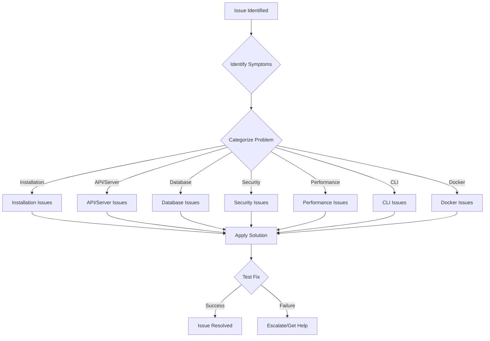
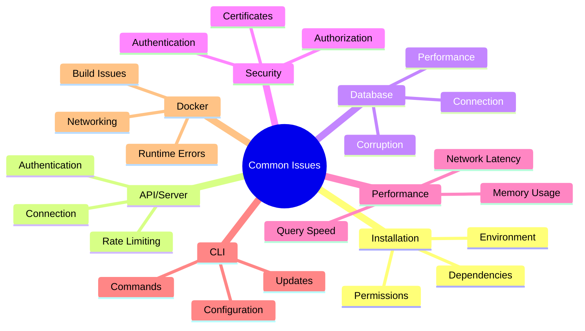
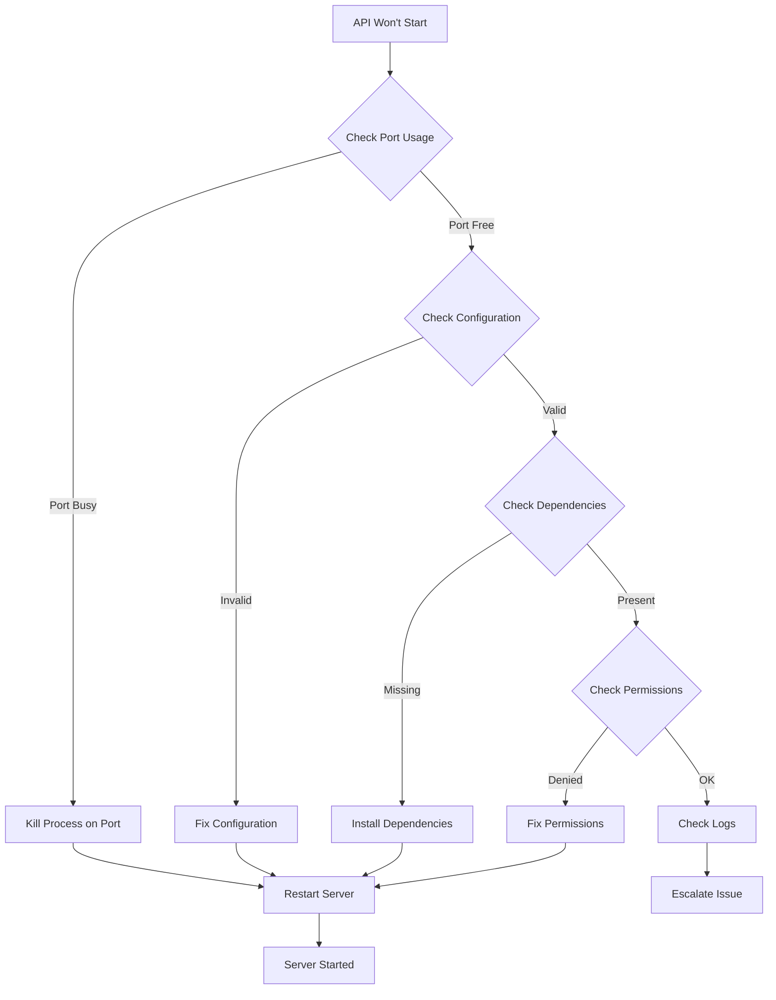
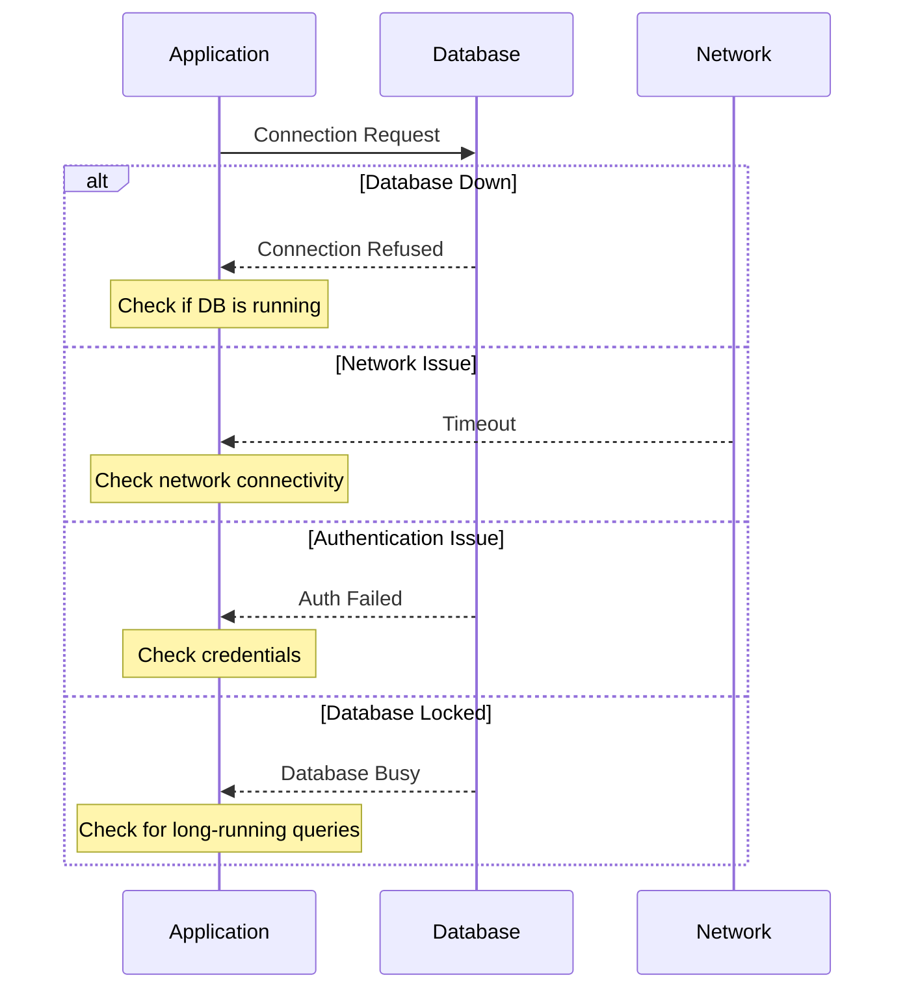
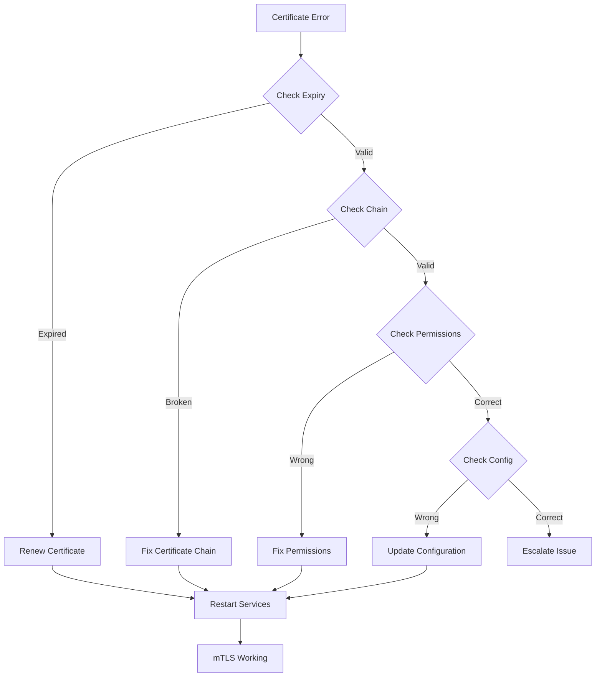
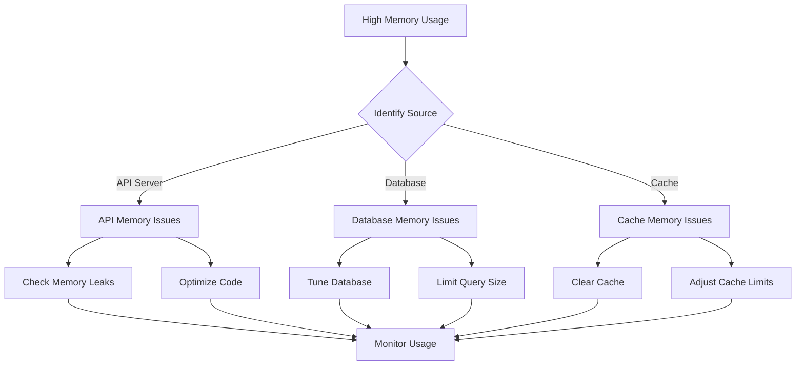
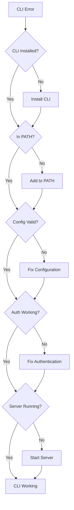
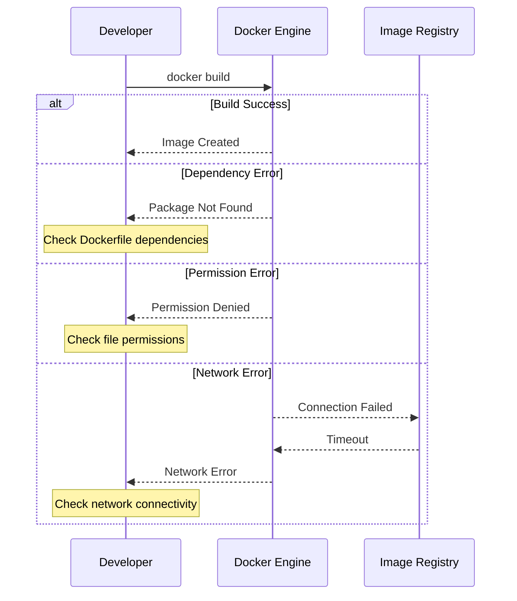
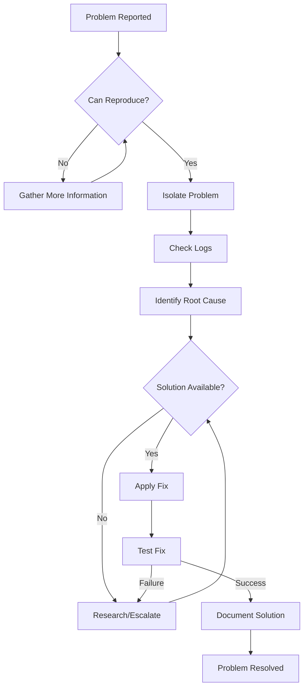

# GraphMemory-IDE Troubleshooting Guide

## 📚 Table of Contents

- [Quick Reference](#quick-reference)
- [Common Issues](#common-issues)
- [Installation & Setup](#installation--setup)
- [API & Server Issues](#api--server-issues)
- [Database & Storage](#database--storage)
- [Security & Authentication](#security--authentication)
- [Performance Issues](#performance-issues)
- [CLI & Client Issues](#cli--client-issues)
- [Docker & Container Issues](#docker--container-issues)
- [Debugging Workflows](#debugging-workflows)
- [Getting Help](#getting-help)

## 🚀 Quick Reference

### Troubleshooting Workflow



### Emergency Commands

```bash
# Check system status
./scripts/health-check.sh

# View logs
docker-compose logs -f

# Restart services
docker-compose restart

# Reset database (⚠️ DATA LOSS)
./scripts/reset-database.sh

# Generate diagnostic report
./scripts/generate-diagnostics.sh
```

### Log Locations

| Component | Log Location | Description |
|-----------|--------------|-------------|
| API Server | `/var/log/graphmemory/api.log` | Main API server logs |
| Database | `/var/log/graphmemory/kuzu.log` | Kuzu database logs |
| CLI | `~/.graphmemory/cli.log` | CLI operation logs |
| Docker | `docker logs <container_name>` | Container-specific logs |
| Security | `/var/log/graphmemory/security.log` | Authentication and security events |

## 🔧 Common Issues

### Issue Categories



## 🛠️ Installation & Setup

### Problem: Installation Fails with Dependency Errors

**Symptoms:**
- `pip install` fails with package conflicts
- Missing system dependencies
- Python version compatibility issues

**Solution:**
1. **Check Python version:**
   ```bash
   python --version  # Should be 3.8+
   ```

2. **Create clean virtual environment:**
   ```bash
   python -m venv .venv
   source .venv/bin/activate  # Linux/Mac
   # or
   .venv\Scripts\activate  # Windows
   ```

3. **Install dependencies:**
   ```bash
   pip install --upgrade pip
   pip install -r requirements.txt
   ```

4. **Install system dependencies (Ubuntu/Debian):**
   ```bash
   sudo apt-get update
   sudo apt-get install build-essential python3-dev
   ```

**Cause:** Conflicting package versions or missing system-level dependencies required for compilation.

---

### Problem: Permission Denied Errors

**Symptoms:**
- Cannot create files in project directory
- Docker commands fail with permission errors
- Scripts are not executable

**Solution:**
1. **Fix file permissions:**
   ```bash
   chmod +x scripts/*.sh
   chmod +x cli/index.mjs
   ```

2. **Fix Docker permissions (Linux):**
   ```bash
   sudo usermod -aG docker $USER
   # Log out and back in
   ```

3. **Fix directory ownership:**
   ```bash
   sudo chown -R $USER:$USER /path/to/project
   ```

**Cause:** Incorrect file permissions or user not in Docker group.

---

### Problem: Environment Variables Not Loading

**Symptoms:**
- Application uses default values instead of configured ones
- "Environment variable not found" errors
- Configuration not taking effect

**Solution:**
1. **Check .env file exists:**
   ```bash
   ls -la .env
   ```

2. **Verify .env format:**
   ```bash
   # Correct format (no spaces around =)
   API_HOST=localhost
   API_PORT=8080
   
   # Incorrect format
   API_HOST = localhost  # ❌ Spaces around =
   ```

3. **Load environment manually:**
   ```bash
   source .env  # Linux/Mac
   # or
   set -a; source .env; set +a  # More robust
   ```

**Cause:** Missing .env file, incorrect format, or environment not loaded in current shell.

## 🌐 API & Server Issues

### Problem: API Server Won't Start

**Symptoms:**
- "Port already in use" error
- Server exits immediately
- Cannot connect to API endpoints

**Diagnostic Flow:**



**Solution:**
1. **Check port usage:**
   ```bash
   lsof -i :8080  # Check what's using port 8080
   netstat -tulpn | grep 8080
   ```

2. **Kill process on port:**
   ```bash
   sudo kill -9 $(lsof -t -i:8080)
   ```

3. **Check configuration:**
   ```bash
   # Validate configuration
   python -c "import yaml; yaml.safe_load(open('config.yml'))"
   ```

4. **Start with debug mode:**
   ```bash
   uvicorn main:app --host 0.0.0.0 --port 8080 --reload --log-level debug
   ```

**Cause:** Port conflicts, configuration errors, or missing dependencies.

---

### Problem: API Returns 500 Internal Server Error

**Symptoms:**
- All API requests return 500 status
- Generic error messages
- No specific error details

**Solution:**
1. **Check server logs:**
   ```bash
   tail -f /var/log/graphmemory/api.log
   # or
   docker logs graphmemory-api -f
   ```

2. **Enable debug mode:**
   ```bash
   export API_DEBUG=true
   uvicorn main:app --reload
   ```

3. **Test database connection:**
   ```bash
   python -c "
   from server.database import test_connection
   test_connection()
   "
   ```

4. **Check memory usage:**
   ```bash
   free -h
   docker stats
   ```

**Cause:** Database connection issues, memory exhaustion, or unhandled exceptions.

---

### Problem: Authentication Failures

**Symptoms:**
- 401 Unauthorized responses
- JWT token validation errors
- mTLS handshake failures

**Solution:**
1. **Verify JWT token:**
   ```bash
   # Decode JWT (without verification)
   python -c "
   import jwt
   token = 'your_jwt_token'
   print(jwt.decode(token, options={'verify_signature': False}))
   "
   ```

2. **Check token expiration:**
   ```bash
   # Check if token is expired
   date -d @$(echo $JWT_PAYLOAD | jq -r '.exp')
   ```

3. **Verify mTLS certificates:**
   ```bash
   # Check certificate validity
   openssl x509 -in client.crt -text -noout
   openssl verify -CAfile ca.crt client.crt
   ```

4. **Test authentication endpoint:**
   ```bash
   curl -X POST http://localhost:8080/auth/login \
     -H "Content-Type: application/json" \
     -d '{"username": "test", "password": "test"}'
   ```

**Cause:** Expired tokens, invalid certificates, or misconfigured authentication.

## 🗄️ Database & Storage

### Problem: Database Connection Failed

**Symptoms:**
- "Connection refused" errors
- Timeout when connecting to database
- Database queries fail

**Database Troubleshooting Flow:**



**Solution:**
1. **Check database status:**
   ```bash
   # For Docker
   docker ps | grep kuzu
   docker logs kuzu-db
   
   # For native installation
   systemctl status kuzu
   ```

2. **Test connection:**
   ```bash
   # Test basic connectivity
   telnet localhost 7687
   
   # Test with kuzu client
   kuzu-shell -h localhost -p 7687
   ```

3. **Check database files:**
   ```bash
   ls -la data/kuzu/
   # Look for .lock files or corruption
   ```

4. **Restart database:**
   ```bash
   docker-compose restart kuzu-db
   # or
   systemctl restart kuzu
   ```

**Cause:** Database service down, network connectivity issues, or database corruption.

---

### Problem: Database Performance Issues

**Symptoms:**
- Slow query responses
- High memory usage
- Database timeouts

**Solution:**
1. **Check query performance:**
   ```cypher
   // Enable query profiling
   PROFILE MATCH (n:Memory) RETURN count(n);
   ```

2. **Monitor resource usage:**
   ```bash
   # Check database memory usage
   docker stats kuzu-db
   
   # Check disk I/O
   iostat -x 1
   ```

3. **Optimize queries:**
   ```cypher
   // Create indexes for frequently queried properties
   CREATE INDEX ON :Memory(type);
   CREATE INDEX ON :Memory(created_at);
   ```

4. **Clean up old data:**
   ```bash
   # Run database maintenance
   ./scripts/database-maintenance.sh
   ```

**Cause:** Missing indexes, large dataset, or insufficient resources.

## 🔒 Security & Authentication

### Problem: mTLS Certificate Issues

**Symptoms:**
- SSL handshake failures
- Certificate verification errors
- "Certificate has expired" messages

**Certificate Troubleshooting:**



**Solution:**
1. **Check certificate expiry:**
   ```bash
   openssl x509 -in /etc/ssl/certs/server.crt -noout -dates
   ```

2. **Verify certificate chain:**
   ```bash
   openssl verify -CAfile /etc/ssl/certs/ca.crt /etc/ssl/certs/server.crt
   ```

3. **Check certificate permissions:**
   ```bash
   ls -la /etc/ssl/certs/
   # Should be readable by application user
   ```

4. **Regenerate certificates:**
   ```bash
   ./scripts/setup-mtls.sh --force
   ```

**Cause:** Expired certificates, broken certificate chain, or incorrect permissions.

---

### Problem: JWT Token Issues

**Symptoms:**
- "Invalid token" errors
- Token validation failures
- Unexpected token expiration

**Solution:**
1. **Verify token structure:**
   ```bash
   # Check token format (should have 3 parts separated by dots)
   echo $JWT_TOKEN | tr '.' '\n' | wc -l  # Should output 3
   ```

2. **Check token claims:**
   ```python
   import jwt
   import json
   
   token = "your_jwt_token"
   decoded = jwt.decode(token, options={"verify_signature": False})
   print(json.dumps(decoded, indent=2))
   ```

3. **Verify signing key:**
   ```bash
   # Check if JWT_SECRET_KEY is set correctly
   echo $JWT_SECRET_KEY | wc -c  # Should be at least 32 characters
   ```

4. **Test token generation:**
   ```bash
   # Generate new token for testing
   curl -X POST http://localhost:8080/auth/token \
     -H "Content-Type: application/json" \
     -d '{"username": "test", "password": "test"}'
   ```

**Cause:** Malformed tokens, incorrect signing key, or clock skew.

## ⚡ Performance Issues

### Problem: High Memory Usage

**Symptoms:**
- Application crashes with out-of-memory errors
- System becomes unresponsive
- Swap usage increases significantly

**Memory Troubleshooting:**



**Solution:**
1. **Monitor memory usage:**
   ```bash
   # System memory
   free -h
   
   # Process memory
   ps aux --sort=-%mem | head -10
   
   # Docker container memory
   docker stats --no-stream
   ```

2. **Check for memory leaks:**
   ```bash
   # Monitor memory over time
   while true; do
     ps -p $(pgrep -f "uvicorn") -o pid,vsz,rss,pmem,comm
     sleep 5
   done
   ```

3. **Optimize database memory:**
   ```bash
   # Adjust Kuzu memory settings
   export KUZU_BUFFER_POOL_SIZE=1GB
   export KUZU_MAX_NUM_THREADS=4
   ```

4. **Clear caches:**
   ```bash
   # Clear Redis cache
   redis-cli FLUSHALL
   
   # Clear application cache
   curl -X POST http://localhost:8080/admin/clear-cache
   ```

**Cause:** Memory leaks, large datasets in memory, or insufficient system resources.

---

### Problem: Slow Query Performance

**Symptoms:**
- API requests timeout
- Database queries take too long
- High CPU usage during queries

**Solution:**
1. **Profile slow queries:**
   ```cypher
   // Enable query profiling
   PROFILE MATCH (n:Memory)-[r]->(m) WHERE n.type = 'insight' RETURN n, r, m;
   ```

2. **Add missing indexes:**
   ```cypher
   // Create indexes for common query patterns
   CREATE INDEX ON :Memory(type);
   CREATE INDEX ON :Memory(created_at);
   CREATE INDEX ON :Relationship(type);
   ```

3. **Optimize query patterns:**
   ```cypher
   // Instead of this (slow)
   MATCH (n:Memory) WHERE n.content CONTAINS 'search_term' RETURN n;
   
   // Use this (faster with full-text index)
   CALL db.index.fulltext.queryNodes('memory_content', 'search_term') YIELD node RETURN node;
   ```

4. **Limit result sets:**
   ```cypher
   // Always use LIMIT for large datasets
   MATCH (n:Memory) RETURN n ORDER BY n.created_at DESC LIMIT 100;
   ```

**Cause:** Missing indexes, inefficient queries, or large result sets.

## 💻 CLI & Client Issues

### Problem: CLI Commands Not Working

**Symptoms:**
- "Command not found" errors
- CLI returns unexpected results
- Authentication failures in CLI

**CLI Troubleshooting Flow:**



**Solution:**
1. **Verify CLI installation:**
   ```bash
   which graphmemory
   graphmemory --version
   ```

2. **Check configuration:**
   ```bash
   # View current config
   graphmemory config show
   
   # Set API endpoint
   graphmemory config set api_url http://localhost:8080
   ```

3. **Test authentication:**
   ```bash
   # Login to CLI
   graphmemory auth login
   
   # Test API connection
   graphmemory status
   ```

4. **Update CLI:**
   ```bash
   npm update -g @graphmemory/cli
   # or
   pip install --upgrade graphmemory-cli
   ```

**Cause:** Missing installation, incorrect configuration, or authentication issues.

---

### Problem: CLI Update Failures

**Symptoms:**
- Update process hangs or fails
- Version rollback issues
- Corrupted CLI installation

**Solution:**
1. **Check update status:**
   ```bash
   graphmemory update status
   ```

2. **Force update:**
   ```bash
   graphmemory update --force
   ```

3. **Rollback to previous version:**
   ```bash
   graphmemory rollback --list
   graphmemory rollback --version 1.2.3
   ```

4. **Clean reinstall:**
   ```bash
   npm uninstall -g @graphmemory/cli
   npm install -g @graphmemory/cli@latest
   ```

**Cause:** Network issues, corrupted installation, or version conflicts.

## 🐳 Docker & Container Issues

### Problem: Docker Build Failures

**Symptoms:**
- Build process fails with errors
- Missing dependencies in container
- Permission issues during build

**Docker Build Troubleshooting:**



**Solution:**
1. **Check Dockerfile syntax:**
   ```bash
   # Validate Dockerfile
   docker build --dry-run .
   ```

2. **Build with verbose output:**
   ```bash
   docker build --progress=plain --no-cache .
   ```

3. **Check base image:**
   ```bash
   # Test base image
   docker run --rm python:3.11-slim python --version
   ```

4. **Fix permission issues:**
   ```dockerfile
   # In Dockerfile, ensure proper permissions
   COPY --chown=app:app . /app
   USER app
   ```

**Cause:** Syntax errors, missing dependencies, or permission issues.

---

### Problem: Container Runtime Issues

**Symptoms:**
- Containers exit immediately
- Health checks fail
- Network connectivity issues between containers

**Solution:**
1. **Check container logs:**
   ```bash
   docker logs <container_name> --tail 50
   docker logs <container_name> -f  # Follow logs
   ```

2. **Inspect container:**
   ```bash
   docker inspect <container_name>
   docker exec -it <container_name> /bin/bash
   ```

3. **Check health status:**
   ```bash
   docker ps --format "table {{.Names}}\t{{.Status}}\t{{.Ports}}"
   ```

4. **Test network connectivity:**
   ```bash
   # Test container-to-container communication
   docker exec api-container ping db-container
   ```

**Cause:** Application errors, misconfiguration, or network issues.

## 🔍 Debugging Workflows

### General Debugging Process



### Diagnostic Commands

```bash
#!/bin/bash
# Comprehensive diagnostic script

echo "=== System Information ==="
uname -a
free -h
df -h

echo "=== Docker Status ==="
docker --version
docker-compose --version
docker ps -a

echo "=== Service Status ==="
curl -s http://localhost:8080/health || echo "API not responding"
docker logs graphmemory-api --tail 20

echo "=== Database Status ==="
docker logs kuzu-db --tail 20

echo "=== Network Status ==="
netstat -tulpn | grep -E "(8080|7687|6379)"

echo "=== Resource Usage ==="
docker stats --no-stream

echo "=== Recent Errors ==="
grep -i error /var/log/graphmemory/*.log | tail -10
```

### Log Analysis

```bash
# Search for specific errors
grep -r "ERROR" /var/log/graphmemory/ | tail -20

# Monitor logs in real-time
tail -f /var/log/graphmemory/api.log | grep -E "(ERROR|WARN)"

# Analyze performance issues
grep -r "slow query" /var/log/graphmemory/ | awk '{print $1, $2, $NF}'

# Check authentication failures
grep -r "authentication failed" /var/log/graphmemory/security.log
```

## 🆘 Getting Help

### Before Seeking Help

1. **Check this troubleshooting guide**
2. **Search existing issues on GitHub**
3. **Gather diagnostic information**
4. **Try basic solutions (restart, clear cache, etc.)**

### Information to Include

When reporting issues, please include:

```bash
# Generate diagnostic report
./scripts/generate-diagnostics.sh > diagnostic-report.txt
```

**System Information:**
- Operating system and version
- Docker version
- Python version
- GraphMemory-IDE version

**Error Details:**
- Exact error message
- Steps to reproduce
- Expected vs actual behavior
- Relevant log entries

**Configuration:**
- Environment variables (sanitized)
- Configuration files (sanitized)
- Docker Compose configuration

### Support Channels

| Channel | Best For | Response Time |
|---------|----------|---------------|
| [GitHub Issues](https://github.com/elementalcollision/GraphMemory-IDE/issues) | Bug reports, feature requests | 1-3 days |
| [GitHub Discussions](https://github.com/elementalcollision/GraphMemory-IDE/discussions) | Questions, general help | 1-2 days |
| [Documentation](https://docs.graphmemory-ide.com) | Self-service help | Immediate |
| Email: support@graphmemory-ide.com | Private issues | 1-2 business days |

### Emergency Contacts

For critical production issues:
- **Priority Support**: priority-support@graphmemory-ide.com
- **Security Issues**: security@graphmemory-ide.com

---

## 📚 Additional Resources

- [User Guide](docs/USER_GUIDE.md) - Complete user documentation
- [Developer Guide](docs/DEVELOPER_GUIDE.md) - Development setup and architecture
- [API Guide](docs/API_GUIDE.md) - Complete API documentation
- [Operations Guide](docs/OPERATIONS.md) - Production deployment and monitoring
- [Security Guide](SECURITY.md) - Security implementation and hardening

---

*This troubleshooting guide is continuously updated based on user feedback and common issues. If you encounter a problem not covered here, please [report it](https://github.com/elementalcollision/GraphMemory-IDE/issues) so we can improve this guide.* 