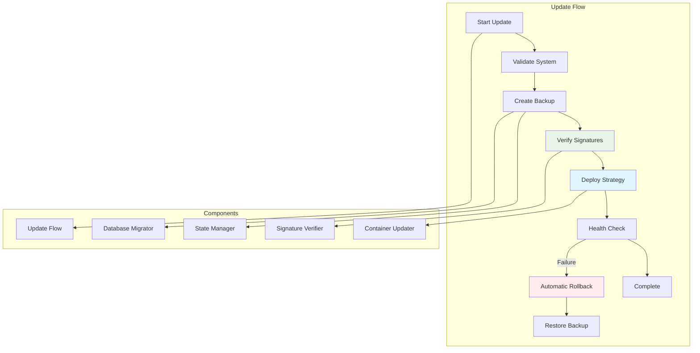

# @graphmemory/cli

GraphMemory-IDE CLI for install, upgrade, diagnostics, and health checks with enterprise-grade update capabilities.

## 🚀 Features

- **Enterprise Update System**: Signature verification, atomic operations, rollback capabilities
- **Security-First**: Docker image signature verification with Cosign
- **Zero-Downtime Updates**: Blue-Green and Rolling deployment strategies
- **Database Migration**: Kuzu native export/import with automated backups
- **Health Monitoring**: Comprehensive system health checks and diagnostics
- **Cross-Platform**: Works on macOS, Linux, and Windows

## 📋 Table of Contents

- [Installation & Usage](#installation--usage)
- [Commands](#commands)
- [Enterprise Update System](#enterprise-update-system)
- [Security Features](#security-features)
- [Configuration](#configuration)
- [Examples](#examples)
- [Troubleshooting](#troubleshooting)
- [Development](#development)

## 🛠️ Installation & Usage

### Quick Start

You can use the CLI directly with npx (recommended):

```sh
npx @graphmemory/cli <command>
```

Or install globally with npm:

```sh
npm install -g @graphmemory/cli
graphmemory <command>
```

### Requirements
- **Node.js 18+**: For CLI execution
- **Docker**: Container management
- **OrbStack** (macOS/Linux) or **Docker Desktop**: Container runtime

## 📚 Commands

### Core Commands

#### `install` - System Installation
Install or set up GraphMemory-IDE components with interactive prompts.

```bash
# Interactive installation
npx @graphmemory/cli install

# Non-interactive installation
npx @graphmemory/cli install --yes

# Install with custom configuration
npx @graphmemory/cli install --config ./custom-config.yml
```

**Features:**
- Checks Docker/OrbStack availability
- Validates system requirements
- Runs Docker Compose setup
- Configures initial database schema
- Sets up security certificates (if enabled)

#### `upgrade` - Enterprise Update System
Upgrade GraphMemory-IDE components with enterprise-grade security and reliability.

```bash
# Standard upgrade
npx @graphmemory/cli upgrade

# Upgrade with signature verification
npx @graphmemory/cli upgrade --verify-signatures

# Blue-Green deployment strategy
npx @graphmemory/cli upgrade --strategy blue-green

# Rolling deployment strategy
npx @graphmemory/cli upgrade --strategy rolling

# Dry run (preview changes)
npx @graphmemory/cli upgrade --dry-run

# Verbose output
npx @graphmemory/cli upgrade --verbose

# Skip database backup
npx @graphmemory/cli upgrade --skip-backup

# Custom timeout
npx @graphmemory/cli upgrade --timeout 600
```

**Options:**
- `--strategy <type>`: Deployment strategy (`blue-green`, `rolling`)
- `--verify-signatures`: Enable Docker image signature verification
- `--dry-run`: Preview changes without executing
- `--verbose`: Detailed output and logging
- `--skip-backup`: Skip automatic database backup
- `--timeout <seconds>`: Custom timeout for operations
- `--force`: Force upgrade even with warnings

#### `status` - System Status
Display comprehensive system status and health information.

```bash
# Basic status check
npx @graphmemory/cli status

# Detailed status with verbose output
npx @graphmemory/cli status --verbose

# JSON output for automation
npx @graphmemory/cli status --json
```

**Information Displayed:**
- Container status and health
- Database connectivity and size
- Network configuration
- Volume usage and availability
- Recent update history
- Security status

#### `health` - Quick Health Check
Perform rapid health checks for core services.

```bash
# Quick health check
npx @graphmemory/cli health

# Detailed health check
npx @graphmemory/cli health --detailed

# Health check with timeout
npx @graphmemory/cli health --timeout 30
```

**Checks Performed:**
- MCP Server API availability
- Kuzu database connectivity
- Container health status
- Network connectivity
- Volume accessibility

#### `rollback` - System Rollback
Rollback to previous version in case of issues.

```bash
# Interactive rollback with backup selection
npx @graphmemory/cli rollback

# Rollback to specific version
npx @graphmemory/cli rollback --version 1.2.0

# Rollback to latest backup
npx @graphmemory/cli rollback --latest

# Force rollback without confirmation
npx @graphmemory/cli rollback --force
```

#### `backup` - Database Backup
Create manual database backups with metadata.

```bash
# Create backup with reason
npx @graphmemory/cli backup --reason "pre-upgrade-backup"

# Create backup with custom name
npx @graphmemory/cli backup --name "manual-backup-2025-01-28"

# Verbose backup with progress
npx @graphmemory/cli backup --verbose

# List available backups
npx @graphmemory/cli backup --list
```

#### `diagnostics` - System Diagnostics
Run comprehensive diagnostics and generate detailed reports.

```bash
# Full diagnostic report
npx @graphmemory/cli diagnostics

# Quick diagnostics
npx @graphmemory/cli diagnostics --quick

# Export diagnostics to file
npx @graphmemory/cli diagnostics --output diagnostics-report.json
```

## 🏢 Enterprise Update System

### Architecture Overview

The enterprise update system provides production-grade capabilities:



### Core Components

#### 1. Signature Verifier
- **Cosign Integration**: Verifies Docker image signatures
- **Keyless Verification**: Uses Fulcio CA and Rekor transparency log
- **Parallel Processing**: Concurrent signature verification
- **Timeout Handling**: Configurable verification timeouts

#### 2. State Manager
- **Atomic Operations**: Thread-safe state management
- **File Locking**: Prevents concurrent update operations
- **State Persistence**: Maintains update state across restarts
- **Rollback Information**: Stores rollback metadata

#### 3. Database Migrator
- **Kuzu Native Commands**: Uses EXPORT/IMPORT for migration
- **Timestamped Backups**: Automatic backup creation with metadata
- **Schema Validation**: Ensures database schema compatibility
- **Rollback Support**: Restores from backups on failure

#### 4. Container Updater
- **Blue-Green Deployment**: Zero-downtime updates with traffic switching
- **Rolling Updates**: Gradual container replacement
- **Health Checks**: Monitors container health during updates
- **Layer Optimization**: Differential updates for faster deployment

#### 5. Update Flow Orchestrator
- **Three-Phase Process**: Validation, execution, post-validation
- **Error Handling**: Comprehensive error recovery
- **Progress Tracking**: Real-time update progress
- **Dry-Run Support**: Preview changes before execution

### Deployment Strategies

#### Blue-Green Deployment
```bash
npx @graphmemory/cli upgrade --strategy blue-green
```

**Process:**
1. Create new "green" environment alongside existing "blue"
2. Deploy new version to green environment
3. Run health checks on green environment
4. Switch traffic from blue to green
5. Keep blue environment for quick rollback

**Benefits:**
- Zero downtime
- Instant rollback capability
- Full environment testing
- Risk mitigation

#### Rolling Deployment
```bash
npx @graphmemory/cli upgrade --strategy rolling
```

**Process:**
1. Update containers one by one
2. Health check each updated container
3. Continue to next container if healthy
4. Rollback if any container fails

**Benefits:**
- Resource efficient
- Gradual deployment
- Early failure detection
- Minimal resource usage

### Security Features

#### Docker Image Signature Verification

```bash
# Enable signature verification
npx @graphmemory/cli upgrade --verify-signatures
```

**Verification Process:**
1. **Cosign Integration**: Uses industry-standard Cosign tool
2. **Keyless Verification**: Leverages Fulcio CA and Rekor transparency log
3. **Public Key Support**: Supports custom public keys for verification
4. **Parallel Processing**: Verifies multiple images concurrently
5. **Timeout Handling**: Configurable verification timeouts

**Configuration:**
```bash
# Set custom verification timeout
export COSIGN_TIMEOUT=300

# Use custom public key
export COSIGN_PUBLIC_KEY=/path/to/public.key

# Enable experimental features
export COSIGN_EXPERIMENTAL=1
```

#### State Management Security

- **File Locking**: Prevents concurrent operations
- **Atomic Operations**: Ensures state consistency
- **Secure Temporary Files**: Uses secure temporary directories
- **Permission Validation**: Checks file and directory permissions

## ⚙️ Configuration

### Environment Variables

| Variable | Default | Description |
|----------|---------|-------------|
| `GRAPHMEMORY_CONFIG_PATH` | `./config` | Configuration directory path |
| `GRAPHMEMORY_DATA_PATH` | `./data` | Data directory path |
| `GRAPHMEMORY_LOG_LEVEL` | `info` | Logging level (`debug`, `info`, `warn`, `error`) |
| `GRAPHMEMORY_TIMEOUT` | `300` | Default operation timeout (seconds) |
| `COSIGN_TIMEOUT` | `60` | Signature verification timeout |
| `COSIGN_EXPERIMENTAL` | `false` | Enable experimental Cosign features |
| `DOCKER_HOST` | - | Custom Docker host |
| `COMPOSE_PROJECT_NAME` | `graphmemory` | Docker Compose project name |

### Configuration File

Create `graphmemory.config.js` for advanced configuration:

```javascript
export default {
  // Update configuration
  update: {
    strategy: 'blue-green',
    verifySignatures: true,
    timeout: 600,
    skipBackup: false,
    parallelism: 2
  },
  
  // Security configuration
  security: {
    enableMTLS: false,
    certDir: './certs',
    cosignTimeout: 60
  },
  
  // Database configuration
  database: {
    backupRetention: 7, // days
    migrationTimeout: 300
  },
  
  // Logging configuration
  logging: {
    level: 'info',
    file: './logs/cli.log',
    maxSize: '10MB',
    maxFiles: 5
  }
};
```

## 📖 Examples

### Basic Usage Examples

#### Installation
```bash
# Interactive installation with prompts
npx @graphmemory/cli install

# Automated installation for CI/CD
npx @graphmemory/cli install --yes --config production.yml
```

#### Health Monitoring
```bash
# Quick health check
npx @graphmemory/cli health

# Detailed health check with JSON output
npx @graphmemory/cli health --detailed --json > health-report.json
```

#### System Status
```bash
# Basic status
npx @graphmemory/cli status

# Detailed status for troubleshooting
npx @graphmemory/cli status --verbose
```

### Advanced Usage Examples

#### Enterprise Upgrade Workflow
```bash
# 1. Check current status
npx @graphmemory/cli status --verbose

# 2. Create pre-upgrade backup
npx @graphmemory/cli backup --reason "pre-upgrade-$(date +%Y%m%d)"

# 3. Dry run upgrade to preview changes
npx @graphmemory/cli upgrade --dry-run --verify-signatures

# 4. Execute upgrade with Blue-Green deployment
npx @graphmemory/cli upgrade --strategy blue-green --verify-signatures --verbose

# 5. Verify upgrade success
npx @graphmemory/cli health --detailed
npx @graphmemory/cli status
```

#### Rollback Scenario
```bash
# If upgrade fails, rollback to previous version
npx @graphmemory/cli rollback --latest

# Or rollback to specific version
npx @graphmemory/cli rollback --version 1.1.0

# Verify rollback success
npx @graphmemory/cli health
```

#### Backup Management
```bash
# Create manual backup before maintenance
npx @graphmemory/cli backup --reason "maintenance-window" --verbose

# List all available backups
npx @graphmemory/cli backup --list

# Restore from specific backup (if needed)
npx @graphmemory/cli rollback --backup backup-20250128-124119
```

#### CI/CD Integration
```bash
#!/bin/bash
# CI/CD deployment script

set -e

echo "Starting GraphMemory-IDE deployment..."

# Check system health
npx @graphmemory/cli health || exit 1

# Create pre-deployment backup
npx @graphmemory/cli backup --reason "ci-cd-deployment-$(date +%Y%m%d-%H%M%S)"

# Perform upgrade with signature verification
npx @graphmemory/cli upgrade \
  --strategy rolling \
  --verify-signatures \
  --timeout 600 \
  --verbose

# Verify deployment success
npx @graphmemory/cli health --detailed || {
  echo "Deployment failed, rolling back..."
  npx @graphmemory/cli rollback --latest
  exit 1
}

echo "Deployment completed successfully!"
```

## 🔧 Troubleshooting

### Common Issues

#### Docker Connection Issues
```bash
# Check Docker status
docker --version
docker ps

# Verify Docker daemon is running
sudo systemctl status docker  # Linux
brew services list | grep docker  # macOS with Homebrew

# Test Docker connectivity
npx @graphmemory/cli diagnostics --quick
```

#### OrbStack Issues (macOS/Linux)
```bash
# Check OrbStack status
orb status

# Restart OrbStack
orb restart

# Verify OrbStack integration
npx @graphmemory/cli diagnostics
```

#### Update Failures
```bash
# Check update state
npx @graphmemory/cli status --verbose

# View detailed logs
cat ~/.graphmemory/logs/update.log

# Force cleanup of failed update
npx @graphmemory/cli upgrade --force --cleanup

# Rollback if needed
npx @graphmemory/cli rollback --latest
```

#### Database Issues
```bash
# Check database connectivity
npx @graphmemory/cli health --detailed

# Verify database files
ls -la ./data/

# Check database backup status
npx @graphmemory/cli backup --list

# Restore from backup if corrupted
npx @graphmemory/cli rollback --backup <backup-name>
```

#### Signature Verification Issues
```bash
# Check Cosign installation
cosign version

# Verify with debug output
COSIGN_EXPERIMENTAL=1 npx @graphmemory/cli upgrade --verify-signatures --verbose

# Skip signature verification temporarily
npx @graphmemory/cli upgrade --skip-verification
```

### Debug Mode

Enable debug mode for detailed troubleshooting:

```bash
# Enable debug logging
DEBUG=graphmemory:* npx @graphmemory/cli <command>

# Or set environment variable
export DEBUG=graphmemory:*
npx @graphmemory/cli <command>
```

### Log Files

CLI logs are stored in:
- **macOS**: `~/Library/Logs/graphmemory/`
- **Linux**: `~/.local/share/graphmemory/logs/`
- **Windows**: `%APPDATA%\graphmemory\logs\`

Key log files:
- `cli.log`: General CLI operations
- `update.log`: Update system operations
- `security.log`: Security-related operations
- `database.log`: Database operations

## 🧪 Development

### Testing & Coverage Policy

- **Business Logic Coverage**: All CLI logic in `commands.mjs` is 100% covered by unit and edge case tests
- **Entrypoint Coverage**: The CLI entrypoint (`index.mjs`) is excluded from coverage reports
- **Integration Tests**: Real CLI subprocess tests for local/manual validation
- **Edge Cases**: All error, type, and system edge cases are robustly tested

### Running Tests

```bash
# Run all tests with coverage
npm test

# Run tests with detailed coverage report
npx vitest run --coverage

# Run specific test file
npx vitest run cli/index.test.mjs

# Watch mode for development
npm run test:watch
```

### Development Setup

```bash
# Clone repository
git clone https://github.com/elementalcollision/GraphMemory-IDE.git
cd GraphMemory-IDE

# Install dependencies
npm install

# Link CLI for local testing
npm link

# Run CLI locally
graphmemory --help
```

### Code Standards

- **ES Modules**: Use modern JavaScript modules
- **Async/Await**: Prefer async/await over promises
- **Error Handling**: Comprehensive error handling with specific error types
- **Input Validation**: Validate all user inputs
- **Dependency Injection**: Use dependency injection for testability

### Contributing

1. **Fork the repository**
2. **Create feature branch**: `git checkout -b feature/cli-enhancement`
3. **Make changes** with tests
4. **Run tests**: `npm test`
5. **Submit pull request**

---

## 📚 Additional Resources

- **[Main Documentation](../README.md)**: Project overview and architecture
- **[Developer Guide](../docs/DEVELOPER_GUIDE.md)**: Comprehensive development guide
- **[Security Documentation](../SECURITY.md)**: Security implementation details
- **[API Documentation](../server/README.md)**: MCP server API reference
- **[Docker Documentation](../docker/README.md)**: Container deployment guide

## 🤝 Support

- **GitHub Issues**: Report bugs and request features
- **Discussions**: Ask questions and share ideas
- **Documentation**: Comprehensive guides and examples
- **Community**: Join our developer community

---

For more details, see the main project README and Product Requirements Document. 