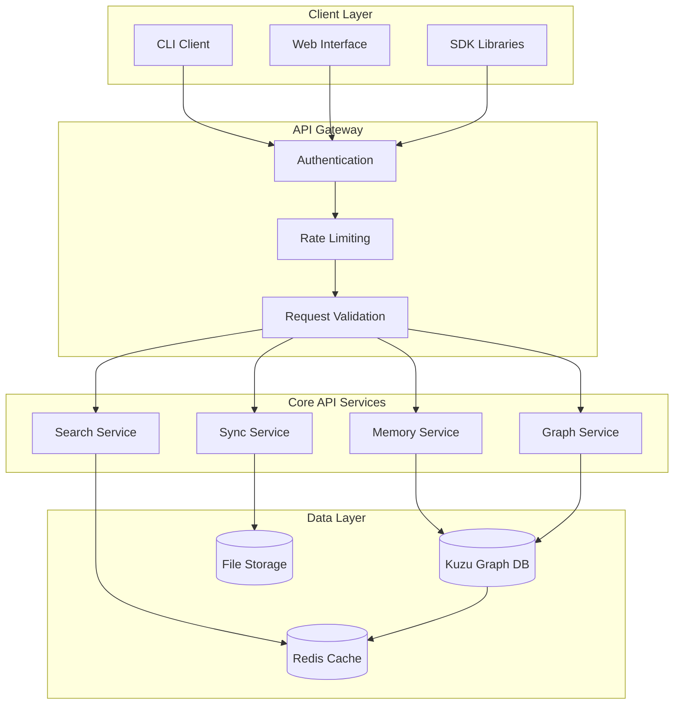
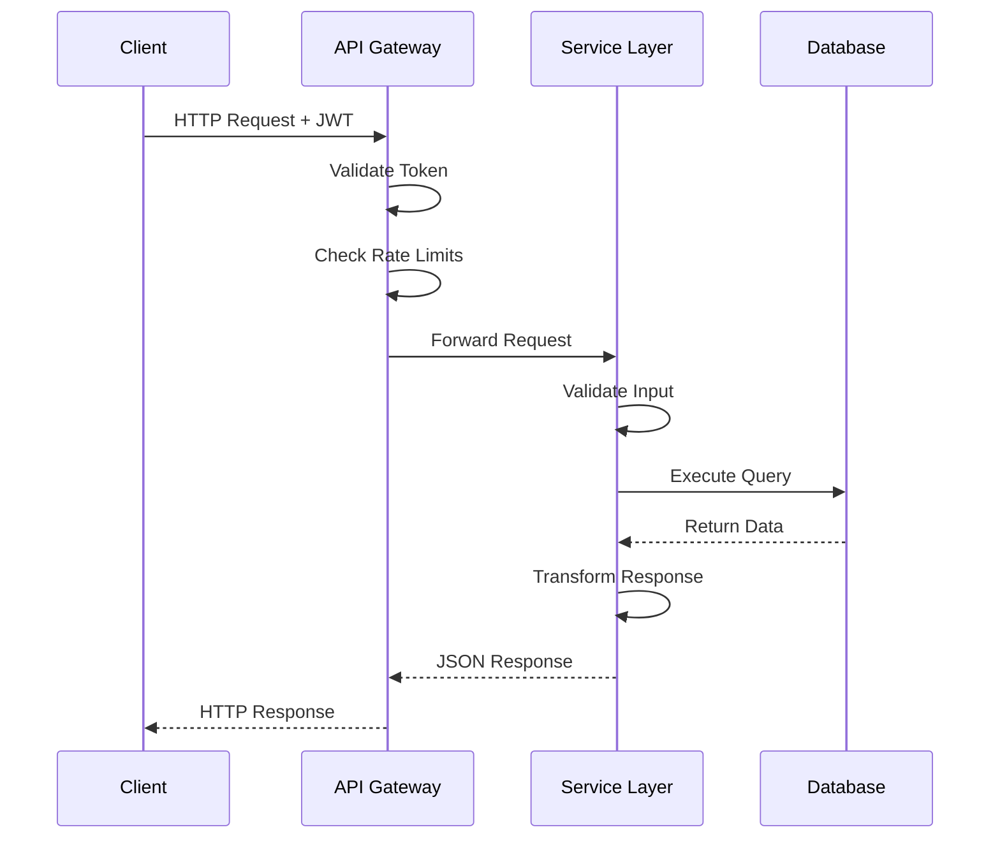
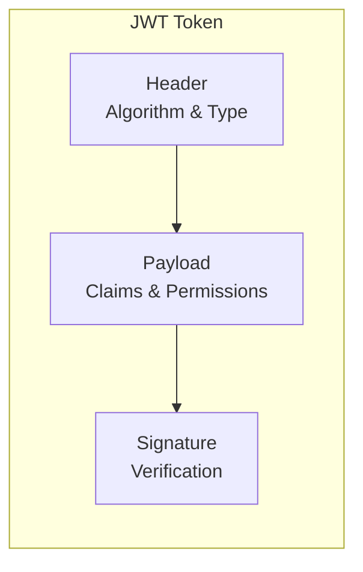
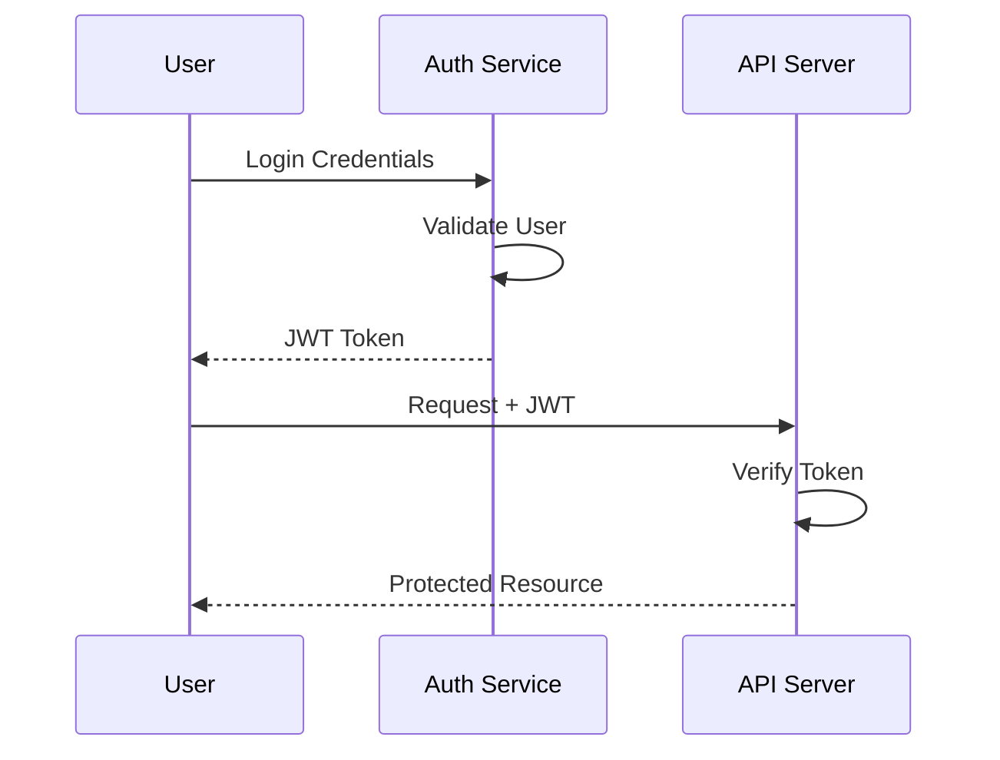
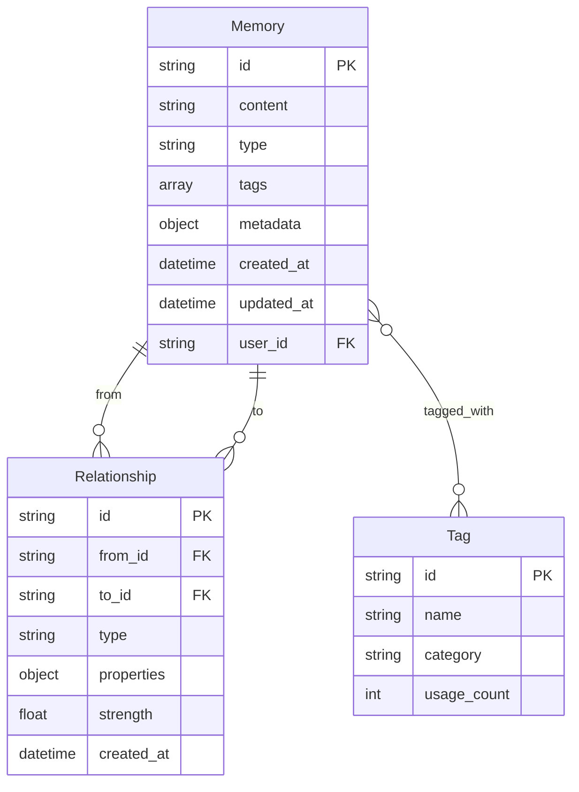
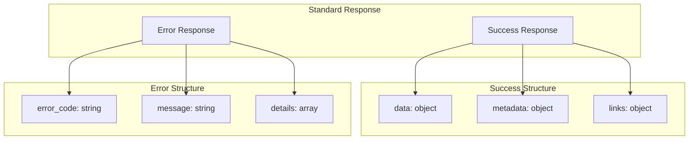
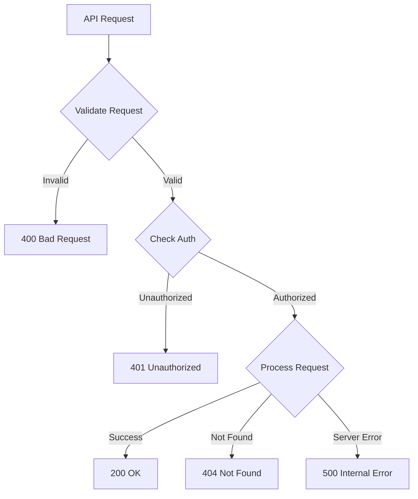
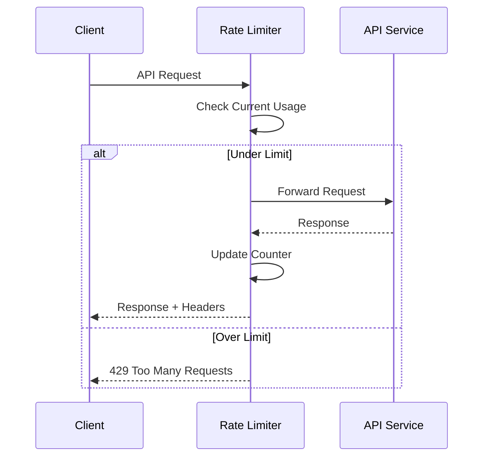
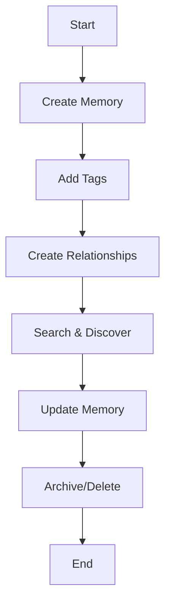

# GraphMemory-IDE API Guide

## 📚 Table of Contents

- [Overview](#overview)
- [API Architecture](#api-architecture)
- [Authentication & Security](#authentication--security)
- [Core Endpoints](#core-endpoints)
- [Data Models & Schemas](#data-models--schemas)
- [Error Handling](#error-handling)
- [Rate Limiting](#rate-limiting)
- [Interactive Documentation](#interactive-documentation)
- [SDK & Client Libraries](#sdk--client-libraries)
- [Examples & Use Cases](#examples--use-cases)

## 🎯 Overview

The GraphMemory-IDE API is a RESTful service built with FastAPI that provides comprehensive memory management, graph operations, and IDE integration capabilities. This guide covers all aspects of interacting with the API, from basic authentication to advanced graph queries.

### Key Features

- **Memory Management**: Store, retrieve, and organize memories with semantic relationships
- **Graph Operations**: Query and manipulate knowledge graphs with Cypher-like syntax
- **Real-time Updates**: WebSocket support for live memory synchronization
- **Security**: mTLS, JWT authentication, and comprehensive authorization
- **Performance**: Optimized queries with caching and pagination

## 🏗️ API Architecture



### Request Flow



## 🔐 Authentication & Security

### JWT Authentication

All API requests require a valid JWT token in the Authorization header:

```http
Authorization: Bearer <jwt_token>
```

### Token Structure



### Authentication Flow



### mTLS Configuration

For enhanced security, the API supports mutual TLS authentication:

```bash
# Generate client certificates
./scripts/setup-mtls.sh

# Configure client
export MTLS_ENABLED=true
export MTLS_CERT_DIR=/path/to/certs
```

## 🔗 Core Endpoints

### Memory Management

#### Create Memory

```http
POST /api/v1/memories
Content-Type: application/json
Authorization: Bearer <token>

{
  "content": "Important project insight",
  "type": "insight",
  "tags": ["project", "learning"],
  "metadata": {
    "source": "meeting",
    "confidence": 0.95
  }
}
```

**Response:**
```json
{
  "id": "mem_123456",
  "content": "Important project insight",
  "type": "insight",
  "tags": ["project", "learning"],
  "metadata": {
    "source": "meeting",
    "confidence": 0.95
  },
  "created_at": "2025-01-27T12:41:19Z",
  "updated_at": "2025-01-27T12:41:19Z"
}
```

#### Retrieve Memory

```http
GET /api/v1/memories/{memory_id}
Authorization: Bearer <token>
```

#### Update Memory

```http
PUT /api/v1/memories/{memory_id}
Content-Type: application/json
Authorization: Bearer <token>

{
  "content": "Updated insight with new information",
  "tags": ["project", "learning", "updated"]
}
```

#### Delete Memory

```http
DELETE /api/v1/memories/{memory_id}
Authorization: Bearer <token>
```

### Graph Operations

#### Query Graph

```http
POST /api/v1/graph/query
Content-Type: application/json
Authorization: Bearer <token>

{
  "query": "MATCH (m:Memory)-[r:RELATES_TO]->(t:Topic) WHERE t.name = 'AI' RETURN m, r, t",
  "parameters": {
    "limit": 50
  }
}
```

#### Create Relationship

```http
POST /api/v1/graph/relationships
Content-Type: application/json
Authorization: Bearer <token>

{
  "from_id": "mem_123456",
  "to_id": "mem_789012",
  "relationship_type": "BUILDS_ON",
  "properties": {
    "strength": 0.8,
    "context": "project_development"
  }
}
```

### Search Operations

#### Semantic Search

```http
GET /api/v1/search?q=machine%20learning&type=semantic&limit=20
Authorization: Bearer <token>
```

#### Full-text Search

```http
GET /api/v1/search?q=project%20insights&type=fulltext&limit=10
Authorization: Bearer <token>
```

## 📊 Data Models & Schemas

### Memory Schema



### API Response Schema



### Pydantic Models

```python
from pydantic import BaseModel, Field
from typing import List, Dict, Optional
from datetime import datetime

class MemoryCreate(BaseModel):
    content: str = Field(..., min_length=1, max_length=10000)
    type: str = Field(..., regex="^(insight|fact|procedure|concept)$")
    tags: List[str] = Field(default_factory=list)
    metadata: Dict = Field(default_factory=dict)

class MemoryResponse(BaseModel):
    id: str
    content: str
    type: str
    tags: List[str]
    metadata: Dict
    created_at: datetime
    updated_at: datetime
    
    class Config:
        orm_mode = True

class GraphQuery(BaseModel):
    query: str = Field(..., min_length=1)
    parameters: Dict = Field(default_factory=dict)
    limit: Optional[int] = Field(default=100, ge=1, le=1000)
```

## ⚠️ Error Handling

### Error Response Format

```json
{
  "error_code": "VALIDATION_ERROR",
  "message": "Request validation failed",
  "details": [
    {
      "field": "content",
      "error": "Field required"
    }
  ],
  "request_id": "req_123456789",
  "timestamp": "2025-01-27T12:41:19Z"
}
```

### HTTP Status Codes

| Code | Meaning | Description |
|------|---------|-------------|
| 200 | OK | Request successful |
| 201 | Created | Resource created successfully |
| 400 | Bad Request | Invalid request format or parameters |
| 401 | Unauthorized | Missing or invalid authentication |
| 403 | Forbidden | Insufficient permissions |
| 404 | Not Found | Resource not found |
| 409 | Conflict | Resource already exists |
| 422 | Unprocessable Entity | Validation error |
| 429 | Too Many Requests | Rate limit exceeded |
| 500 | Internal Server Error | Server error |

### Error Flow



## 🚦 Rate Limiting

### Rate Limit Headers

```http
X-RateLimit-Limit: 1000
X-RateLimit-Remaining: 999
X-RateLimit-Reset: 1643284800
X-RateLimit-Window: 3600
```

### Rate Limit Tiers

| Tier | Requests/Hour | Burst Limit |
|------|---------------|-------------|
| Free | 100 | 10 |
| Pro | 1,000 | 50 |
| Enterprise | 10,000 | 200 |

### Rate Limiting Flow



## 📖 Interactive Documentation

### Swagger UI

Access the interactive API documentation at:
```
http://localhost:8080/docs
```

### ReDoc

Alternative documentation interface:
```
http://localhost:8080/redoc
```

### OpenAPI Specification

Download the OpenAPI spec:
```
http://localhost:8080/openapi.json
```

## 🛠️ SDK & Client Libraries

### Python SDK

```python
from graphmemory_sdk import GraphMemoryClient

# Initialize client
client = GraphMemoryClient(
    base_url="http://localhost:8080",
    api_key="your_api_key"
)

# Create memory
memory = client.memories.create(
    content="Important insight",
    type="insight",
    tags=["project"]
)

# Query graph
results = client.graph.query(
    "MATCH (m:Memory) WHERE m.type = 'insight' RETURN m"
)
```

### JavaScript SDK

```javascript
import { GraphMemoryClient } from '@graphmemory/sdk';

const client = new GraphMemoryClient({
  baseUrl: 'http://localhost:8080',
  apiKey: 'your_api_key'
});

// Create memory
const memory = await client.memories.create({
  content: 'Important insight',
  type: 'insight',
  tags: ['project']
});

// Query graph
const results = await client.graph.query(
  "MATCH (m:Memory) WHERE m.type = 'insight' RETURN m"
);
```

## 💡 Examples & Use Cases

### Memory Management Workflow



### Common Use Cases

#### 1. Project Knowledge Base

```python
# Create project memory
project_memory = client.memories.create(
    content="Project uses microservices architecture with Docker",
    type="fact",
    tags=["architecture", "docker", "microservices"],
    metadata={"project": "graphmemory-ide", "confidence": 0.9}
)

# Create related insight
insight = client.memories.create(
    content="Docker containers should be hardened for production",
    type="insight",
    tags=["security", "docker", "production"]
)

# Link memories
client.graph.create_relationship(
    from_id=project_memory.id,
    to_id=insight.id,
    relationship_type="RELATES_TO",
    properties={"context": "security_considerations"}
)
```

#### 2. Learning Path Tracking

```python
# Query learning progression
query = """
MATCH (start:Memory {type: 'concept'})-[:LEADS_TO*]->(end:Memory {type: 'skill'})
WHERE start.content CONTAINS 'basic programming'
RETURN start, end, length(path) as steps
ORDER BY steps
"""

learning_paths = client.graph.query(query)
```

#### 3. Context-Aware Search

```python
# Search with context
results = client.search.semantic(
    query="database optimization",
    context={"project": "graphmemory-ide", "domain": "performance"},
    limit=10
)
```

### Integration Examples

#### CLI Integration

```bash
# Create memory via CLI
graphmemory memory create \
  --content "API endpoint for user authentication" \
  --type "fact" \
  --tags "api,auth,security"

# Query relationships
graphmemory graph query \
  "MATCH (m:Memory)-[r]->(n) WHERE m.id = 'mem_123' RETURN r, n"
```

#### Web Interface Integration

```javascript
// Real-time memory updates
const socket = new WebSocket('ws://localhost:8080/ws');

socket.onmessage = (event) => {
  const update = JSON.parse(event.data);
  if (update.type === 'memory_created') {
    updateMemoryList(update.data);
  }
};

// Create memory with real-time sync
const createMemory = async (memoryData) => {
  const memory = await client.memories.create(memoryData);
  socket.send(JSON.stringify({
    type: 'memory_sync',
    data: memory
  }));
};
```

## 🔧 Configuration

### Environment Variables

```bash
# API Configuration
API_HOST=localhost
API_PORT=8080
API_DEBUG=false

# Database
DATABASE_URL=kuzu://localhost:7687
REDIS_URL=redis://localhost:6379

# Security
JWT_SECRET_KEY=your_secret_key
JWT_ALGORITHM=HS256
JWT_EXPIRATION_HOURS=24

# mTLS
MTLS_ENABLED=true
MTLS_CERT_DIR=/etc/ssl/certs
MTLS_PORT=50051

# Rate Limiting
RATE_LIMIT_ENABLED=true
RATE_LIMIT_REQUESTS_PER_HOUR=1000
RATE_LIMIT_BURST_SIZE=50
```

### API Client Configuration

```python
from graphmemory_sdk import GraphMemoryClient

client = GraphMemoryClient(
    base_url="http://localhost:8080",
    api_key="your_api_key",
    timeout=30,
    retry_attempts=3,
    retry_delay=1.0,
    verify_ssl=True,
    mtls_cert_path="/path/to/client.crt",
    mtls_key_path="/path/to/client.key"
)
```

## 📚 Additional Resources

- [Developer Guide](docs/DEVELOPER_GUIDE.md) - Development setup and contribution guidelines
- [User Guide](docs/USER_GUIDE.md) - End-user documentation
- [Security Guide](SECURITY.md) - Security implementation details
- [Troubleshooting](TROUBLESHOOTING.md) - Common issues and solutions
- [CLI Documentation](cli/README.md) - Command-line interface guide

## 🤝 Support

- **Documentation**: [https://docs.graphmemory-ide.com](https://docs.graphmemory-ide.com)
- **Issues**: [GitHub Issues](https://github.com/elementalcollision/GraphMemory-IDE/issues)
- **Discussions**: [GitHub Discussions](https://github.com/elementalcollision/GraphMemory-IDE/discussions)
- **Email**: support@graphmemory-ide.com

---

*This API guide is part of the GraphMemory-IDE documentation suite. For the latest updates, visit our [documentation repository](https://github.com/elementalcollision/GraphMemory-IDE).* 