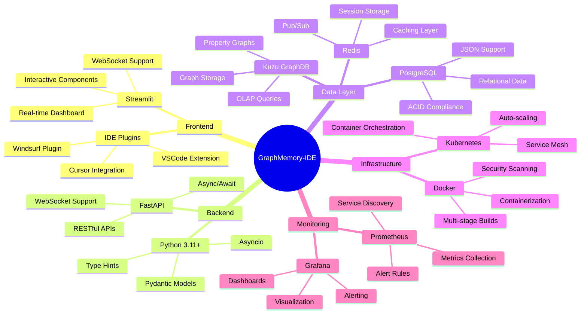
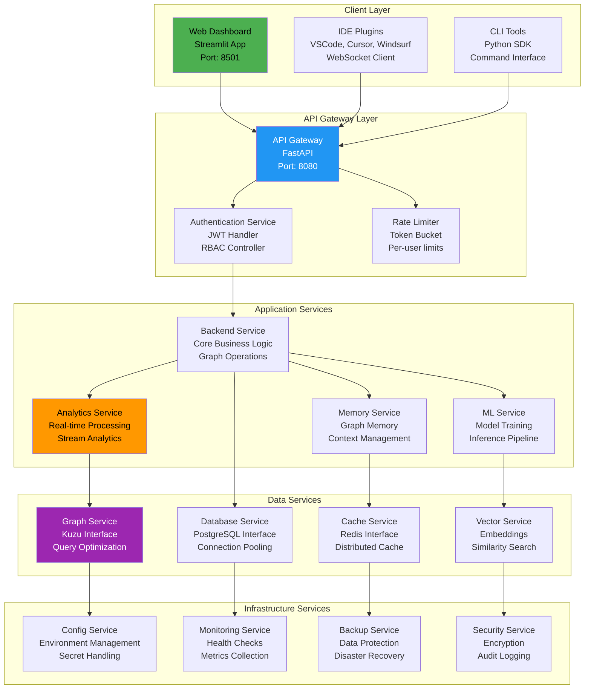
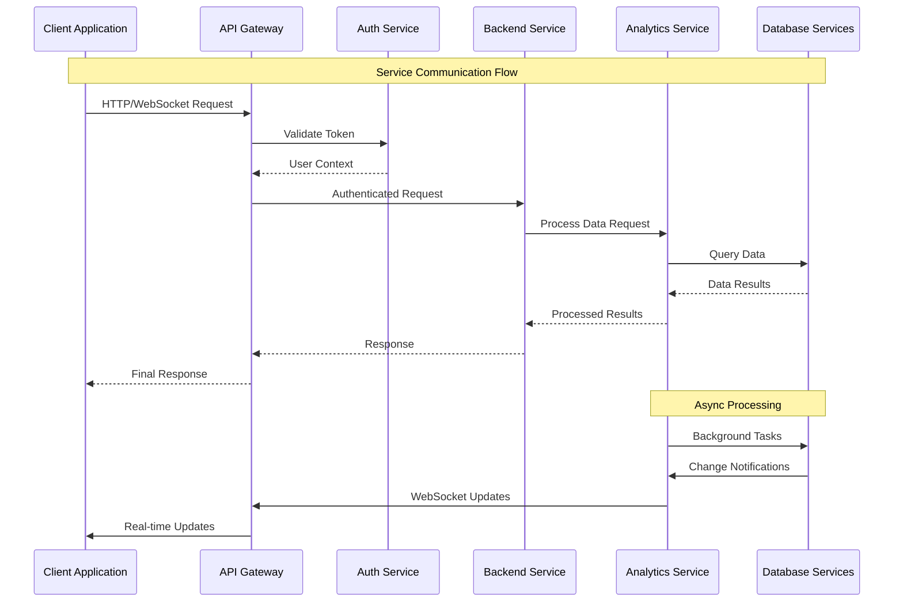
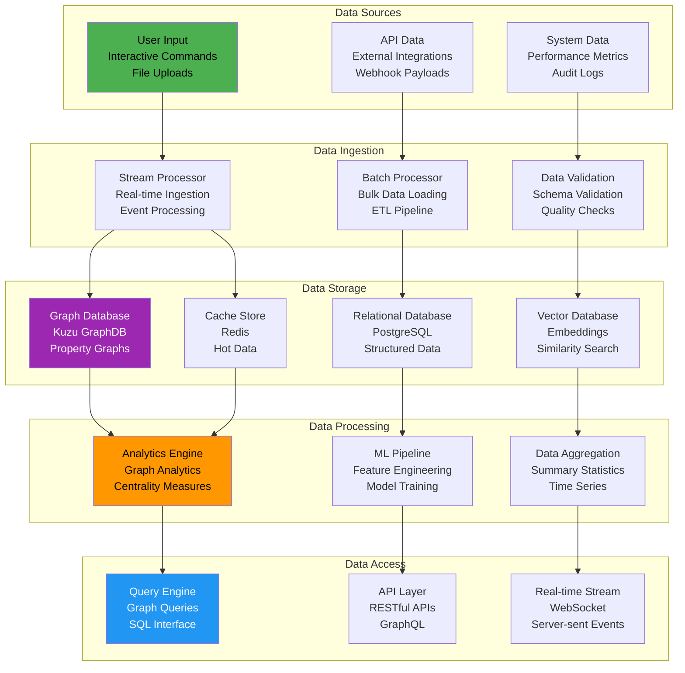
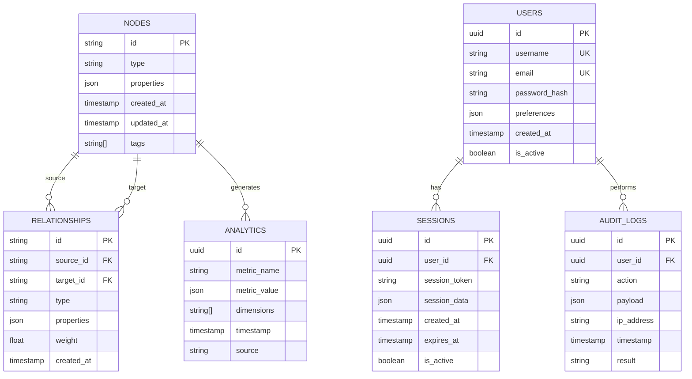
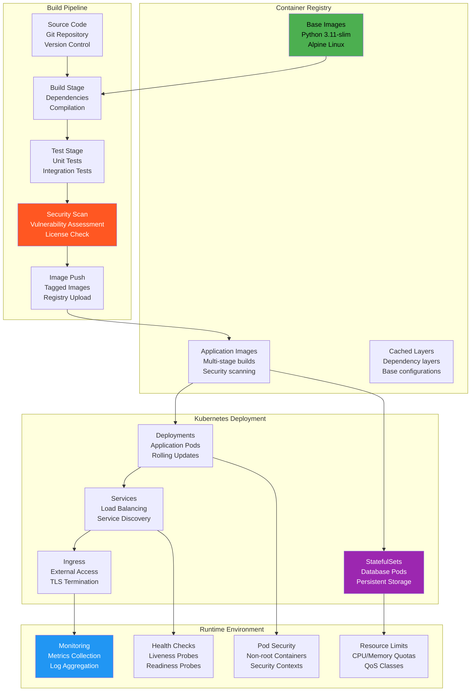
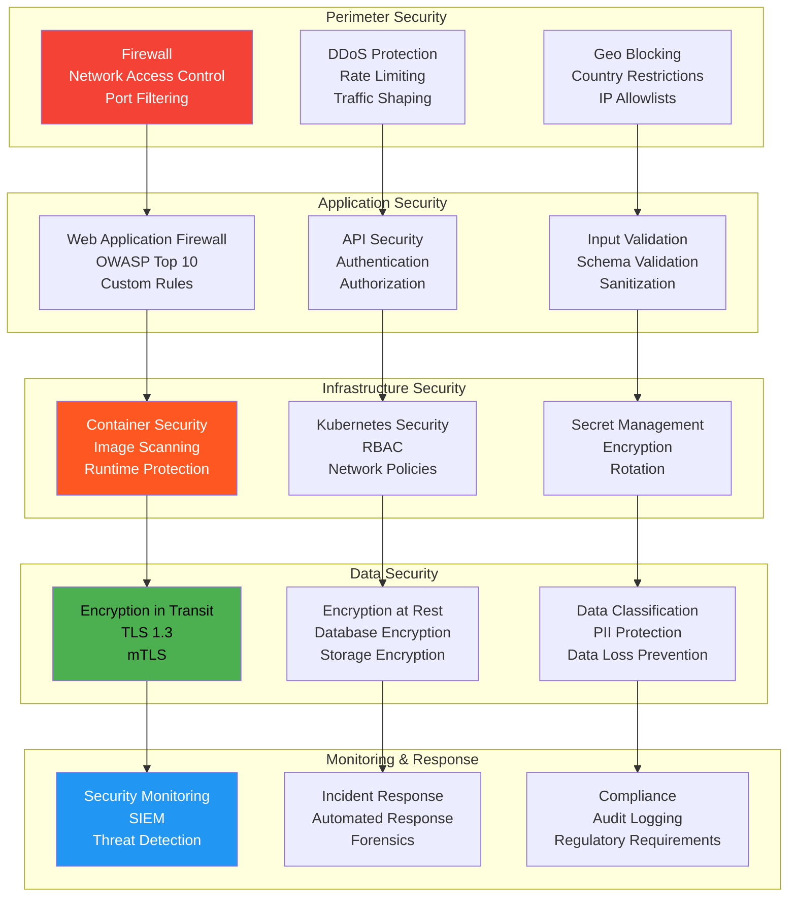

# GraphMemory-IDE Architecture Overview

## 🎯 System Architecture

GraphMemory-IDE is a sophisticated graph-based memory management system built on modern microservices architecture with real-time analytics capabilities. This document provides a comprehensive view of the system's architectural components, their relationships, and design patterns.

## 📋 Table of Contents

- [High-Level Architecture](#high-level-architecture)
- [Component Architecture](#component-architecture)
- [Data Architecture](#data-architecture)
- [Deployment Architecture](#deployment-architecture)
- [Security Architecture](#security-architecture)
- [Integration Architecture](#integration-architecture)

## 🏗️ High-Level Architecture

### System Overview

### Technology Stack

## 🧩 Component Architecture

### Microservices Breakdown

### Service Communication Patterns

## 💾 Data Architecture

### Data Flow Architecture

### Database Schema Architecture

## 🚀 Deployment Architecture

### Container Architecture

### Infrastructure Layers

```mermaid
flowchart TB
    subgraph "Cloud Infrastructure"
        CLOUD_PROVIDER[Cloud Provider<br/>AWS/GCP/Azure<br/>Multi-region]
        COMPUTE[Compute Resources<br/>VM Instances<br/>Auto-scaling Groups]
        NETWORK[Network Infrastructure<br/>VPC/Subnets<br/>Load Balancers]
        STORAGE[Storage Infrastructure<br/>Block Storage<br/>Object Storage]
    end
    
    subgraph "Container Orchestration"
        K8S_CONTROL[Kubernetes Control Plane<br/>API Server<br/>etcd Cluster]
        K8S_NODES[Kubernetes Nodes<br/>Worker Nodes<br/>Container Runtime]
        K8S_NETWORK[Kubernetes Networking<br/>CNI Plugin<br/>Service Mesh]
        K8S_STORAGE[Kubernetes Storage<br/>CSI Driver<br/>Persistent Volumes]
    end
    
    subgraph "Application Platform"
        RUNTIME[Container Runtime<br/>containerd<br/>OCI Compliant]
        SCHEDULER[Scheduler<br/>Pod Placement<br/>Resource Allocation]
        SERVICE_DISCOVERY[Service Discovery<br/>CoreDNS<br/>Service Registry]
        CONFIG_MGMT[Configuration Management<br/>ConfigMaps<br/>Secrets]
    end
    
    subgraph "Observability Platform"
        METRICS[Metrics Platform<br/>Prometheus<br/>Time Series DB]
        LOGGING[Logging Platform<br/>Centralized Logs<br/>Log Aggregation]
        TRACING[Distributed Tracing<br/>Request Tracking<br/>Performance Analysis]
        ALERTING[Alerting Platform<br/>Alert Manager<br/>Notification System]
    end
    
    CLOUD_PROVIDER --> COMPUTE
    COMPUTE --> NETWORK
    NETWORK --> STORAGE
    
    STORAGE --> K8S_CONTROL
    K8S_CONTROL --> K8S_NODES
    K8S_NODES --> K8S_NETWORK
    K8S_NETWORK --> K8S_STORAGE
    
    K8S_STORAGE --> RUNTIME
    RUNTIME --> SCHEDULER
    SCHEDULER --> SERVICE_DISCOVERY
    SERVICE_DISCOVERY --> CONFIG_MGMT
    
    CONFIG_MGMT --> METRICS
    METRICS --> LOGGING
    LOGGING --> TRACING
    TRACING --> ALERTING
    
    style CLOUD_PROVIDER fill:#ff9800,color:#000
    style K8S_CONTROL fill:#326ce5,color:#fff
    style RUNTIME fill:#4caf50,color:#000
    style METRICS fill:#e6522c,color:#fff
```

## 🔐 Security Architecture

### Defense in Depth

## 🔗 Integration Architecture

### External Integrations

```mermaid
flowchart TB
    subgraph "Client Integrations"
        IDE_EXTENSIONS[IDE Extensions<br/>VSCode, Cursor, Windsurf<br/>Language Server Protocol]
        CLI_TOOLS[CLI Tools<br/>Python SDK<br/>REST API Client]
        WEB_UI[Web Interface<br/>Browser-based<br/>WebSocket Client]
    end
    
    subgraph "Third-party APIs"
        CLOUD_SERVICES[Cloud Services<br/>AWS/GCP/Azure APIs<br/>Infrastructure Management]
        ML_SERVICES[ML Services<br/>OpenAI API<br/>Hugging Face]
        MONITORING_SERVICES[Monitoring Services<br/>DataDog<br/>New Relic]
    end
    
    subgraph "Data Integrations"
        DATABASE_CONNECTORS[Database Connectors<br/>PostgreSQL<br/>MySQL, MongoDB]
        FILE_SYSTEMS[File Systems<br/>Local Storage<br/>S3, GCS, Azure Blob]
        MESSAGE_QUEUES[Message Queues<br/>Redis Pub/Sub<br/>Apache Kafka]
    end
    
    subgraph "Integration Patterns"
        API_GATEWAY[API Gateway<br/>Request Routing<br/>Protocol Translation]
        EVENT_DRIVEN[Event-driven<br/>Webhook Handlers<br/>Async Processing]
        BATCH_INTEGRATION[Batch Integration<br/>Scheduled Jobs<br/>ETL Pipelines]
    end
    
    IDE_EXTENSIONS --> API_GATEWAY
    CLI_TOOLS --> API_GATEWAY
    WEB_UI --> EVENT_DRIVEN
    
    CLOUD_SERVICES --> EVENT_DRIVEN
    ML_SERVICES --> API_GATEWAY
    MONITORING_SERVICES --> BATCH_INTEGRATION
    
    DATABASE_CONNECTORS --> BATCH_INTEGRATION
    FILE_SYSTEMS --> API_GATEWAY
    MESSAGE_QUEUES --> EVENT_DRIVEN
    
    style IDE_EXTENSIONS fill:#4caf50,color:#000
    style CLOUD_SERVICES fill:#ff9800,color:#000
    style API_GATEWAY fill:#2196f3,color:#fff
    style EVENT_DRIVEN fill:#9c27b0,color:#fff
```

This comprehensive architecture overview provides a complete understanding of GraphMemory-IDE's design, from high-level system organization to detailed component interactions and deployment patterns. 