# GraphMemory-IDE Code Paths & Component Interactions

## 🎯 Overview

This document provides a comprehensive map of code paths, component interactions, and data flow throughout the GraphMemory-IDE system. It serves as a technical reference for developers to understand how different parts of the system communicate and process data.

## 🏗️ System Architecture Code Paths

### High-Level Data Flow

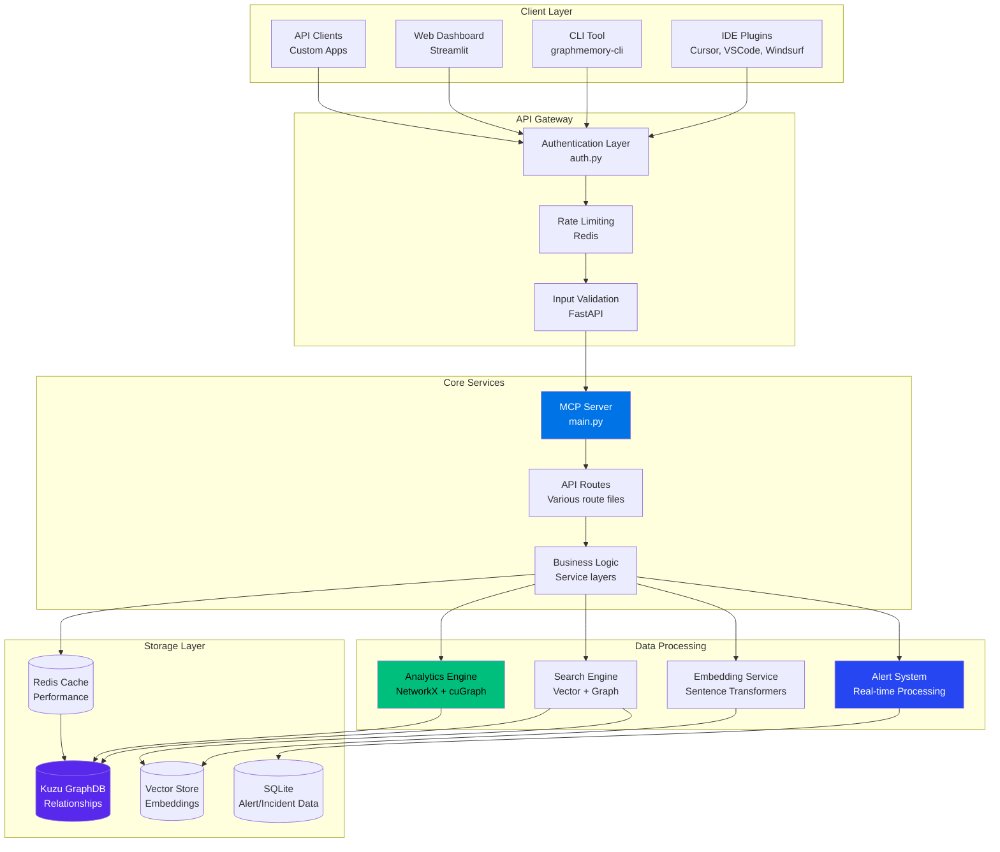

## 📁 Directory Structure & Code Organization

### Core Application Structure

```
GraphMemory-IDE/
├── server/                          # Backend FastAPI server
│   ├── main.py                      # Main application entry point
│   ├── auth.py                      # Authentication & authorization
│   ├── database.py                  # Database connections & setup
│   ├── models.py                    # Pydantic data models
│   ├── routes/                      # API route definitions
│   │   ├── memory.py               # Memory management endpoints
│   │   ├── graph.py                # Graph query endpoints
│   │   ├── search.py               # Search & discovery endpoints
│   │   └── health.py               # Health check endpoints
│   ├── analytics/                   # Analytics engine (2,500+ lines)
│   │   ├── engine.py               # Core analytics orchestration
│   │   ├── algorithms.py           # Graph algorithms & ML
│   │   ├── gpu_acceleration.py     # NVIDIA cuGraph integration
│   │   ├── performance_monitor.py  # Performance tracking
│   │   ├── alert_engine.py         # Alert rule evaluation
│   │   ├── alert_manager.py        # Alert lifecycle management
│   │   ├── notification_dispatcher.py # Multi-channel notifications
│   │   ├── alert_correlator.py     # ML-based correlation
│   │   └── incident_manager.py     # Incident management
│   └── dashboard/                   # Dashboard backend (1,000+ lines)
│       ├── main.py                 # Dashboard FastAPI server
│       ├── sse_server.py           # Server-sent events
│       ├── sse_alert_server.py     # Enhanced SSE for alerts
│       └── data_collection.py      # Real-time data collection
├── dashboard/                       # Streamlit frontend (3,000+ lines)
│   ├── streamlit_app.py            # Main dashboard application
│   ├── components/                 # UI components
│   │   ├── alerts.py               # Alert management UI
│   │   ├── incidents.py            # Incident management UI
│   │   ├── alert_metrics.py        # Analytics dashboard
│   │   └── alert_actions.py        # Action components
│   ├── pages/                      # Dashboard pages
│   │   └── alerts_dashboard.py     # Main alerts page
│   └── utils/                      # Dashboard utilities
├── ide-plugins/                     # IDE integration (2,000+ lines)
│   ├── shared/                     # Common plugin code
│   ├── cursor/                     # Cursor IDE plugin
│   ├── vscode/                     # VSCode extension
│   └── windsurf/                   # Windsurf plugin
└── cli/                            # Command-line interface
    ├── commands.mjs                # CLI command implementations
    └── update/                     # Update management
```

## 🔄 Core Code Paths

### 1. Memory Creation & Storage Flow

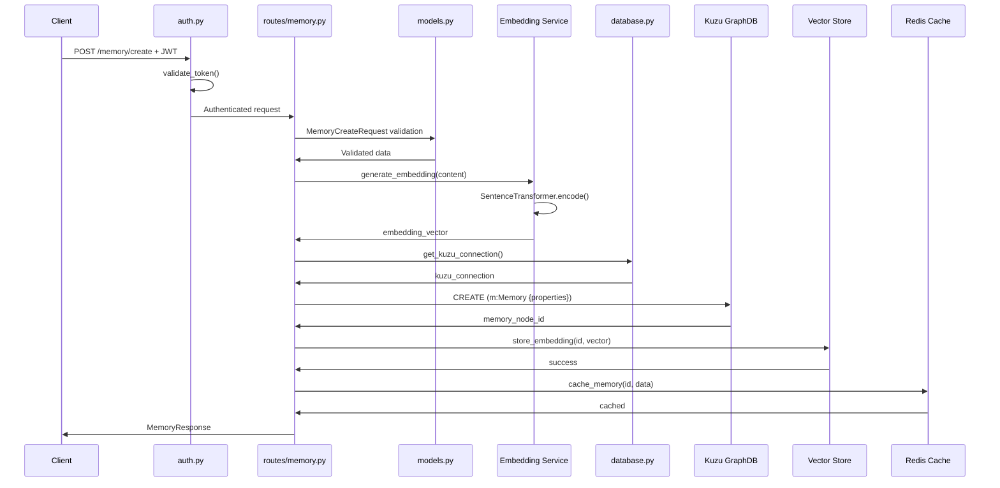

### 2. Search & Retrieval Flow

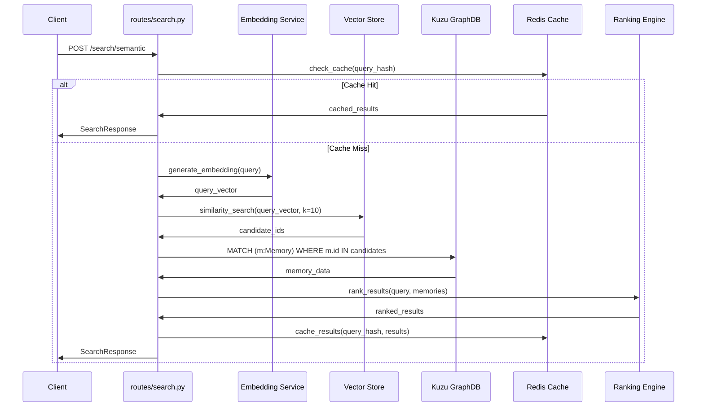

### 3. Alert System Flow (Step 8)

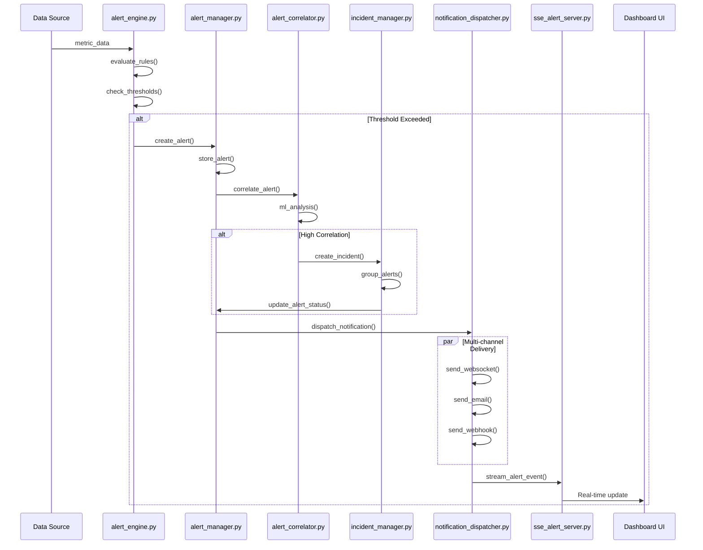

### 4. Analytics Engine Flow

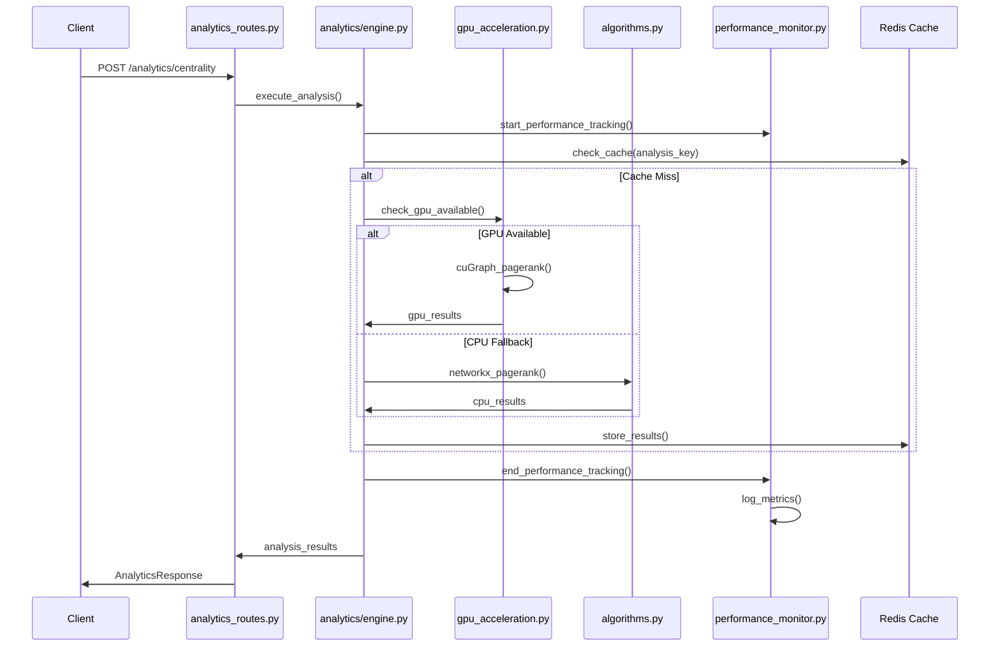

## 🔌 Plugin Integration Paths

### IDE Plugin Communication Flow

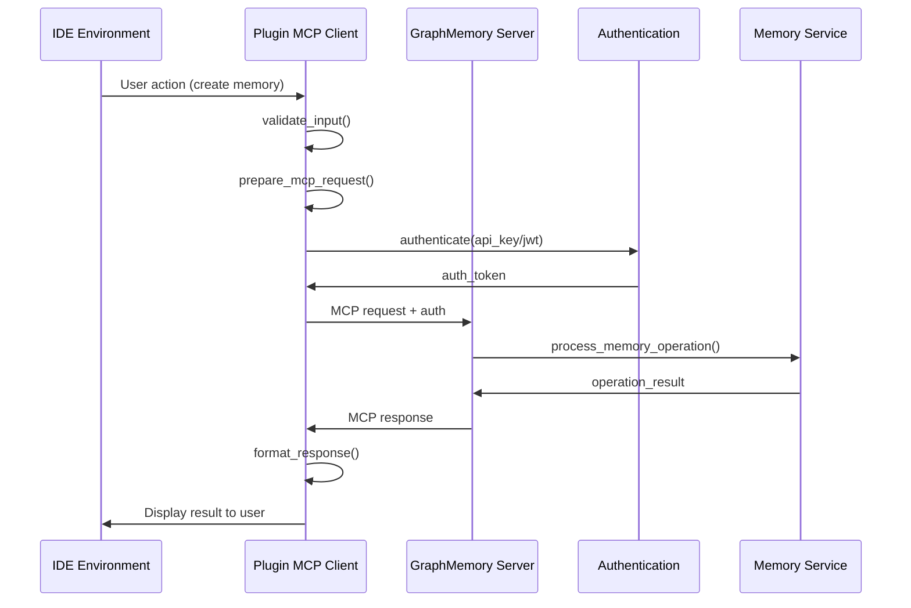

## 📊 Dashboard Real-time Data Flow

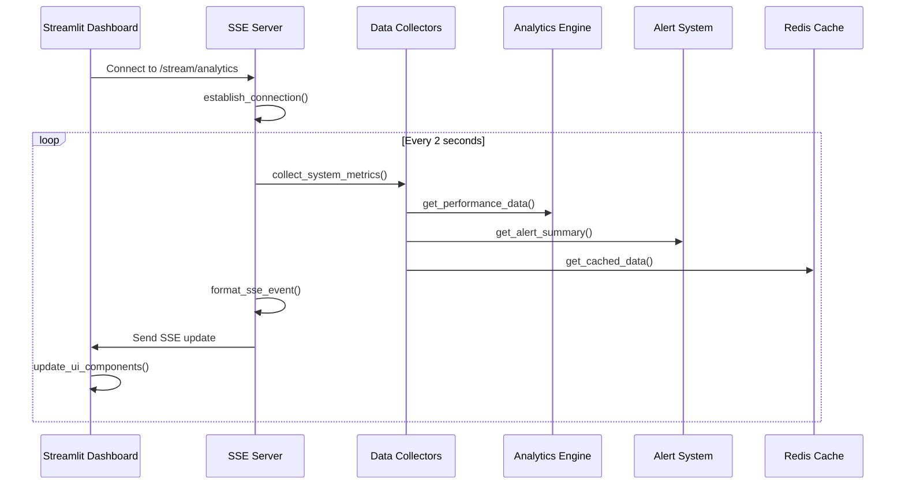

## 🔐 Security Code Paths

### Authentication Flow

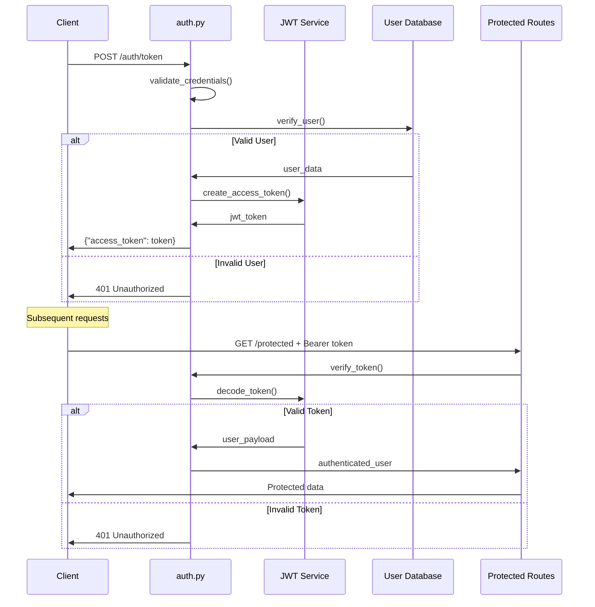

## 🚀 Performance Optimization Paths

### Caching Strategy

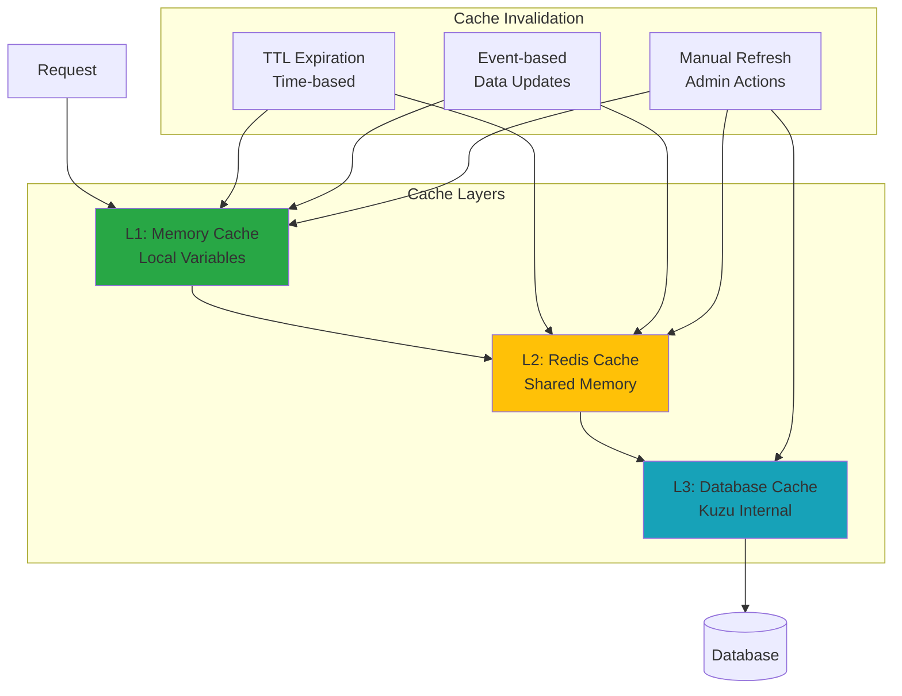

## 🔍 Error Handling Paths

### Error Propagation Flow

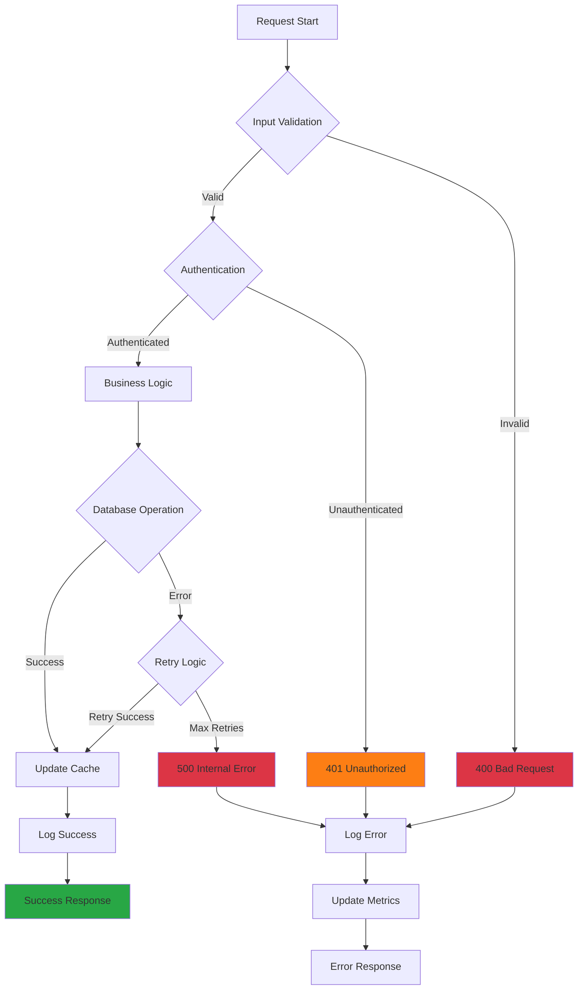

## 📈 Monitoring & Observability Paths

### Metrics Collection Flow

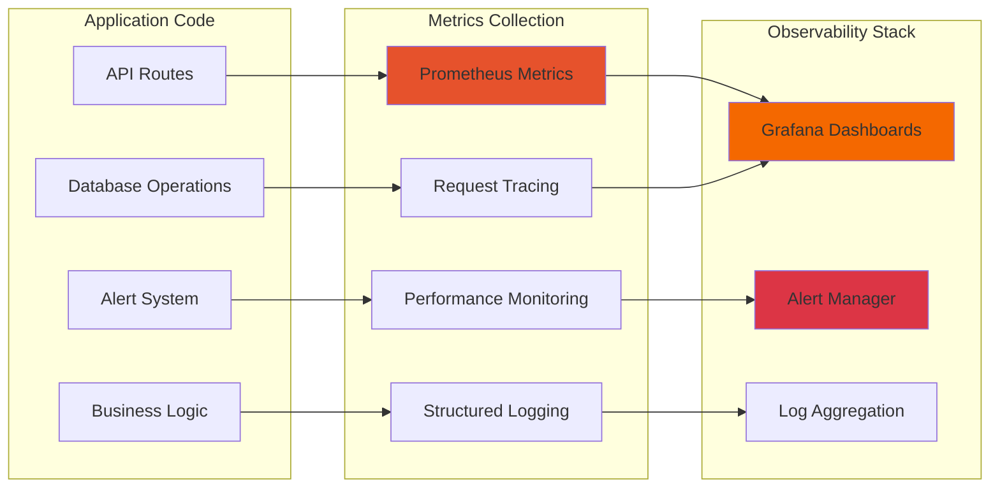

## 🧪 Testing Code Paths

### Test Execution Flow

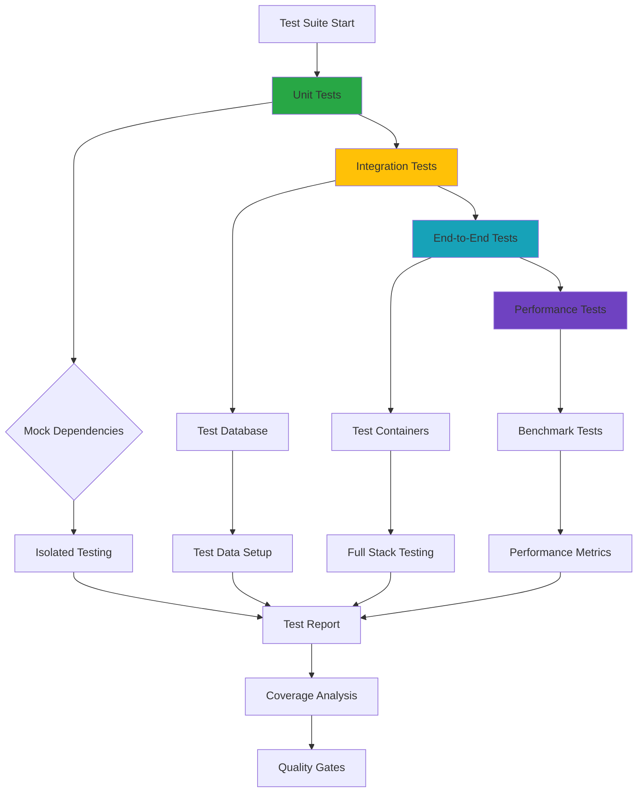

## 📚 Code Organization Best Practices

### Module Dependencies

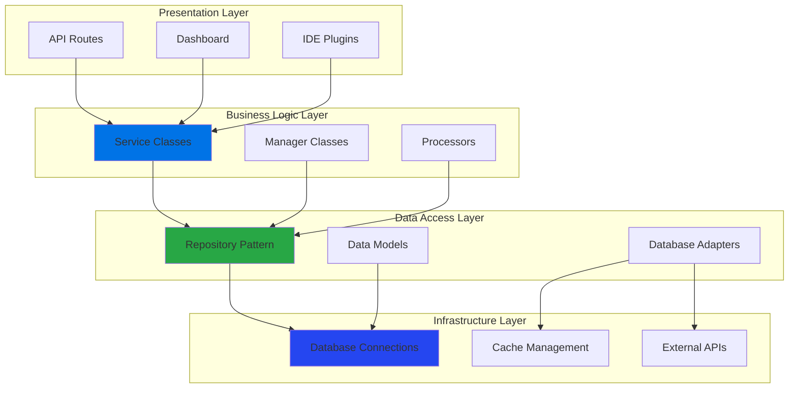

---

**Code Paths Documentation**: Comprehensive technical reference for GraphMemory-IDE  
**Version**: 1.0.0  
**Last Updated**: May 29, 2025  
**Maintainer**: Development Team 