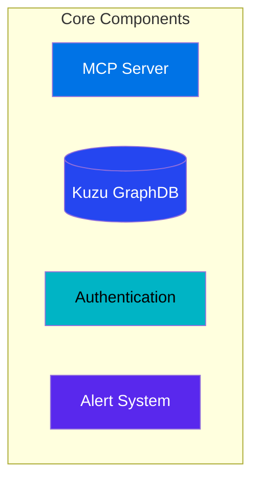
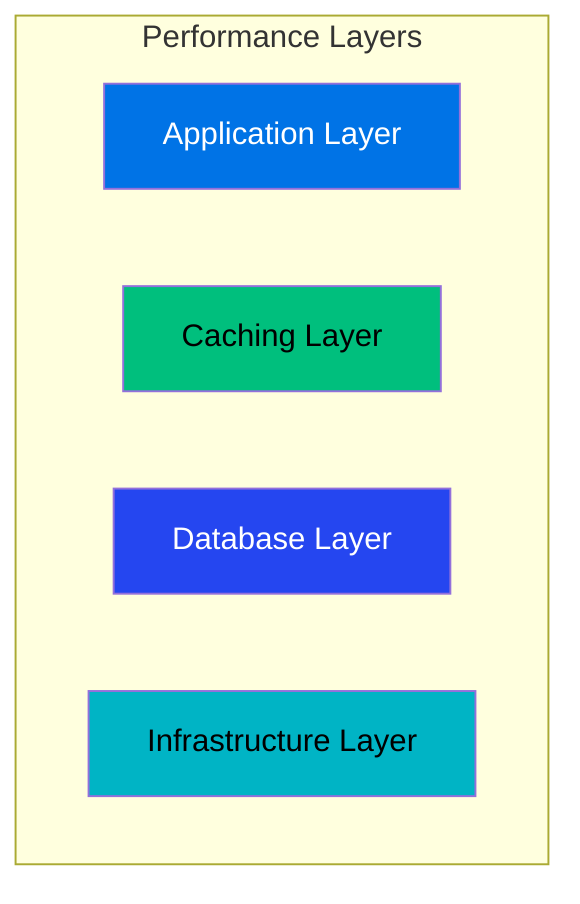
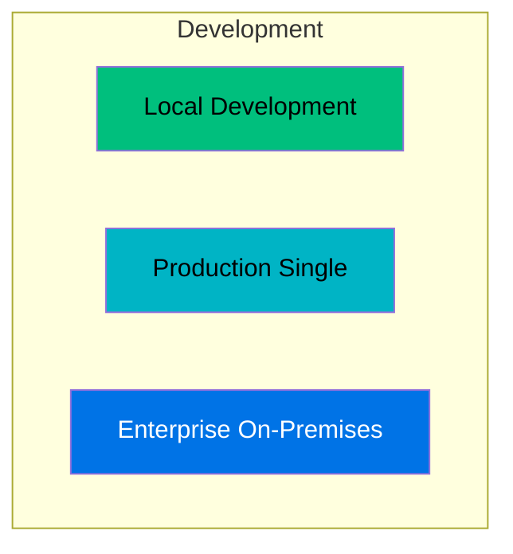
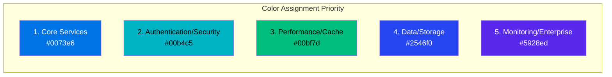

# GraphMemory-IDE Color Palette Guide

## 🎨 Overview

This guide documents the standardized color palette used across all Mermaid diagrams in the GraphMemory-IDE documentation. All diagrams follow the vibrant color scheme defined in `vibrant-palette.txt`.

## 🌈 Color Palette Specifications

### Primary Colors

| Color Code | Hex Value | Text Color | Usage | Visual Sample |
|------------|-----------|------------|-------|---------------|
| **Bright Green** | `#00bf7d` | `#000000` (Black) | Primary actions, success states, caching layers | 🟢 |
| **Teal/Cyan** | `#00b4c5` | `#000000` (Black) | Secondary components, authentication, networking | 🔵 |
| **Blue** | `#0073e6` | `#ffffff` (White) | Core services, main applications, primary data flow | 🔷 |
| **Dark Blue** | `#2546f0` | `#ffffff` (White) | Databases, storage layers, alert processing | 🔹 |
| **Purple** | `#5928ed` | `#ffffff` (White) | Advanced features, monitoring, enterprise components | 🟣 |

### Mermaid Syntax Reference

```mermaid
style NODE_NAME fill:#00bf7d,color:#000000
style NODE_NAME fill:#00b4c5,color:#000000
style NODE_NAME fill:#0073e6,color:#ffffff
style NODE_NAME fill:#2546f0,color:#ffffff
style NODE_NAME fill:#5928ed,color:#ffffff
```

## 📋 Color Usage Guidelines

### Component Type Mapping

| Component Type | Recommended Color | Reasoning |
|----------------|------------------|-----------|
| **Main Applications** | `#0073e6` (Blue) | High visibility for primary components |
| **Authentication/Security** | `#00b4c5` (Teal) | Professional look for security features |
| **Cache/Performance** | `#00bf7d` (Green) | Positive association with speed/efficiency |
| **Databases/Storage** | `#2546f0` (Dark Blue) | Stable, reliable data storage representation |
| **Monitoring/Enterprise** | `#5928ed` (Purple) | Premium feel for advanced features |

### Visual Hierarchy

1. **Primary Focus**: Use `#0073e6` (Blue) for the most important components
2. **Secondary Elements**: Use `#00b4c5` (Teal) or `#00bf7d` (Green)
3. **Supporting Systems**: Use `#2546f0` (Dark Blue)
4. **Advanced Features**: Use `#5928ed` (Purple)

## 📚 Documentation Files Updated

The following documentation files have been updated to use the standardized color palette:

### ✅ Updated Files

| File | Diagrams Updated | Status |
|------|------------------|--------|
| **README.md** | System Architecture, Advanced Alerting System | ✅ Complete |
| **docs/API_GUIDE.md** | API Architecture | ✅ Complete |
| **docs/DEPLOYMENT_GUIDE.md** | Software Dependencies, Deployment Matrix, Production Architecture | ✅ Complete |
| **docs/PERFORMANCE_TUNING.md** | Performance Layers, Multi-Tier Cache Architecture | ✅ Complete |
| **docs/MONITORING_GUIDE.md** | Monitoring Architecture | ✅ Complete |
| **docs/CODE_PATHS.md** | System Overview | ✅ Complete |

### 📊 Updated Diagram Examples

#### System Architecture (README.md)


#### Performance Architecture (PERFORMANCE_TUNING.md)


#### Deployment Architecture (DEPLOYMENT_GUIDE.md)


## 🔧 Implementation Guidelines

### For New Diagrams

When creating new Mermaid diagrams:

1. **Choose Primary Color**: Select the main component and use `#0073e6` (Blue)
2. **Apply Hierarchy**: Use colors based on component importance
3. **Maintain Consistency**: Follow the established patterns in existing diagrams
4. **Test Contrast**: Ensure text is readable with chosen background colors

### Color Assignment Rules



## 🎯 Quality Assurance

### Validation Checklist

- [ ] All new diagrams use colors from the approved palette
- [ ] Text contrast meets accessibility standards
- [ ] Color usage follows component type guidelines
- [ ] Diagrams maintain visual consistency across documentation

### Accessibility Considerations

- **High Contrast**: All color combinations provide sufficient contrast ratios
- **Text Visibility**: White text on dark backgrounds, black text on light backgrounds
- **Color Blindness**: Colors chosen to be distinguishable for common color vision deficiencies

## 📝 Maintenance

### Regular Updates

1. **New Documentation**: Apply color palette to all new Mermaid diagrams
2. **Existing Diagrams**: Audit and update legacy diagrams during documentation reviews
3. **Consistency Checks**: Verify color usage during PR reviews

### Future Enhancements

- Consider adding more colors if component types expand
- Maintain backwards compatibility with existing diagrams
- Update this guide when palette changes are needed

---

**Color Palette Version**: 1.0  
**Last Updated**: May 29, 2025  
**Scope**: All GraphMemory-IDE documentation Mermaid diagrams  
**Standard**: Based on vibrant-palette.txt specifications 