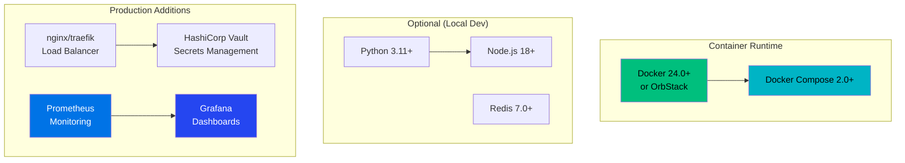
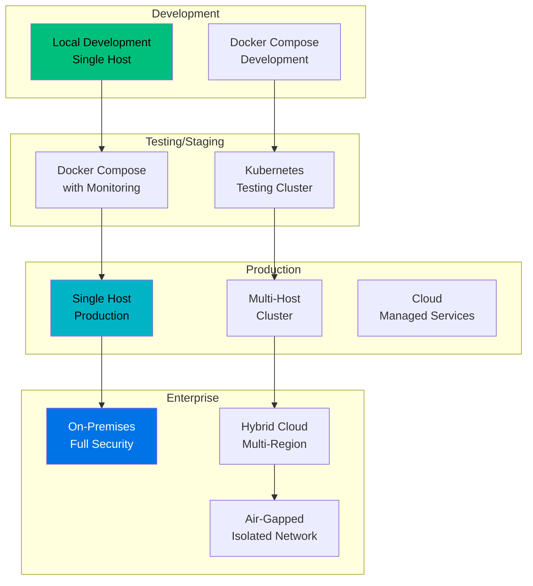
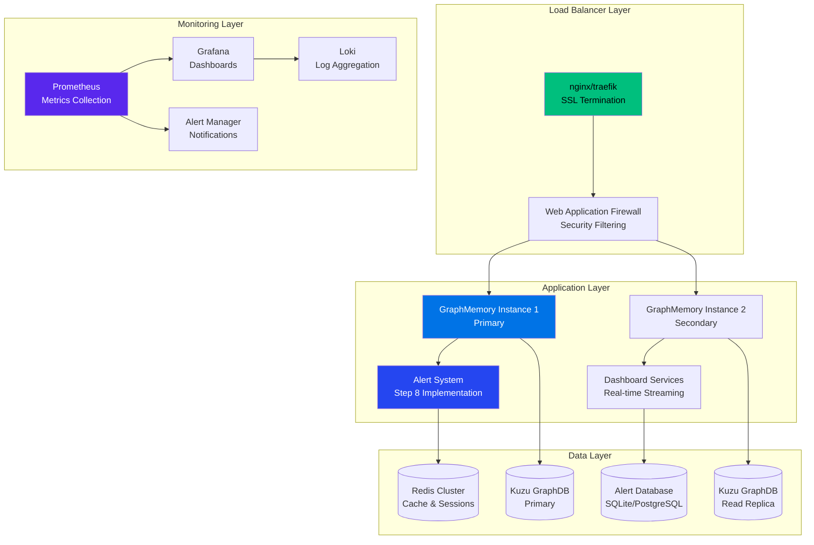
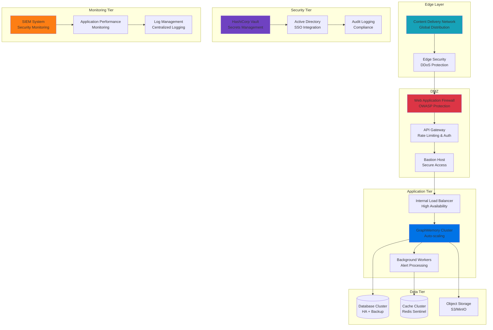
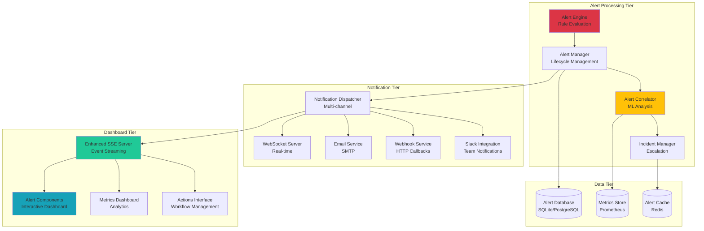
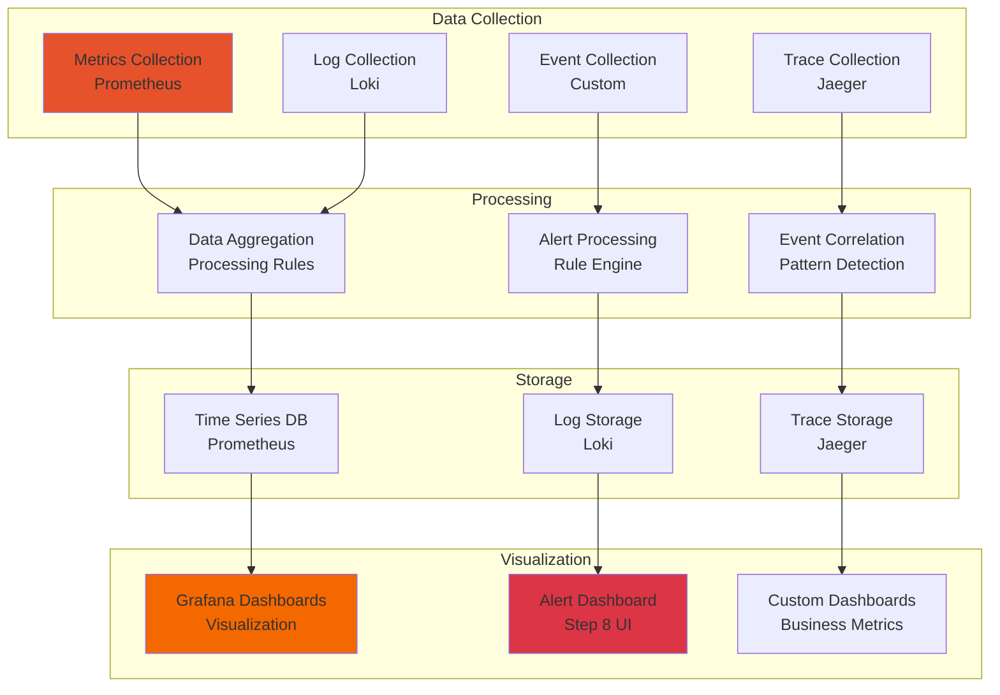

# GraphMemory-IDE Deployment Guide

## 🎯 Overview

This comprehensive guide covers deploying GraphMemory-IDE in various environments, from local development to production-grade enterprise deployments. The guide includes the complete Step 8 alerting system, analytics engine, and security hardening configurations.

## 📋 Table of Contents

- [Prerequisites](#prerequisites)
- [Deployment Options](#deployment-options)
- [Quick Start Deployment](#quick-start-deployment)
- [Production Deployment](#production-deployment)
- [Enterprise Deployment](#enterprise-deployment)
- [Step 8 Alerting System Deployment](#step-8-alerting-system-deployment)
- [Security Hardening](#security-hardening)
- [Monitoring & Observability](#monitoring--observability)
- [Performance Tuning](#performance-tuning)
- [Troubleshooting Deployment](#troubleshooting-deployment)

## 🚀 Prerequisites

### System Requirements

| Component | Minimum | Recommended | Production |
|-----------|---------|-------------|------------|
| **CPU** | 2 cores | 4 cores | 8+ cores |
| **RAM** | 4GB | 8GB | 16GB+ |
| **Storage** | 20GB | 50GB | 100GB+ |
| **Network** | 1Gbps | 1Gbps | 10Gbps |

### Software Dependencies



### Environment Preparation

```bash
# Verify Docker installation
docker --version
docker compose version

# Clone repository
git clone https://github.com/elementalcollision/GraphMemory-IDE.git
cd GraphMemory-IDE

# Verify system resources
df -h  # Check disk space
free -h  # Check memory
lscpu  # Check CPU
```

## 🔧 Deployment Options

### Deployment Architecture Matrix



## 🚀 Quick Start Deployment

### Option 1: Standard Docker Deployment

```bash
# Navigate to docker directory
cd docker

# Start all services
docker compose up -d

# Verify services
docker compose ps
docker compose logs -f mcp-server
```

**Services Started:**
- MCP Server: http://localhost:8080
- MCP Server (mTLS): https://localhost:50051
- Kestra CI/CD: http://localhost:8081

### Option 2: Security-Hardened Deployment

```bash
# Deploy with enhanced security
./scripts/deploy-secure.sh

# Or with mTLS enabled
MTLS_ENABLED=true ./scripts/deploy-secure.sh

# Verify security features
./scripts/verify-security.sh
```

### Option 3: Local Development

```bash
# Create virtual environment
python3 -m venv .venv
source .venv/bin/activate

# Install dependencies
pip install -r requirements.txt

# Initialize database
cd server && python init_db.py

# Start development server
python main.py
```

## 🏢 Production Deployment

### Production Architecture



### Production Configuration

```bash
# Production environment variables
export ENVIRONMENT=production
export KUZU_DB_PATH=/data/kuzu
export REDIS_URL=redis://redis-cluster:6379
export JWT_SECRET_KEY=$(openssl rand -hex 32)
export MTLS_ENABLED=true
export LOG_LEVEL=INFO
export METRICS_ENABLED=true

# Deploy production stack
ENVIRONMENT=production ./scripts/deploy-secure.sh --with-monitoring
```

### Production Docker Compose

```yaml
# docker-compose.prod.yml
version: '3.8'

services:
  nginx:
    image: nginx:alpine
    ports:
      - "80:80"
      - "443:443"
    volumes:
      - ./nginx/nginx.conf:/etc/nginx/nginx.conf
      - ./certs:/etc/nginx/certs
    depends_on:
      - graphmemory-app1
      - graphmemory-app2

  graphmemory-app1:
    image: graphmemory-ide:latest
    environment:
      - ENVIRONMENT=production
      - INSTANCE_ID=app1
    volumes:
      - kuzu_data:/app/data
      - app_logs:/app/logs
    deploy:
      resources:
        limits:
          cpus: '2'
          memory: 4G
        reservations:
          cpus: '1'
          memory: 2G

  graphmemory-app2:
    image: graphmemory-ide:latest
    environment:
      - ENVIRONMENT=production
      - INSTANCE_ID=app2
      - READ_ONLY_MODE=true
    volumes:
      - kuzu_data:/app/data:ro
      - app_logs:/app/logs

  redis-cluster:
    image: redis:7-alpine
    command: redis-server --appendonly yes
    volumes:
      - redis_data:/data

  prometheus:
    image: prom/prometheus:latest
    ports:
      - "9090:9090"
    volumes:
      - ./monitoring/prometheus.yml:/etc/prometheus/prometheus.yml
      - prometheus_data:/prometheus

volumes:
  kuzu_data:
  redis_data:
  prometheus_data:
  app_logs:
```

## 🏛️ Enterprise Deployment

### Enterprise Architecture Components



### Enterprise Security Configuration

```bash
# Enterprise deployment with full security
export ENTERPRISE_MODE=true
export SSO_ENABLED=true
export AUDIT_LOGGING=true
export ENCRYPTION_AT_REST=true
export NETWORK_POLICIES=strict

# Deploy enterprise stack
./scripts/deploy-enterprise.sh
```

## 🚨 Step 8 Alerting System Deployment

### Alerting Architecture Deployment



### Step 8 Configuration

```bash
# Enable Step 8 alerting system
export STEP8_ENABLED=true
export ALERT_PROCESSING_WORKERS=4
export CORRELATION_ML_ENABLED=true
export INCIDENT_AUTO_ESCALATION=true
export DASHBOARD_REALTIME=true

# Configure notification channels
export WEBSOCKET_ENABLED=true
export EMAIL_ENABLED=true
export WEBHOOK_ENABLED=true
export SLACK_ENABLED=false

# Performance tuning
export ALERT_BATCH_SIZE=100
export CORRELATION_TIMEOUT=30
export NOTIFICATION_RETRY_ATTEMPTS=3

# Deploy Step 8 components
docker compose -f docker-compose.yml -f docker-compose.step8.yml up -d
```

### Step 8 Docker Compose Extension

```yaml
# docker-compose.step8.yml
version: '3.8'

services:
  alert-engine:
    image: graphmemory-ide:latest
    command: python -m server.analytics.alert_engine
    environment:
      - COMPONENT=alert_engine
      - WORKERS=4
    volumes:
      - alert_data:/app/data/alerts
    depends_on:
      - alert-db

  alert-correlator:
    image: graphmemory-ide:latest
    command: python -m server.analytics.alert_correlator
    environment:
      - COMPONENT=alert_correlator
      - ML_ENABLED=true
    volumes:
      - ml_models:/app/models

  notification-dispatcher:
    image: graphmemory-ide:latest
    command: python -m server.analytics.notification_dispatcher
    environment:
      - COMPONENT=notification_dispatcher
      - CHANNELS=websocket,email,webhook
    ports:
      - "8082:8082"  # WebSocket port

  sse-alert-server:
    image: graphmemory-ide:latest
    command: python -m server.dashboard.sse_alert_server
    environment:
      - COMPONENT=sse_alert_server
    ports:
      - "8083:8083"  # SSE port

  alert-db:
    image: postgres:15-alpine
    environment:
      - POSTGRES_DB=alerts
      - POSTGRES_USER=alertuser
      - POSTGRES_PASSWORD_FILE=/run/secrets/alert_db_password
    volumes:
      - alert_db_data:/var/lib/postgresql/data
    secrets:
      - alert_db_password

volumes:
  alert_data:
  alert_db_data:
  ml_models:

secrets:
  alert_db_password:
    file: ./secrets/alert_db_password.txt
```

## 🔒 Security Hardening

### Container Security

```bash
# Apply security hardening
./scripts/apply-security-hardening.sh

# Verify security configuration
./scripts/verify-security.sh

# Generate mTLS certificates
./scripts/setup-mtls.sh
```

### Security Checklist

- ✅ **Container Hardening**: Read-only filesystems, non-root users
- ✅ **Network Security**: mTLS, VPN, network segmentation
- ✅ **Authentication**: JWT tokens, SSO integration
- ✅ **Authorization**: RBAC, fine-grained permissions
- ✅ **Encryption**: Data at rest and in transit
- ✅ **Audit Logging**: Complete audit trail
- ✅ **Secrets Management**: Vault integration
- ✅ **Security Monitoring**: Real-time threat detection

## 📊 Monitoring & Observability

### Monitoring Stack Deployment

```bash
# Deploy full monitoring stack
docker compose -f docker-compose.yml -f docker-compose.monitoring.yml up -d

# Access monitoring services
echo "Prometheus: http://localhost:9090"
echo "Grafana: http://localhost:3000"
echo "AlertManager: http://localhost:9093"
```

### Monitoring Architecture



## ⚡ Performance Tuning

### Database Optimization

```bash
# Optimize Kuzu database
echo "CREATE INDEX IF NOT EXISTS idx_memory_created_at ON Memory(created_at);" | kuzu

# Redis configuration for high performance
redis-cli CONFIG SET maxmemory-policy allkeys-lru
redis-cli CONFIG SET maxmemory 2gb
```

### Application Tuning

```yaml
# Performance environment variables
environment:
  - WORKERS=4
  - WORKER_CONNECTIONS=1000
  - KEEPALIVE_TIMEOUT=65
  - MAX_REQUEST_SIZE=50MB
  - CACHE_TTL=3600
  - BATCH_SIZE=1000
  - CONCURRENT_REQUESTS=100
```

### Performance Monitoring

```bash
# Monitor performance
curl http://localhost:8080/metrics | grep -E "(request_duration|memory_usage|cpu_usage)"

# Step 8 specific metrics
curl http://localhost:8080/alerts/metrics/performance
```

## 🚀 Cloud Deployment

### AWS Deployment

```bash
# Deploy to AWS using ECS
aws ecs create-cluster --cluster-name graphmemory-prod

# Deploy using CloudFormation
aws cloudformation deploy \
  --template-file cloudformation/graphmemory-stack.yml \
  --stack-name graphmemory-production \
  --capabilities CAPABILITY_IAM
```

### Kubernetes Deployment

```bash
# Deploy to Kubernetes
kubectl apply -f k8s/namespace.yml
kubectl apply -f k8s/configmap.yml
kubectl apply -f k8s/secrets.yml
kubectl apply -f k8s/deployment.yml
kubectl apply -f k8s/service.yml
kubectl apply -f k8s/ingress.yml

# Deploy Step 8 components
kubectl apply -f k8s/step8/
```

## 🔧 Troubleshooting Deployment

### Common Issues

**Container Won't Start**
```bash
# Check logs
docker compose logs -f mcp-server

# Check resource usage
docker stats

# Verify configuration
docker compose config
```

**Database Connection Issues**
```bash
# Test database connectivity
docker compose exec mcp-server python -c "
import kuzu
db = kuzu.Database('/app/data/kuzu')
conn = kuzu.Connection(db)
print('Database connection successful')
"
```

**Alert System Issues**
```bash
# Check Step 8 components
curl http://localhost:8080/alerts/health
curl http://localhost:8083/alerts/stream/status

# Verify notification channels
docker compose logs notification-dispatcher
```

**Performance Issues**
```bash
# Monitor resource usage
htop
iotop
nethogs

# Check application metrics
curl http://localhost:8080/metrics
```

### Deployment Validation

```bash
# Run comprehensive deployment tests
./scripts/test-deployment.sh

# Validate all services
./scripts/validate-services.sh

# Run integration tests
pytest tests/deployment/ -v
```

## 📋 Deployment Checklist

### Pre-Deployment
- [ ] System requirements verified
- [ ] Dependencies installed
- [ ] Network connectivity confirmed
- [ ] Storage capacity planned
- [ ] Security certificates generated
- [ ] Environment variables configured
- [ ] Backup strategy implemented

### Deployment
- [ ] Services deployed successfully
- [ ] Health checks passing
- [ ] Database initialized
- [ ] Cache configured
- [ ] Monitoring enabled
- [ ] Logging configured
- [ ] Security hardening applied

### Post-Deployment
- [ ] Functional testing completed
- [ ] Performance testing passed
- [ ] Security testing validated
- [ ] Monitoring alerts configured
- [ ] Documentation updated
- [ ] Team training completed
- [ ] Incident response procedures in place

---

**Deployment Guide**: Complete deployment reference for GraphMemory-IDE  
**Version**: 2.0.0  
**Last Updated**: January 29, 2025  
**Includes**: Step 8 Alerting System, Enterprise Security, Production Monitoring 