# GraphMemory-IDE Kubernetes Operations Guide

## 🎯 Overview

This guide covers the operational aspects of managing GraphMemory-IDE in a production Kubernetes environment. It includes the complete Phase 3 Day 2 implementation with StatefulSets, Gateway API, auto-scaling, and advanced operational procedures.

## 📋 Table of Contents

- [Kubernetes Architecture Overview](#kubernetes-architecture-overview)
- [Resource Management](#resource-management)
- [Scaling Operations](#scaling-operations)
- [Network Management](#network-management)
- [Storage Operations](#storage-operations)
- [Monitoring and Alerting](#monitoring-and-alerting)
- [Security Operations](#security-operations)
- [Backup and Recovery](#backup-and-recovery)
- [Troubleshooting](#troubleshooting)

## 🏗️ Kubernetes Architecture Overview

### Complete System Architecture

### Namespace Organization

## ⚙️ Resource Management

### Resource Quotas and Limits

### Pod Affinity and Anti-Affinity

## 📊 Scaling Operations

### Horizontal Pod Autoscaler (HPA) Workflow

### Vertical Pod Autoscaler (VPA) Workflow

### Combined HPA + VPA Strategy

## 🌐 Network Management

### Gateway API Architecture

```mermaid
flowchart TB
    subgraph "External Traffic"
        INTERNET[Internet Traffic]
        DNS[DNS Resolution<br/>graphmemory.example.com]
        CDN[CloudFlare CDN<br/>Static Assets]
    end
    
    subgraph "Gateway Layer"
        GATEWAY_CLASS[GatewayClass<br/>nginx-gateway-fabric]
        GATEWAY[Gateway<br/>graphmemory-gateway]
        HTTP_LISTENER[HTTP Listener<br/>Port 80 → HTTPS redirect]
        HTTPS_LISTENER[HTTPS Listener<br/>Port 443 → TLS termination]
        API_LISTENER[API Listener<br/>Port 8443 → API traffic]
    end
    
    subgraph "Routing Layer"
        DASHBOARD_ROUTE[HTTPRoute<br/>/ → Dashboard]
        API_ROUTE[HTTPRoute<br/>/api → Backend]
        WS_ROUTE[HTTPRoute<br/>/ws → WebSocket]
        HEALTH_ROUTE[HTTPRoute<br/>/health → Health checks]
    end
    
    subgraph "Service Layer"
        STREAMLIT_SVC[Streamlit Service<br/>ClusterIP]
        FASTAPI_SVC[FastAPI Service<br/>ClusterIP]
        ANALYTICS_SVC[Analytics Service<br/>ClusterIP]
    end
    
    subgraph "Security Policies"
        RATE_LIMIT[Rate Limiting<br/>100-300 req/min]
        CORS_POLICY[CORS Policy<br/>API access control]
        TLS_POLICY[TLS Policy<br/>Certificate management]
        NETWORK_POLICY[Network Policies<br/>Pod-to-pod communication]
    end
    
    INTERNET --> DNS
    DNS --> CDN
    CDN --> GATEWAY
    
    GATEWAY --> HTTP_LISTENER
    GATEWAY --> HTTPS_LISTENER
    GATEWAY --> API_LISTENER
    
    HTTP_LISTENER --> DASHBOARD_ROUTE
    HTTPS_LISTENER --> DASHBOARD_ROUTE
    HTTPS_LISTENER --> API_ROUTE
    API_LISTENER --> WS_ROUTE
    
    DASHBOARD_ROUTE --> STREAMLIT_SVC
    API_ROUTE --> FASTAPI_SVC
    WS_ROUTE --> ANALYTICS_SVC
    
    GATEWAY --> RATE_LIMIT
    GATEWAY --> CORS_POLICY
    GATEWAY --> TLS_POLICY
    NETWORK_POLICY --> STREAMLIT_SVC
    NETWORK_POLICY --> FASTAPI_SVC
    
    style GATEWAY fill:#326ce5,color:#fff
    style RATE_LIMIT fill:#ff5722,color:#fff
    style TLS_POLICY fill:#4caf50,color:#000
```

### Network Policies and Security

```mermaid
flowchart TD
    subgraph "Default Deny Policy"
        DENY_ALL[Deny All Ingress<br/>Default namespace policy]
        DENY_EGRESS[Deny All Egress<br/>Strict outbound control]
    end
    
    subgraph "Application Network Policies"
        FRONTEND_POLICY[Frontend Policy<br/>Allow: Gateway → Streamlit]
        BACKEND_POLICY[Backend Policy<br/>Allow: Gateway + Frontend → FastAPI]
        ANALYTICS_POLICY[Analytics Policy<br/>Allow: Backend → Analytics]
        DATABASE_POLICY[Database Policy<br/>Allow: Backend + Analytics → DB]
    end
    
    subgraph "System Network Policies"
        MONITORING_POLICY[Monitoring Policy<br/>Allow: Prometheus scraping]
        DNS_POLICY[DNS Policy<br/>Allow: DNS resolution]
        EGRESS_POLICY[Egress Policy<br/>Allow: External APIs]
    end
    
    subgraph "Allowed Traffic Flows"
        INGRESS_FLOW[Internet → Gateway → Apps]
        INTERNAL_FLOW[App → App communication]
        DATABASE_FLOW[Apps → Databases]
        MONITORING_FLOW[Prometheus → All endpoints]
        EGRESS_FLOW[Apps → External services]
    end
    
    DENY_ALL --> FRONTEND_POLICY
    DENY_ALL --> BACKEND_POLICY
    DENY_ALL --> ANALYTICS_POLICY
    DENY_ALL --> DATABASE_POLICY
    
    FRONTEND_POLICY --> INGRESS_FLOW
    BACKEND_POLICY --> INTERNAL_FLOW
    DATABASE_POLICY --> DATABASE_FLOW
    
    MONITORING_POLICY --> MONITORING_FLOW
    EGRESS_POLICY --> EGRESS_FLOW
    
    style DENY_ALL fill:#f44336,color:#fff
    style FRONTEND_POLICY fill:#4caf50,color:#000
    style MONITORING_POLICY fill:#ff9800,color:#000
```

## 💾 Storage Operations

### Persistent Volume Management

### StatefulSet Scaling Operations

```mermaid
sequenceDiagram
    participant Operator as Kubernetes Operator
    participant StatefulSet as StatefulSet Controller
    participant Pods as StatefulSet Pods
    participant Storage as Persistent Volumes
    participant Database as Database Cluster

    Note over Operator, Database: StatefulSet Scaling Workflow

    Operator->>StatefulSet: Scale replicas: 1 → 3
    StatefulSet->>Storage: Create PVC for pod-1
    Storage->>Storage: Provision volume
    
    StatefulSet->>Pods: Create pod-1 (replica)
    Pods->>Database: Initialize as replica
    Database->>Database: Start replication from primary
    
    loop Health Check
        StatefulSet->>Pods: Check pod-1 readiness
        Pods->>Database: Verify replication lag
        Database-->>Pods: Replication healthy
    end
    
    StatefulSet->>Storage: Create PVC for pod-2
    Storage->>Storage: Provision volume
    StatefulSet->>Pods: Create pod-2 (replica)
    
    Note over Database: All replicas running
    Database->>Operator: Scaling complete
```

## 📊 Monitoring and Alerting

### Prometheus Monitoring Architecture

### SLI/SLO Monitoring

## 🔒 Security Operations

### RBAC and Access Control

### Secrets Management

## 💾 Backup and Recovery

### Backup Strategy

### Disaster Recovery Workflow

## 🔧 Troubleshooting

### Common Issues and Solutions

### Performance Troubleshooting

## 📚 Operational Runbooks

### Daily Operations Checklist

This comprehensive Kubernetes Operations Guide provides detailed operational procedures for managing GraphMemory-IDE in production. The guide includes visual workflows for all major operational tasks, from scaling and monitoring to troubleshooting and disaster recovery.

Key operational principles:
- **Proactive monitoring** with comprehensive SLI/SLO tracking
- **Automated scaling** using HPA and VPA for optimal resource utilization  
- **Security-first approach** with RBAC, network policies, and secrets management
- **Disaster recovery** planning with defined RTO/RPO targets
- **Performance optimization** through continuous monitoring and tuning

For specific operational procedures, refer to the individual sections and use the provided mermaid diagrams to understand the complete workflows. 