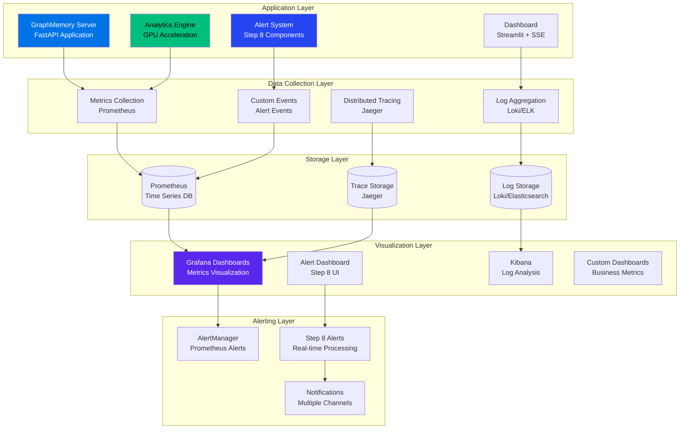

# GraphMemory-IDE Monitoring & Observability Guide

## 🎯 Overview

Comprehensive monitoring and observability strategy for GraphMemory-IDE, covering the core system, Step 8 alerting platform, analytics engine, and dashboard components with production-ready monitoring stack.

## 📊 Monitoring Architecture



## 🔧 Metrics Collection

### Prometheus Configuration

```yaml
# monitoring/prometheus.yml
global:
  scrape_interval: 15s
  evaluation_interval: 15s

rule_files:
  - "alert_rules.yml"
  - "recording_rules.yml"

alerting:
  alertmanagers:
    - static_configs:
        - targets:
          - alertmanager:9093

scrape_configs:
  # GraphMemory main application
  - job_name: 'graphmemory-app'
    static_configs:
      - targets: ['graphmemory-server:8080']
    metrics_path: '/metrics'
    scrape_interval: 10s

  # Step 8 Alert System
  - job_name: 'alert-system'
    static_configs:
      - targets: 
        - 'alert-engine:8081'
        - 'alert-correlator:8082'
        - 'notification-dispatcher:8083'
    metrics_path: '/metrics'
    scrape_interval: 5s  # More frequent for alerts

  # Analytics Engine
  - job_name: 'analytics-engine'
    static_configs:
      - targets: ['analytics-server:8084']
    metrics_path: '/analytics/metrics'
    scrape_interval: 10s

  # Dashboard SSE Server
  - job_name: 'dashboard-sse'
    static_configs:
      - targets: ['sse-server:8085']
    metrics_path: '/dashboard/metrics'
    scrape_interval: 15s

  # Infrastructure monitoring
  - job_name: 'node-exporter'
    static_configs:
      - targets: ['node-exporter:9100']
  
  - job_name: 'redis-exporter'
    static_configs:
      - targets: ['redis-exporter:9121']
```

### Application Metrics Implementation

```python
# server/monitoring/metrics.py
from prometheus_client import Counter, Histogram, Gauge, Info
import time
import psutil
from functools import wraps

# Core Application Metrics
REQUEST_COUNT = Counter(
    'graphmemory_requests_total',
    'Total HTTP requests',
    ['method', 'endpoint', 'status']
)

REQUEST_DURATION = Histogram(
    'graphmemory_request_duration_seconds',
    'HTTP request duration',
    ['method', 'endpoint']
)

MEMORY_USAGE = Gauge(
    'graphmemory_memory_usage_bytes',
    'Memory usage in bytes',
    ['type']
)

CPU_USAGE = Gauge(
    'graphmemory_cpu_usage_percent',
    'CPU usage percentage'
)

DB_CONNECTIONS = Gauge(
    'graphmemory_db_connections_active',
    'Active database connections'
)

CACHE_OPERATIONS = Counter(
    'graphmemory_cache_operations_total',
    'Cache operations',
    ['operation', 'result']
)

# Step 8 Alert System Metrics
ALERT_PROCESSING_TIME = Histogram(
    'alert_processing_duration_seconds',
    'Alert processing time',
    ['alert_type', 'severity']
)

ALERT_COUNT = Counter(
    'alerts_total',
    'Total alerts processed',
    ['severity', 'status', 'source']
)

CORRELATION_SUCCESS_RATE = Gauge(
    'alert_correlation_success_rate',
    'Alert correlation success rate'
)

INCIDENT_COUNT = Counter(
    'incidents_total',
    'Total incidents',
    ['priority', 'status', 'category']
)

NOTIFICATION_DELIVERY = Counter(
    'notification_delivery_total',
    'Notification delivery attempts',
    ['channel', 'status']
)

# Analytics Engine Metrics
ANALYTICS_EXECUTION_TIME = Histogram(
    'analytics_execution_duration_seconds',
    'Analytics algorithm execution time',
    ['algorithm', 'acceleration']
)

GPU_UTILIZATION = Gauge(
    'gpu_utilization_percent',
    'GPU utilization percentage',
    ['device']
)

GRAPH_METRICS = Gauge(
    'graph_metrics',
    'Graph analysis metrics',
    ['metric_type']
)

class MetricsCollector:
    def __init__(self):
        self.start_time = time.time()
    
    def track_request(self, func):
        """Decorator to track request metrics"""
        @wraps(func)
        async def wrapper(*args, **kwargs):
            start_time = time.time()
            
            try:
                result = await func(*args, **kwargs)
                status = '200'
                return result
            except Exception as e:
                status = '500'
                raise
            finally:
                duration = time.time() - start_time
                REQUEST_COUNT.labels(
                    method='POST', 
                    endpoint=func.__name__, 
                    status=status
                ).inc()
                REQUEST_DURATION.labels(
                    method='POST', 
                    endpoint=func.__name__
                ).observe(duration)
        
        return wrapper
    
    def update_system_metrics(self):
        """Update system-level metrics"""
        # Memory metrics
        memory = psutil.virtual_memory()
        MEMORY_USAGE.labels(type='used').set(memory.used)
        MEMORY_USAGE.labels(type='available').set(memory.available)
        
        # CPU metrics
        CPU_USAGE.set(psutil.cpu_percent())
        
        # Process metrics
        process = psutil.Process()
        MEMORY_USAGE.labels(type='process').set(process.memory_info().rss)
```

### Custom Metrics for Step 8

```python
# server/analytics/monitoring.py
from prometheus_client import Counter, Histogram, Gauge
import time

class AlertMetrics:
    def __init__(self):
        self.alert_processing_start = {}
    
    def start_alert_processing(self, alert_id: str):
        """Start timing alert processing"""
        self.alert_processing_start[alert_id] = time.time()
    
    def end_alert_processing(self, alert_id: str, alert_type: str, severity: str):
        """End timing and record metrics"""
        start_time = self.alert_processing_start.pop(alert_id, time.time())
        duration = time.time() - start_time
        
        ALERT_PROCESSING_TIME.labels(
            alert_type=alert_type,
            severity=severity
        ).observe(duration)
        
        ALERT_COUNT.labels(
            severity=severity,
            status='processed',
            source='system'
        ).inc()
    
    def record_correlation_result(self, success: bool, confidence: float):
        """Record correlation metrics"""
        if success:
            CORRELATION_SUCCESS_RATE.set(confidence)
    
    def record_notification_delivery(self, channel: str, success: bool):
        """Record notification delivery metrics"""
        status = 'success' if success else 'failed'
        NOTIFICATION_DELIVERY.labels(
            channel=channel,
            status=status
        ).inc()

class AnalyticsMetrics:
    def __init__(self):
        self.execution_start = {}
    
    def start_analytics_execution(self, algorithm: str, execution_id: str):
        """Start timing analytics execution"""
        self.execution_start[execution_id] = time.time()
    
    def end_analytics_execution(self, algorithm: str, execution_id: str, gpu_used: bool):
        """End timing and record metrics"""
        start_time = self.execution_start.pop(execution_id, time.time())
        duration = time.time() - start_time
        
        acceleration = 'gpu' if gpu_used else 'cpu'
        ANALYTICS_EXECUTION_TIME.labels(
            algorithm=algorithm,
            acceleration=acceleration
        ).observe(duration)
    
    def update_graph_metrics(self, node_count: int, edge_count: int, density: float):
        """Update graph analysis metrics"""
        GRAPH_METRICS.labels(metric_type='node_count').set(node_count)
        GRAPH_METRICS.labels(metric_type='edge_count').set(edge_count)
        GRAPH_METRICS.labels(metric_type='density').set(density)
```

## 📋 Logging Strategy

### Structured Logging Configuration

```python
# server/logging_config.py
import logging
import json
from datetime import datetime
from typing import Dict, Any

class StructuredFormatter(logging.Formatter):
    def format(self, record):
        log_entry = {
            'timestamp': datetime.utcnow().isoformat(),
            'level': record.levelname,
            'logger': record.name,
            'message': record.getMessage(),
            'module': record.module,
            'function': record.funcName,
            'line': record.lineno
        }
        
        # Add extra fields if present
        if hasattr(record, 'extra_fields'):
            log_entry.update(record.extra_fields)
        
        # Add exception info if present
        if record.exc_info:
            log_entry['exception'] = self.formatException(record.exc_info)
        
        return json.dumps(log_entry)

# Logging configuration
LOGGING_CONFIG = {
    'version': 1,
    'disable_existing_loggers': False,
    'formatters': {
        'structured': {
            '()': StructuredFormatter,
        },
        'standard': {
            'format': '%(asctime)s [%(levelname)s] %(name)s: %(message)s'
        }
    },
    'handlers': {
        'console': {
            'level': 'INFO',
            'class': 'logging.StreamHandler',
            'formatter': 'structured',
            'stream': 'ext://sys.stdout'
        },
        'file': {
            'level': 'DEBUG',
            'class': 'logging.handlers.RotatingFileHandler',
            'formatter': 'structured',
            'filename': '/app/logs/graphmemory.log',
            'maxBytes': 100 * 1024 * 1024,  # 100MB
            'backupCount': 10
        },
        'alert_file': {
            'level': 'INFO',
            'class': 'logging.handlers.RotatingFileHandler',
            'formatter': 'structured',
            'filename': '/app/logs/alerts.log',
            'maxBytes': 50 * 1024 * 1024,  # 50MB
            'backupCount': 5
        }
    },
    'loggers': {
        'graphmemory': {
            'handlers': ['console', 'file'],
            'level': 'INFO',
            'propagate': False
        },
        'alerts': {
            'handlers': ['console', 'alert_file'],
            'level': 'INFO',
            'propagate': False
        },
        'analytics': {
            'handlers': ['console', 'file'],
            'level': 'DEBUG',
            'propagate': False
        }
    },
    'root': {
        'level': 'WARNING',
        'handlers': ['console']
    }
}
```

### Application Logging

```python
# server/logging_utils.py
import logging
from typing import Dict, Any

class ContextualLogger:
    def __init__(self, name: str):
        self.logger = logging.getLogger(name)
    
    def log_with_context(self, level: str, message: str, **context):
        """Log with additional context"""
        extra_fields = {
            'component': context.get('component', 'unknown'),
            'operation': context.get('operation', 'unknown'),
            'user_id': context.get('user_id'),
            'request_id': context.get('request_id'),
            'correlation_id': context.get('correlation_id')
        }
        
        # Filter out None values
        extra_fields = {k: v for k, v in extra_fields.items() if v is not None}
        
        getattr(self.logger, level)(
            message,
            extra={'extra_fields': extra_fields}
        )
    
    def log_performance(self, operation: str, duration: float, **context):
        """Log performance metrics"""
        self.log_with_context(
            'info',
            f"Performance: {operation} completed in {duration:.3f}s",
            operation=operation,
            duration=duration,
            **context
        )
    
    def log_alert_event(self, alert_id: str, event_type: str, **context):
        """Log alert system events"""
        self.log_with_context(
            'info',
            f"Alert {event_type}: {alert_id}",
            component='alert_system',
            alert_id=alert_id,
            event_type=event_type,
            **context
        )

# Usage example
app_logger = ContextualLogger('graphmemory')
alert_logger = ContextualLogger('alerts')
analytics_logger = ContextualLogger('analytics')
```

## 📊 Grafana Dashboards

### Main Application Dashboard

```json
{
  "dashboard": {
    "id": null,
    "title": "GraphMemory-IDE Overview",
    "tags": ["graphmemory", "overview"],
    "timezone": "browser",
    "panels": [
      {
        "title": "Request Rate",
        "type": "stat",
        "targets": [
          {
            "expr": "rate(graphmemory_requests_total[5m])",
            "legendFormat": "{{method}} {{endpoint}}"
          }
        ],
        "fieldConfig": {
          "defaults": {
            "unit": "reqps",
            "min": 0
          }
        }
      },
      {
        "title": "Response Time",
        "type": "graph",
        "targets": [
          {
            "expr": "histogram_quantile(0.95, rate(graphmemory_request_duration_seconds_bucket[5m]))",
            "legendFormat": "95th percentile"
          },
          {
            "expr": "histogram_quantile(0.50, rate(graphmemory_request_duration_seconds_bucket[5m]))",
            "legendFormat": "50th percentile"
          }
        ]
      },
      {
        "title": "Memory Usage",
        "type": "graph",
        "targets": [
          {
            "expr": "graphmemory_memory_usage_bytes{type=\"used\"}",
            "legendFormat": "Used Memory"
          },
          {
            "expr": "graphmemory_memory_usage_bytes{type=\"process\"}",
            "legendFormat": "Process Memory"
          }
        ]
      },
      {
        "title": "CPU Usage",
        "type": "stat",
        "targets": [
          {
            "expr": "graphmemory_cpu_usage_percent",
            "legendFormat": "CPU %"
          }
        ]
      }
    ]
  }
}
```

### Step 8 Alert System Dashboard

```json
{
  "dashboard": {
    "title": "Step 8 Alert System",
    "panels": [
      {
        "title": "Alert Processing Rate",
        "type": "graph",
        "targets": [
          {
            "expr": "rate(alerts_total[5m])",
            "legendFormat": "{{severity}} alerts"
          }
        ]
      },
      {
        "title": "Alert Processing Time",
        "type": "graph",
        "targets": [
          {
            "expr": "histogram_quantile(0.95, rate(alert_processing_duration_seconds_bucket[5m]))",
            "legendFormat": "95th percentile"
          }
        ]
      },
      {
        "title": "Correlation Success Rate",
        "type": "stat",
        "targets": [
          {
            "expr": "alert_correlation_success_rate",
            "legendFormat": "Success Rate"
          }
        ]
      },
      {
        "title": "Notification Delivery",
        "type": "graph",
        "targets": [
          {
            "expr": "rate(notification_delivery_total{status=\"success\"}[5m])",
            "legendFormat": "{{channel}} success"
          },
          {
            "expr": "rate(notification_delivery_total{status=\"failed\"}[5m])",
            "legendFormat": "{{channel}} failed"
          }
        ]
      }
    ]
  }
}
```

### Analytics Engine Dashboard

```json
{
  "dashboard": {
    "title": "Analytics Engine Performance",
    "panels": [
      {
        "title": "Algorithm Execution Time",
        "type": "graph",
        "targets": [
          {
            "expr": "histogram_quantile(0.95, rate(analytics_execution_duration_seconds_bucket[5m]))",
            "legendFormat": "{{algorithm}} ({{acceleration}})"
          }
        ]
      },
      {
        "title": "GPU Utilization",
        "type": "graph",
        "targets": [
          {
            "expr": "gpu_utilization_percent",
            "legendFormat": "GPU {{device}}"
          }
        ]
      },
      {
        "title": "Graph Metrics",
        "type": "stat",
        "targets": [
          {
            "expr": "graph_metrics{metric_type=\"node_count\"}",
            "legendFormat": "Nodes"
          },
          {
            "expr": "graph_metrics{metric_type=\"edge_count\"}",
            "legendFormat": "Edges"
          }
        ]
      }
    ]
  }
}
```

## 🚨 Alert Rules

### Prometheus Alert Rules

```yaml
# monitoring/alert_rules.yml
groups:
  - name: graphmemory.rules
    rules:
      # High response time
      - alert: HighResponseTime
        expr: histogram_quantile(0.95, rate(graphmemory_request_duration_seconds_bucket[5m])) > 1
        for: 2m
        labels:
          severity: warning
        annotations:
          summary: "High response time detected"
          description: "95th percentile response time is {{ $value }}s"

      # High error rate
      - alert: HighErrorRate
        expr: rate(graphmemory_requests_total{status=~"5.."}[5m]) / rate(graphmemory_requests_total[5m]) > 0.1
        for: 1m
        labels:
          severity: critical
        annotations:
          summary: "High error rate detected"
          description: "Error rate is {{ $value | humanizePercentage }}"

      # High memory usage
      - alert: HighMemoryUsage
        expr: graphmemory_memory_usage_bytes{type="process"} / 1024 / 1024 / 1024 > 4
        for: 5m
        labels:
          severity: warning
        annotations:
          summary: "High memory usage"
          description: "Process memory usage is {{ $value }}GB"

      # Database connection issues
      - alert: DatabaseConnectionIssues
        expr: graphmemory_db_connections_active == 0
        for: 1m
        labels:
          severity: critical
        annotations:
          summary: "No database connections"
          description: "No active database connections available"

  - name: step8.rules
    rules:
      # Alert processing delays
      - alert: AlertProcessingDelay
        expr: histogram_quantile(0.95, rate(alert_processing_duration_seconds_bucket[5m])) > 10
        for: 2m
        labels:
          severity: warning
        annotations:
          summary: "Alert processing delay"
          description: "95th percentile alert processing time is {{ $value }}s"

      # Low correlation success rate
      - alert: LowCorrelationSuccessRate
        expr: alert_correlation_success_rate < 0.5
        for: 5m
        labels:
          severity: warning
        annotations:
          summary: "Low alert correlation success rate"
          description: "Correlation success rate is {{ $value | humanizePercentage }}"

      # Notification delivery failures
      - alert: NotificationDeliveryFailures
        expr: rate(notification_delivery_total{status="failed"}[5m]) / rate(notification_delivery_total[5m]) > 0.2
        for: 2m
        labels:
          severity: critical
        annotations:
          summary: "High notification delivery failure rate"
          description: "Notification failure rate is {{ $value | humanizePercentage }}"

  - name: analytics.rules
    rules:
      # Long analytics execution
      - alert: LongAnalyticsExecution
        expr: histogram_quantile(0.95, rate(analytics_execution_duration_seconds_bucket[5m])) > 300
        for: 1m
        labels:
          severity: warning
        annotations:
          summary: "Long analytics execution time"
          description: "95th percentile execution time is {{ $value }}s"

      # GPU utilization issues
      - alert: LowGPUUtilization
        expr: gpu_utilization_percent < 10 and on() analytics_execution_duration_seconds > 0
        for: 5m
        labels:
          severity: info
        annotations:
          summary: "Low GPU utilization during analytics"
          description: "GPU utilization is only {{ $value }}% during analytics execution"
```

### AlertManager Configuration

```yaml
# monitoring/alertmanager.yml
global:
  smtp_smarthost: 'localhost:587'
  smtp_from: 'alerts@graphmemory.com'

route:
  group_by: ['alertname']
  group_wait: 10s
  group_interval: 10s
  repeat_interval: 1h
  receiver: 'web.hook'
  routes:
    - match:
        severity: critical
      receiver: 'critical-alerts'
    - match:
        severity: warning
      receiver: 'warning-alerts'

receivers:
  - name: 'web.hook'
    webhook_configs:
      - url: 'http://webhook-server:5000/webhook'

  - name: 'critical-alerts'
    email_configs:
      - to: 'sre-team@company.com'
        subject: 'CRITICAL: GraphMemory Alert'
        body: |
          Alert: {{ .GroupLabels.alertname }}
          Description: {{ range .Alerts }}{{ .Annotations.description }}{{ end }}
          
    slack_configs:
      - api_url: 'https://hooks.slack.com/services/YOUR/SLACK/WEBHOOK'
        channel: '#alerts-critical'
        title: 'Critical GraphMemory Alert'

  - name: 'warning-alerts'
    email_configs:
      - to: 'dev-team@company.com'
        subject: 'WARNING: GraphMemory Alert'
```

## 🔍 Distributed Tracing

### Jaeger Configuration

```python
# server/tracing.py
from jaeger_client import Config
from opentracing.ext import tags
import opentracing

def init_tracer(service_name='graphmemory-ide'):
    """Initialize Jaeger tracer"""
    config = Config(
        config={
            'sampler': {
                'type': 'const',
                'param': 1,
            },
            'logging': True,
            'reporter_batch_size': 1,
        },
        service_name=service_name,
        validate=True,
    )
    
    return config.initialize_tracer()

class TracingMiddleware:
    def __init__(self, tracer):
        self.tracer = tracer
    
    async def __call__(self, request, call_next):
        with self.tracer.start_span('http_request') as span:
            span.set_tag(tags.HTTP_METHOD, request.method)
            span.set_tag(tags.HTTP_URL, str(request.url))
            
            try:
                response = await call_next(request)
                span.set_tag(tags.HTTP_STATUS_CODE, response.status_code)
                return response
            except Exception as e:
                span.set_tag(tags.ERROR, True)
                span.log_kv({'error.message': str(e)})
                raise
```

## 📱 Health Checks

### Comprehensive Health Check Implementation

```python
# server/health.py
from typing import Dict, Any
import asyncio
import time
import kuzu
import redis
from enum import Enum

class HealthStatus(Enum):
    HEALTHY = "healthy"
    DEGRADED = "degraded"
    UNHEALTHY = "unhealthy"

class HealthChecker:
    def __init__(self):
        self.checks = {}
        self.register_default_checks()
    
    def register_check(self, name: str, check_func):
        """Register a health check"""
        self.checks[name] = check_func
    
    def register_default_checks(self):
        """Register default health checks"""
        self.register_check("database", self.check_database)
        self.register_check("cache", self.check_cache)
        self.register_check("alert_system", self.check_alert_system)
        self.register_check("analytics", self.check_analytics)
        self.register_check("dashboard", self.check_dashboard)
    
    async def check_database(self) -> Dict[str, Any]:
        """Check database connectivity"""
        try:
            start_time = time.time()
            db = kuzu.Database("/app/data/kuzu")
            conn = kuzu.Connection(db)
            
            # Simple query to test connectivity
            result = conn.execute("MATCH (n) RETURN count(n) LIMIT 1")
            response_time = time.time() - start_time
            
            return {
                "status": HealthStatus.HEALTHY.value,
                "response_time_ms": round(response_time * 1000, 2),
                "details": "Database connection successful"
            }
        except Exception as e:
            return {
                "status": HealthStatus.UNHEALTHY.value,
                "error": str(e),
                "details": "Database connection failed"
            }
    
    async def check_cache(self) -> Dict[str, Any]:
        """Check Redis cache"""
        try:
            start_time = time.time()
            r = redis.Redis(host='redis', port=6379, decode_responses=True)
            
            # Test cache operation
            test_key = "health_check_test"
            r.set(test_key, "test_value", ex=10)
            value = r.get(test_key)
            r.delete(test_key)
            
            response_time = time.time() - start_time
            
            if value == "test_value":
                return {
                    "status": HealthStatus.HEALTHY.value,
                    "response_time_ms": round(response_time * 1000, 2),
                    "details": "Cache operations successful"
                }
            else:
                return {
                    "status": HealthStatus.DEGRADED.value,
                    "details": "Cache read/write test failed"
                }
        except Exception as e:
            return {
                "status": HealthStatus.UNHEALTHY.value,
                "error": str(e),
                "details": "Cache connection failed"
            }
    
    async def check_alert_system(self) -> Dict[str, Any]:
        """Check Step 8 alert system"""
        try:
            # Check alert processing components
            components = {
                "alert_engine": self.ping_service("http://alert-engine:8081/health"),
                "correlator": self.ping_service("http://alert-correlator:8082/health"),
                "dispatcher": self.ping_service("http://notification-dispatcher:8083/health")
            }
            
            component_results = await asyncio.gather(*components.values(), return_exceptions=True)
            
            healthy_components = sum(1 for result in component_results if isinstance(result, dict) and result.get("status") == "healthy")
            total_components = len(components)
            
            if healthy_components == total_components:
                status = HealthStatus.HEALTHY.value
            elif healthy_components > 0:
                status = HealthStatus.DEGRADED.value
            else:
                status = HealthStatus.UNHEALTHY.value
            
            return {
                "status": status,
                "healthy_components": healthy_components,
                "total_components": total_components,
                "details": f"{healthy_components}/{total_components} alert system components healthy"
            }
        except Exception as e:
            return {
                "status": HealthStatus.UNHEALTHY.value,
                "error": str(e),
                "details": "Alert system health check failed"
            }
    
    async def ping_service(self, url: str) -> Dict[str, Any]:
        """Ping a service endpoint"""
        import aiohttp
        try:
            async with aiohttp.ClientSession() as session:
                async with session.get(url, timeout=aiohttp.ClientTimeout(total=5)) as response:
                    if response.status == 200:
                        return {"status": "healthy"}
                    else:
                        return {"status": "unhealthy", "http_status": response.status}
        except Exception as e:
            return {"status": "unhealthy", "error": str(e)}
    
    async def run_all_checks(self) -> Dict[str, Any]:
        """Run all registered health checks"""
        results = {}
        start_time = time.time()
        
        # Run all checks concurrently
        check_tasks = {
            name: check_func() 
            for name, check_func in self.checks.items()
        }
        
        check_results = await asyncio.gather(*check_tasks.values(), return_exceptions=True)
        
        # Process results
        overall_status = HealthStatus.HEALTHY
        for name, result in zip(check_tasks.keys(), check_results):
            if isinstance(result, Exception):
                results[name] = {
                    "status": HealthStatus.UNHEALTHY.value,
                    "error": str(result)
                }
                overall_status = HealthStatus.UNHEALTHY
            else:
                results[name] = result
                
                # Determine overall status
                if result["status"] == HealthStatus.UNHEALTHY.value:
                    overall_status = HealthStatus.UNHEALTHY
                elif result["status"] == HealthStatus.DEGRADED.value and overall_status == HealthStatus.HEALTHY:
                    overall_status = HealthStatus.DEGRADED
        
        total_time = time.time() - start_time
        
        return {
            "overall_status": overall_status.value,
            "checks": results,
            "check_duration_ms": round(total_time * 1000, 2),
            "timestamp": time.time()
        }

# FastAPI endpoint
from fastapi import APIRouter

health_router = APIRouter()
health_checker = HealthChecker()

@health_router.get("/health")
async def health_check():
    return await health_checker.run_all_checks()

@health_router.get("/health/live")
async def liveness_check():
    """Simple liveness check for Kubernetes"""
    return {"status": "alive", "timestamp": time.time()}

@health_router.get("/health/ready")
async def readiness_check():
    """Readiness check for Kubernetes"""
    critical_checks = ["database", "cache"]
    
    results = {}
    for check_name in critical_checks:
        if check_name in health_checker.checks:
            results[check_name] = await health_checker.checks[check_name]()
    
    # Ready if all critical checks pass
    ready = all(
        result.get("status") in [HealthStatus.HEALTHY.value, HealthStatus.DEGRADED.value]
        for result in results.values()
    )
    
    return {
        "ready": ready,
        "checks": results,
        "timestamp": time.time()
    }
```

## 🐳 Docker Monitoring Stack

### Complete Monitoring Docker Compose

```yaml
# docker-compose.monitoring.yml
version: '3.8'

services:
  prometheus:
    image: prom/prometheus:latest
    ports:
      - "9090:9090"
    volumes:
      - ./monitoring/prometheus.yml:/etc/prometheus/prometheus.yml
      - ./monitoring/alert_rules.yml:/etc/prometheus/alert_rules.yml
      - prometheus_data:/prometheus
    command:
      - '--config.file=/etc/prometheus/prometheus.yml'
      - '--storage.tsdb.path=/prometheus'
      - '--web.console.libraries=/etc/prometheus/console_libraries'
      - '--web.console.templates=/etc/prometheus/consoles'
      - '--storage.tsdb.retention.time=200h'
      - '--web.enable-lifecycle'
      - '--web.enable-admin-api'

  grafana:
    image: grafana/grafana:latest
    ports:
      - "3000:3000"
    environment:
      - GF_SECURITY_ADMIN_PASSWORD=admin
      - GF_USERS_ALLOW_SIGN_UP=false
    volumes:
      - grafana_data:/var/lib/grafana
      - ./monitoring/grafana/dashboards:/etc/grafana/provisioning/dashboards
      - ./monitoring/grafana/datasources:/etc/grafana/provisioning/datasources

  alertmanager:
    image: prom/alertmanager:latest
    ports:
      - "9093:9093"
    volumes:
      - ./monitoring/alertmanager.yml:/etc/alertmanager/alertmanager.yml
      - alertmanager_data:/alertmanager

  node-exporter:
    image: prom/node-exporter:latest
    ports:
      - "9100:9100"
    volumes:
      - /proc:/host/proc:ro
      - /sys:/host/sys:ro
      - /:/rootfs:ro
    command:
      - '--path.procfs=/host/proc'
      - '--path.rootfs=/rootfs'
      - '--path.sysfs=/host/sys'
      - '--collector.filesystem.mount-points-exclude=^/(sys|proc|dev|host|etc)($$|/)'

  redis-exporter:
    image: oliver006/redis_exporter:latest
    ports:
      - "9121:9121"
    environment:
      - REDIS_ADDR=redis:6379
    depends_on:
      - redis

  jaeger:
    image: jaegertracing/all-in-one:latest
    ports:
      - "16686:16686"
      - "14268:14268"
    environment:
      - COLLECTOR_ZIPKIN_HOST_PORT=:9411

  loki:
    image: grafana/loki:latest
    ports:
      - "3100:3100"
    volumes:
      - ./monitoring/loki.yml:/etc/loki/local-config.yaml
      - loki_data:/loki

  promtail:
    image: grafana/promtail:latest
    volumes:
      - ./monitoring/promtail.yml:/etc/promtail/config.yml
      - /var/log:/var/log:ro
      - app_logs:/app/logs:ro
    depends_on:
      - loki

volumes:
  prometheus_data:
  grafana_data:
  alertmanager_data:
  loki_data:
  app_logs:
```

---

**Monitoring Guide**: Complete observability reference for GraphMemory-IDE  
**Version**: 1.0.0  
**Last Updated**: May 29, 2025  
**Coverage**: Application, Step 8 Alerts, Analytics, Infrastructure 