# GraphMemory-IDE Network Flows & Data Movement

## 🎯 Overview

This guide provides detailed network flow diagrams and packet-level analysis for GraphMemory-IDE. It covers the complete data journey from user interactions through the Kubernetes infrastructure to database storage and back.

## 📋 Table of Contents

- [Network Topology Overview](#network-topology-overview)
- [Request Flow Patterns](#request-flow-patterns)
- [Database Communication](#database-communication)
- [Real-time Data Flows](#real-time-data-flows)
- [Security Boundaries](#security-boundaries)
- [Load Balancing & Routing](#load-balancing--routing)
- [Performance Optimization](#performance-optimization)

## 🌐 Network Topology Overview

### Complete Network Architecture

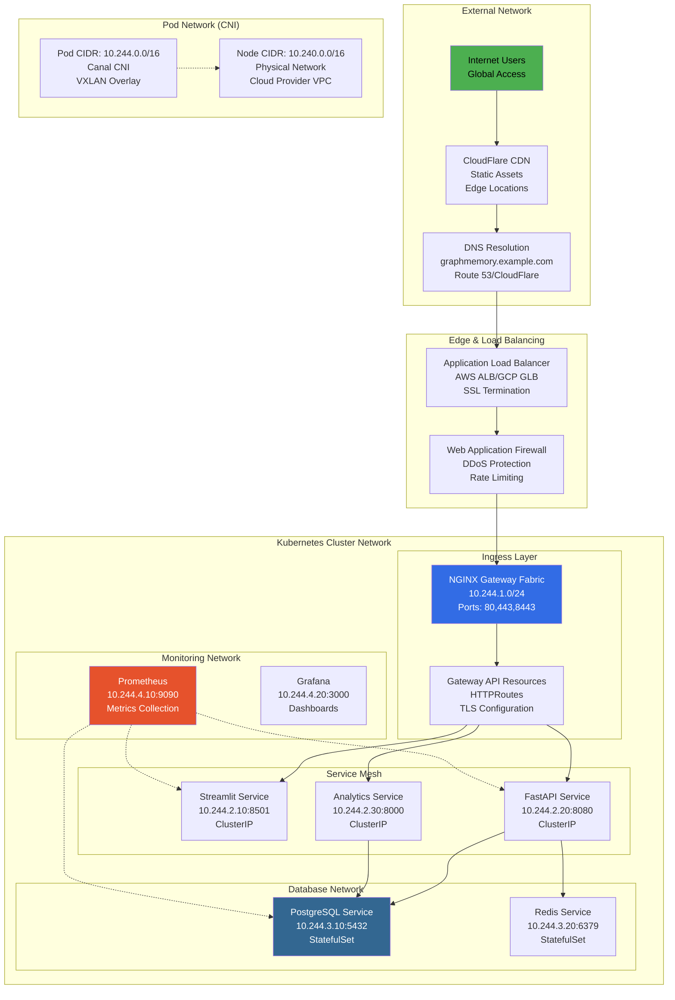

### Network Layers & CIDR Allocation

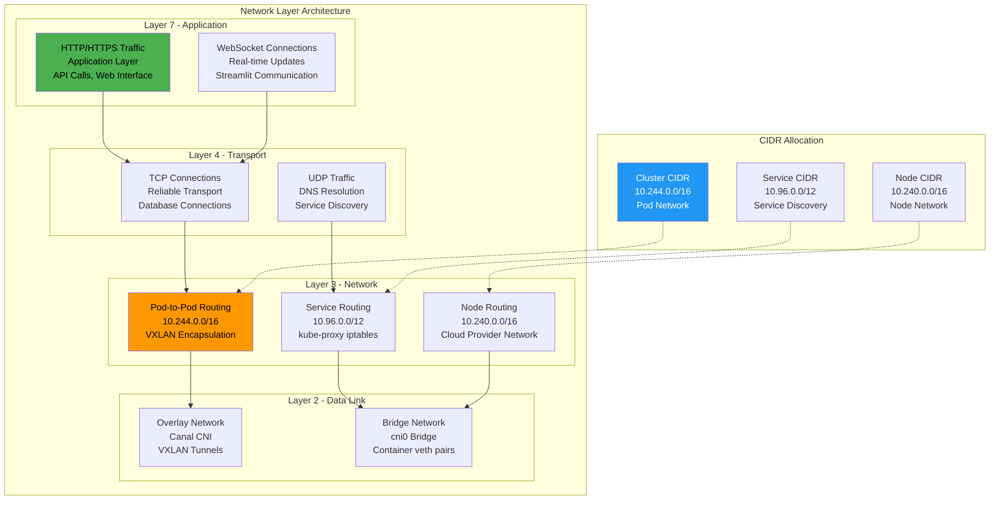

## 🔄 Request Flow Patterns

### User Request Lifecycle

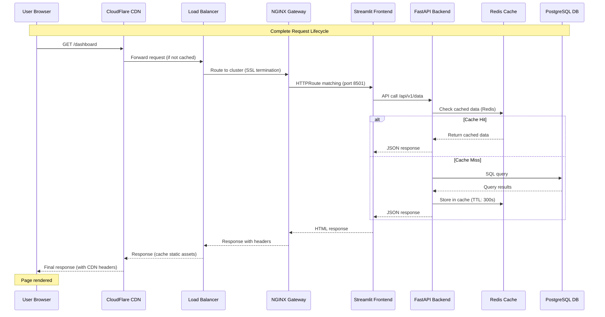

### API Request Flow Patterns

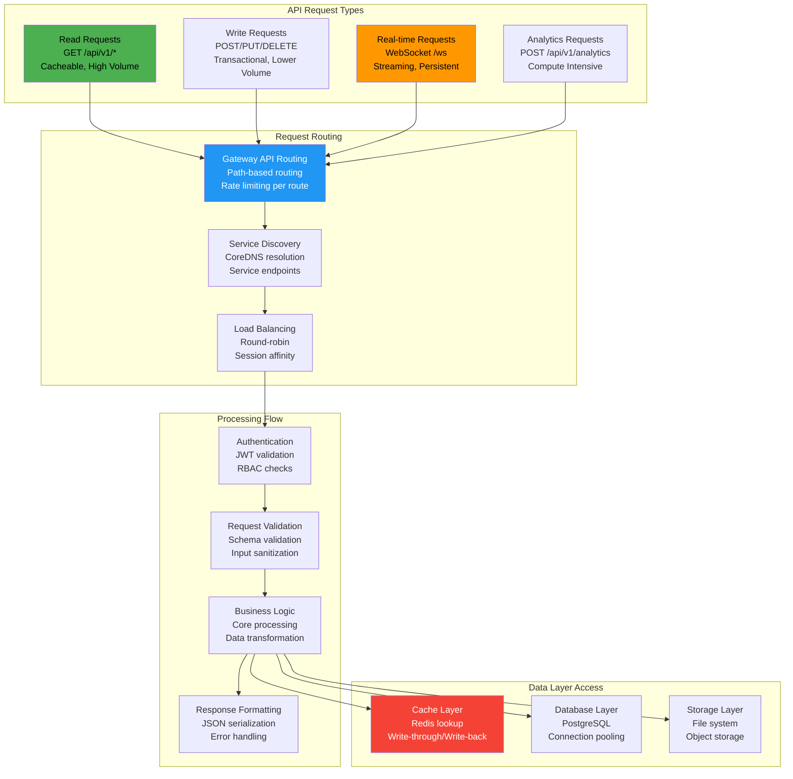

## 💾 Database Communication

### Database Connection Patterns

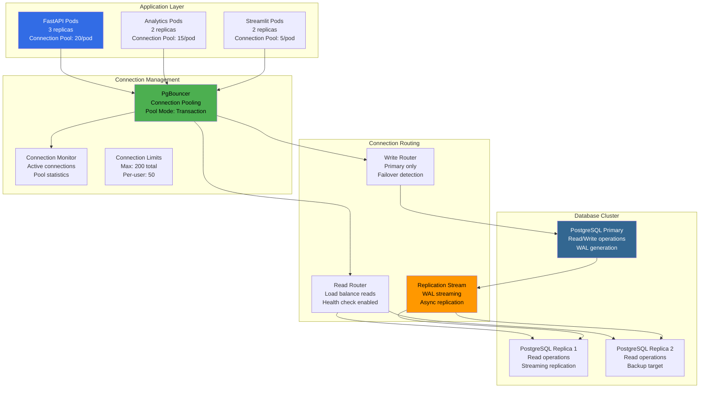

### Query Flow & Optimization

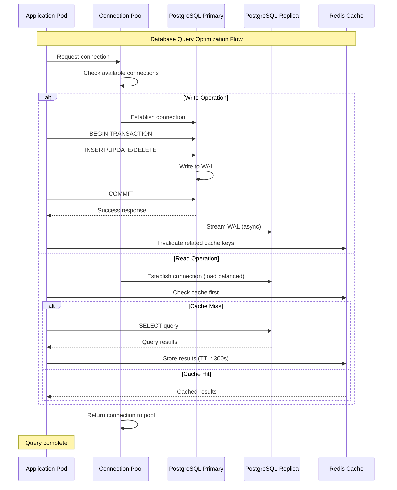

## ⚡ Real-time Data Flows

### WebSocket Communication

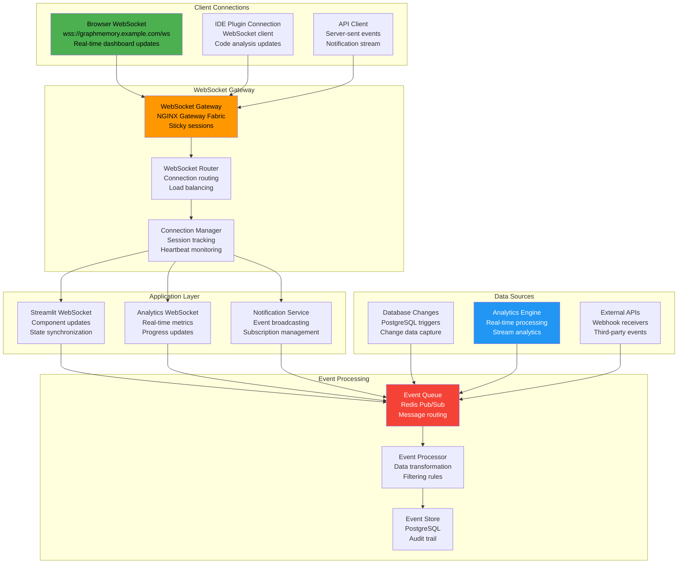

### Event-Driven Architecture

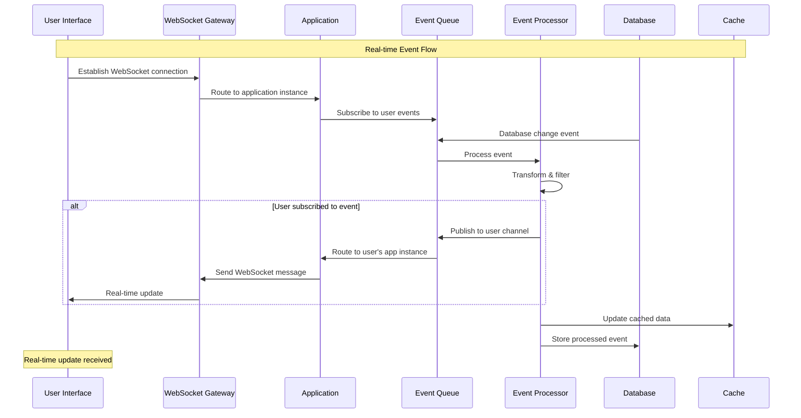

## 🔐 Security Boundaries

### Network Security Zones

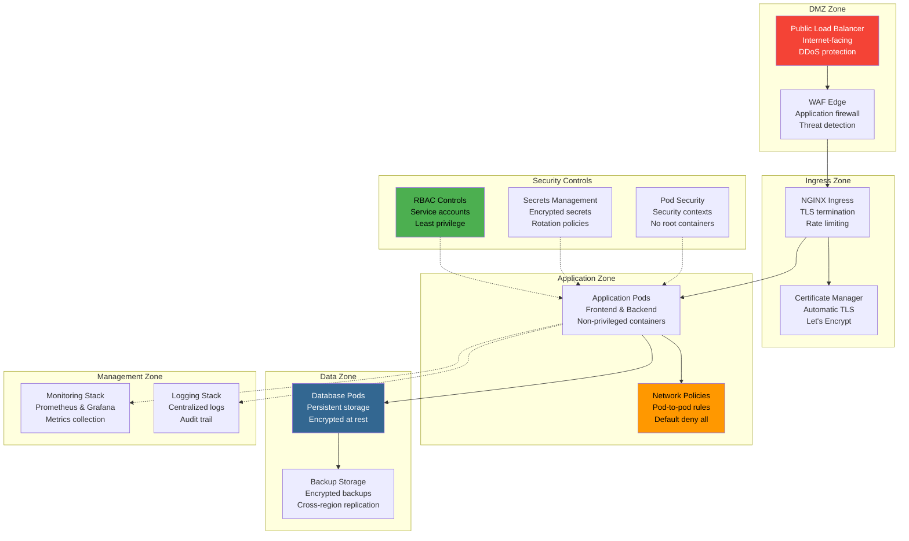

### Traffic Filtering & Inspection

```mermaid
flowchart TD
    subgraph "Ingress Traffic Flow"
        EXTERNAL_TRAFFIC[External Traffic<br/>Internet requests<br/>Various protocols]
        DPI_INSPECTION[Deep Packet Inspection<br/>Protocol analysis<br/>Threat detection]
        RATE_LIMITING[Rate Limiting<br/>Per-IP limits<br/>Burst control]
        GEO_FILTERING[Geo Filtering<br/>Country blocking<br/>Allowlist regions]
    end
    
    subgraph "Application Security"
        INPUT_VALIDATION[Input Validation<br/>Schema validation<br/>XSS/SQL injection protection]
        AUTH_CHECKS[Authentication<br/>JWT validation<br/>Session management]
        AUTHZ_CHECKS[Authorization<br/>RBAC enforcement<br/>Resource permissions]
        AUDIT_LOGGING[Audit Logging<br/>Access logs<br/>Security events]
    end
    
    subgraph "Network Policies"
        INGRESS_POLICIES[Ingress Policies<br/>Allow from gateway only<br/>Port restrictions]
        EGRESS_POLICIES[Egress Policies<br/>Database access only<br/>External API whitelist]
        INTER_POD[Inter-pod Communication<br/>Service mesh rules<br/>mTLS encryption]
    end
    
    subgraph "Data Protection"
        ENCRYPTION_TRANSIT[Encryption in Transit<br/>TLS 1.3<br/>Perfect forward secrecy]
        ENCRYPTION_REST[Encryption at Rest<br/>Database encryption<br/>Storage encryption]
        DATA_MASKING[Data Masking<br/>PII protection<br/>Log sanitization]
    end
    
    EXTERNAL_TRAFFIC --> DPI_INSPECTION
    DPI_INSPECTION --> RATE_LIMITING
    RATE_LIMITING --> GEO_FILTERING
    
    GEO_FILTERING --> INPUT_VALIDATION
    INPUT_VALIDATION --> AUTH_CHECKS
    AUTH_CHECKS --> AUTHZ_CHECKS
    AUTHZ_CHECKS --> AUDIT_LOGGING
    
    AUDIT_LOGGING --> INGRESS_POLICIES
    INGRESS_POLICIES --> EGRESS_POLICIES
    EGRESS_POLICIES --> INTER_POD
    
    INTER_POD --> ENCRYPTION_TRANSIT
    ENCRYPTION_TRANSIT --> ENCRYPTION_REST
    ENCRYPTION_REST --> DATA_MASKING
    
    style EXTERNAL_TRAFFIC fill:#f44336,color:#fff
    style DPI_INSPECTION fill:#ff5722,color:#fff
    style AUTH_CHECKS fill:#4caf50,color:#000
    style ENCRYPTION_TRANSIT fill:#2196f3,color:#fff
```

## ⚖️ Load Balancing & Routing

### Traffic Distribution Strategy

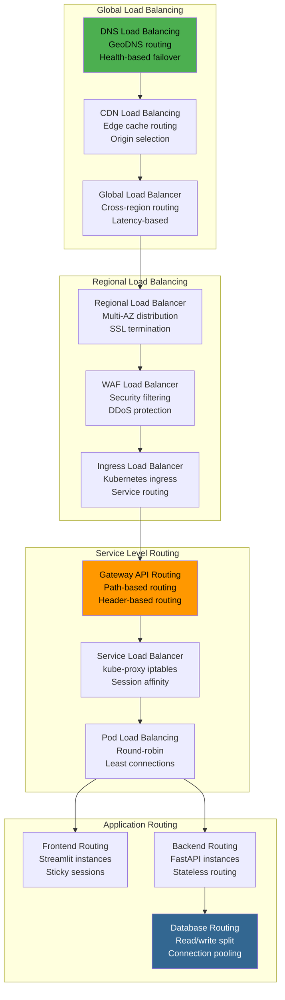

### Health Check & Failover

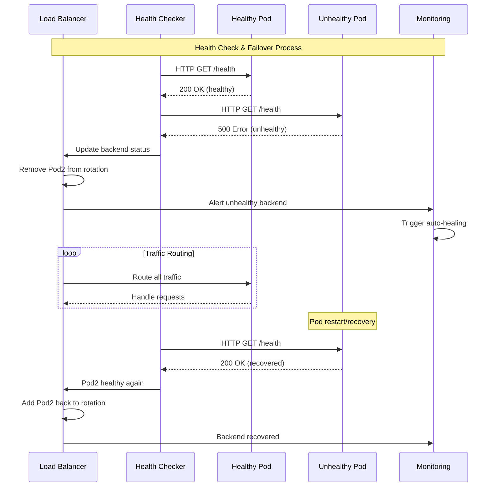

## 🚀 Performance Optimization

### Caching Strategy

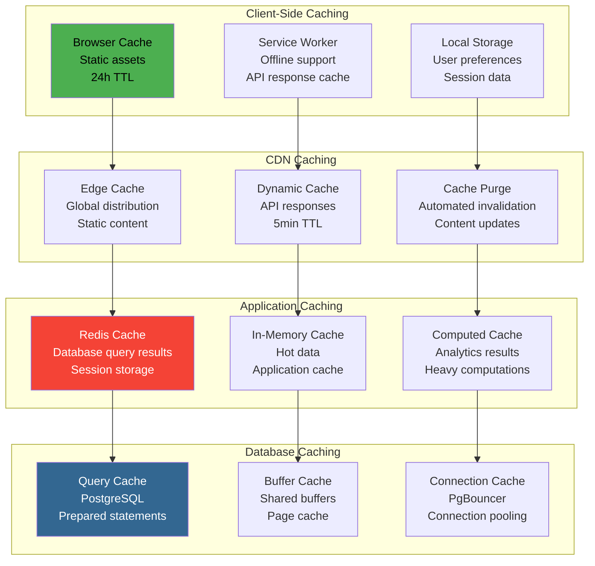

This comprehensive Network Flows documentation provides detailed packet-level analysis and data movement patterns for GraphMemory-IDE. The guide includes visual representations of all network communication paths, security boundaries, and performance optimization strategies. 