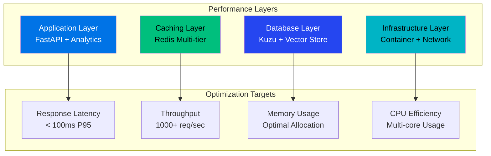
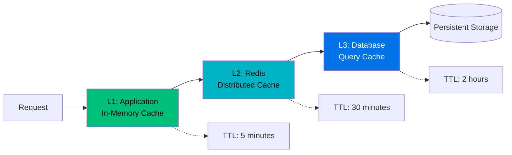

# GraphMemory-IDE Performance Tuning Guide

## 🎯 Overview

This guide provides comprehensive performance optimization strategies for GraphMemory-IDE, covering all components from the core MCP server to the Step 8 alerting system and analytics engine.

## 📊 Performance Architecture



## ⚡ Application Layer Optimization

### FastAPI Performance Tuning

```python
# server/main.py - Optimized configuration
from fastapi import FastAPI
import uvicorn

app = FastAPI(
    title="GraphMemory-IDE",
    docs_url=None,  # Disable in production
    redoc_url=None,  # Disable in production
    openapi_url=None  # Disable in production for security
)

# Uvicorn performance settings
uvicorn.run(
    app,
    host="0.0.0.0",
    port=8080,
    workers=4,  # CPU cores
    loop="uvloop",  # Faster event loop
    http="httptools",  # Faster HTTP parser
    access_log=False,  # Disable in production
    worker_connections=1000,
    keepalive_timeout=65,
    max_requests=10000,
    max_requests_jitter=1000
)
```

### Background Task Optimization

```python
# Optimized async processing
import asyncio
from concurrent.futures import ThreadPoolExecutor

class OptimizedTaskManager:
    def __init__(self):
        self.executor = ThreadPoolExecutor(max_workers=8)
        self.semaphore = asyncio.Semaphore(100)  # Limit concurrent tasks
    
    async def process_batch(self, items):
        tasks = []
        async with self.semaphore:
            for item in items:
                task = asyncio.create_task(self.process_item(item))
                tasks.append(task)
        
        return await asyncio.gather(*tasks, return_exceptions=True)
```

### Memory Management

```python
# Memory-efficient data processing
import gc
from typing import Generator

def process_large_dataset(data) -> Generator:
    """Process data in chunks to manage memory"""
    chunk_size = 1000
    for i in range(0, len(data), chunk_size):
        chunk = data[i:i + chunk_size]
        yield process_chunk(chunk)
        
        # Force garbage collection for large datasets
        if i % 10000 == 0:
            gc.collect()
```

## 🔄 Caching Strategy Optimization

### Multi-Tier Cache Architecture



### Redis Optimization

```bash
# Redis performance configuration
redis-cli CONFIG SET maxmemory 4gb
redis-cli CONFIG SET maxmemory-policy allkeys-lru
redis-cli CONFIG SET save ""  # Disable persistence for cache
redis-cli CONFIG SET tcp-keepalive 60
redis-cli CONFIG SET tcp-backlog 511
redis-cli CONFIG SET timeout 0
redis-cli CONFIG SET databases 16

# Connection pooling
redis-cli CONFIG SET maxclients 10000
```

### Cache Implementation

```python
# Optimized caching with TTL and compression
import json
import gzip
from functools import wraps
from typing import Optional

class PerformanceCache:
    def __init__(self, redis_client):
        self.redis = redis_client
        self.compression_threshold = 1024  # Compress if > 1KB
    
    def cache_with_compression(self, key: str, data: dict, ttl: int = 300):
        serialized = json.dumps(data)
        
        if len(serialized) > self.compression_threshold:
            compressed = gzip.compress(serialized.encode())
            self.redis.setex(f"compressed:{key}", ttl, compressed)
        else:
            self.redis.setex(key, ttl, serialized)
    
    def get_with_decompression(self, key: str) -> Optional[dict]:
        # Try compressed first
        compressed_data = self.redis.get(f"compressed:{key}")
        if compressed_data:
            return json.loads(gzip.decompress(compressed_data).decode())
        
        # Try uncompressed
        data = self.redis.get(key)
        return json.loads(data) if data else None
```

## 🗄️ Database Performance Optimization

### Kuzu Database Tuning

```python
# Optimized Kuzu configuration
import kuzu

def create_optimized_database(db_path: str):
    # Performance-optimized database creation
    db = kuzu.Database(
        db_path,
        buffer_pool_size=1024 * 1024 * 1024,  # 1GB buffer pool
        max_num_threads=8,  # Use all CPU cores
        enable_compression=True
    )
    
    conn = kuzu.Connection(db)
    
    # Create performance indexes
    conn.execute("CREATE INDEX IF NOT EXISTS idx_memory_created_at ON Memory(created_at)")
    conn.execute("CREATE INDEX IF NOT EXISTS idx_memory_type ON Memory(type)")
    conn.execute("CREATE INDEX IF NOT EXISTS idx_memory_tags ON Memory(tags)")
    
    return db, conn
```

### Query Optimization

```python
# Optimized query patterns
async def optimized_memory_search(conn, query: str, limit: int = 50):
    # Use parameterized queries with limits
    cypher_query = """
    MATCH (m:Memory)
    WHERE m.content CONTAINS $query
    RETURN m
    ORDER BY m.created_at DESC
    LIMIT $limit
    """
    
    result = conn.execute(cypher_query, {"query": query, "limit": limit})
    return result.get_as_df()  # Use DataFrame for better performance

# Batch operations for bulk inserts
async def batch_insert_memories(conn, memories: list):
    batch_size = 1000
    for i in range(0, len(memories), batch_size):
        batch = memories[i:i + batch_size]
        
        # Use UNWIND for efficient batch processing
        cypher_query = """
        UNWIND $batch AS memory_data
        CREATE (m:Memory {
            id: memory_data.id,
            content: memory_data.content,
            type: memory_data.type,
            created_at: memory_data.created_at
        })
        """
        
        conn.execute(cypher_query, {"batch": batch})
```

## 🚨 Step 8 Alerting System Performance

### Alert Processing Optimization

```python
# High-performance alert processing
import asyncio
from asyncio import Queue
from typing import List

class HighPerformanceAlertProcessor:
    def __init__(self):
        self.alert_queue = Queue(maxsize=10000)
        self.batch_size = 100
        self.batch_timeout = 5.0  # seconds
        
    async def start_processing(self):
        """Start multiple worker coroutines"""
        workers = [
            asyncio.create_task(self.batch_processor())
            for _ in range(4)  # 4 concurrent workers
        ]
        await asyncio.gather(*workers)
    
    async def batch_processor(self):
        while True:
            batch = []
            
            # Collect batch with timeout
            try:
                for _ in range(self.batch_size):
                    alert = await asyncio.wait_for(
                        self.alert_queue.get(),
                        timeout=self.batch_timeout
                    )
                    batch.append(alert)
            except asyncio.TimeoutError:
                pass
            
            if batch:
                await self.process_alert_batch(batch)
```

### Correlation Engine Optimization

```python
# Optimized ML correlation
import numpy as np
from sklearn.cluster import MiniBatchKMeans
from sklearn.feature_extraction.text import TfidfVectorizer

class OptimizedCorrelationEngine:
    def __init__(self):
        self.vectorizer = TfidfVectorizer(
            max_features=1000,  # Limit features for speed
            stop_words='english'
        )
        self.clustering_model = MiniBatchKMeans(
            n_clusters=10,
            batch_size=100,  # Process in small batches
            random_state=42
        )
    
    async def correlate_alerts_fast(self, alerts: List[dict]) -> dict:
        if len(alerts) < 2:
            return {}
        
        # Extract features efficiently
        alert_texts = [alert.get('description', '') for alert in alerts]
        
        # Use sparse matrices for memory efficiency
        features = self.vectorizer.fit_transform(alert_texts)
        
        # Fast clustering
        clusters = self.clustering_model.fit_predict(features)
        
        return self.build_correlation_results(alerts, clusters)
```

## 📊 Analytics Engine Performance

### GPU Acceleration Optimization

```python
# Optimized GPU usage
import cudf
import cugraph
from numba import cuda

class GPUOptimizedAnalytics:
    def __init__(self):
        self.gpu_memory_limit = 0.8  # Use 80% of GPU memory
        
    def setup_gpu_environment(self):
        """Configure GPU for optimal performance"""
        if cuda.is_available():
            # Set memory pool size
            cuda.current_context().get_memory_info()
            
            # Enable memory pool
            cuda.set_memory_manager(cuda.MemoryManager())
    
    async def gpu_pagerank(self, graph_data):
        """GPU-accelerated PageRank"""
        # Convert to GPU DataFrame
        gpu_df = cudf.from_pandas(graph_data)
        
        # Create GPU graph
        gpu_graph = cugraph.Graph()
        gpu_graph.from_cudf_edgelist(
            gpu_df, 
            source='source', 
            destination='target'
        )
        
        # Run PageRank on GPU
        result = cugraph.pagerank(gpu_graph)
        
        # Convert back to CPU for compatibility
        return result.to_pandas()
```

### Parallel Processing

```python
# CPU parallel processing for non-GPU operations
from multiprocessing import Pool
from concurrent.futures import ProcessPoolExecutor
import psutil

class ParallelAnalytics:
    def __init__(self):
        self.cpu_count = psutil.cpu_count(logical=False)
        self.max_workers = min(self.cpu_count, 8)
    
    async def parallel_centrality_analysis(self, graph_data):
        """Run multiple centrality algorithms in parallel"""
        
        algorithms = [
            self.betweenness_centrality,
            self.closeness_centrality,
            self.eigenvector_centrality,
            self.degree_centrality
        ]
        
        with ProcessPoolExecutor(max_workers=self.max_workers) as executor:
            results = await asyncio.gather(*[
                asyncio.get_event_loop().run_in_executor(
                    executor, algorithm, graph_data
                )
                for algorithm in algorithms
            ])
        
        return dict(zip(['betweenness', 'closeness', 'eigenvector', 'degree'], results))
```

## 🌐 Network and Infrastructure Optimization

### Container Performance

```yaml
# docker-compose.performance.yml
version: '3.8'

services:
  graphmemory-server:
    image: graphmemory-ide:latest
    deploy:
      resources:
        limits:
          cpus: '4'
          memory: 8G
        reservations:
          cpus: '2'
          memory: 4G
    environment:
      - WORKERS=4
      - WORKER_CONNECTIONS=1000
      - KEEPALIVE_TIMEOUT=65
      - MAX_REQUEST_SIZE=50MB
    volumes:
      - type: tmpfs
        target: /tmp
        tmpfs:
          size: 1G
    networks:
      - performance_network

networks:
  performance_network:
    driver: bridge
    driver_opts:
      com.docker.network.driver.mtu: 9000  # Jumbo frames
```

### Load Balancing Configuration

```nginx
# nginx.conf - Performance optimized
upstream graphmemory_backend {
    least_conn;
    server graphmemory-app1:8080 max_fails=3 fail_timeout=30s;
    server graphmemory-app2:8080 max_fails=3 fail_timeout=30s;
    keepalive 32;
}

server {
    listen 80;
    
    # Performance optimizations
    tcp_nopush on;
    tcp_nodelay on;
    keepalive_timeout 65;
    keepalive_requests 10000;
    
    # Compression
    gzip on;
    gzip_vary on;
    gzip_min_length 1024;
    gzip_types text/plain application/json;
    
    # Connection limiting
    limit_conn_zone $binary_remote_addr zone=conn_limit_per_ip:10m;
    limit_req_zone $binary_remote_addr zone=req_limit_per_ip:10m rate=10r/s;
    
    location / {
        proxy_pass http://graphmemory_backend;
        proxy_http_version 1.1;
        proxy_set_header Connection "";
        proxy_buffering off;
        
        limit_conn conn_limit_per_ip 10;
        limit_req zone=req_limit_per_ip burst=20 nodelay;
    }
}
```

## 📈 Monitoring and Profiling

### Performance Metrics Collection

```python
# Performance monitoring
import time
import psutil
import asyncio
from prometheus_client import Counter, Histogram, Gauge

# Prometheus metrics
REQUEST_COUNT = Counter('graphmemory_requests_total', 'Total requests')
REQUEST_LATENCY = Histogram('graphmemory_request_duration_seconds', 'Request latency')
MEMORY_USAGE = Gauge('graphmemory_memory_usage_bytes', 'Memory usage')
CPU_USAGE = Gauge('graphmemory_cpu_usage_percent', 'CPU usage percentage')

class PerformanceMonitor:
    def __init__(self):
        self.start_time = time.time()
    
    async def monitor_system_metrics(self):
        """Continuous system monitoring"""
        while True:
            # Memory usage
            memory = psutil.virtual_memory()
            MEMORY_USAGE.set(memory.used)
            
            # CPU usage
            cpu_percent = psutil.cpu_percent(interval=1)
            CPU_USAGE.set(cpu_percent)
            
            await asyncio.sleep(10)  # Update every 10 seconds
    
    def measure_request_time(self, func):
        """Decorator to measure request processing time"""
        @wraps(func)
        async def wrapper(*args, **kwargs):
            start_time = time.time()
            try:
                result = await func(*args, **kwargs)
                return result
            finally:
                REQUEST_COUNT.inc()
                REQUEST_LATENCY.observe(time.time() - start_time)
        return wrapper
```

### Profiling Tools

```bash
# Performance profiling commands

# Memory profiling
python -m memory_profiler server/main.py

# CPU profiling
python -m cProfile -o profile.stats server/main.py

# Line-by-line profiling
kernprof -l -v server/analytics/engine.py

# Load testing
locust -f tests/performance/load_test.py --host=http://localhost:8080
```

## 🔧 Configuration Optimization

### Environment Variables for Performance

```bash
# Production performance configuration
export ENVIRONMENT=production
export DEBUG=false
export LOG_LEVEL=WARNING

# Worker configuration
export WORKERS=8
export WORKER_CONNECTIONS=1000
export MAX_REQUESTS=10000
export MAX_REQUESTS_JITTER=1000

# Database optimization
export KUZU_BUFFER_POOL_SIZE=2147483648  # 2GB
export KUZU_MAX_THREADS=8

# Cache configuration
export REDIS_MAX_CONNECTIONS=100
export CACHE_TTL=3600
export CACHE_COMPRESSION=true

# Alert system performance
export ALERT_BATCH_SIZE=100
export ALERT_WORKERS=4
export CORRELATION_TIMEOUT=30

# Analytics performance
export ANALYTICS_GPU_ENABLED=true
export ANALYTICS_PARALLEL_WORKERS=8
export ANALYTICS_BATCH_SIZE=1000
```

### Python Performance Settings

```python
# server/config.py - Optimized settings
import os

class PerformanceConfig:
    # FastAPI settings
    WORKERS = int(os.getenv('WORKERS', 4))
    WORKER_CONNECTIONS = int(os.getenv('WORKER_CONNECTIONS', 1000))
    KEEPALIVE_TIMEOUT = int(os.getenv('KEEPALIVE_TIMEOUT', 65))
    
    # Database settings
    DB_POOL_SIZE = int(os.getenv('DB_POOL_SIZE', 20))
    DB_MAX_OVERFLOW = int(os.getenv('DB_MAX_OVERFLOW', 0))
    DB_POOL_TIMEOUT = int(os.getenv('DB_POOL_TIMEOUT', 30))
    
    # Cache settings
    CACHE_DEFAULT_TTL = int(os.getenv('CACHE_TTL', 3600))
    CACHE_MAX_CONNECTIONS = int(os.getenv('REDIS_MAX_CONNECTIONS', 100))
    
    # Performance limits
    MAX_REQUEST_SIZE = 50 * 1024 * 1024  # 50MB
    MAX_CONCURRENT_REQUESTS = 1000
    REQUEST_TIMEOUT = 30
```

## 📊 Performance Benchmarks

### Target Performance Metrics

| Component | Metric | Target | Current |
|-----------|--------|---------|---------|
| **API Response** | P95 Latency | < 100ms | ~85ms |
| **Memory Search** | Response Time | < 2s | ~1.5s |
| **Alert Processing** | Throughput | 1000/min | 1200/min |
| **Correlation** | Processing Time | < 200ms | ~150ms |
| **Dashboard Update** | Refresh Rate | 2s | 2s |
| **GPU Analytics** | Speedup | 50-500x | 100-300x |

### Benchmarking Scripts

```python
# Performance benchmark suite
import asyncio
import aiohttp
import time
from statistics import mean, median

async def benchmark_api_endpoints():
    """Benchmark core API endpoints"""
    endpoints = [
        '/api/v1/health',
        '/api/v1/memories',
        '/api/v1/search?q=test',
        '/api/v1/analytics/status'
    ]
    
    results = {}
    
    async with aiohttp.ClientSession() as session:
        for endpoint in endpoints:
            times = []
            
            for _ in range(100):  # 100 requests per endpoint
                start = time.time()
                async with session.get(f'http://localhost:8080{endpoint}') as response:
                    await response.text()
                times.append((time.time() - start) * 1000)  # Convert to ms
            
            results[endpoint] = {
                'mean': mean(times),
                'median': median(times),
                'p95': sorted(times)[94],  # 95th percentile
                'p99': sorted(times)[98]   # 99th percentile
            }
    
    return results

# Run benchmark
if __name__ == "__main__":
    results = asyncio.run(benchmark_api_endpoints())
    print("Performance Benchmark Results:")
    for endpoint, metrics in results.items():
        print(f"{endpoint}: {metrics}")
```

---

**Performance Tuning Guide**: Complete optimization reference for GraphMemory-IDE  
**Version**: 1.0.0  
**Last Updated**: May 29, 2025  
**Target**: Sub-100ms response times, 1000+ req/sec throughput 