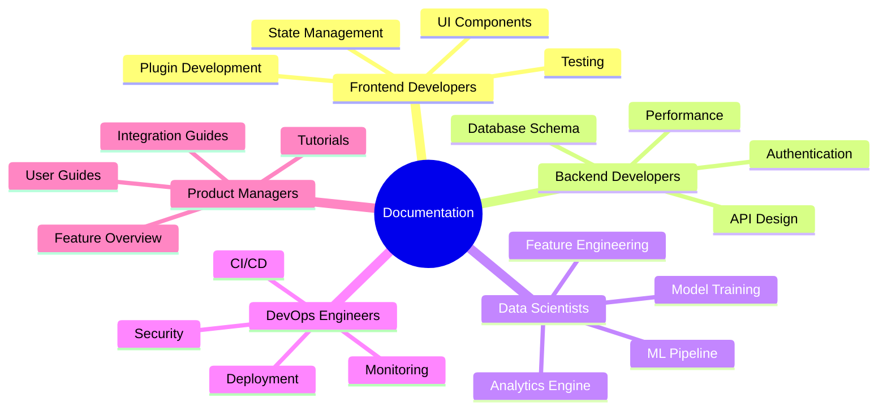
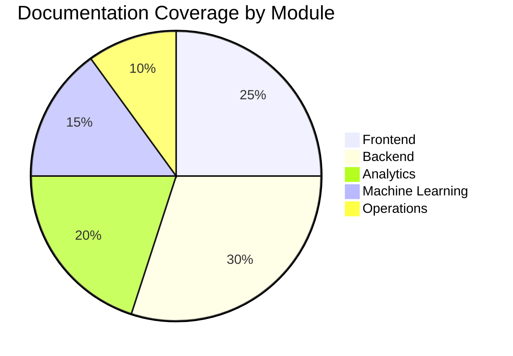

# GraphMemory-IDE Documentation Hub

Welcome to the comprehensive documentation for GraphMemory-IDE, an advanced graph-based memory management system with real-time analytics and machine learning capabilities.

## 🏗️ System Architecture Overview

```mermaid
graph TB
    subgraph "Frontend Layer"
        UI[Web Interface]
        IDE[IDE Plugins]
        CLI[Command Line Interface]
    end
    
    subgraph "API Gateway"
        Gateway[FastAPI Gateway]
        Auth[Authentication]
        Rate[Rate Limiting]
    end
    
    subgraph "Backend Services"
        MCP[MCP Server]
        Analytics[Analytics Engine]
        ML[ML Pipeline]
        Cache[Redis Cache]
    end
    
    subgraph "Data Layer"
        Graph[(Kuzu GraphDB)]
        Vector[(Vector Store)]
        Files[(File Storage)]
    end
    
    subgraph "Infrastructure"
        Docker[Docker Containers]
        Monitor[Monitoring]
        Backup[Backup System]
    end
    
    UI --> Gateway
    IDE --> Gateway
    CLI --> Gateway
    
    Gateway --> Auth
    Gateway --> Rate
    Gateway --> MCP
    Gateway --> Analytics
    
    MCP --> Graph
    Analytics --> Graph
    Analytics --> Cache
    ML --> Vector
    ML --> Graph
    
    Backend Services --> Monitor
    Data Layer --> Backup
    
    style Frontend Layer fill:#e1f5fe
    style Backend Services fill:#e8f5e8
    style Data Layer fill:#fff3e0
    style Infrastructure fill:#fce4ec
```

## 📚 Documentation Modules

### 🎨 [Frontend Documentation](./frontend/README.md)
Complete guide to user interfaces, IDE plugins, and client-side development.

**Key Topics:**
- Web interface architecture
- IDE plugin development (Cursor, VSCode, Windsurf)
- Component libraries and UI patterns
- State management and real-time updates

### ⚙️ [Backend Documentation](./backend/README.md)
Comprehensive backend architecture, APIs, and server-side development.

**Key Topics:**
- FastAPI server architecture
- Database design and Kuzu integration
- Authentication and security
- API endpoints and data models

### 📊 [Analytics Documentation](./analytics/README.md)
Advanced graph analytics engine and real-time processing capabilities.

**Key Topics:**
- Analytics engine architecture
- Graph algorithms and centrality measures
- Real-time analytics and WebSocket streaming
- Performance optimization and caching

### 🤖 [Machine Learning Documentation](./machine-learning/README.md)
ML pipeline, model training, and intelligent features.

**Key Topics:**
- ML pipeline architecture
- Feature extraction and embeddings
- Model training and inference
- Pattern recognition and clustering

### 🚀 [Operations Documentation](./operations/README.md)
Deployment, monitoring, and production operations.

**Key Topics:**
- Docker deployment strategies
- CI/CD pipelines and automation
- Monitoring and observability
- Backup and disaster recovery

### 📖 [Reference Documentation](./reference/README.md)
Complete API reference, configuration options, and technical specifications.

**Key Topics:**
- Complete API reference
- Configuration parameters
- Database schemas
- Integration specifications

## 🎯 Quick Navigation by Role



## 🔄 Data Flow Architecture

```mermaid
flowchart TD
    subgraph "Input Sources"
        User[User Input]
        API[API Requests]
        Plugins[IDE Plugins]
        CLI[CLI Commands]
    end
    
    subgraph "Processing Pipeline"
        Validate[Input Validation]
        Auth[Authentication]
        Route[Request Routing]
        Process[Business Logic]
        Analytics[Analytics Processing]
        ML[ML Processing]
    end
    
    subgraph "Data Storage"
        Graph[(Graph Database)]
        Vector[(Vector Store)]
        Cache[(Redis Cache)]
        Files[(File Storage)]
    end
    
    subgraph "Output Channels"
        Response[API Response]
        Realtime[Real-time Updates]
        Notifications[Notifications]
        Reports[Analytics Reports]
    end
    
    User --> Validate
    API --> Validate
    Plugins --> Validate
    CLI --> Validate
    
    Validate --> Auth
    Auth --> Route
    Route --> Process
    Process --> Analytics
    Process --> ML
    
    Process --> Graph
    Analytics --> Cache
    ML --> Vector
    Process --> Files
    
    Process --> Response
    Analytics --> Realtime
    ML --> Notifications
    Analytics --> Reports
    
    style "Input Sources" fill:#e1f5fe
    style "Processing Pipeline" fill:#e8f5e8
    style "Data Storage" fill:#fff3e0
    style "Output Channels" fill:#fce4ec
```

## 🧩 Component Integration Map

```mermaid
graph LR
    subgraph "Frontend Components"
        WebUI[Web Interface]
        VSCode[VSCode Plugin]
        Cursor[Cursor Plugin]
        Windsurf[Windsurf Plugin]
    end
    
    subgraph "API Layer"
        FastAPI[FastAPI Server]
        WebSocket[WebSocket Handler]
        SSE[Server-Sent Events]
    end
    
    subgraph "Core Services"
        MCP[MCP Server]
        Analytics[Analytics Engine]
        ML[ML Pipeline]
        Auth[Auth Service]
    end
    
    subgraph "Data Services"
        Kuzu[(Kuzu GraphDB)]
        Redis[(Redis Cache)]
        Vector[(Vector Store)]
    end
    
    WebUI <--> FastAPI
    VSCode <--> FastAPI
    Cursor <--> FastAPI
    Windsurf <--> FastAPI
    
    FastAPI <--> WebSocket
    FastAPI <--> SSE
    FastAPI <--> Auth
    
    FastAPI <--> MCP
    FastAPI <--> Analytics
    FastAPI <--> ML
    
    MCP <--> Kuzu
    Analytics <--> Kuzu
    Analytics <--> Redis
    ML <--> Vector
    ML <--> Kuzu
    
    style "Frontend Components" fill:#e1f5fe
    style "API Layer" fill:#f3e5f5
    style "Core Services" fill:#e8f5e8
    style "Data Services" fill:#fff3e0
```

## 📋 Documentation Standards

All documentation modules follow these standards:

### 🎨 Visual Documentation
- **Mermaid Diagrams**: Every module includes comprehensive diagrams
- **Architecture Views**: System, component, and data flow diagrams
- **Process Workflows**: Step-by-step operational procedures
- **Integration Maps**: How components connect and communicate

### 📝 Content Structure
- **README.md**: Module overview and navigation
- **Architecture**: Detailed technical architecture
- **Development**: Development guides and best practices
- **Reference**: Technical specifications and APIs

### 🔗 Cross-References
- **Module Linking**: Clear navigation between related modules
- **Dependency Mapping**: Understanding component dependencies
- **Integration Guides**: How modules work together
- **Troubleshooting**: Cross-module problem resolution

## 🚀 Getting Started Paths

### For New Developers
1. Start with [Frontend Documentation](./frontend/README.md) for UI development
2. Review [Backend Documentation](./backend/README.md) for server-side work
3. Explore [Tutorials](./tutorials/README.md) for hands-on learning

### For Data Scientists
1. Begin with [Analytics Documentation](./analytics/README.md)
2. Dive into [Machine Learning Documentation](./machine-learning/README.md)
3. Review [Backend Documentation](./backend/README.md) for data access patterns

### For DevOps Engineers
1. Start with [Operations Documentation](./operations/README.md)
2. Review [Backend Documentation](./backend/README.md) for architecture
3. Check [Reference Documentation](./reference/README.md) for configuration

## 📊 Documentation Metrics



## 🔄 Continuous Improvement

This documentation is continuously updated to reflect:
- New features and capabilities
- Architecture changes and improvements
- Best practices and lessons learned
- Community feedback and contributions

---

**Last Updated**: 2025-05-28  
**Version**: 1.0.0  
**Maintainers**: GraphMemory-IDE Team 