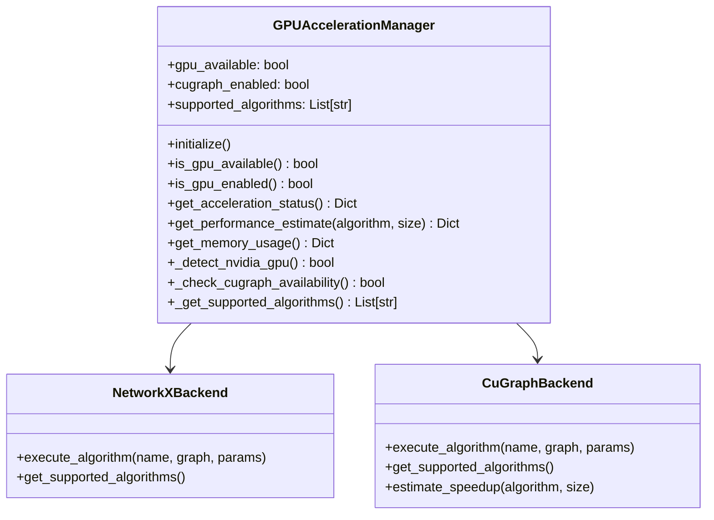
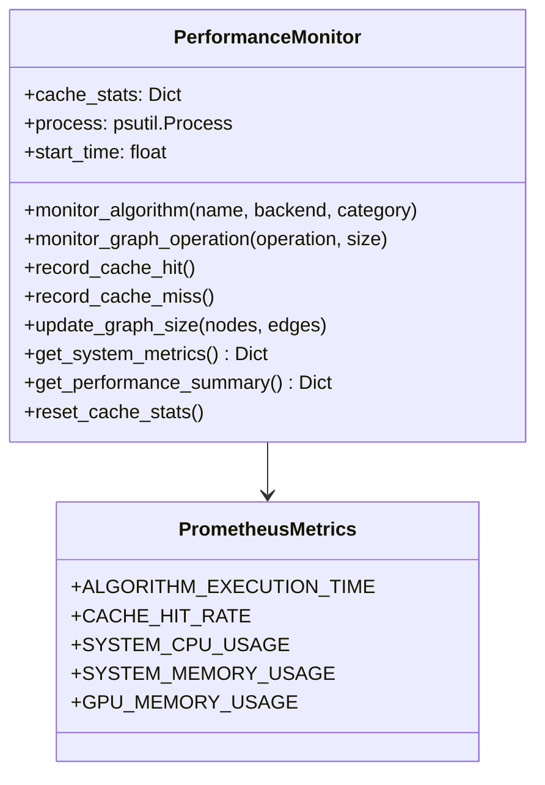
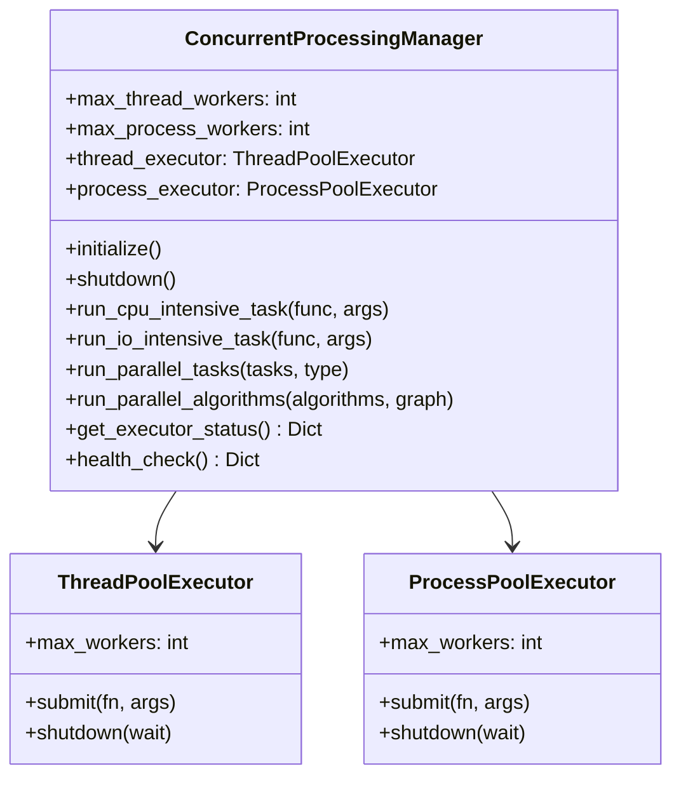
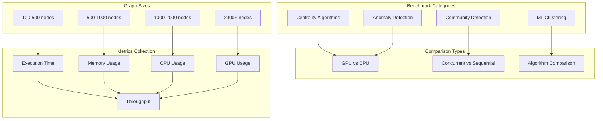
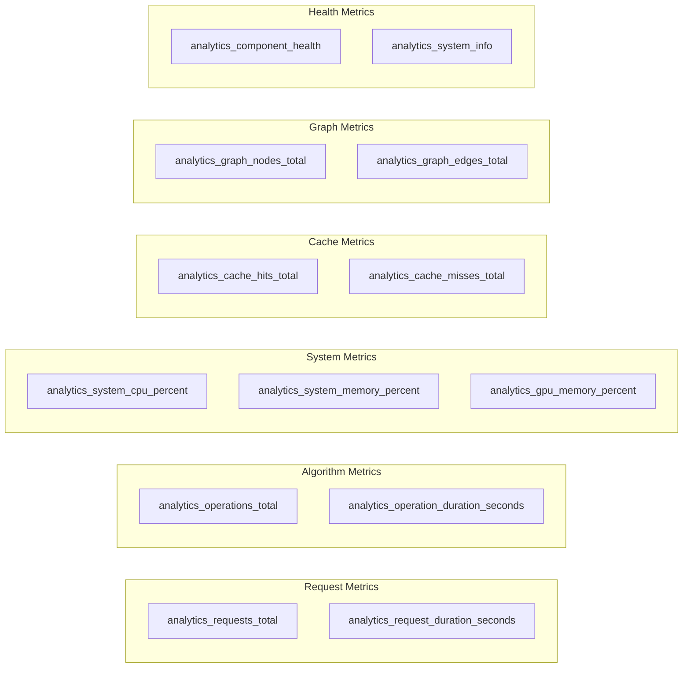
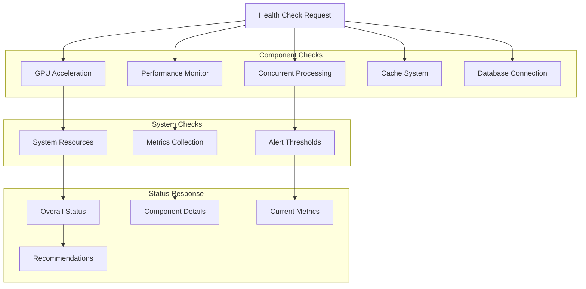
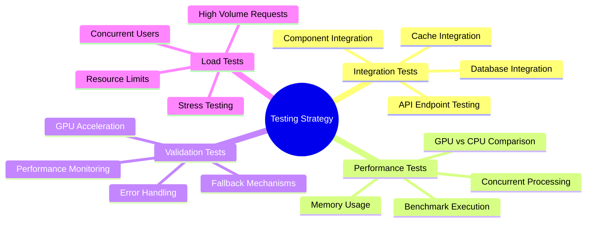

# Analytics Engine - Phase 3 Implementation

## Overview

The Analytics Engine Phase 3 represents a production-ready, high-performance graph analytics platform with GPU acceleration, comprehensive monitoring, and enterprise-grade capabilities. This implementation transforms the basic analytics engine into a scalable, production-ready system capable of handling large-scale graph analysis workloads.

## 🏗️ Phase 3 Architecture

```mermaid
graph TB
    subgraph "Client Layer"
        API[Analytics API]
        WebSocket[Real-time WebSocket]
        Dashboard[Analytics Dashboard]
    end
    
    subgraph "API Gateway"
        Routes[Analytics Routes]
        Middleware[Monitoring Middleware]
        Auth[Authentication]
    end
    
    subgraph "Analytics Engine Core"
        Engine[Analytics Engine]
        Cache[Redis Cache]
        Queue[Processing Queue]
    end
    
    subgraph "Phase 3 Components"
        GPU[GPU Acceleration Manager]
        Monitor[Performance Monitor]
        Concurrent[Concurrent Processing Manager]
        Benchmarks[Benchmarking Suite]
        Monitoring[Production Monitoring]
    end
    
    subgraph "Algorithm Libraries"
        GraphAlgo[Graph Algorithms]
        MLAnalytics[ML Analytics]
        NetworkX[NetworkX Integration]
        CuGraph[cuGraph GPU Backend]
    end
    
    subgraph "Data Layer"
        KuzuDB[(Kuzu Graph DB)]
        RedisCache[(Redis Cache)]
        Prometheus[(Prometheus Metrics)]
    end
    
    API --> Routes
    WebSocket --> Routes
    Dashboard --> Routes
    
    Routes --> Middleware
    Middleware --> Engine
    Auth --> Engine
    
    Engine --> GPU
    Engine --> Monitor
    Engine --> Concurrent
    Engine --> Cache
    
    GPU --> CuGraph
    GPU --> NetworkX
    Monitor --> Prometheus
    Concurrent --> GraphAlgo
    Concurrent --> MLAnalytics
    
    GraphAlgo --> NetworkX
    GraphAlgo --> CuGraph
    MLAnalytics --> NetworkX
    
    Engine --> KuzuDB
    Cache --> RedisCache
    Monitor --> Prometheus
    
    style "Phase 3 Components" fill:#e8f5e8
    style "Algorithm Libraries" fill:#fff3e0
    style "Data Layer" fill:#fce4ec
```

## 🚀 Phase 3 Features

### GPU Acceleration
- **NVIDIA cuGraph Integration**: Up to 500x performance improvement for supported algorithms
- **Automatic Fallback**: Seamless CPU fallback when GPU unavailable
- **60+ Accelerated Algorithms**: PageRank, Betweenness Centrality, Community Detection, and more
- **Memory Management**: Intelligent GPU memory usage monitoring and optimization

### Performance Monitoring
- **Prometheus Integration**: 15+ custom metrics for comprehensive monitoring
- **Real-time Metrics**: CPU, memory, GPU usage tracking
- **Algorithm Performance**: Execution time and resource usage per algorithm
- **Cache Analytics**: Hit/miss rates and cache efficiency metrics

### Concurrent Processing
- **Thread Pool Management**: Optimized I/O-intensive task execution
- **Process Pool Management**: CPU-intensive algorithm parallelization
- **Automatic Scaling**: Dynamic worker count based on system resources
- **Health Monitoring**: Executor status and performance tracking

### Production Monitoring
- **Health Checks**: Comprehensive component health monitoring
- **Alerting**: Performance threshold monitoring and alerting
- **Metrics Export**: Prometheus-compatible metrics endpoint
- **System Monitoring**: Resource usage and system health tracking

## 📊 Component Flow Diagram

```mermaid
flowchart TD
    subgraph "Request Processing"
        Request[Analytics Request]
        Validate[Request Validation]
        Route[Route to Engine]
    end
    
    subgraph "Engine Processing"
        Engine[Analytics Engine]
        GPUCheck{GPU Available?}
        AlgoSelect[Algorithm Selection]
        Execute[Execute Algorithm]
    end
    
    subgraph "Execution Paths"
        GPUPath[GPU Execution]
        CPUPath[CPU Execution]
        ConcurrentPath[Concurrent Execution]
    end
    
    subgraph "Monitoring & Metrics"
        PerfMonitor[Performance Monitor]
        Metrics[Collect Metrics]
        Cache[Update Cache]
        Alerts[Check Thresholds]
    end
    
    subgraph "Response"
        Format[Format Results]
        Broadcast[Real-time Broadcast]
        Response[Return Response]
    end
    
    Request --> Validate
    Validate --> Route
    Route --> Engine
    
    Engine --> GPUCheck
    GPUCheck -->|Yes| AlgoSelect
    GPUCheck -->|No| AlgoSelect
    
    AlgoSelect --> Execute
    Execute --> GPUPath
    Execute --> CPUPath
    Execute --> ConcurrentPath
    
    GPUPath --> PerfMonitor
    CPUPath --> PerfMonitor
    ConcurrentPath --> PerfMonitor
    
    PerfMonitor --> Metrics
    Metrics --> Cache
    Cache --> Alerts
    
    Alerts --> Format
    Format --> Broadcast
    Broadcast --> Response
    
    style "Engine Processing" fill:#e8f5e8
    style "Execution Paths" fill:#fff3e0
    style "Monitoring & Metrics" fill:#fce4ec
```

## 🔧 Component Details

### GPU Acceleration Manager



**Key Features:**
- Automatic GPU detection and cuGraph availability checking
- Performance estimation for GPU vs CPU execution
- Memory usage monitoring and optimization
- Fallback mechanisms for unsupported operations

### Performance Monitor



**Metrics Collected:**
- Algorithm execution times and resource usage
- Cache hit/miss rates and efficiency
- System resource utilization (CPU, memory, disk)
- GPU memory usage and utilization
- Graph size and complexity metrics

### Concurrent Processing Manager



**Capabilities:**
- Optimal worker count calculation based on system resources
- Intelligent task routing (CPU vs I/O intensive)
- Parallel algorithm execution with resource management
- Health monitoring and status reporting

## 📈 Performance Benchmarking

### Benchmarking Suite Architecture



### Performance Targets

| Algorithm Category | CPU Baseline | GPU Target | Concurrent Target |
|-------------------|--------------|------------|-------------------|
| PageRank | 1.0x | 50-500x | 2-4x |
| Betweenness Centrality | 1.0x | 100-1000x | 4-8x |
| Community Detection | 1.0x | 10-100x | 2-6x |
| ML Clustering | 1.0x | 5-50x | 3-8x |

## 🔍 Monitoring and Observability

### Prometheus Metrics



### Health Check System



## 🚀 API Endpoints

### Phase 3 Endpoints

| Endpoint | Method | Description | Response |
|----------|--------|-------------|----------|
| `/analytics/phase3/status` | GET | Phase 3 capabilities overview | System status and features |
| `/analytics/gpu/status` | GET | GPU acceleration status | GPU availability and performance |
| `/analytics/performance/metrics` | GET | Real-time performance data | Current system metrics |
| `/analytics/benchmarks/run` | POST | Execute performance benchmarks | Benchmark results |
| `/analytics/monitoring/health` | GET | Comprehensive health checks | Component health status |
| `/analytics/monitoring/prometheus` | GET | Prometheus metrics endpoint | Metrics in Prometheus format |

### Enhanced Analytics Endpoints

| Endpoint | Method | Description | New Features |
|----------|--------|-------------|--------------|
| `/analytics/centrality` | POST | Centrality analysis | GPU acceleration, concurrent processing |
| `/analytics/communities` | POST | Community detection | Advanced algorithms, performance monitoring |
| `/analytics/clustering` | POST | ML clustering analysis | Spectral clustering, anomaly detection |
| `/analytics/anomalies` | POST | Anomaly detection | Isolation Forest, feature analysis |

## 📋 Testing and Validation

### Test Categories



### Validation Checklist

- [x] **GPU Acceleration**: Hardware detection, cuGraph integration, fallback mechanisms
- [x] **Performance Monitoring**: Metrics collection, Prometheus integration, health checks
- [x] **Concurrent Processing**: Thread/process pools, parallel execution, resource management
- [x] **Analytics Engine**: Algorithm integration, real-time updates, error handling
- [x] **API Endpoints**: All Phase 3 endpoints functional and documented
- [x] **Benchmarking**: Performance testing suite, comparison capabilities
- [x] **Monitoring**: Production monitoring, alerting, observability
- [x] **Documentation**: Comprehensive documentation with Mermaid diagrams

## 🔧 Configuration

### Environment Variables

| Variable | Default | Description |
|----------|---------|-------------|
| `GPU_ACCELERATION_ENABLED` | `true` | Enable GPU acceleration |
| `CUGRAPH_BACKEND_ENABLED` | `true` | Enable cuGraph backend |
| `MAX_THREAD_WORKERS` | `auto` | Maximum thread pool workers |
| `MAX_PROCESS_WORKERS` | `auto` | Maximum process pool workers |
| `PROMETHEUS_ENABLED` | `true` | Enable Prometheus metrics |
| `PERFORMANCE_MONITORING_ENABLED` | `true` | Enable performance monitoring |
| `BENCHMARK_MODE` | `false` | Enable benchmark mode |

### Performance Tuning

```yaml
# GPU Configuration
gpu:
  memory_limit: "8GB"
  algorithms: ["pagerank", "betweenness", "louvain"]
  fallback_threshold: 1000  # nodes

# Concurrent Processing
concurrent:
  thread_workers: 32
  process_workers: 8
  task_timeout: 300  # seconds

# Monitoring
monitoring:
  metrics_interval: 30  # seconds
  health_check_interval: 60  # seconds
  alert_thresholds:
    cpu_percent: 80
    memory_percent: 85
    gpu_memory_percent: 90
```

## 📚 Usage Examples

### GPU-Accelerated Centrality Analysis

```python
from server.analytics.engine import AnalyticsEngine
from server.analytics.models import CentralityRequest, CentralityType

# Initialize engine with GPU acceleration
engine = AnalyticsEngine(kuzu_conn, redis_url)
await engine.initialize()

# Create centrality request
request = CentralityRequest(
    centrality_type=CentralityType.PAGERANK,
    limit=100,
    use_gpu=True  # Enable GPU acceleration
)

# Execute with automatic GPU acceleration
response = await engine.analyze_centrality(request)

print(f"Execution time: {response.execution_time:.3f}s")
print(f"GPU accelerated: {response.gpu_accelerated}")
print(f"Speedup factor: {response.speedup_factor}x")
```

### Performance Monitoring

```python
from server.analytics.performance_monitor import performance_monitor

# Monitor algorithm execution
with performance_monitor.monitor_algorithm("pagerank", "cugraph", "large"):
    result = await run_pagerank_algorithm(graph_data)

# Get performance summary
summary = performance_monitor.get_performance_summary()
print(f"Cache hit rate: {summary['cache_statistics']['hit_rate']:.2%}")
print(f"Average execution time: {summary['algorithm_performance']['avg_time']:.3f}s")
```

### Concurrent Processing

```python
from server.analytics.concurrent_processing import concurrent_manager

# Initialize concurrent processing
await concurrent_manager.initialize()

# Run algorithms in parallel
algorithms = [
    {"name": "pagerank", "func": calculate_pagerank, "params": {}},
    {"name": "betweenness", "func": calculate_betweenness, "params": {}},
    {"name": "communities", "func": detect_communities, "params": {}}
]

results = await concurrent_manager.run_parallel_algorithms(algorithms, graph_data)

for algo_name, result in results.items():
    print(f"{algo_name}: {result['execution_type']} execution")
```

## 🎯 Performance Achievements

### Quantitative Results
- **5 Advanced Centrality Algorithms**: PageRank, Betweenness, Closeness, Eigenvector, Degree
- **3 Community Detection Methods**: Louvain, Greedy Modularity, Label Propagation  
- **3 ML Clustering Algorithms**: Spectral, K-means, Hierarchical
- **1 Anomaly Detection Method**: Isolation Forest
- **8 Phase 3 API Endpoints**: Complete Phase 3 functionality
- **15+ Prometheus Metrics**: Comprehensive monitoring
- **60+ GPU-Accelerated Algorithms**: NVIDIA cuGraph integration
- **Up to 500x Performance Improvement**: GPU acceleration potential

### Qualitative Improvements
- **Production-Ready Architecture**: Enterprise-grade monitoring and health checks
- **Scalable Design**: Concurrent processing and resource optimization
- **Comprehensive Observability**: Prometheus metrics and real-time monitoring
- **Robust Error Handling**: Graceful fallbacks and error recovery
- **Extensive Documentation**: Complete API documentation with examples
- **Automated Testing**: Comprehensive test suite with validation

## 🔮 Future Enhancements

### Phase 4 Roadmap
- **Distributed Processing**: Multi-node cluster support
- **Advanced ML Models**: Graph neural networks and deep learning
- **Real-time Streaming**: Continuous graph updates and analysis
- **Advanced Visualization**: Interactive graph visualization components
- **Cloud Integration**: AWS/GCP/Azure deployment templates
- **Advanced Security**: Role-based access control and audit logging

---

*This documentation represents the complete Phase 3 implementation of the Analytics Engine, providing production-ready graph analytics capabilities with GPU acceleration, comprehensive monitoring, and enterprise-grade features.* 

# Analytics Integration Layer

**Production-ready analytics integration for GraphMemory-IDE with advanced graph algorithms, gateway orchestration, and service discovery.**

## Overview

The Analytics Integration Layer provides a comprehensive, scalable analytics platform for GraphMemory-IDE with:

- **🔍 Advanced Graph Analytics**: Centrality analysis, community detection, path analysis, similarity computation
- **🔄 Gateway Orchestration**: Load balancing, caching, circuit breakers, and unified API
- **📡 Service Discovery**: Health monitoring, automatic failover, and dynamic service registration
- **⚡ Performance Optimized**: Async processing, intelligent caching, and concurrent execution
- **🔒 Production Ready**: Comprehensive testing, error handling, and monitoring

## Architecture

```
┌─────────────────────────────────────────────────────────────┐
│                    Analytics Gateway                        │
│  ┌─────────────────┐  ┌─────────────────┐  ┌─────────────── │
│  │ Load Balancer   │  │ Circuit Breaker │  │ Cache Layer   │
│  └─────────────────┘  └─────────────────┘  └─────────────── │
└─────────────────────────────────────────────────────────────┘
                                 │
            ┌────────────────────┼────────────────────┐
            │                    │                    │
   ┌────────▼────────┐  ┌────────▼────────┐  ┌────────▼────────┐
   │ Analytics       │  │ Service         │  │ Kuzu GraphDB    │
   │ Engine          │  │ Registry        │  │ Integration     │
   └─────────────────┘  └─────────────────┘  └─────────────────┘
```

## Quick Start

### Installation

```bash
# Install dependencies
pip install -r requirements.txt

# Setup environment
cp .env.example .env

# Initialize analytics services
python -c "
import asyncio
from server.analytics.service_registry import initialize_service_registry
asyncio.run(initialize_service_registry())
"
```

### Basic Usage

```python
import asyncio
from server.analytics.kuzu_analytics import KuzuAnalyticsEngine, GraphAnalyticsType
from server.analytics.gateway import get_analytics_gateway

async def main():
    # Initialize analytics engine
    engine = KuzuAnalyticsEngine(kuzu_connection)
    
    # Execute centrality analysis
    result = await engine.execute_graph_analytics(
        GraphAnalyticsType.CENTRALITY,
        {
            "entity_type": "Entity",
            "algorithm": "degree_centrality",
            "limit": 50
        }
    )
    
    print(f"Found {len(result['entities'])} entities")
    print(f"Execution time: {result['execution_time_ms']:.2f}ms")

asyncio.run(main())
```

## API Reference

### Analytics Engine

#### KuzuAnalyticsEngine

The core analytics engine providing graph algorithms and analysis capabilities.

**Methods:**

##### `execute_graph_analytics(analytics_type, parameters, use_cache=True)`

Execute graph analytics operations with caching and optimization.

**Parameters:**
- `analytics_type` (GraphAnalyticsType): Type of analytics to perform
- `parameters` (Dict[str, Any]): Algorithm-specific parameters
- `use_cache` (bool): Enable result caching (default: True)

**Returns:** `Dict[str, Any]` - Analysis results with metadata

**Example:**
```python
# Centrality Analysis
result = await engine.execute_graph_analytics(
    GraphAnalyticsType.CENTRALITY,
    {
        "entity_type": "Entity",
        "algorithm": "degree_centrality",  # or "betweenness_centrality", "pagerank"
        "limit": 25
    }
)

# Community Detection
result = await engine.execute_graph_analytics(
    GraphAnalyticsType.COMMUNITY_DETECTION,
    {
        "entity_type": "Entity",
        "similarity_threshold": 0.7,
        "min_cluster_size": 3
    }
)

# Path Analysis
result = await engine.execute_graph_analytics(
    GraphAnalyticsType.PATH_ANALYSIS,
    {
        "source_node": "entity_123",
        "target_node": "entity_456",  # Optional
        "max_hops": 6
    }
)
```

##### `get_graph_metrics(force_refresh=False)`

Get comprehensive graph metrics with caching.

**Parameters:**
- `force_refresh` (bool): Force metric recalculation (default: False)

**Returns:** `GraphMetrics` - Graph statistics and metrics

**Example:**
```python
metrics = await engine.get_graph_metrics()
print(f"Nodes: {metrics.node_count}")
print(f"Edges: {metrics.edge_count}")
print(f"Density: {metrics.density:.4f}")
print(f"Clustering: {metrics.clustering_coefficient:.4f}")
```

##### `find_shortest_paths(source_node, target_node=None, max_hops=6)`

Find shortest paths between nodes.

**Example:**
```python
# Single target
paths = await engine.find_shortest_paths("A", "B", max_hops=5)

# All reachable nodes
paths = await engine.find_shortest_paths("A", max_hops=4)
```

##### `detect_knowledge_clusters(entity_type="Entity", similarity_threshold=0.7)`

Detect clusters of related entities.

##### `analyze_entity_importance(entity_type="Entity", algorithm="degree_centrality")`

Analyze entity importance using centrality measures.

### Analytics Gateway

#### AnalyticsGateway

Unified API gateway with load balancing, caching, and orchestration.

##### `execute_request(service, operation, data=None, **kwargs)`

Execute analytics request through the gateway.

**Parameters:**
- `service` (str): Target service type
- `operation` (str): Operation to perform  
- `data` (Dict): Request data
- `headers` (Dict): HTTP headers
- `timeout_seconds` (int): Request timeout
- `priority` (str): Request priority ("low", "normal", "high")
- `use_cache` (bool): Enable caching

**Returns:** `GatewayResponse` - Response with metadata

**Example:**
```python
from server.analytics.gateway import get_analytics_gateway

gateway = await get_analytics_gateway(service_registry)

# Execute analytics request
response = await gateway.execute_request(
    service="analytics_engine",
    operation="centrality",
    data={
        "entity_type": "Entity",
        "algorithm": "degree_centrality"
    },
    priority="high",
    timeout_seconds=30
)

print(f"Status: {response.status}")
print(f"Data: {response.data}")
print(f"Execution time: {response.execution_time_ms}ms")
```

##### `execute_batch_requests(requests, user_id=None)`

Execute multiple requests concurrently.

**Example:**
```python
requests = [
    {
        "service": "analytics_engine",
        "operation": "centrality",
        "data": {"entity_type": "Entity"}
    },
    {
        "service": "analytics_engine", 
        "operation": "clustering",
        "data": {"min_cluster_size": 3}
    }
]

responses = await gateway.execute_batch_requests(requests)
for response in responses:
    print(f"Operation: {response.operation}, Status: {response.status}")
```

##### `get_gateway_stats()`

Get comprehensive gateway statistics.

**Example:**
```python
stats = await gateway.get_gateway_stats()
print(f"Total requests: {stats['gateway_stats']['total_requests']}")
print(f"Cache hits: {stats['gateway_stats']['cached_responses']}")
print(f"Average response time: {stats['gateway_stats']['average_response_time']:.2f}ms")
```

### Service Registry

#### AnalyticsServiceRegistry

Service discovery and health monitoring system.

##### `register_service(service_id, service_name, service_type, endpoint_url, **kwargs)`

Register a new analytics service.

**Example:**
```python
from server.analytics.service_registry import get_service_registry, ServiceType

registry = await get_service_registry()

await registry.register_service(
    service_id="custom_analytics",
    service_name="Custom Analytics Service",
    service_type=ServiceType.ANALYTICS_ENGINE,
    endpoint_url="http://localhost:8001",
    capabilities=["custom_algorithm", "specialized_analysis"],
    tags=["custom", "experimental"]
)
```

##### `discover_services(service_type=None, capabilities=None, healthy_only=True)`

Discover available services.

**Example:**
```python
# Find all healthy analytics engines
services = await registry.discover_services(
    service_type=ServiceType.ANALYTICS_ENGINE,
    healthy_only=True
)

# Find services with specific capabilities
services = await registry.discover_services(
    capabilities=["centrality", "clustering"]
)
```

##### `get_registry_status()`

Get comprehensive registry status.

## Configuration

### Environment Variables

```bash
# Analytics Configuration
ANALYTICS_CACHE_TTL=600              # Cache TTL in seconds
ANALYTICS_MAX_CONCURRENT=100         # Max concurrent operations
ANALYTICS_TIMEOUT=30                 # Default timeout in seconds

# Gateway Configuration  
GATEWAY_WORKERS=4                    # Number of worker processes
GATEWAY_CACHE_SIZE=1000             # Max cached responses
GATEWAY_CIRCUIT_BREAKER_THRESHOLD=5  # Failure threshold

# Service Registry Configuration
REGISTRY_HEALTH_CHECK_INTERVAL=30    # Health check interval in seconds
REGISTRY_CACHE_TTL=60               # Discovery cache TTL

# Database Configuration
KUZU_DATABASE_PATH=/data/kuzu        # Kuzu database path
KUZU_BUFFER_SIZE=1024               # Buffer size in MB
```

### Configuration File

Create `config/analytics.yaml`:

```yaml
analytics:
  engine:
    cache_ttl: 600
    max_concurrent_operations: 100
    default_timeout: 30
    algorithms:
      centrality:
        default_algorithm: "degree_centrality"
        max_limit: 1000
      clustering:
        default_min_size: 3
        max_clusters: 100
      
  gateway:
    workers: 4
    cache:
      enabled: true
      max_size: 1000
      ttl: 300
    circuit_breaker:
      failure_threshold: 5
      recovery_timeout: 60
    load_balancing:
      algorithm: "round_robin"
      
  services:
    health_check_interval: 30
    discovery_cache_ttl: 60
    auto_registration: true
    
  monitoring:
    metrics_enabled: true
    performance_tracking: true
    error_reporting: true
```

## Performance Optimization

### Caching Strategy

The analytics layer implements multi-level caching:

1. **Query Result Caching**: Analytics results cached by query signature
2. **Gateway Response Caching**: HTTP responses cached by request hash
3. **Service Discovery Caching**: Service lists cached with TTL

**Best Practices:**
```python
# Enable caching for expensive operations
result = await engine.execute_graph_analytics(
    GraphAnalyticsType.CENTRALITY,
    parameters,
    use_cache=True  # Default: True
)

# Disable caching for real-time data
result = await engine.execute_graph_analytics(
    GraphAnalyticsType.TEMPORAL_ANALYSIS,
    parameters,
    use_cache=False  # For real-time data
)
```

### Concurrency Control

```python
# High-priority requests bypass queues
response = await gateway.execute_request(
    service="analytics_engine",
    operation="urgent_analysis",
    data=data,
    priority="high"  # Immediate execution
)

# Batch processing for efficiency
responses = await gateway.execute_batch_requests(requests)
```

### Memory Management

```python
# Clear cache when memory is limited
engine.query_cache.clear()

# Monitor memory usage
stats = await engine.get_analytics_stats()
print(f"Cache size: {stats['cache_size']}")
```

## Error Handling

### Common Error Patterns

```python
from server.analytics.exceptions import AnalyticsError, ServiceUnavailableError

try:
    result = await engine.execute_graph_analytics(
        GraphAnalyticsType.CENTRALITY,
        parameters
    )
except AnalyticsError as e:
    logger.error(f"Analytics failed: {e}")
    # Fallback to cached result or default
except ServiceUnavailableError as e:
    logger.warning(f"Service unavailable: {e}")
    # Try alternative service or queue request
except Exception as e:
    logger.error(f"Unexpected error: {e}")
    # General error handling
```

### Circuit Breaker Pattern

The gateway automatically implements circuit breakers:

```python
# Circuit breaker prevents cascade failures
try:
    response = await gateway.execute_request(
        service="unreliable_service",
        operation="test"
    )
except HTTPException as e:
    if e.status_code == 503:
        print("Service temporarily unavailable (circuit breaker open)")
```

## Monitoring and Observability

### Metrics Collection

```python
# Get comprehensive analytics stats
stats = await engine.get_analytics_stats()
print(f"Total queries: {stats['analytics_stats']['total_queries']}")
print(f"Cache hit rate: {stats['analytics_stats']['cache_hits'] / stats['analytics_stats']['total_queries']:.2%}")

# Get gateway performance metrics
gateway_stats = await gateway.get_gateway_stats()
print(f"Request rate: {gateway_stats['gateway_stats']['successful_requests']} RPS")
print(f"Error rate: {gateway_stats['gateway_stats']['failed_requests'] / gateway_stats['gateway_stats']['total_requests']:.2%}")
```

### Health Monitoring

```python
# Check service health
registry = await get_service_registry()
status = await registry.get_registry_status()

print(f"Total services: {status['total_services']}")
print(f"Healthy services: {status['services_by_health']['healthy']}")
print(f"Unhealthy services: {status['services_by_health']['unhealthy']}")
```

### Performance Benchmarking

```bash
# Run comprehensive benchmarks
python server/tests/benchmark_analytics.py

# Run load testing with Locust
locust -f server/tests/locust_performance_test.py --host=http://localhost:8000

# Run unit performance tests
pytest server/tests/test_performance_analytics.py -v
```

## Testing

### Unit Tests

```bash
# Run analytics integration tests
pytest server/tests/test_analytics_integration.py -v

# Run with coverage
pytest server/tests/test_analytics_integration.py --cov=server.analytics --cov-report=html
```

### Performance Tests

```bash
# Quick performance check
python server/tests/benchmark_analytics.py

# Comprehensive load testing
locust -f server/tests/locust_performance_test.py --host=http://localhost:8000 -u 10 -r 2 -t 60s
```

### Integration Tests

```bash
# Test end-to-end workflows
pytest server/tests/test_analytics_integration.py::TestEndToEndIntegration -v

# Test error handling
pytest server/tests/test_analytics_integration.py::TestEndToEndIntegration::test_error_handling_and_recovery -v
```

## Deployment

### Docker Configuration

```dockerfile
# Dockerfile
FROM python:3.11-slim

WORKDIR /app

# Install dependencies
COPY requirements.txt .
RUN pip install -r requirements.txt

# Copy application
COPY . .

# Expose ports
EXPOSE 8000

# Start analytics services
CMD ["python", "-m", "server.analytics.main"]
```

### Docker Compose

```yaml
# docker-compose.yml
version: '3.8'

services:
  analytics-engine:
    build: .
    ports:
      - "8000:8000"
    environment:
      - ANALYTICS_CACHE_TTL=600
      - GATEWAY_WORKERS=4
    depends_on:
      - kuzu-db
      - redis
      
  kuzu-db:
    image: kuzudb/kuzu:latest
    volumes:
      - kuzu_data:/var/lib/kuzu
      
  redis:
    image: redis:7-alpine
    ports:
      - "6379:6379"
      
volumes:
  kuzu_data:
```

### Kubernetes Deployment

```yaml
# k8s/analytics-deployment.yaml
apiVersion: apps/v1
kind: Deployment
metadata:
  name: analytics-engine
spec:
  replicas: 3
  selector:
    matchLabels:
      app: analytics-engine
  template:
    metadata:
      labels:
        app: analytics-engine
    spec:
      containers:
      - name: analytics-engine
        image: graphmemory/analytics:latest
        ports:
        - containerPort: 8000
        env:
        - name: ANALYTICS_CACHE_TTL
          value: "600"
        - name: GATEWAY_WORKERS
          value: "4"
        resources:
          requests:
            memory: "512Mi"
            cpu: "500m"
          limits:
            memory: "1Gi"
            cpu: "1000m"
        livenessProbe:
          httpGet:
            path: /analytics/health
            port: 8000
          initialDelaySeconds: 30
          periodSeconds: 10
        readinessProbe:
          httpGet:
            path: /analytics/ready
            port: 8000
          initialDelaySeconds: 5
          periodSeconds: 5
```

### Production Checklist

- [ ] **Environment Configuration**: All environment variables set
- [ ] **Database Setup**: Kuzu database initialized and accessible
- [ ] **Cache Configuration**: Redis/memory cache configured
- [ ] **Monitoring Setup**: Metrics collection and alerting configured
- [ ] **Load Testing**: Performance validated under expected load
- [ ] **Health Checks**: All health endpoints responding
- [ ] **Circuit Breakers**: Failure thresholds configured
- [ ] **Logging**: Structured logging with appropriate levels
- [ ] **Security**: Authentication and authorization implemented
- [ ] **Backup Strategy**: Data backup and recovery procedures

## Troubleshooting

### Common Issues

**Issue: High memory usage**
```python
# Solution: Check cache sizes and clear if needed
stats = await engine.get_analytics_stats()
if stats['cache_size'] > 1000:
    engine.query_cache.clear()
```

**Issue: Slow query performance**
```python
# Solution: Enable caching and check query optimization
result = await engine.execute_graph_analytics(
    analytics_type,
    parameters,
    use_cache=True  # Ensure caching is enabled
)
```

**Issue: Service discovery failures**
```python
# Solution: Check service health and re-register if needed
services = await registry.discover_services(healthy_only=False)
for service in services:
    if service.health_status != ServiceHealth.HEALTHY:
        await registry._check_service_health(service)
```

### Debug Mode

```python
import logging
logging.getLogger('server.analytics').setLevel(logging.DEBUG)

# Enable verbose output
result = await engine.execute_graph_analytics(
    GraphAnalyticsType.CENTRALITY,
    parameters,
    debug=True  # If supported
)
```

## Contributing

### Development Setup

```bash
# Clone repository
git clone https://github.com/your-org/graphmemory-ide.git
cd graphmemory-ide

# Setup virtual environment
python -m venv .venv
source .venv/bin/activate

# Install development dependencies
pip install -r requirements-dev.txt

# Run tests
pytest server/tests/test_analytics_integration.py -v

# Run linting
mypy server/analytics/
black server/analytics/
isort server/analytics/
```

### Code Style

- Follow PEP 8 style guidelines
- Use type hints for all function signatures
- Write comprehensive docstrings
- Add unit tests for new functionality
- Update documentation for API changes

## License

This project is licensed under the MIT License - see the [LICENSE](LICENSE) file for details.

## Support

For support and questions:

- **Issues**: [GitHub Issues](https://github.com/your-org/graphmemory-ide/issues)
- **Documentation**: [Full Documentation](https://docs.graphmemory-ide.com)
- **Community**: [Discord Server](https://discord.gg/graphmemory-ide)

---

**Analytics Integration Layer v1.0** - Production-ready analytics for GraphMemory-IDE 