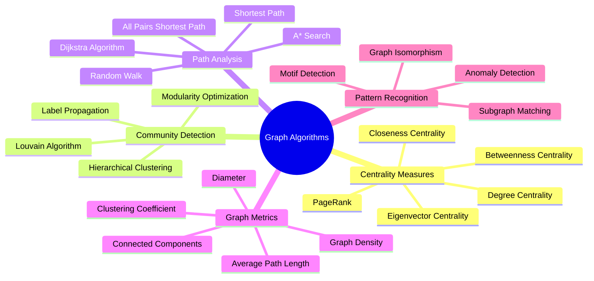
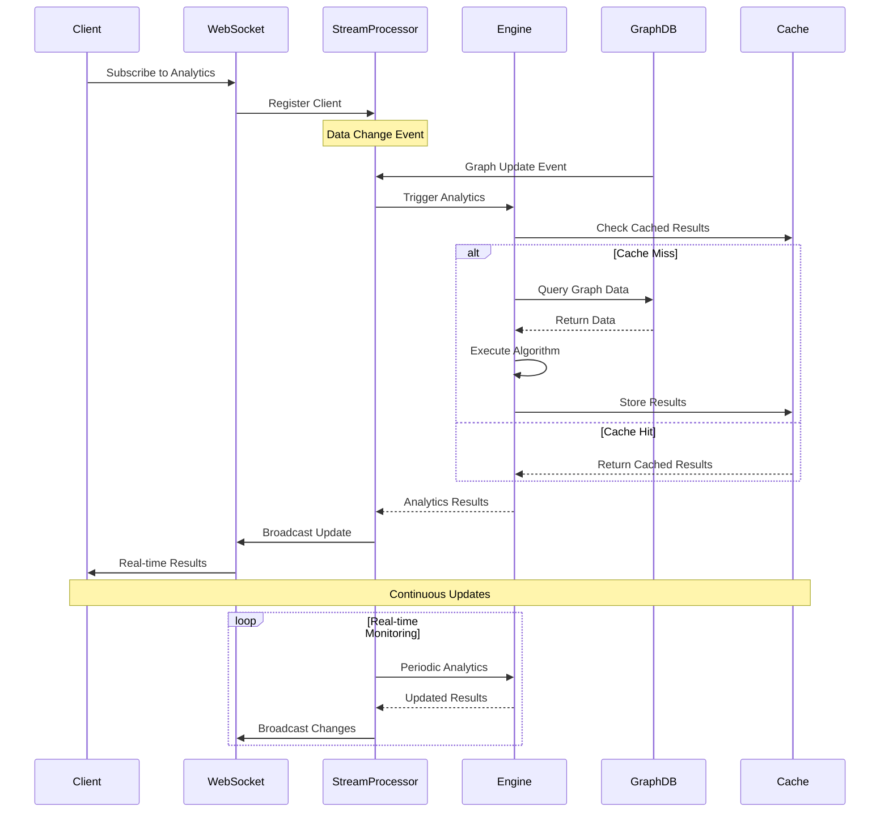
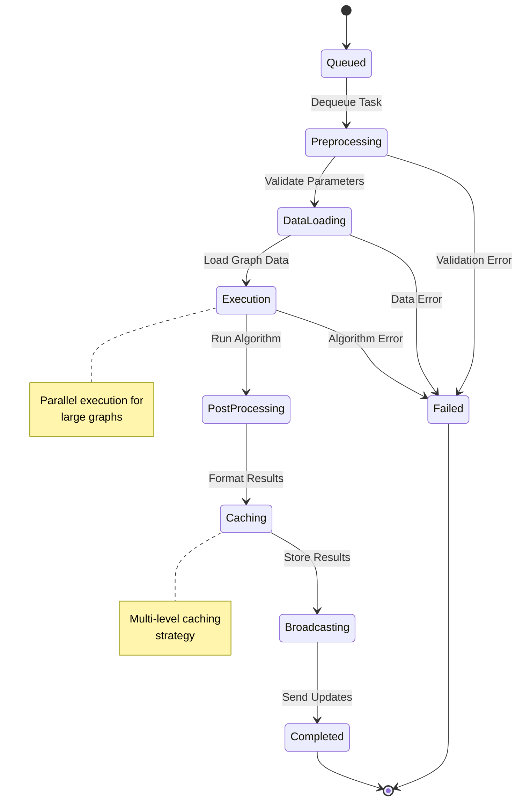

# Analytics Documentation

Welcome to the GraphMemory-IDE analytics documentation. This module covers the advanced graph analytics engine, real-time processing capabilities, and performance optimization strategies.

## 🏗️ Analytics Engine Architecture

```mermaid
graph TB
    subgraph "Analytics Interface"
        API[Analytics API]
        WebSocket[Real-time WebSocket]
        Scheduler[Task Scheduler]
        Dashboard[Analytics Dashboard]
    end
    
    subgraph "Analytics Engine Core"
        Engine[Analytics Engine]
        Algorithms[Algorithm Library]
        Cache[Analytics Cache]
        Queue[Processing Queue]
    end
    
    subgraph "Graph Processing"
        GraphAnalyzer[Graph Analyzer]
        Centrality[Centrality Calculator]
        Community[Community Detection]
        PathFinder[Path Finding]
    end
    
    subgraph "Real-time Processing"
        StreamProcessor[Stream Processor]
        EventHandler[Event Handler]
        Aggregator[Data Aggregator]
        Broadcaster[Result Broadcaster]
    end
    
    subgraph "Data Sources"
        GraphDB[(Graph Database)]
        VectorDB[(Vector Store)]
        CacheDB[(Redis Cache)]
        MetricsDB[(Metrics Store)]
    end
    
    API --> Engine
    WebSocket --> StreamProcessor
    Scheduler --> Engine
    Dashboard --> API
    
    Engine --> Algorithms
    Engine --> Cache
    Engine --> Queue
    
    Algorithms --> GraphAnalyzer
    Algorithms --> Centrality
    Algorithms --> Community
    Algorithms --> PathFinder
    
    StreamProcessor --> EventHandler
    StreamProcessor --> Aggregator
    StreamProcessor --> Broadcaster
    
    GraphAnalyzer --> GraphDB
    Centrality --> GraphDB
    Community --> GraphDB
    PathFinder --> GraphDB
    
    Cache --> CacheDB
    EventHandler --> VectorDB
    Aggregator --> MetricsDB
    
    style "Analytics Interface" fill:#e1f5fe
    style "Analytics Engine Core" fill:#e8f5e8
    style "Graph Processing" fill:#fff3e0
    style "Real-time Processing" fill:#fce4ec
```

## 📚 Module Contents

### 🧮 [Core Engine](./core-engine.md)
Complete guide to the analytics engine architecture and processing pipeline.

**Topics Covered:**
- Engine architecture and components
- Processing pipeline design
- Task scheduling and queue management
- Performance optimization strategies

### 🔬 [Graph Algorithms](./algorithms.md)
Comprehensive library of graph analysis algorithms.

**Topics Covered:**
- Centrality measures (PageRank, Betweenness, Closeness)
- Community detection algorithms
- Path finding and shortest paths
- Graph clustering and classification

### ⚡ [Real-time Analytics](./real-time.md)
Real-time processing and streaming analytics capabilities.

**Topics Covered:**
- Stream processing architecture
- Event-driven analytics
- Real-time aggregation
- WebSocket broadcasting

### 🚀 [Performance Optimization](./performance.md)
Optimization strategies and caching mechanisms.

**Topics Covered:**
- Caching strategies
- Query optimization
- Parallel processing
- Memory management

## 🔄 Analytics Processing Pipeline

```mermaid
flowchart TD
    subgraph "Input Stage"
        Request[Analytics Request]
        Validate[Validate Parameters]
        Queue[Add to Queue]
    end
    
    subgraph "Processing Stage"
        Dequeue[Dequeue Task]
        LoadData[Load Graph Data]
        Execute[Execute Algorithm]
        Cache[Cache Results]
    end
    
    subgraph "Output Stage"
        Format[Format Results]
        Store[Store Metrics]
        Broadcast[Broadcast Updates]
        Response[Return Response]
    end
    
    subgraph "Monitoring"
        Metrics[Collect Metrics]
        Alerts[Performance Alerts]
        Logs[Audit Logs]
    end
    
    Request --> Validate
    Validate --> Queue
    Queue --> Dequeue
    
    Dequeue --> LoadData
    LoadData --> Execute
    Execute --> Cache
    
    Cache --> Format
    Format --> Store
    Store --> Broadcast
    Broadcast --> Response
    
    Execute --> Metrics
    Store --> Alerts
    Broadcast --> Logs
    
    style "Input Stage" fill:#e1f5fe
    style "Processing Stage" fill:#e8f5e8
    style "Output Stage" fill:#fff3e0
    style "Monitoring" fill:#fce4ec
```

## 🧮 Algorithm Categories



## ⚡ Real-time Analytics Flow



## 📊 Analytics Metrics Dashboard

```mermaid
graph TD
    subgraph "Graph Metrics"
        Nodes[Node Count]
        Edges[Edge Count]
        Density[Graph Density]
        Components[Connected Components]
    end
    
    subgraph "Centrality Metrics"
        PageRank[PageRank Scores]
        Betweenness[Betweenness Centrality]
        Closeness[Closeness Centrality]
        Degree[Degree Distribution]
    end
    
    subgraph "Community Metrics"
        Communities[Community Count]
        Modularity[Modularity Score]
        Sizes[Community Sizes]
        Overlap[Community Overlap]
    end
    
    subgraph "Performance Metrics"
        ExecutionTime[Execution Time]
        CacheHitRate[Cache Hit Rate]
        QueueLength[Queue Length]
        Throughput[Processing Throughput]
    end
    
    subgraph "Real-time Updates"
        LiveMetrics[Live Metrics Stream]
        Alerts[Performance Alerts]
        Trends[Trend Analysis]
        Predictions[Predictive Analytics]
    end
    
    Nodes --> LiveMetrics
    PageRank --> LiveMetrics
    Communities --> LiveMetrics
    ExecutionTime --> LiveMetrics
    
    LiveMetrics --> Alerts
    LiveMetrics --> Trends
    LiveMetrics --> Predictions
    
    style "Graph Metrics" fill:#e1f5fe
    style "Centrality Metrics" fill:#e8f5e8
    style "Community Metrics" fill:#fff3e0
    style "Performance Metrics" fill:#fce4ec
```

## 🔄 Caching Strategy

```mermaid
graph TB
    subgraph "Cache Layers"
        L1[L1: Algorithm Results<br/>In-Memory Cache]
        L2[L2: Intermediate Data<br/>Redis Cache]
        L3[L3: Historical Results<br/>Persistent Storage]
    end
    
    subgraph "Cache Types"
        Centrality[Centrality Scores]
        Community[Community Results]
        Paths[Path Calculations]
        Metrics[Graph Metrics]
    end
    
    subgraph "Cache Policies"
        TTL[Time-To-Live<br/>1 hour]
        LRU[Least Recently Used<br/>Size-based eviction]
        Invalidation[Smart Invalidation<br/>Graph change detection]
    end
    
    subgraph "Cache Optimization"
        Precompute[Precompute Popular]
        Incremental[Incremental Updates]
        Partitioning[Data Partitioning]
        Compression[Result Compression]
    end
    
    Centrality --> L1
    Community --> L1
    Paths --> L2
    Metrics --> L2
    
    L1 --> TTL
    L2 --> LRU
    L3 --> Invalidation
    
    TTL --> Precompute
    LRU --> Incremental
    Invalidation --> Partitioning
    Precompute --> Compression
    
    style "Cache Layers" fill:#e1f5fe
    style "Cache Types" fill:#e8f5e8
    style "Cache Policies" fill:#fff3e0
    style "Cache Optimization" fill:#fce4ec
```

## 🚀 Performance Optimization

```mermaid
flowchart TD
    subgraph "Algorithm Optimization"
        Parallel[Parallel Processing]
        Approximation[Approximation Algorithms]
        Sampling[Graph Sampling]
        Pruning[Search Space Pruning]
    end
    
    subgraph "Data Optimization"
        Indexing[Graph Indexing]
        Partitioning[Graph Partitioning]
        Compression[Data Compression]
        Preprocessing[Data Preprocessing]
    end
    
    subgraph "System Optimization"
        Memory[Memory Management]
        CPU[CPU Optimization]
        IO[I/O Optimization]
        Network[Network Optimization]
    end
    
    subgraph "Monitoring & Tuning"
        Profiling[Performance Profiling]
        Benchmarking[Algorithm Benchmarking]
        Tuning[Parameter Tuning]
        Scaling[Auto-scaling]
    end
    
    Parallel --> Memory
    Approximation --> CPU
    Sampling --> IO
    Pruning --> Network
    
    Indexing --> Profiling
    Partitioning --> Benchmarking
    Compression --> Tuning
    Preprocessing --> Scaling
    
    Memory --> Profiling
    CPU --> Benchmarking
    IO --> Tuning
    Network --> Scaling
    
    style "Algorithm Optimization" fill:#e1f5fe
    style "Data Optimization" fill:#e8f5e8
    style "System Optimization" fill:#fff3e0
    style "Monitoring & Tuning" fill:#fce4ec
```

## 🔬 Algorithm Execution Flow



## 📈 Analytics API Endpoints

```mermaid
graph LR
    subgraph "Core Analytics"
        Centrality[/api/v1/analytics/centrality]
        Community[/api/v1/analytics/community]
        Paths[/api/v1/analytics/paths]
        Metrics[/api/v1/analytics/metrics]
    end
    
    subgraph "Real-time"
        Stream[/ws/analytics/stream]
        Subscribe[/api/v1/analytics/subscribe]
        Unsubscribe[/api/v1/analytics/unsubscribe]
    end
    
    subgraph "Management"
        Status[/api/v1/analytics/status]
        Queue[/api/v1/analytics/queue]
        Cache[/api/v1/analytics/cache]
        Config[/api/v1/analytics/config]
    end
    
    subgraph "Batch Processing"
        Batch[/api/v1/analytics/batch]
        Jobs[/api/v1/analytics/jobs]
        Results[/api/v1/analytics/results]
    end
    
    Centrality --> Stream
    Community --> Stream
    Paths --> Subscribe
    Metrics --> Subscribe
    
    Status --> Queue
    Queue --> Cache
    Cache --> Config
    
    Batch --> Jobs
    Jobs --> Results
    
    style "Core Analytics" fill:#e1f5fe
    style "Real-time" fill:#e8f5e8
    style "Management" fill:#fff3e0
    style "Batch Processing" fill:#fce4ec
```

## 🎯 Use Case Scenarios

```mermaid
graph TD
    subgraph "Knowledge Discovery"
        ImportantNodes[Find Important Nodes]
        RelatedConcepts[Discover Related Concepts]
        KnowledgeGaps[Identify Knowledge Gaps]
        LearningPaths[Suggest Learning Paths]
    end
    
    subgraph "Content Analysis"
        TopicClusters[Topic Clustering]
        ContentSimilarity[Content Similarity]
        TrendAnalysis[Trend Analysis]
        InfluenceMapping[Influence Mapping]
    end
    
    subgraph "Performance Insights"
        MemoryUsage[Memory Usage Patterns]
        AccessPatterns[Access Patterns]
        SearchEfficiency[Search Efficiency]
        UserBehavior[User Behavior Analysis]
    end
    
    subgraph "Recommendations"
        ContentRecommendations[Content Recommendations]
        ConnectionSuggestions[Connection Suggestions]
        TagRecommendations[Tag Recommendations]
        WorkflowOptimization[Workflow Optimization]
    end
    
    ImportantNodes --> TopicClusters
    RelatedConcepts --> ContentSimilarity
    KnowledgeGaps --> TrendAnalysis
    LearningPaths --> InfluenceMapping
    
    TopicClusters --> MemoryUsage
    ContentSimilarity --> AccessPatterns
    TrendAnalysis --> SearchEfficiency
    InfluenceMapping --> UserBehavior
    
    MemoryUsage --> ContentRecommendations
    AccessPatterns --> ConnectionSuggestions
    SearchEfficiency --> TagRecommendations
    UserBehavior --> WorkflowOptimization
    
    style "Knowledge Discovery" fill:#e1f5fe
    style "Content Analysis" fill:#e8f5e8
    style "Performance Insights" fill:#fff3e0
    style "Recommendations" fill:#fce4ec
```

## 🔧 Configuration & Tuning

```mermaid
graph TB
    subgraph "Algorithm Configuration"
        PageRankConfig[PageRank Parameters<br/>- Damping Factor: 0.85<br/>- Max Iterations: 100<br/>- Tolerance: 1e-6]
        CommunityConfig[Community Detection<br/>- Resolution: 1.0<br/>- Random Seed: 42<br/>- Max Iterations: 50]
        PathConfig[Path Finding<br/>- Max Depth: 10<br/>- Weight Threshold: 0.1<br/>- Heuristic: A*]
    end
    
    subgraph "Performance Configuration"
        CacheConfig[Cache Settings<br/>- TTL: 3600s<br/>- Max Size: 1GB<br/>- Eviction: LRU]
        QueueConfig[Queue Settings<br/>- Max Size: 1000<br/>- Workers: 4<br/>- Timeout: 300s]
        ParallelConfig[Parallel Processing<br/>- Thread Pool: 8<br/>- Chunk Size: 1000<br/>- Memory Limit: 4GB]
    end
    
    subgraph "Real-time Configuration"
        StreamConfig[Stream Settings<br/>- Buffer Size: 100<br/>- Batch Interval: 1s<br/>- Max Connections: 100]
        EventConfig[Event Processing<br/>- Debounce: 500ms<br/>- Batch Size: 50<br/>- Priority Queue: True]
    end
    
    PageRankConfig --> CacheConfig
    CommunityConfig --> QueueConfig
    PathConfig --> ParallelConfig
    
    CacheConfig --> StreamConfig
    QueueConfig --> EventConfig
    ParallelConfig --> StreamConfig
    
    style "Algorithm Configuration" fill:#e1f5fe
    style "Performance Configuration" fill:#e8f5e8
    style "Real-time Configuration" fill:#fff3e0
```

## 📖 Quick Reference

### Essential Commands
```bash
# Analytics Engine
python -m server.analytics.engine --start     # Start analytics engine
python -m server.analytics.cache --clear      # Clear analytics cache
python -m server.analytics.benchmark          # Run performance benchmarks

# Algorithm Testing
python -m server.analytics.algorithms --test  # Test all algorithms
python -m server.analytics.centrality --run   # Run centrality analysis
python -m server.analytics.community --detect # Detect communities
```

### Key Configuration
```yaml
# Analytics Configuration
ANALYTICS_CACHE_TTL: 3600
ANALYTICS_QUEUE_SIZE: 1000
ANALYTICS_WORKERS: 4
ANALYTICS_MEMORY_LIMIT: "4GB"
ANALYTICS_PARALLEL_THREADS: 8
```

### API Examples
```python
# Centrality Analysis
POST /api/v1/analytics/centrality
{
    "algorithm": "pagerank",
    "parameters": {"damping_factor": 0.85},
    "filters": {"node_type": "memory"}
}

# Real-time Subscription
WebSocket /ws/analytics/stream
{
    "subscribe": ["centrality", "community"],
    "filters": {"user_id": "user123"}
}
```

---

**Next Steps:**
- [Core Engine Architecture](./core-engine.md)
- [Graph Algorithms Library](./algorithms.md)
- [Real-time Analytics](./real-time.md)
- [Performance Optimization](./performance.md) 