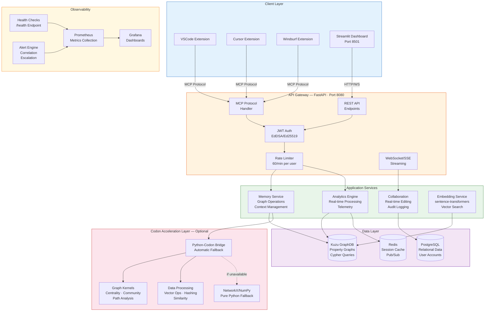
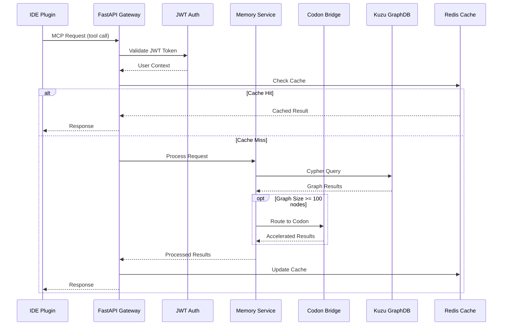
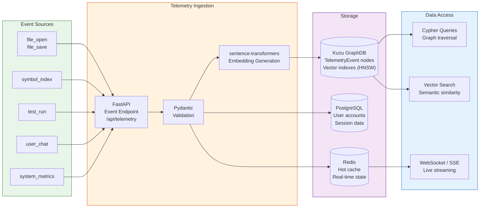
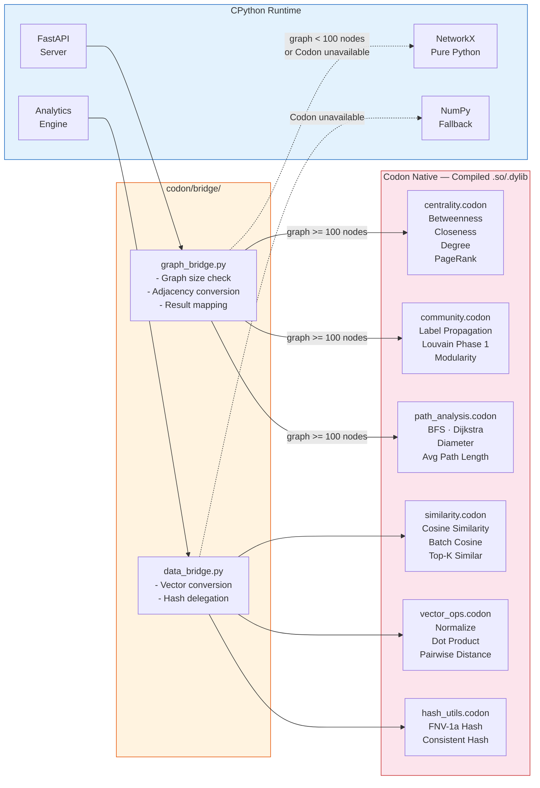
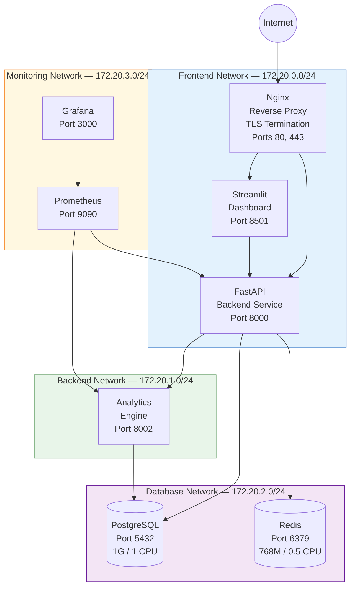
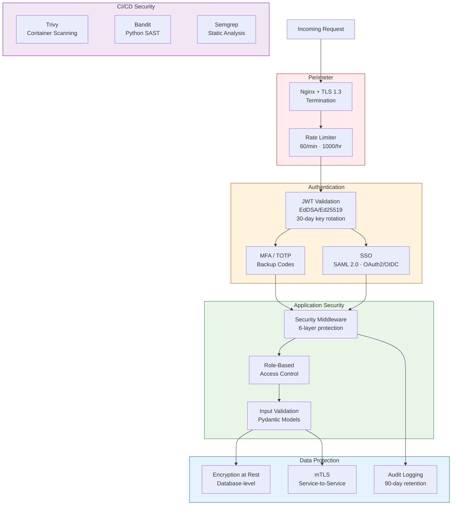

# GraphMemory-IDE Architecture Overview

GraphMemory-IDE is an AI-assisted, long-term memory system for IDEs built on a hybrid CPython/Codon architecture. This document provides accurate, up-to-date architectural diagrams reflecting the actual codebase.

## Table of Contents

- [System Architecture](#system-architecture)
- [Request Flow](#request-flow)
- [Data Flow](#data-flow)
- [Codon Acceleration](#codon-acceleration)
- [Production Deployment](#production-deployment)
- [Security Architecture](#security-architecture)

---

## System Architecture

The system is organized into six layers: client integrations, API gateway, application services, an optional Codon acceleration layer, a polyglot data layer, and observability infrastructure.

```mermaid
flowchart TB
    subgraph clients["Client Layer"]
        VSCODE["VSCode Extension"]
        CURSOR["Cursor Extension"]
        WINDSURF["Windsurf Extension"]
        DASHBOARD["Streamlit Dashboard\nPort 8501"]
    end

    subgraph gateway["API Gateway — FastAPI · Port 8080"]
        AUTH["JWT Auth\nEdDSA/Ed25519"]
        RATE["Rate Limiter\n60/min per user"]
        MCP["MCP Protocol\nHandler"]
        REST["REST API\nEndpoints"]
        WS["WebSocket/SSE\nStreaming"]
    end

    subgraph core["Application Services"]
        MEMORY["Memory Service\nGraph Operations\nContext Management"]
        ANALYTICS["Analytics Engine\nReal-time Processing\nTelemetry"]
        COLLAB["Collaboration\nReal-time Editing\nAudit Logging"]
        EMBEDDINGS["Embedding Service\nsentence-transformers\nVector Search"]
    end

    subgraph acceleration["Codon Acceleration Layer — Optional"]
        BRIDGE["Python-Codon Bridge\nAutomatic Fallback"]
        KERNELS["Graph Kernels\nCentrality · Community\nPath Analysis"]
        DATAOPS["Data Processing\nVector Ops · Hashing\nSimilarity"]
        FALLBACK["NetworkX/NumPy\nPure Python Fallback"]
    end

    subgraph data["Data Layer"]
        KUZU[("Kuzu GraphDB\nProperty Graphs\nCypher Queries")]
        PG[("PostgreSQL\nRelational Data\nUser Accounts")]
        REDIS[("Redis\nSession Cache\nPub/Sub")]
    end

    subgraph monitoring["Observability"]
        PROM["Prometheus\nMetrics Collection"]
        GRAFANA["Grafana\nDashboards"]
        HEALTH["Health Checks\n/health Endpoint"]
        ALERTS["Alert Engine\nCorrelation\nEscalation"]
    end

    VSCODE & CURSOR & WINDSURF -->|MCP Protocol| MCP
    DASHBOARD -->|HTTP/WS| REST

    MCP --> AUTH
    REST --> AUTH
    AUTH --> RATE
    RATE --> MEMORY
    RATE --> ANALYTICS
    WS --> COLLAB

    MEMORY --> KUZU
    MEMORY --> BRIDGE
    ANALYTICS --> KUZU
    ANALYTICS --> REDIS
    EMBEDDINGS --> KUZU
    COLLAB --> PG

    BRIDGE --> KERNELS
    BRIDGE --> DATAOPS
    BRIDGE -.->|if unavailable| FALLBACK

    PROM --> GRAFANA
    HEALTH --> PROM
    ALERTS --> PROM

    style clients fill:#e3f2fd,stroke:#1565c0
    style gateway fill:#fff3e0,stroke:#e65100
    style core fill:#e8f5e9,stroke:#2e7d32
    style acceleration fill:#fce4ec,stroke:#c62828
    style data fill:#f3e5f5,stroke:#6a1b9a
    style monitoring fill:#fff8e1,stroke:#f57f17
```

### Key Components

| Component | Implementation | Location |
|-----------|---------------|----------|
| API Gateway | FastAPI 0.115 + Uvicorn | `server/main.py` |
| Authentication | JWT with EdDSA/Ed25519, SSO (SAML/OIDC), MFA (TOTP) | `server/auth_jwt.py`, `server/auth/` |
| Graph Database | Kuzu 0.10 with Cypher queries, HNSW vector indexes | `server/graph_database.py` |
| Analytics | Real-time telemetry with WebSocket/SSE streaming | `server/analytics/` |
| Embeddings | sentence-transformers for semantic vector search | `server/main.py` (vector search endpoints) |
| Codon Bridge | Optional native compilation with Python fallback | `codon/bridge/` |
| Dashboard | Streamlit with ECharts and Plotly visualizations | `dashboard/` |
| Monitoring | Prometheus metrics + Grafana + alert correlation | `server/monitoring/` |

---

## Request Flow

This sequence diagram shows how an MCP request flows from an IDE plugin through authentication, caching, graph queries, and optional Codon acceleration.

```mermaid
sequenceDiagram
    participant IDE as IDE Plugin
    participant GW as FastAPI Gateway
    participant AUTH as JWT Auth
    participant MEM as Memory Service
    participant BRIDGE as Codon Bridge
    participant KUZU as Kuzu GraphDB
    participant REDIS as Redis Cache

    IDE->>GW: MCP Request (tool call)
    GW->>AUTH: Validate JWT Token
    AUTH-->>GW: User Context

    GW->>REDIS: Check Cache
    alt Cache Hit
        REDIS-->>GW: Cached Result
        GW-->>IDE: Response
    else Cache Miss
        GW->>MEM: Process Request
        MEM->>KUZU: Cypher Query
        KUZU-->>MEM: Graph Results

        opt Graph Size >= 100 nodes
            MEM->>BRIDGE: Route to Codon
            BRIDGE-->>MEM: Accelerated Results
        end

        MEM-->>GW: Processed Results
        GW->>REDIS: Update Cache
        GW-->>IDE: Response
    end
```

---

## Data Flow

Telemetry events from IDE interactions are ingested, validated, embedded, and stored across three databases. Data is accessed via Cypher queries, vector search, or real-time streaming.

```mermaid
flowchart LR
    subgraph sources["Event Sources"]
        FILE_EVT["file_open\nfile_save"]
        SYMBOL["symbol_index"]
        TEST["test_run"]
        CHAT["user_chat"]
        SYS["system_metrics"]
    end

    subgraph ingestion["Telemetry Ingestion"]
        INGEST["FastAPI\nEvent Endpoint\n/api/telemetry"]
        VALIDATE["Pydantic\nValidation"]
        EMBED["sentence-transformers\nEmbedding Generation"]
    end

    subgraph storage["Storage"]
        KUZU_STORE[("Kuzu GraphDB\nTelemetryEvent nodes\nVector indexes (HNSW)")]
        PG_STORE[("PostgreSQL\nUser accounts\nSession data")]
        REDIS_STORE[("Redis\nHot cache\nReal-time state")]
    end

    subgraph access["Data Access"]
        CYPHER["Cypher Queries\nGraph traversal"]
        VECTOR_SEARCH["Vector Search\nSemantic similarity"]
        STREAM["WebSocket / SSE\nLive streaming"]
    end

    FILE_EVT & SYMBOL & TEST & CHAT & SYS --> INGEST
    INGEST --> VALIDATE --> EMBED
    EMBED --> KUZU_STORE
    VALIDATE --> PG_STORE
    VALIDATE --> REDIS_STORE

    KUZU_STORE --> CYPHER
    KUZU_STORE --> VECTOR_SEARCH
    REDIS_STORE --> STREAM

    style sources fill:#e8f5e9,stroke:#2e7d32
    style ingestion fill:#fff3e0,stroke:#e65100
    style storage fill:#f3e5f5,stroke:#6a1b9a
    style access fill:#e3f2fd,stroke:#1565c0
```

### Database Configuration

| Database | Purpose | Key Settings |
|----------|---------|-------------|
| Kuzu GraphDB | Graph storage, vector search | Buffer pool: 1GB, max threads: 8, auto-checkpoint: 64MB |
| PostgreSQL | User accounts, sessions, relational data | Connection pool: 5 base / 10 max |
| Redis | Session cache, pub/sub, real-time state | Default config, used for hot data |

---

## Codon Acceleration

GraphMemory-IDE uses a hybrid architecture where compute-heavy graph algorithms can optionally run as native-compiled [Codon](https://github.com/exaloop/codon) modules for 10-100x speedups. The bridge layer handles data conversion and automatic fallback.

```mermaid
flowchart LR
    subgraph cpython["CPython Runtime"]
        FASTAPI["FastAPI\nServer"]
        ANALYTICS["Analytics\nEngine"]
        NETWORKX["NetworkX\nPure Python"]
        NUMPY["NumPy\nFallback"]
    end

    subgraph bridge["codon/bridge/"]
        GRAPH_BRIDGE["graph_bridge.py\n- Graph size check\n- Adjacency conversion\n- Result mapping"]
        DATA_BRIDGE["data_bridge.py\n- Vector conversion\n- Hash delegation"]
    end

    subgraph codon_native["Codon Native — Compiled .so/.dylib"]
        CENTRALITY["centrality.codon\nBetweenness\nCloseness\nDegree\nPageRank"]
        COMMUNITY["community.codon\nLabel Propagation\nLouvain Phase 1\nModularity"]
        PATHS["path_analysis.codon\nBFS · Dijkstra\nDiameter\nAvg Path Length"]
        SIMILARITY["similarity.codon\nCosine Similarity\nBatch Cosine\nTop-K Similar"]
        VECTOR["vector_ops.codon\nNormalize\nDot Product\nPairwise Distance"]
        HASH["hash_utils.codon\nFNV-1a Hash\nConsistent Hash"]
    end

    FASTAPI --> GRAPH_BRIDGE
    ANALYTICS --> DATA_BRIDGE

    GRAPH_BRIDGE -->|graph >= 100 nodes| CENTRALITY
    GRAPH_BRIDGE -->|graph >= 100 nodes| COMMUNITY
    GRAPH_BRIDGE -->|graph >= 100 nodes| PATHS

    DATA_BRIDGE --> SIMILARITY
    DATA_BRIDGE --> VECTOR
    DATA_BRIDGE --> HASH

    GRAPH_BRIDGE -.->|graph < 100 nodes\nor Codon unavailable| NETWORKX
    DATA_BRIDGE -.->|Codon unavailable| NUMPY

    style cpython fill:#e3f2fd,stroke:#1565c0
    style bridge fill:#fff3e0,stroke:#e65100
    style codon_native fill:#fce4ec,stroke:#c62828
```

### Routing Rules

- **Codon path**: Used when `CODON_ENABLED=true`, compiled `.so`/`.dylib` files exist, and graph size >= `CODON_MIN_GRAPH_SIZE` (default: 100 nodes)
- **Fallback path**: NetworkX/NumPy used automatically when Codon is unavailable or for small graphs where conversion overhead exceeds the speedup
- **Data boundary**: Codon receives typed arrays only (`List[int]`, `List[Tuple[int, int, float]]`, `List[float]`). The bridge handles Python object to typed array conversion in both directions.

### Configuration

| Variable | Default | Description |
|----------|---------|-------------|
| `CODON_ENABLED` | `true` | Master switch for Codon acceleration |
| `CODON_LIB_PATH` | `./codon/lib/` | Directory containing compiled `.so`/`.dylib` files |
| `CODON_FALLBACK` | `true` | Fall back to Python if Codon unavailable |
| `CODON_MIN_GRAPH_SIZE` | `100` | Minimum node count to route through Codon |

Build Codon modules: `./scripts/build_codon.sh`

---

## Production Deployment

The production Docker Compose configuration (`docker/production/docker-compose.prod.yml`) runs 7+ services across 4 isolated network subnets with resource limits.

```mermaid
flowchart TB
    INTERNET((Internet))

    subgraph frontend_net["Frontend Network — 172.20.0.0/24"]
        NGINX["Nginx\nReverse Proxy\nTLS Termination\nPorts 80, 443"]
        FASTAPI["FastAPI\nBackend Service\nPort 8000"]
        STREAMLIT["Streamlit\nDashboard\nPort 8501"]
    end

    subgraph backend_net["Backend Network — 172.20.1.0/24"]
        ANALYTICS_SVC["Analytics\nEngine\nPort 8002"]
    end

    subgraph db_net["Database Network — 172.20.2.0/24"]
        POSTGRES[("PostgreSQL\nPort 5432\n1G / 1 CPU")]
        REDIS_SVC[("Redis\nPort 6379\n768M / 0.5 CPU")]
    end

    subgraph mon_net["Monitoring Network — 172.20.3.0/24"]
        PROMETHEUS_SVC["Prometheus\nPort 9090"]
        GRAFANA_SVC["Grafana\nPort 3000"]
    end

    INTERNET --> NGINX
    NGINX --> FASTAPI
    NGINX --> STREAMLIT
    FASTAPI --> ANALYTICS_SVC
    FASTAPI --> POSTGRES
    FASTAPI --> REDIS_SVC
    ANALYTICS_SVC --> POSTGRES
    STREAMLIT --> FASTAPI
    PROMETHEUS_SVC --> FASTAPI
    PROMETHEUS_SVC --> ANALYTICS_SVC
    GRAFANA_SVC --> PROMETHEUS_SVC

    style frontend_net fill:#e3f2fd,stroke:#1565c0
    style backend_net fill:#e8f5e9,stroke:#2e7d32
    style db_net fill:#f3e5f5,stroke:#6a1b9a
    style mon_net fill:#fff8e1,stroke:#f57f17
```

### Resource Limits

| Service | Memory | CPU |
|---------|--------|-----|
| FastAPI | 2G | 2.0 |
| Streamlit | 1.5G | 1.5 |
| Analytics | 2G | 2.0 |
| PostgreSQL | 1G | 1.0 |
| Redis | 768M | 0.5 |

### Development Environment

For local development, `docker/docker-compose.yml` provides a minimal 2-service setup:
- **mcp-server**: FastAPI + Kuzu (ports 8080, 50051) with security hardening (read-only, seccomp, non-root)
- **kestra**: Workflow orchestration (port 8081)

---

## Security Architecture

Requests pass through five security layers: perimeter protection, authentication, application-level enforcement, data protection, and CI/CD scanning.

```mermaid
flowchart TB
    REQUEST["Incoming Request"]

    subgraph perimeter["Perimeter"]
        NGINX_TLS["Nginx + TLS 1.3\nTermination"]
        RATE_LIMIT["Rate Limiter\n60/min · 1000/hr"]
    end

    subgraph auth_layer["Authentication"]
        JWT["JWT Validation\nEdDSA/Ed25519\n30-day key rotation"]
        MFA["MFA / TOTP\nBackup Codes"]
        SSO["SSO\nSAML 2.0 · OAuth2/OIDC"]
    end

    subgraph app_security["Application Security"]
        MIDDLEWARE["Security Middleware\n6-layer protection"]
        RBAC["Role-Based\nAccess Control"]
        INPUT_VAL["Input Validation\nPydantic Models"]
    end

    subgraph data_security["Data Protection"]
        ENCRYPT_REST["Encryption at Rest\nDatabase-level"]
        ENCRYPT_TRANSIT["mTLS\nService-to-Service"]
        AUDIT["Audit Logging\n90-day retention"]
    end

    subgraph scanning["CI/CD Security"]
        TRIVY["Trivy\nContainer Scanning"]
        BANDIT["Bandit\nPython SAST"]
        SEMGREP["Semgrep\nStatic Analysis"]
    end

    REQUEST --> NGINX_TLS --> RATE_LIMIT
    RATE_LIMIT --> JWT
    JWT --> MFA
    JWT --> SSO
    MFA --> MIDDLEWARE
    SSO --> MIDDLEWARE
    MIDDLEWARE --> RBAC --> INPUT_VAL
    INPUT_VAL --> ENCRYPT_REST
    INPUT_VAL --> ENCRYPT_TRANSIT
    MIDDLEWARE --> AUDIT

    TRIVY ~~~ BANDIT ~~~ SEMGREP

    style perimeter fill:#ffebee,stroke:#c62828
    style auth_layer fill:#fff3e0,stroke:#e65100
    style app_security fill:#e8f5e9,stroke:#2e7d32
    style data_security fill:#e3f2fd,stroke:#1565c0
    style scanning fill:#f3e5f5,stroke:#6a1b9a
```

### Security Configuration

| Setting | Value |
|---------|-------|
| JWT Algorithm | EdDSA (Ed25519) |
| Key Rotation | 30 days |
| Password Requirements | 12+ chars, uppercase, lowercase, numbers, special |
| Rate Limiting | 60/min, 1000/hr burst |
| API Key Rotation | 90-day cycle |
| Audit Log Retention | 90 days |
| Container Security | Non-root, read-only filesystem, seccomp profiles |

### Security Files

| File | Purpose |
|------|---------|
| `server/auth_jwt.py` | JWT token creation and validation |
| `server/auth/sso_manager.py` | SAML 2.0 and OAuth2/OIDC integration |
| `server/auth/mfa_manager.py` | TOTP multi-factor authentication |
| `server/security/` | Security middleware and utilities |
| `scripts/security/` | Key rotation and secrets management scripts |
| `.bandit` | Python security linting configuration |
| `.semgrep.yml` | Static analysis rules |
