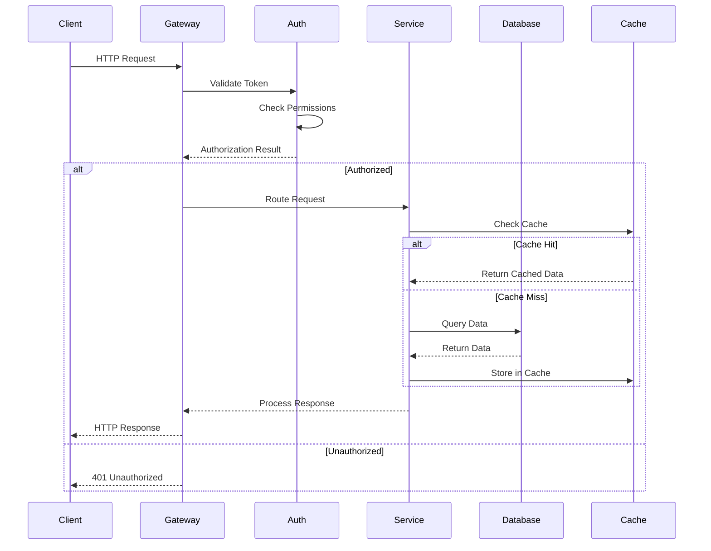
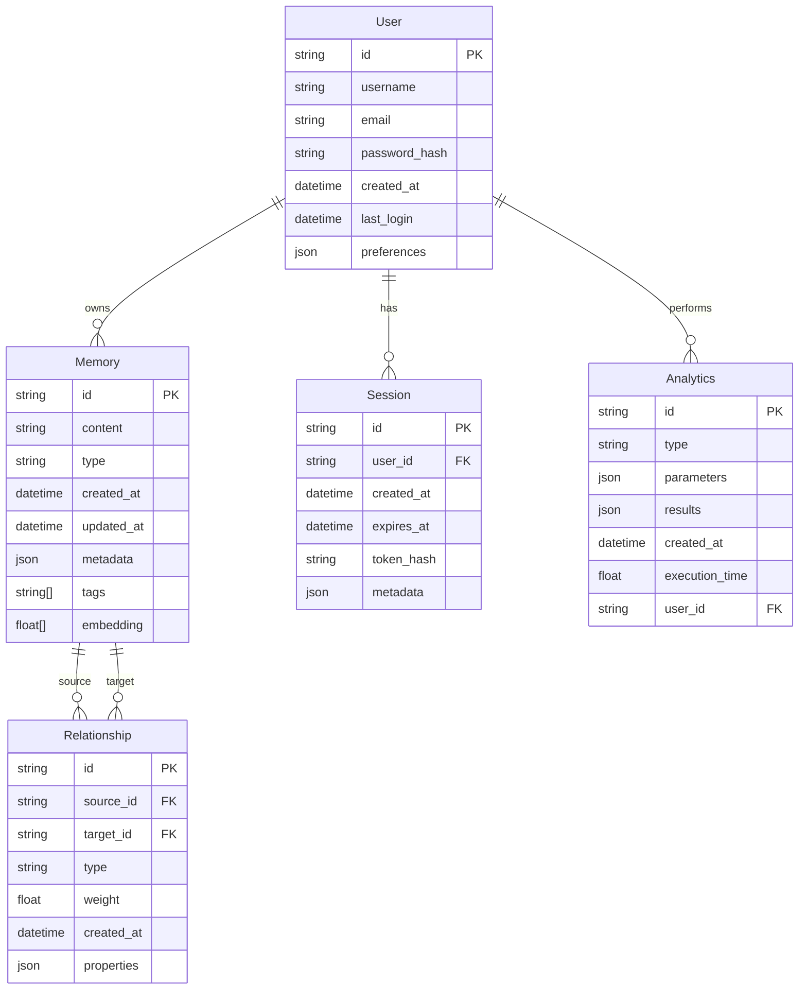

# Backend Documentation

Welcome to the GraphMemory-IDE backend documentation. This module covers server-side architecture, API design, database management, and backend services.

## 🏗️ Backend Architecture Overview

```mermaid
graph TB
    subgraph "API Gateway Layer"
        Gateway[FastAPI Gateway]
        Auth[Authentication Middleware]
        Rate[Rate Limiting]
        CORS[CORS Handler]
    end
    
    subgraph "Application Services"
        MCP[MCP Server]
        Analytics[Analytics Engine]
        Memory[Memory Service]
        Search[Search Service]
        Embeddings[Embeddings Service]
    end
    
    subgraph "Data Access Layer"
        KuzuClient[Kuzu Client]
        VectorClient[Vector Store Client]
        CacheClient[Redis Client]
        FileClient[File Storage Client]
    end
    
    subgraph "Data Storage"
        GraphDB[(Kuzu GraphDB)]
        VectorDB[(Vector Store)]
        Cache[(Redis Cache)]
        Files[(File Storage)]
    end
    
    subgraph "External Services"
        Embeddings_API[Embeddings API]
        Monitoring[Monitoring Service]
        Backup[Backup Service]
    end
    
    Gateway --> Auth
    Gateway --> Rate
    Gateway --> CORS
    
    Auth --> MCP
    Auth --> Analytics
    Auth --> Memory
    Auth --> Search
    Auth --> Embeddings
    
    MCP --> KuzuClient
    Analytics --> KuzuClient
    Analytics --> CacheClient
    Memory --> KuzuClient
    Search --> VectorClient
    Embeddings --> VectorClient
    
    KuzuClient --> GraphDB
    VectorClient --> VectorDB
    CacheClient --> Cache
    FileClient --> Files
    
    Embeddings --> Embeddings_API
    Application Services --> Monitoring
    Data Storage --> Backup
    
    style "API Gateway Layer" fill:#e1f5fe
    style "Application Services" fill:#e8f5e8
    style "Data Access Layer" fill:#fff3e0
    style "Data Storage" fill:#fce4ec
```

## 📚 Module Contents

### 🌐 [API Architecture](./api-architecture.md)
Complete guide to the FastAPI-based server architecture.

**Topics Covered:**
- FastAPI application structure
- Middleware and dependency injection
- Request/response handling
- Error handling and validation

### 🗄️ [Database Design](./database-design.md)
Comprehensive database architecture and schema design.

**Topics Covered:**
- Kuzu GraphDB schema design
- Vector store integration
- Data modeling patterns
- Query optimization strategies

### 🔐 [Authentication & Security](./authentication.md)
Security architecture and authentication systems.

**Topics Covered:**
- JWT authentication flow
- mTLS certificate management
- Authorization patterns
- Security best practices

### 🔍 [API Reference](./api-reference.md)
Complete API endpoint documentation.

**Topics Covered:**
- REST API endpoints
- WebSocket connections
- Request/response schemas
- Error codes and handling

## 🌐 API Request Flow



## 🗄️ Database Schema Architecture



## 🔐 Authentication Flow

```mermaid
flowchart TD
    subgraph "Client Authentication"
        Login[User Login]
        Credentials[Username/Password]
        Certificate[Client Certificate]
    end
    
    subgraph "Authentication Service"
        Validate[Validate Credentials]
        JWT[Generate JWT Token]
        mTLS[Verify mTLS Certificate]
        Session[Create Session]
    end
    
    subgraph "Authorization"
        Token[Token Validation]
        Permissions[Check Permissions]
        Resources[Access Resources]
    end
    
    subgraph "Security Storage"
        UserDB[(User Database)]
        CertStore[(Certificate Store)]
        SessionStore[(Session Store)]
    end
    
    Login --> Credentials
    Login --> Certificate
    
    Credentials --> Validate
    Certificate --> mTLS
    
    Validate --> UserDB
    mTLS --> CertStore
    
    Validate --> JWT
    mTLS --> Session
    JWT --> Session
    
    Session --> SessionStore
    
    Token --> Permissions
    Permissions --> Resources
    
    style "Client Authentication" fill:#e1f5fe
    style "Authentication Service" fill:#e8f5e8
    style "Authorization" fill:#fff3e0
    style "Security Storage" fill:#fce4ec
```

## 🚀 Service Architecture

```mermaid
graph TB
    subgraph "Core Services"
        MCPService[MCP Service]
        MemoryService[Memory Service]
        SearchService[Search Service]
        AnalyticsService[Analytics Service]
    end
    
    subgraph "Support Services"
        EmbeddingService[Embedding Service]
        CacheService[Cache Service]
        FileService[File Service]
        NotificationService[Notification Service]
    end
    
    subgraph "Data Layer"
        GraphRepository[Graph Repository]
        VectorRepository[Vector Repository]
        CacheRepository[Cache Repository]
        FileRepository[File Repository]
    end
    
    subgraph "External APIs"
        EmbeddingAPI[Embedding API]
        MonitoringAPI[Monitoring API]
        BackupAPI[Backup API]
    end
    
    MCPService --> MemoryService
    MCPService --> SearchService
    MCPService --> AnalyticsService
    
    MemoryService --> EmbeddingService
    MemoryService --> CacheService
    SearchService --> EmbeddingService
    AnalyticsService --> CacheService
    
    MemoryService --> GraphRepository
    SearchService --> VectorRepository
    AnalyticsService --> CacheRepository
    FileService --> FileRepository
    
    EmbeddingService --> EmbeddingAPI
    NotificationService --> MonitoringAPI
    FileService --> BackupAPI
    
    style "Core Services" fill:#e1f5fe
    style "Support Services" fill:#e8f5e8
    style "Data Layer" fill:#fff3e0
    style "External APIs" fill:#fce4ec
```

## 📊 Data Processing Pipeline

```mermaid
flowchart TD
    subgraph "Input Processing"
        Receive[Receive Data]
        Validate[Validate Input]
        Transform[Transform Data]
    end
    
    subgraph "Business Logic"
        Process[Process Business Rules]
        Enrich[Enrich with Metadata]
        Relate[Create Relationships]
    end
    
    subgraph "Storage Operations"
        Store[Store in Graph]
        Index[Create Indexes]
        Cache[Update Cache]
        Vector[Store Embeddings]
    end
    
    subgraph "Post-Processing"
        Notify[Send Notifications]
        Analytics[Update Analytics]
        Sync[Sync with External]
    end
    
    Receive --> Validate
    Validate --> Transform
    Transform --> Process
    
    Process --> Enrich
    Enrich --> Relate
    Relate --> Store
    
    Store --> Index
    Index --> Cache
    Cache --> Vector
    
    Vector --> Notify
    Notify --> Analytics
    Analytics --> Sync
    
    style "Input Processing" fill:#e1f5fe
    style "Business Logic" fill:#e8f5e8
    style "Storage Operations" fill:#fff3e0
    style "Post-Processing" fill:#fce4ec
```

## 🔄 Caching Strategy

```mermaid
graph TD
    subgraph "Cache Layers"
        L1[L1: Application Cache<br/>In-Memory]
        L2[L2: Redis Cache<br/>Distributed]
        L3[L3: Database Cache<br/>Query Results]
    end
    
    subgraph "Cache Types"
        Query[Query Results]
        Session[Session Data]
        Analytics[Analytics Results]
        Embeddings[Embedding Vectors]
    end
    
    subgraph "Cache Policies"
        TTL[Time-To-Live]
        LRU[Least Recently Used]
        Write[Write-Through]
        Invalidate[Cache Invalidation]
    end
    
    Query --> L1
    Session --> L1
    Analytics --> L2
    Embeddings --> L2
    
    L1 --> TTL
    L2 --> LRU
    L3 --> Write
    
    TTL --> Invalidate
    LRU --> Invalidate
    Write --> Invalidate
    
    style "Cache Layers" fill:#e1f5fe
    style "Cache Types" fill:#e8f5e8
    style "Cache Policies" fill:#fff3e0
```

## 🔍 Query Optimization

```mermaid
flowchart TD
    subgraph "Query Planning"
        Parse[Parse Query]
        Analyze[Analyze Patterns]
        Optimize[Optimize Plan]
    end
    
    subgraph "Execution Strategy"
        Index[Use Indexes]
        Parallel[Parallel Execution]
        Cache[Cache Results]
    end
    
    subgraph "Performance Monitoring"
        Metrics[Collect Metrics]
        Profile[Profile Queries]
        Alert[Performance Alerts]
    end
    
    Parse --> Analyze
    Analyze --> Optimize
    Optimize --> Index
    
    Index --> Parallel
    Parallel --> Cache
    Cache --> Metrics
    
    Metrics --> Profile
    Profile --> Alert
    Alert --> Analyze
    
    style "Query Planning" fill:#e1f5fe
    style "Execution Strategy" fill:#e8f5e8
    style "Performance Monitoring" fill:#fff3e0
```

## 🛡️ Security Architecture

```mermaid
graph TB
    subgraph "Network Security"
        TLS[TLS Encryption]
        mTLS[Mutual TLS]
        Firewall[Firewall Rules]
    end
    
    subgraph "Application Security"
        JWT[JWT Tokens]
        RBAC[Role-Based Access]
        Validation[Input Validation]
        Sanitization[Data Sanitization]
    end
    
    subgraph "Data Security"
        Encryption[Data Encryption]
        Hashing[Password Hashing]
        Backup[Secure Backup]
        Audit[Audit Logging]
    end
    
    subgraph "Infrastructure Security"
        Container[Container Security]
        Secrets[Secret Management]
        Monitoring[Security Monitoring]
        Updates[Security Updates]
    end
    
    TLS --> JWT
    mTLS --> RBAC
    Firewall --> Validation
    
    JWT --> Encryption
    RBAC --> Hashing
    Validation --> Backup
    Sanitization --> Audit
    
    Encryption --> Container
    Hashing --> Secrets
    Backup --> Monitoring
    Audit --> Updates
    
    style "Network Security" fill:#e1f5fe
    style "Application Security" fill:#e8f5e8
    style "Data Security" fill:#fff3e0
    style "Infrastructure Security" fill:#fce4ec
```

## 📈 Performance Monitoring

```mermaid
graph LR
    subgraph "Metrics Collection"
        App[Application Metrics]
        DB[Database Metrics]
        Cache[Cache Metrics]
        System[System Metrics]
    end
    
    subgraph "Monitoring Tools"
        Prometheus[Prometheus]
        Grafana[Grafana]
        Alerts[Alert Manager]
        Logs[Log Aggregation]
    end
    
    subgraph "Performance Analysis"
        Dashboards[Performance Dashboards]
        Reports[Performance Reports]
        Optimization[Optimization Recommendations]
        Capacity[Capacity Planning]
    end
    
    App --> Prometheus
    DB --> Prometheus
    Cache --> Prometheus
    System --> Prometheus
    
    Prometheus --> Grafana
    Prometheus --> Alerts
    Prometheus --> Logs
    
    Grafana --> Dashboards
    Alerts --> Reports
    Logs --> Optimization
    Dashboards --> Capacity
    
    style "Metrics Collection" fill:#e1f5fe
    style "Monitoring Tools" fill:#e8f5e8
    style "Performance Analysis" fill:#fff3e0
```

## 🔧 Development Environment

```mermaid
flowchart TD
    subgraph "Local Development"
        Code[Code Changes]
        Test[Unit Tests]
        Debug[Debug Mode]
        HotReload[Hot Reload]
    end
    
    subgraph "Development Services"
        LocalDB[Local Database]
        MockServices[Mock Services]
        TestData[Test Data]
        DevServer[Development Server]
    end
    
    subgraph "Integration Testing"
        IntegrationTests[Integration Tests]
        E2ETests[E2E Tests]
        LoadTests[Load Tests]
        SecurityTests[Security Tests]
    end
    
    subgraph "CI/CD Pipeline"
        Build[Build Process]
        Deploy[Deploy to Staging]
        Validate[Validation Tests]
        Release[Release to Production]
    end
    
    Code --> Test
    Test --> Debug
    Debug --> HotReload
    
    HotReload --> LocalDB
    LocalDB --> MockServices
    MockServices --> TestData
    TestData --> DevServer
    
    DevServer --> IntegrationTests
    IntegrationTests --> E2ETests
    E2ETests --> LoadTests
    LoadTests --> SecurityTests
    
    SecurityTests --> Build
    Build --> Deploy
    Deploy --> Validate
    Validate --> Release
    
    style "Local Development" fill:#e1f5fe
    style "Development Services" fill:#e8f5e8
    style "Integration Testing" fill:#fff3e0
    style "CI/CD Pipeline" fill:#fce4ec
```

## 📖 Quick Reference

### Essential Commands
```bash
# Development
python -m uvicorn server.main:app --reload  # Start development server
pytest                                      # Run test suite
python -m pytest --cov=server              # Run tests with coverage
python -m black server/                    # Format code

# Database
python scripts/init_db.py                  # Initialize database
python scripts/migrate_db.py               # Run migrations
python scripts/seed_data.py                # Seed test data
```

### Key Configuration
```yaml
# Environment Variables
DATABASE_URL: "kuzu://localhost:8000"
REDIS_URL: "redis://localhost:6379"
JWT_SECRET_KEY: "your-secret-key"
CORS_ORIGINS: "http://localhost:3000"
```

### API Endpoints
- **Health**: `GET /health`
- **Authentication**: `POST /auth/login`
- **Memory**: `GET|POST|PUT|DELETE /api/v1/memory`
- **Analytics**: `GET /api/v1/analytics/*`
- **WebSocket**: `WS /ws/{connection_id}`

---

**Next Steps:**
- [API Architecture](./api-architecture.md)
- [Database Design](./database-design.md)
- [Authentication & Security](./authentication.md)
- [API Reference](./api-reference.md) 