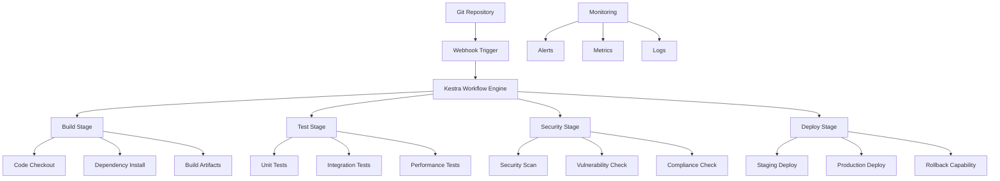

# CI/CD Guide

## Table of Contents
- [Overview](#overview)
- [Kestra Workflow Engine](#kestra-workflow-engine)
- [Pipeline Configuration](#pipeline-configuration)
- [Automated Testing Integration](#automated-testing-integration)
- [Deployment Automation](#deployment-automation)
- [Environment Management](#environment-management)
- [Security and Compliance](#security-and-compliance)
- [Monitoring and Observability](#monitoring-and-observability)
- [Troubleshooting](#troubleshooting)

## Overview

GraphMemory-IDE uses Kestra as the primary workflow orchestration engine for CI/CD operations. This guide covers the complete CI/CD pipeline setup, from code commit to production deployment, including automated testing, security scanning, and deployment strategies.

### CI/CD Architecture



### Key Features

- **Automated Pipelines**: Triggered by Git events (push, PR, tag)
- **Multi-Environment**: Development, staging, and production deployments
- **Security Integration**: Automated security scanning and compliance checks
- **Testing Automation**: Comprehensive test suite execution
- **Deployment Strategies**: Blue-green, rolling, and canary deployments
- **Rollback Capabilities**: Automated rollback on failure detection
- **Monitoring Integration**: Real-time pipeline monitoring and alerting

## Kestra Workflow Engine

### Configuration

```yaml
# kestra.yml
kestra:
  server:
    port: 8081
  datasources:
    postgres:
      url: jdbc:postgresql://postgres:5432/kestra
      username: kestra
      password: kestra
  storage:
    type: local
    local:
      base-path: /app/storage
  queue:
    type: postgres
  repository:
    type: postgres
  secret:
    type: postgres
```

### Core Workflows

#### 1. Main CI/CD Pipeline

```yaml
# .kestra/flows/main-pipeline.yml
id: graphmemory-main-pipeline
namespace: graphmemory.cicd

inputs:
  - name: repository
    type: STRING
    defaults: "https://github.com/elementalcollision/GraphMemory-IDE.git"
  - name: branch
    type: STRING
    defaults: "main"
  - name: environment
    type: STRING
    defaults: "staging"

tasks:
  - id: checkout
    type: io.kestra.core.tasks.flows.WorkingDirectory
    tasks:
      - id: clone
        type: io.kestra.plugin.git.Clone
        url: "{{ inputs.repository }}"
        branch: "{{ inputs.branch }}"
        
      - id: build
        type: io.kestra.core.tasks.scripts.Bash
        script: |
          echo "Building GraphMemory-IDE..."
          npm install
          npm run build
          docker build -t graphmemory/mcp-server:{{ execution.id }} .
          
      - id: test
        type: io.kestra.core.tasks.flows.Parallel
        tasks:
          - id: unit-tests
            type: io.kestra.core.tasks.scripts.Bash
            script: |
              echo "Running unit tests..."
              npm test
              
          - id: integration-tests
            type: io.kestra.core.tasks.scripts.Bash
            script: |
              echo "Running integration tests..."
              npm run test:integration
              
          - id: security-tests
            type: io.kestra.core.tasks.scripts.Bash
            script: |
              echo "Running security tests..."
              npm run test:security
              
      - id: security-scan
        type: io.kestra.core.tasks.scripts.Bash
        script: |
          echo "Running security scan..."
          docker run --rm -v /var/run/docker.sock:/var/run/docker.sock \
            aquasec/trivy image graphmemory/mcp-server:{{ execution.id }}
            
      - id: deploy
        type: io.kestra.core.tasks.flows.Switch
        value: "{{ inputs.environment }}"
        cases:
          staging:
            - id: deploy-staging
              type: io.kestra.core.tasks.scripts.Bash
              script: |
                echo "Deploying to staging..."
                ./scripts/deploy-staging.sh {{ execution.id }}
                
          production:
            - id: deploy-production
              type: io.kestra.core.tasks.scripts.Bash
              script: |
                echo "Deploying to production..."
                ./scripts/deploy-production.sh {{ execution.id }}

triggers:
  - id: git-webhook
    type: io.kestra.core.models.triggers.types.Webhook
    key: "graphmemory-webhook-key"
    
  - id: scheduled-build
    type: io.kestra.core.models.triggers.types.Schedule
    cron: "0 2 * * *"  # Daily at 2 AM
```

#### 2. Feature Branch Pipeline

```yaml
# .kestra/flows/feature-pipeline.yml
id: graphmemory-feature-pipeline
namespace: graphmemory.cicd

inputs:
  - name: pull_request_number
    type: STRING
  - name: branch
    type: STRING

tasks:
  - id: checkout
    type: io.kestra.core.tasks.flows.WorkingDirectory
    tasks:
      - id: clone
        type: io.kestra.plugin.git.Clone
        url: "https://github.com/elementalcollision/GraphMemory-IDE.git"
        branch: "{{ inputs.branch }}"
        
      - id: build
        type: io.kestra.core.tasks.scripts.Bash
        script: |
          echo "Building feature branch..."
          npm install
          npm run build
          
      - id: test
        type: io.kestra.core.tasks.flows.Parallel
        tasks:
          - id: unit-tests
            type: io.kestra.core.tasks.scripts.Bash
            script: |
              npm test -- --coverage
              
          - id: lint
            type: io.kestra.core.tasks.scripts.Bash
            script: |
              npm run lint
              
          - id: type-check
            type: io.kestra.core.tasks.scripts.Bash
            script: |
              npm run type-check
              
      - id: comment-pr
        type: io.kestra.plugin.github.Comment
        repository: "elementalcollision/GraphMemory-IDE"
        pullRequestNumber: "{{ inputs.pull_request_number }}"
        comment: |
          ✅ CI Pipeline completed successfully!
          
          **Build Status**: ✅ Passed
          **Tests**: ✅ All tests passed
          **Coverage**: {{ outputs.coverage }}%
          **Lint**: ✅ No issues found

triggers:
  - id: pr-webhook
    type: io.kestra.core.models.triggers.types.Webhook
    key: "graphmemory-pr-webhook-key"
```

#### 3. Release Pipeline

```yaml
# .kestra/flows/release-pipeline.yml
id: graphmemory-release-pipeline
namespace: graphmemory.cicd

inputs:
  - name: tag
    type: STRING
  - name: release_notes
    type: STRING

tasks:
  - id: checkout
    type: io.kestra.core.tasks.flows.WorkingDirectory
    tasks:
      - id: clone
        type: io.kestra.plugin.git.Clone
        url: "https://github.com/elementalcollision/GraphMemory-IDE.git"
        tag: "{{ inputs.tag }}"
        
      - id: build-release
        type: io.kestra.core.tasks.scripts.Bash
        script: |
          echo "Building release {{ inputs.tag }}..."
          npm install --production
          npm run build:production
          
      - id: create-docker-images
        type: io.kestra.core.tasks.flows.Parallel
        tasks:
          - id: build-mcp-server
            type: io.kestra.core.tasks.scripts.Bash
            script: |
              docker build -t graphmemory/mcp-server:{{ inputs.tag }} \
                -t graphmemory/mcp-server:latest \
                -f docker/mcp-server/Dockerfile .
                
          - id: build-cli
            type: io.kestra.core.tasks.scripts.Bash
            script: |
              docker build -t graphmemory/cli:{{ inputs.tag }} \
                -t graphmemory/cli:latest \
                -f docker/cli/Dockerfile .
                
      - id: sign-images
        type: io.kestra.core.tasks.scripts.Bash
        script: |
          echo "Signing Docker images..."
          cosign sign graphmemory/mcp-server:{{ inputs.tag }}
          cosign sign graphmemory/cli:{{ inputs.tag }}
          
      - id: push-images
        type: io.kestra.core.tasks.scripts.Bash
        script: |
          echo "Pushing Docker images..."
          docker push graphmemory/mcp-server:{{ inputs.tag }}
          docker push graphmemory/mcp-server:latest
          docker push graphmemory/cli:{{ inputs.tag }}
          docker push graphmemory/cli:latest
          
      - id: create-github-release
        type: io.kestra.plugin.github.Release
        repository: "elementalcollision/GraphMemory-IDE"
        tag: "{{ inputs.tag }}"
        name: "GraphMemory-IDE {{ inputs.tag }}"
        body: "{{ inputs.release_notes }}"
        
      - id: deploy-production
        type: io.kestra.core.tasks.scripts.Bash
        script: |
          echo "Deploying release to production..."
          ./scripts/deploy-production.sh {{ inputs.tag }}

triggers:
  - id: tag-webhook
    type: io.kestra.core.models.triggers.types.Webhook
    key: "graphmemory-tag-webhook-key"
```

## Pipeline Configuration

### Environment Variables

```yaml
# .kestra/config/environments.yml
environments:
  development:
    GRAPHMEMORY_ENV: development
    LOG_LEVEL: debug
    MCP_PORT: 8080
    KESTRA_PORT: 8081
    
  staging:
    GRAPHMEMORY_ENV: staging
    LOG_LEVEL: info
    MCP_PORT: 8080
    KESTRA_PORT: 8081
    MTLS_ENABLED: true
    
  production:
    GRAPHMEMORY_ENV: production
    LOG_LEVEL: warn
    MCP_PORT: 8080
    KESTRA_PORT: 8081
    MTLS_ENABLED: true
    BACKUP_ENABLED: true
```

### Secrets Management

```yaml
# .kestra/flows/secrets-management.yml
id: graphmemory-secrets-management
namespace: graphmemory.security

tasks:
  - id: rotate-secrets
    type: io.kestra.core.tasks.scripts.Bash
    script: |
      echo "Rotating secrets..."
      
      # Generate new API keys
      NEW_API_KEY=$(openssl rand -hex 32)
      NEW_JWT_SECRET=$(openssl rand -hex 64)
      
      # Update secrets in environment
      kubectl create secret generic graphmemory-secrets \
        --from-literal=api-key=$NEW_API_KEY \
        --from-literal=jwt-secret=$NEW_JWT_SECRET \
        --dry-run=client -o yaml | kubectl apply -f -
        
      # Restart services to pick up new secrets
      kubectl rollout restart deployment/mcp-server
      kubectl rollout restart deployment/kestra

triggers:
  - id: weekly-rotation
    type: io.kestra.core.models.triggers.types.Schedule
    cron: "0 2 * * 0"  # Weekly on Sunday at 2 AM
```

### Quality Gates

```yaml
# .kestra/flows/quality-gates.yml
id: graphmemory-quality-gates
namespace: graphmemory.quality

tasks:
  - id: code-quality-check
    type: io.kestra.core.tasks.flows.Parallel
    tasks:
      - id: test-coverage
        type: io.kestra.core.tasks.scripts.Bash
        script: |
          COVERAGE=$(npm test -- --coverage --silent | grep "All files" | awk '{print $10}' | sed 's/%//')
          if [ "$COVERAGE" -lt 80 ]; then
            echo "Test coverage $COVERAGE% is below threshold (80%)"
            exit 1
          fi
          echo "Test coverage: $COVERAGE%"
          
      - id: code-complexity
        type: io.kestra.core.tasks.scripts.Bash
        script: |
          npm run complexity-check
          
      - id: security-audit
        type: io.kestra.core.tasks.scripts.Bash
        script: |
          npm audit --audit-level moderate
          
      - id: dependency-check
        type: io.kestra.core.tasks.scripts.Bash
        script: |
          npm run dependency-check
          
  - id: performance-check
    type: io.kestra.core.tasks.scripts.Bash
    script: |
      echo "Running performance tests..."
      npm run test:performance
      
      # Check response time threshold
      RESPONSE_TIME=$(curl -w "%{time_total}" -s -o /dev/null http://localhost:8080/health)
      if (( $(echo "$RESPONSE_TIME > 1.0" | bc -l) )); then
        echo "Response time $RESPONSE_TIME seconds exceeds threshold (1.0s)"
        exit 1
      fi
```

## Automated Testing Integration

### Test Configuration

```yaml
# .kestra/flows/test-automation.yml
id: graphmemory-test-automation
namespace: graphmemory.testing

tasks:
  - id: setup-test-environment
    type: io.kestra.core.tasks.scripts.Bash
    script: |
      echo "Setting up test environment..."
      docker-compose -f docker-compose.test.yml up -d
      sleep 30  # Wait for services to be ready
      
  - id: run-test-suite
    type: io.kestra.core.tasks.flows.Parallel
    tasks:
      - id: unit-tests
        type: io.kestra.core.tasks.scripts.Bash
        script: |
          echo "Running unit tests..."
          npm test -- --reporter=json --outputFile=test-results/unit-tests.json
          
      - id: integration-tests
        type: io.kestra.core.tasks.scripts.Bash
        script: |
          echo "Running integration tests..."
          npm run test:integration -- --reporter=json --outputFile=test-results/integration-tests.json
          
      - id: e2e-tests
        type: io.kestra.core.tasks.scripts.Bash
        script: |
          echo "Running end-to-end tests..."
          npm run test:e2e -- --reporter=json --outputFile=test-results/e2e-tests.json
          
      - id: performance-tests
        type: io.kestra.core.tasks.scripts.Bash
        script: |
          echo "Running performance tests..."
          npm run test:performance -- --reporter=json --outputFile=test-results/performance-tests.json
          
      - id: security-tests
        type: io.kestra.core.tasks.scripts.Bash
        script: |
          echo "Running security tests..."
          npm run test:security -- --reporter=json --outputFile=test-results/security-tests.json
          
  - id: generate-test-report
    type: io.kestra.core.tasks.scripts.Bash
    script: |
      echo "Generating test report..."
      npm run test:report
      
  - id: cleanup-test-environment
    type: io.kestra.core.tasks.scripts.Bash
    script: |
      echo "Cleaning up test environment..."
      docker-compose -f docker-compose.test.yml down -v
```

### Test Data Management

```yaml
# .kestra/flows/test-data-management.yml
id: graphmemory-test-data
namespace: graphmemory.testing

tasks:
  - id: setup-test-data
    type: io.kestra.core.tasks.scripts.Bash
    script: |
      echo "Setting up test data..."
      
      # Create test database
      docker-compose exec -T postgres createdb graphmemory_test
      
      # Load test fixtures
      npm run test:fixtures:load
      
  - id: seed-test-data
    type: io.kestra.core.tasks.scripts.Bash
    script: |
      echo "Seeding test data..."
      
      # Create test memories
      curl -X POST http://localhost:8080/api/memories \
        -H "Content-Type: application/json" \
        -d @tests/fixtures/test-memories.json
        
      # Create test relations
      curl -X POST http://localhost:8080/api/relations \
        -H "Content-Type: application/json" \
        -d @tests/fixtures/test-relations.json
        
  - id: cleanup-test-data
    type: io.kestra.core.tasks.scripts.Bash
    script: |
      echo "Cleaning up test data..."
      docker-compose exec -T postgres dropdb graphmemory_test
```

## Deployment Automation

### Deployment Strategies

#### Blue-Green Deployment

```yaml
# .kestra/flows/blue-green-deployment.yml
id: graphmemory-blue-green-deployment
namespace: graphmemory.deployment

inputs:
  - name: image_tag
    type: STRING
  - name: environment
    type: STRING
    defaults: "production"

tasks:
  - id: prepare-green-environment
    type: io.kestra.core.tasks.scripts.Bash
    script: |
      echo "Preparing green environment..."
      
      # Deploy to green environment
      kubectl set image deployment/mcp-server-green \
        mcp-server=graphmemory/mcp-server:{{ inputs.image_tag }}
        
      # Wait for rollout to complete
      kubectl rollout status deployment/mcp-server-green --timeout=300s
      
  - id: health-check-green
    type: io.kestra.core.tasks.scripts.Bash
    script: |
      echo "Performing health check on green environment..."
      
      # Wait for service to be ready
      sleep 30
      
      # Health check
      HEALTH_STATUS=$(curl -s -o /dev/null -w "%{http_code}" \
        http://mcp-server-green:8080/health)
        
      if [ "$HEALTH_STATUS" != "200" ]; then
        echo "Health check failed with status: $HEALTH_STATUS"
        exit 1
      fi
      
      echo "Green environment is healthy"
      
  - id: smoke-tests
    type: io.kestra.core.tasks.scripts.Bash
    script: |
      echo "Running smoke tests on green environment..."
      npm run test:smoke -- --target=green
      
  - id: switch-traffic
    type: io.kestra.core.tasks.scripts.Bash
    script: |
      echo "Switching traffic to green environment..."
      
      # Update service selector to point to green
      kubectl patch service mcp-server \
        -p '{"spec":{"selector":{"version":"green"}}}'
        
      echo "Traffic switched to green environment"
      
  - id: monitor-deployment
    type: io.kestra.core.tasks.scripts.Bash
    script: |
      echo "Monitoring deployment for 5 minutes..."
      
      for i in {1..30}; do
        HEALTH_STATUS=$(curl -s -o /dev/null -w "%{http_code}" \
          http://mcp-server:8080/health)
          
        if [ "$HEALTH_STATUS" != "200" ]; then
          echo "Health check failed, initiating rollback..."
          kubectl patch service mcp-server \
            -p '{"spec":{"selector":{"version":"blue"}}}'
          exit 1
        fi
        
        sleep 10
      done
      
      echo "Deployment monitoring completed successfully"
      
  - id: cleanup-blue-environment
    type: io.kestra.core.tasks.scripts.Bash
    script: |
      echo "Cleaning up blue environment..."
      kubectl delete deployment mcp-server-blue
```

#### Rolling Deployment

```yaml
# .kestra/flows/rolling-deployment.yml
id: graphmemory-rolling-deployment
namespace: graphmemory.deployment

inputs:
  - name: image_tag
    type: STRING
  - name: replicas
    type: INT
    defaults: 3

tasks:
  - id: rolling-update
    type: io.kestra.core.tasks.scripts.Bash
    script: |
      echo "Starting rolling update..."
      
      # Update deployment with new image
      kubectl set image deployment/mcp-server \
        mcp-server=graphmemory/mcp-server:{{ inputs.image_tag }}
        
      # Configure rolling update strategy
      kubectl patch deployment mcp-server -p '{
        "spec": {
          "strategy": {
            "type": "RollingUpdate",
            "rollingUpdate": {
              "maxUnavailable": 1,
              "maxSurge": 1
            }
          }
        }
      }'
      
      # Wait for rollout to complete
      kubectl rollout status deployment/mcp-server --timeout=600s
      
  - id: verify-deployment
    type: io.kestra.core.tasks.scripts.Bash
    script: |
      echo "Verifying deployment..."
      
      # Check all pods are running
      READY_PODS=$(kubectl get pods -l app=mcp-server -o jsonpath='{.items[?(@.status.phase=="Running")].metadata.name}' | wc -w)
      
      if [ "$READY_PODS" -ne "{{ inputs.replicas }}" ]; then
        echo "Expected {{ inputs.replicas }} pods, but only $READY_PODS are ready"
        exit 1
      fi
      
      echo "All pods are running successfully"
```

### Environment Promotion

```yaml
# .kestra/flows/environment-promotion.yml
id: graphmemory-environment-promotion
namespace: graphmemory.deployment

inputs:
  - name: source_environment
    type: STRING
  - name: target_environment
    type: STRING
  - name: image_tag
    type: STRING

tasks:
  - id: validate-source
    type: io.kestra.core.tasks.scripts.Bash
    script: |
      echo "Validating source environment: {{ inputs.source_environment }}"
      
      # Check source environment health
      HEALTH_STATUS=$(curl -s -o /dev/null -w "%{http_code}" \
        "http://{{ inputs.source_environment }}.graphmemory.dev/health")
        
      if [ "$HEALTH_STATUS" != "200" ]; then
        echo "Source environment is not healthy"
        exit 1
      fi
      
  - id: backup-target
    type: io.kestra.core.tasks.scripts.Bash
    script: |
      echo "Creating backup of target environment..."
      ./scripts/backup.sh --environment={{ inputs.target_environment }}
      
  - id: promote-image
    type: io.kestra.core.tasks.scripts.Bash
    script: |
      echo "Promoting image to {{ inputs.target_environment }}..."
      
      # Tag image for target environment
      docker tag graphmemory/mcp-server:{{ inputs.image_tag }} \
        graphmemory/mcp-server:{{ inputs.target_environment }}-latest
        
      # Push to registry
      docker push graphmemory/mcp-server:{{ inputs.target_environment }}-latest
      
  - id: deploy-to-target
    type: io.kestra.core.tasks.scripts.Bash
    script: |
      echo "Deploying to {{ inputs.target_environment }}..."
      ./scripts/deploy.sh \
        --environment={{ inputs.target_environment }} \
        --image-tag={{ inputs.image_tag }}
        
  - id: post-deployment-tests
    type: io.kestra.core.tasks.scripts.Bash
    script: |
      echo "Running post-deployment tests..."
      npm run test:smoke -- --environment={{ inputs.target_environment }}
```

## Environment Management

### Infrastructure as Code

```yaml
# .kestra/flows/infrastructure-management.yml
id: graphmemory-infrastructure
namespace: graphmemory.infrastructure

tasks:
  - id: validate-terraform
    type: io.kestra.core.tasks.scripts.Bash
    script: |
      echo "Validating Terraform configuration..."
      cd infrastructure/
      terraform init
      terraform validate
      terraform plan -out=tfplan
      
  - id: apply-infrastructure
    type: io.kestra.core.tasks.scripts.Bash
    script: |
      echo "Applying infrastructure changes..."
      cd infrastructure/
      terraform apply tfplan
      
  - id: update-dns
    type: io.kestra.core.tasks.scripts.Bash
    script: |
      echo "Updating DNS records..."
      # Update DNS records based on new infrastructure
      ./scripts/update-dns.sh
```

### Configuration Management

```yaml
# .kestra/flows/configuration-management.yml
id: graphmemory-configuration
namespace: graphmemory.config

tasks:
  - id: validate-config
    type: io.kestra.core.tasks.scripts.Bash
    script: |
      echo "Validating configuration..."
      
      # Validate Kubernetes manifests
      kubectl apply --dry-run=client -f k8s/
      
      # Validate Docker Compose files
      docker-compose -f docker-compose.yml config
      
  - id: apply-config
    type: io.kestra.core.tasks.scripts.Bash
    script: |
      echo "Applying configuration..."
      kubectl apply -f k8s/
      
  - id: restart-services
    type: io.kestra.core.tasks.scripts.Bash
    script: |
      echo "Restarting services to pick up new configuration..."
      kubectl rollout restart deployment/mcp-server
      kubectl rollout restart deployment/kestra
```

## Security and Compliance

### Security Scanning Pipeline

```yaml
# .kestra/flows/security-scanning.yml
id: graphmemory-security-scanning
namespace: graphmemory.security

tasks:
  - id: dependency-scan
    type: io.kestra.core.tasks.scripts.Bash
    script: |
      echo "Scanning dependencies for vulnerabilities..."
      npm audit --audit-level moderate
      
  - id: container-scan
    type: io.kestra.core.tasks.scripts.Bash
    script: |
      echo "Scanning container images..."
      docker run --rm -v /var/run/docker.sock:/var/run/docker.sock \
        aquasec/trivy image --severity HIGH,CRITICAL \
        graphmemory/mcp-server:latest
        
  - id: code-scan
    type: io.kestra.core.tasks.scripts.Bash
    script: |
      echo "Scanning code for security issues..."
      npm run security:scan
      
  - id: secrets-scan
    type: io.kestra.core.tasks.scripts.Bash
    script: |
      echo "Scanning for exposed secrets..."
      docker run --rm -v $(pwd):/src \
        trufflesecurity/trufflehog:latest filesystem /src
        
  - id: compliance-check
    type: io.kestra.core.tasks.scripts.Bash
    script: |
      echo "Running compliance checks..."
      ./scripts/compliance-check.sh

triggers:
  - id: daily-security-scan
    type: io.kestra.core.models.triggers.types.Schedule
    cron: "0 3 * * *"  # Daily at 3 AM
```

### Compliance Reporting

```yaml
# .kestra/flows/compliance-reporting.yml
id: graphmemory-compliance-reporting
namespace: graphmemory.compliance

tasks:
  - id: generate-compliance-report
    type: io.kestra.core.tasks.scripts.Bash
    script: |
      echo "Generating compliance report..."
      
      # Generate security report
      ./scripts/generate-security-report.sh
      
      # Generate audit log report
      ./scripts/generate-audit-report.sh
      
      # Generate access control report
      ./scripts/generate-access-report.sh
      
  - id: upload-reports
    type: io.kestra.core.tasks.scripts.Bash
    script: |
      echo "Uploading compliance reports..."
      aws s3 cp compliance-reports/ \
        s3://graphmemory-compliance/reports/$(date +%Y-%m-%d)/ \
        --recursive

triggers:
  - id: monthly-compliance-report
    type: io.kestra.core.models.triggers.types.Schedule
    cron: "0 0 1 * *"  # Monthly on the 1st at midnight
```

## Monitoring and Observability

### Pipeline Monitoring

```yaml
# .kestra/flows/pipeline-monitoring.yml
id: graphmemory-pipeline-monitoring
namespace: graphmemory.monitoring

tasks:
  - id: collect-metrics
    type: io.kestra.core.tasks.scripts.Bash
    script: |
      echo "Collecting pipeline metrics..."
      
      # Collect build metrics
      BUILD_TIME=$(cat build-metrics.json | jq '.build_time')
      TEST_COVERAGE=$(cat test-results.json | jq '.coverage')
      
      # Send metrics to monitoring system
      curl -X POST http://prometheus:9091/metrics/job/pipeline \
        -d "build_time $BUILD_TIME"
      curl -X POST http://prometheus:9091/metrics/job/pipeline \
        -d "test_coverage $TEST_COVERAGE"
        
  - id: check-sla
    type: io.kestra.core.tasks.scripts.Bash
    script: |
      echo "Checking SLA compliance..."
      
      # Check build time SLA (< 10 minutes)
      if [ "$BUILD_TIME" -gt 600 ]; then
        echo "Build time SLA violation: ${BUILD_TIME}s > 600s"
        # Send alert
        curl -X POST http://alertmanager:9093/api/v1/alerts \
          -d '[{"labels":{"alertname":"BuildTimeSLA","severity":"warning"}}]'
      fi

triggers:
  - id: post-pipeline-monitoring
    type: io.kestra.core.models.triggers.types.Flow
    flowId: graphmemory-main-pipeline
```

### Performance Monitoring

```yaml
# .kestra/flows/performance-monitoring.yml
id: graphmemory-performance-monitoring
namespace: graphmemory.monitoring

tasks:
  - id: performance-test
    type: io.kestra.core.tasks.scripts.Bash
    script: |
      echo "Running performance tests..."
      
      # Load test
      npm run test:load
      
      # Stress test
      npm run test:stress
      
      # Endurance test
      npm run test:endurance
      
  - id: analyze-results
    type: io.kestra.core.tasks.scripts.Bash
    script: |
      echo "Analyzing performance results..."
      
      # Check response time thresholds
      AVG_RESPONSE_TIME=$(cat performance-results.json | jq '.avg_response_time')
      
      if (( $(echo "$AVG_RESPONSE_TIME > 1000" | bc -l) )); then
        echo "Performance degradation detected"
        # Trigger alert
        ./scripts/send-alert.sh "Performance degradation: ${AVG_RESPONSE_TIME}ms"
      fi

triggers:
  - id: nightly-performance-test
    type: io.kestra.core.models.triggers.types.Schedule
    cron: "0 1 * * *"  # Daily at 1 AM
```

## Troubleshooting

### Common Pipeline Issues

#### Build Failures

```yaml
# .kestra/flows/troubleshoot-build.yml
id: graphmemory-troubleshoot-build
namespace: graphmemory.troubleshooting

tasks:
  - id: diagnose-build-failure
    type: io.kestra.core.tasks.scripts.Bash
    script: |
      echo "Diagnosing build failure..."
      
      # Check disk space
      df -h
      
      # Check memory usage
      free -h
      
      # Check Docker daemon
      docker info
      
      # Check build logs
      tail -n 100 build.log
      
  - id: cleanup-build-cache
    type: io.kestra.core.tasks.scripts.Bash
    script: |
      echo "Cleaning up build cache..."
      
      # Clean npm cache
      npm cache clean --force
      
      # Clean Docker cache
      docker system prune -f
      
      # Clean workspace
      rm -rf node_modules/
      rm -rf dist/
```

#### Test Failures

```yaml
# .kestra/flows/troubleshoot-tests.yml
id: graphmemory-troubleshoot-tests
namespace: graphmemory.troubleshooting

tasks:
  - id: analyze-test-failures
    type: io.kestra.core.tasks.scripts.Bash
    script: |
      echo "Analyzing test failures..."
      
      # Parse test results
      FAILED_TESTS=$(cat test-results.json | jq '.failures[].title')
      
      echo "Failed tests:"
      echo "$FAILED_TESTS"
      
      # Check test environment
      docker-compose -f docker-compose.test.yml ps
      
  - id: retry-flaky-tests
    type: io.kestra.core.tasks.scripts.Bash
    script: |
      echo "Retrying flaky tests..."
      npm run test:retry-failed
```

#### Deployment Issues

```yaml
# .kestra/flows/troubleshoot-deployment.yml
id: graphmemory-troubleshoot-deployment
namespace: graphmemory.troubleshooting

tasks:
  - id: diagnose-deployment
    type: io.kestra.core.tasks.scripts.Bash
    script: |
      echo "Diagnosing deployment issues..."
      
      # Check pod status
      kubectl get pods -l app=mcp-server
      
      # Check events
      kubectl get events --sort-by=.metadata.creationTimestamp
      
      # Check logs
      kubectl logs -l app=mcp-server --tail=100
      
  - id: rollback-deployment
    type: io.kestra.core.tasks.scripts.Bash
    script: |
      echo "Rolling back deployment..."
      kubectl rollout undo deployment/mcp-server
      kubectl rollout status deployment/mcp-server
```

### Debug Workflows

```yaml
# .kestra/flows/debug-workflow.yml
id: graphmemory-debug-workflow
namespace: graphmemory.debug

inputs:
  - name: execution_id
    type: STRING
  - name: debug_level
    type: STRING
    defaults: "info"

tasks:
  - id: collect-debug-info
    type: io.kestra.core.tasks.scripts.Bash
    script: |
      echo "Collecting debug information for execution {{ inputs.execution_id }}..."
      
      # Collect system information
      uname -a > debug-info.txt
      docker version >> debug-info.txt
      kubectl version >> debug-info.txt
      
      # Collect logs
      kubectl logs -l app=mcp-server --since=1h > mcp-server-logs.txt
      kubectl logs -l app=kestra --since=1h > kestra-logs.txt
      
      # Collect metrics
      curl -s http://prometheus:9090/api/v1/query?query=up > metrics.json
      
  - id: generate-debug-report
    type: io.kestra.core.tasks.scripts.Bash
    script: |
      echo "Generating debug report..."
      
      # Create debug report
      cat > debug-report.md << EOF
      # Debug Report for Execution {{ inputs.execution_id }}
      
      ## System Information
      \`\`\`
      $(cat debug-info.txt)
      \`\`\`
      
      ## Recent Logs
      ### MCP Server
      \`\`\`
      $(tail -n 50 mcp-server-logs.txt)
      \`\`\`
      
      ### Kestra
      \`\`\`
      $(tail -n 50 kestra-logs.txt)
      \`\`\`
      
      ## Metrics
      \`\`\`json
      $(cat metrics.json)
      \`\`\`
      EOF
      
      echo "Debug report generated: debug-report.md"
```

---

## Best Practices

### Pipeline Design
1. **Keep pipelines simple and focused**
2. **Use parallel execution where possible**
3. **Implement proper error handling and rollback**
4. **Use environment-specific configurations**
5. **Implement comprehensive testing at each stage**

### Security
1. **Scan for vulnerabilities at every stage**
2. **Use signed container images**
3. **Implement least privilege access**
4. **Rotate secrets regularly**
5. **Audit all pipeline activities**

### Monitoring
1. **Monitor pipeline performance and SLAs**
2. **Set up alerts for failures and degradation**
3. **Track deployment frequency and success rates**
4. **Monitor application health post-deployment**
5. **Implement comprehensive logging**

For additional CI/CD guidance, refer to the [operations guide](OPERATIONS.md) and [security documentation](../SECURITY.md). 