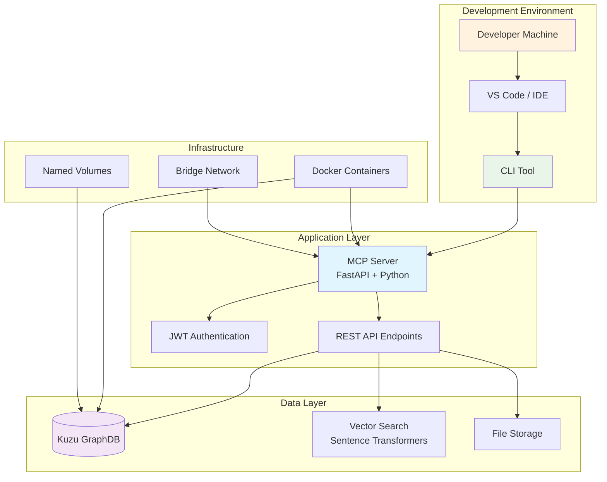

# GraphMemory-IDE Developer Guide

## 🚀 Welcome to GraphMemory-IDE Development

This comprehensive guide will help you get started with GraphMemory-IDE development, understand the codebase architecture, and contribute effectively to the project.

## 📋 Table of Contents

- [Quick Start](#quick-start)
- [Development Environment Setup](#development-environment-setup)
- [Architecture Overview](#architecture-overview)
- [Code Organization](#code-organization)
- [Development Workflow](#development-workflow)
- [Testing Guide](#testing-guide)
- [Debugging](#debugging)
- [Contributing](#contributing)
- [Best Practices](#best-practices)

## 🚀 Quick Start

### Prerequisites

Before you begin, ensure you have:

- **Node.js 18+**: For CLI development and tooling
- **Python 3.11+**: For MCP server development
- **Docker Desktop or OrbStack**: For containerized development
- **Git**: For version control
- **VS Code** (recommended): With Python and Docker extensions

### 5-Minute Setup

```bash
# 1. Clone the repository
git clone https://github.com/elementalcollision/GraphMemory-IDE.git
cd GraphMemory-IDE

# 2. Set up Python environment
python3 -m venv .venv
source .venv/bin/activate  # On Windows: .venv\Scripts\activate

# 3. Install Python dependencies
pip install --upgrade pip
pip install -r requirements.txt

# 4. Install Node.js dependencies
npm install

# 5. Start development environment
docker compose -f docker/docker-compose.yml up -d

# 6. Run tests to verify setup
PYTHONPATH=. pytest server/ -v
npm test
```

**Verify Installation:**
- MCP Server: http://localhost:8080/docs
- Kestra CI/CD: http://localhost:8081
- All tests passing

## 🛠️ Development Environment Setup

### Python Development Environment

#### Virtual Environment Setup

```bash
# Create virtual environment
python3 -m venv .venv

# Activate virtual environment
source .venv/bin/activate  # macOS/Linux
# .venv\Scripts\activate   # Windows

# Verify Python version
python --version  # Should be 3.11+

# Install dependencies
pip install --upgrade pip
pip install -r requirements.txt
pip install -r requirements-dev.txt  # Development dependencies
```

#### IDE Configuration (VS Code)

Create `.vscode/settings.json`:

```json
{
  "python.defaultInterpreterPath": "./.venv/bin/python",
  "python.terminal.activateEnvironment": true,
  "python.linting.enabled": true,
  "python.linting.pylintEnabled": true,
  "python.linting.flake8Enabled": true,
  "python.formatting.provider": "black",
  "python.testing.pytestEnabled": true,
  "python.testing.pytestArgs": ["server/"],
  "files.exclude": {
    "**/__pycache__": true,
    "**/*.pyc": true
  }
}
```

#### Environment Variables

Create `.env` file for development:

```bash
# Database Configuration
KUZU_DB_PATH=./server/data
KUZU_READ_ONLY=false

# JWT Configuration
JWT_SECRET_KEY=dev-secret-key-change-in-production
JWT_ALGORITHM=HS256
JWT_ACCESS_TOKEN_EXPIRE_MINUTES=30
JWT_ENABLED=true

# Security Configuration
MTLS_ENABLED=false
CERT_DIR=./certs

# Development Settings
DEBUG=true
LOG_LEVEL=DEBUG
```

### Node.js Development Environment

#### CLI Development Setup

```bash
# Install Node.js dependencies
npm install

# Install CLI globally for testing
npm link

# Verify CLI installation
graphmemory --help

# Run CLI tests
npm test
npm run test:coverage
```

#### CLI Development Dependencies

Key packages for CLI development:

```json
{
  "dependencies": {
    "commander": "^11.0.0",
    "chalk": "^5.3.0",
    "inquirer": "^9.2.0",
    "node-fetch": "^3.3.0",
    "atomically": "^2.0.0",
    "proper-lockfile": "^4.1.2",
    "semver": "^7.5.0"
  },
  "devDependencies": {
    "vitest": "^1.0.0",
    "@vitest/coverage-v8": "^1.0.0",
    "eslint": "^8.50.0"
  }
}
```

### Docker Development Environment

#### Development Compose Configuration

Create `docker-compose.dev.yml` for development:

```yaml
version: '3.8'

services:
  mcp-server:
    build:
      context: .
      dockerfile: docker/mcp-server/Dockerfile
      target: development  # Development stage
    ports:
      - "8080:8080"
      - "5678:5678"  # Debugger port
    volumes:
      - ./server:/app/server:ro
      - ./data:/app/data
      - ./logs:/var/log/mcp
    environment:
      - DEBUG=true
      - PYTHONPATH=/app
    command: python -m debugpy --listen 0.0.0.0:5678 --wait-for-client -m uvicorn server.main:app --host 0.0.0.0 --port 8080 --reload

  kuzu-db:
    image: kuzudb/kuzu:latest
    volumes:
      - kuzu-dev-data:/data
    environment:
      - KUZU_DEBUG=true

volumes:
  kuzu-dev-data:
```

#### Development Commands

```bash
# Start development environment
docker compose -f docker-compose.dev.yml up -d

# View logs
docker compose -f docker-compose.dev.yml logs -f mcp-server

# Rebuild after changes
docker compose -f docker-compose.dev.yml build --no-cache mcp-server

# Clean development environment
docker compose -f docker-compose.dev.yml down -v
```

## 🏗️ Architecture Overview

### System Architecture



### Component Responsibilities

#### MCP Server (`server/`)
- **Purpose**: Core API server providing AI memory capabilities
- **Technology**: FastAPI, Python 3.11+
- **Responsibilities**:
  - REST API endpoints for telemetry and vector search
  - JWT authentication and authorization
  - Kuzu database integration
  - Vector search with sentence transformers
  - Request validation and error handling

#### CLI Tool (`cli/`)
- **Purpose**: Command-line interface for installation, upgrades, and diagnostics
- **Technology**: Node.js 18+, Commander.js
- **Responsibilities**:
  - System installation and setup
  - Enterprise-grade update system with signature verification
  - Health checks and diagnostics
  - Docker container management
  - Database backup and migration

#### Docker Infrastructure (`docker/`)
- **Purpose**: Containerized deployment and development environment
- **Technology**: Docker Compose, multi-stage Dockerfiles
- **Responsibilities**:
  - Production-ready container images
  - Security hardening (read-only filesystems, non-root users)
  - Volume management and persistence
  - Network isolation and security

## 📁 Code Organization

### Project Structure

```
GraphMemory-IDE/
├── server/                 # MCP Server (Python/FastAPI)
│   ├── main.py            # FastAPI application entry point
│   ├── auth.py            # JWT authentication logic
│   ├── models.py          # Pydantic data models
│   ├── mtls_config.py     # mTLS configuration
│   ├── init_db.py         # Database initialization
│   ├── test_main.py       # Server tests
│   └── data/              # Database files (development)
├── cli/                   # CLI Tool (Node.js)
│   ├── index.mjs          # CLI entry point
│   ├── commands.mjs       # Command implementations
│   ├── update/            # Enterprise update system
│   │   ├── signature-verifier.mjs
│   │   ├── state-manager.mjs
│   │   ├── database-migrator.mjs
│   │   ├── container-updater.mjs
│   │   └── update-flow.mjs
│   └── index.test.mjs     # CLI tests
├── docker/                # Docker configuration
│   ├── docker-compose.yml # Production deployment
│   ├── mcp-server/        # MCP server container
│   │   └── Dockerfile     # Multi-stage build
│   ├── security/          # Security configurations
│   │   └── seccomp-profile.json
│   └── scripts/           # Deployment scripts
├── docs/                  # Documentation
│   ├── DEVELOPER_GUIDE.md # This file
│   ├── USER_GUIDE.md      # User documentation
│   └── tutorials/         # Step-by-step tutorials
├── tests/                 # Integration tests
│   └── test_security.py   # Security test suite
├── monitoring/            # Monitoring and alerting
│   └── resource-monitor.sh
├── scripts/               # Automation scripts
│   ├── deploy-secure.sh   # Secure deployment
│   └── setup-mtls.sh      # mTLS certificate setup
└── .context/              # Aegis framework (project management)
    ├── tasks/             # Task management
    ├── decisions/         # Decision records
    └── memory/            # Project memory
```

### Key Files and Their Purpose

#### Server Components

| File | Purpose | Key Functions |
|------|---------|---------------|
| `server/main.py` | FastAPI application | API endpoints, middleware, startup |
| `server/auth.py` | Authentication | JWT token creation/validation |
| `server/models.py` | Data models | Pydantic schemas for API |
| `server/mtls_config.py` | mTLS setup | SSL context, certificate validation |
| `server/init_db.py` | Database setup | Kuzu initialization, schema creation |

#### CLI Components

| File | Purpose | Key Functions |
|------|---------|---------------|
| `cli/index.mjs` | CLI entry point | Command registration, help system |
| `cli/commands.mjs` | Command logic | Install, upgrade, diagnostics, health |
| `cli/update/signature-verifier.mjs` | Security | Cosign signature verification |
| `cli/update/state-manager.mjs` | State management | Atomic operations, file locking |
| `cli/update/database-migrator.mjs` | DB migration | Kuzu export/import, backups |
| `cli/update/container-updater.mjs` | Container updates | Blue-Green deployment |
| `cli/update/update-flow.mjs` | Update orchestration | Complete update workflow |

#### Infrastructure Components

| File | Purpose | Key Functions |
|------|---------|---------------|
| `docker/docker-compose.yml` | Service orchestration | Container definitions, networking |
| `docker/mcp-server/Dockerfile` | Container build | Multi-stage build, security hardening |
| `docker/security/seccomp-profile.json` | Security | System call restrictions |
| `scripts/deploy-secure.sh` | Deployment | Automated secure deployment |
| `scripts/setup-mtls.sh` | Certificate management | PKI setup, certificate generation |

## 🔄 Development Workflow

### Git Workflow

#### Branch Strategy

```bash
# Main branches
main          # Production-ready code
develop       # Integration branch for features

# Feature branches
feature/task-xxx-description
bugfix/issue-description
hotfix/critical-fix
```

#### Development Process

1. **Create Feature Branch**:
   ```bash
   git checkout develop
   git pull origin develop
   git checkout -b feature/task-011-documentation
   ```

2. **Make Changes**:
   ```bash
   # Make your changes
   git add .
   git commit -m "feat: add comprehensive developer guide
   
   - Create detailed development environment setup
   - Add architecture overview and code organization
   - Include testing and debugging procedures
   - Add contribution workflow examples"
   ```

3. **Test Changes**:
   ```bash
   # Run all tests
   PYTHONPATH=. pytest server/ -v
   npm test
   
   # Test Docker build
   docker compose -f docker/docker-compose.yml build
   
   # Test deployment
   ./scripts/deploy-secure.sh validate
   ```

4. **Submit Pull Request**:
   ```bash
   git push origin feature/task-011-documentation
   # Create PR via GitHub interface
   ```

### Commit Message Convention

Follow conventional commits format:

```
<type>(<scope>): <description>

[optional body]

[optional footer(s)]
```

**Types:**
- `feat`: New feature
- `fix`: Bug fix
- `docs`: Documentation changes
- `style`: Code style changes
- `refactor`: Code refactoring
- `test`: Adding or updating tests
- `chore`: Maintenance tasks

**Examples:**
```bash
feat(cli): add enterprise update system with signature verification
fix(server): resolve JWT token expiration handling
docs(api): add comprehensive endpoint documentation
test(security): add mTLS authentication test suite
```

### Code Review Process

#### Before Submitting PR

1. **Self-Review Checklist**:
   - [ ] All tests pass
   - [ ] Code follows style guidelines
   - [ ] Documentation updated
   - [ ] No sensitive data in commits
   - [ ] Docker builds successfully

2. **Testing Checklist**:
   - [ ] Unit tests pass
   - [ ] Integration tests pass
   - [ ] Security tests pass
   - [ ] Manual testing completed

#### PR Requirements

- **Clear Description**: Explain what changes were made and why
- **Test Coverage**: Include tests for new functionality
- **Documentation**: Update relevant documentation
- **Breaking Changes**: Clearly mark any breaking changes
- **Screenshots**: Include screenshots for UI changes

## 🧪 Testing Guide

### Test Structure

```
tests/
├── server/
│   ├── test_main.py       # API endpoint tests
│   ├── test_auth.py       # Authentication tests
│   └── test_models.py     # Data model tests
├── cli/
│   ├── index.test.mjs     # CLI command tests
│   └── update/
│       ├── test_signature_verifier.mjs
│       ├── test_state_manager.mjs
│       └── test_update_flow.mjs
├── integration/
│   ├── test_security.py   # Security integration tests
│   └── test_deployment.py # Deployment tests
└── e2e/
    ├── test_user_workflows.py
    └── test_api_integration.py
```

### Running Tests

#### Python Tests

```bash
# Run all server tests
PYTHONPATH=. pytest server/ -v

# Run with coverage
PYTHONPATH=. pytest server/ --cov=server --cov-report=html

# Run specific test file
PYTHONPATH=. pytest server/test_main.py -v

# Run specific test
PYTHONPATH=. pytest server/test_main.py::test_ingest_telemetry -v

# Run security tests
pytest tests/test_security.py -v
```

#### Node.js Tests

```bash
# Run all CLI tests
npm test

# Run with coverage
npm run test:coverage

# Run specific test file
npx vitest run cli/index.test.mjs

# Watch mode for development
npm run test:watch
```

#### Integration Tests

```bash
# Run Docker integration tests
docker compose -f docker/docker-compose.yml up -d
pytest tests/integration/ -v
docker compose -f docker/docker-compose.yml down

# Run security tests
./scripts/deploy-secure.sh
pytest tests/test_security.py -v
```

### Writing Tests

#### Python Test Example

```python
# server/test_example.py
import pytest
from fastapi.testclient import TestClient
from server.main import app

client = TestClient(app)

def test_create_telemetry_event():
    """Test telemetry event creation."""
    event_data = {
        "event_type": "file_open",
        "file_path": "/test/file.py",
        "timestamp": "2025-01-28T12:41:19Z",
        "metadata": {"language": "python"}
    }
    
    response = client.post("/telemetry/ingest", json=event_data)
    
    assert response.status_code == 200
    assert response.json()["status"] == "success"
    assert "event_id" in response.json()

@pytest.fixture
def auth_headers():
    """Fixture for authenticated requests."""
    token_response = client.post("/auth/token", data={
        "username": "testuser",
        "password": "testpassword"
    })
    token = token_response.json()["access_token"]
    return {"Authorization": f"Bearer {token}"}

def test_authenticated_endpoint(auth_headers):
    """Test endpoint requiring authentication."""
    response = client.get("/telemetry/events", headers=auth_headers)
    assert response.status_code == 200
```

#### Node.js Test Example

```javascript
// cli/test_example.mjs
import { describe, it, expect, vi } from 'vitest';
import { install, upgrade, health } from './commands.mjs';

describe('CLI Commands', () => {
  it('should check system requirements for install', async () => {
    const mockDeps = {
      execSync: vi.fn().mockReturnValue('Docker version 20.10.0'),
      inquirer: {
        prompt: vi.fn().mockResolvedValue({ confirm: true })
      }
    };
    
    const result = await install({}, mockDeps);
    
    expect(result.success).toBe(true);
    expect(mockDeps.execSync).toHaveBeenCalledWith('docker --version');
  });

  it('should handle upgrade with signature verification', async () => {
    const mockDeps = {
      execSync: vi.fn(),
      fetch: vi.fn().mockResolvedValue({
        ok: true,
        json: () => Promise.resolve({ version: '1.2.0' })
      })
    };
    
    const result = await upgrade({ verifySignatures: true }, mockDeps);
    
    expect(result.success).toBe(true);
    expect(result.version).toBe('1.2.0');
  });
});
```

### Test Coverage Goals

- **Unit Tests**: >90% code coverage
- **Integration Tests**: All major workflows covered
- **Security Tests**: All security features validated
- **E2E Tests**: Critical user journeys tested

## 🐛 Debugging

### Python Debugging

#### VS Code Debugging

Create `.vscode/launch.json`:

```json
{
  "version": "0.2.0",
  "configurations": [
    {
      "name": "Debug MCP Server",
      "type": "python",
      "request": "launch",
      "program": "${workspaceFolder}/.venv/bin/uvicorn",
      "args": ["server.main:app", "--host", "0.0.0.0", "--port", "8080", "--reload"],
      "console": "integratedTerminal",
      "cwd": "${workspaceFolder}",
      "env": {
        "PYTHONPATH": "${workspaceFolder}"
      }
    },
    {
      "name": "Debug Tests",
      "type": "python",
      "request": "launch",
      "module": "pytest",
      "args": ["server/test_main.py", "-v"],
      "console": "integratedTerminal",
      "cwd": "${workspaceFolder}",
      "env": {
        "PYTHONPATH": "${workspaceFolder}"
      }
    }
  ]
}
```

#### Remote Debugging (Docker)

```python
# Add to server/main.py for development
import debugpy

if os.getenv("DEBUG") == "true":
    debugpy.listen(("0.0.0.0", 5678))
    print("Waiting for debugger attach...")
    debugpy.wait_for_client()
```

#### Logging Configuration

```python
# server/logging_config.py
import logging
import sys

def setup_logging():
    logging.basicConfig(
        level=logging.DEBUG if os.getenv("DEBUG") else logging.INFO,
        format="%(asctime)s - %(name)s - %(levelname)s - %(message)s",
        handlers=[
            logging.StreamHandler(sys.stdout),
            logging.FileHandler("logs/app.log")
        ]
    )

# Usage in main.py
from .logging_config import setup_logging
setup_logging()
logger = logging.getLogger(__name__)
```

### Node.js Debugging

#### CLI Debugging

```bash
# Debug CLI commands
node --inspect-brk cli/index.mjs install

# Debug with VS Code
# Add to .vscode/launch.json:
{
  "name": "Debug CLI",
  "type": "node",
  "request": "launch",
  "program": "${workspaceFolder}/cli/index.mjs",
  "args": ["install"],
  "console": "integratedTerminal"
}
```

#### Console Debugging

```javascript
// Add debug logging to CLI commands
import debug from 'debug';
const log = debug('graphmemory:cli');

export async function install(options, deps) {
  log('Starting install with options:', options);
  
  try {
    // Command logic
    log('Install completed successfully');
  } catch (error) {
    log('Install failed:', error);
    throw error;
  }
}

// Enable debug output
// DEBUG=graphmemory:* node cli/index.mjs install
```

### Docker Debugging

#### Container Debugging

```bash
# View container logs
docker compose logs -f mcp-server

# Execute commands in running container
docker compose exec mcp-server bash

# Debug container startup
docker compose up --no-deps mcp-server

# Check container health
docker compose ps
docker inspect docker-mcp-server-1
```

#### Volume Debugging

```bash
# Check volume contents
docker volume inspect docker_kuzu-data
docker run --rm -v docker_kuzu-data:/data alpine ls -la /data

# Backup volume for debugging
docker run --rm -v docker_kuzu-data:/data -v $(pwd):/backup alpine tar czf /backup/debug-backup.tar.gz -C /data .
```

### Common Debugging Scenarios

#### Database Connection Issues

```python
# Add to server/main.py
@app.on_event("startup")
async def startup_event():
    try:
        # Test database connection
        conn = kuzu.Connection(database)
        result = conn.execute("RETURN 'Database connected' AS status")
        logger.info(f"Database status: {result.get_next()[0]}")
    except Exception as e:
        logger.error(f"Database connection failed: {e}")
        raise
```

#### Authentication Issues

```python
# Debug JWT token issues
from server.auth import verify_token

def debug_token(token: str):
    try:
        payload = verify_token(token)
        print(f"Token valid: {payload}")
    except Exception as e:
        print(f"Token invalid: {e}")

# Usage
debug_token("your-jwt-token-here")
```

#### CLI Command Issues

```javascript
// Add verbose logging to CLI commands
export async function upgrade(options, deps) {
  if (options.verbose) {
    console.log('Upgrade options:', JSON.stringify(options, null, 2));
    console.log('Dependencies:', Object.keys(deps));
  }
  
  // Command logic with detailed logging
}
```

## 🤝 Contributing

### Getting Started

1. **Fork the Repository**:
   ```bash
   # Fork on GitHub, then clone your fork
   git clone https://github.com/elementalcollision/GraphMemory-IDE.git
   cd GraphMemory-IDE
   ```

2. **Set Up Development Environment**:
   ```bash
   # Follow the setup instructions above
   python3 -m venv .venv
   source .venv/bin/activate
   pip install -r requirements.txt
   npm install
   ```

3. **Create Feature Branch**:
   ```bash
   git checkout -b feature/your-feature-name
   ```

### Contribution Types

#### Bug Fixes
- **Small Fixes**: Direct PR to `develop` branch
- **Critical Fixes**: Hotfix branch to `main` with immediate release
- **Include**: Test case that reproduces the bug
- **Include**: Fix with minimal code changes

#### New Features
- **Discussion**: Create issue first for large features
- **Design**: Include architecture decisions in PR
- **Testing**: Comprehensive test coverage required
- **Documentation**: Update relevant documentation

#### Documentation
- **Accuracy**: Ensure all examples work
- **Completeness**: Cover all use cases
- **Clarity**: Write for your target audience
- **Maintenance**: Keep documentation up-to-date

### Code Standards

#### Python Code Standards

```python
# Follow PEP 8 with these specific guidelines:

# 1. Type hints for all functions
def process_telemetry(event: TelemetryEvent) -> ProcessResult:
    """Process a telemetry event and return result."""
    pass

# 2. Docstrings for all public functions
def create_user(username: str, password: str) -> User:
    """
    Create a new user with the given credentials.
    
    Args:
        username: Unique username for the user
        password: Plain text password (will be hashed)
        
    Returns:
        User object with generated ID
        
    Raises:
        ValueError: If username already exists
    """
    pass

# 3. Error handling with specific exceptions
try:
    result = risky_operation()
except SpecificError as e:
    logger.error(f"Operation failed: {e}")
    raise HTTPException(status_code=400, detail=str(e))

# 4. Use Pydantic models for data validation
class TelemetryEvent(BaseModel):
    event_type: str = Field(..., description="Type of telemetry event")
    timestamp: datetime = Field(default_factory=datetime.utcnow)
    metadata: Dict[str, Any] = Field(default_factory=dict)
```

#### JavaScript Code Standards

```javascript
// Follow these guidelines for CLI code:

// 1. Use ES modules and async/await
export async function installCommand(options) {
  try {
    const result = await performInstallation(options);
    return { success: true, result };
  } catch (error) {
    console.error(chalk.red(`Installation failed: ${error.message}`));
    return { success: false, error: error.message };
  }
}

// 2. Comprehensive error handling
async function executeDockerCommand(command) {
  try {
    const result = await execAsync(command);
    return result;
  } catch (error) {
    if (error.code === 'ENOENT') {
      throw new Error('Docker not found. Please install Docker first.');
    }
    throw new Error(`Docker command failed: ${error.message}`);
  }
}

// 3. Input validation
function validateOptions(options) {
  if (!options || typeof options !== 'object') {
    throw new Error('Options must be an object');
  }
  
  if (options.timeout && (typeof options.timeout !== 'number' || options.timeout < 0)) {
    throw new Error('Timeout must be a positive number');
  }
}

// 4. Dependency injection for testing
export async function upgrade(options = {}, deps = {}) {
  const {
    execSync = require('child_process').execSync,
    fetch = require('node-fetch'),
    inquirer = require('inquirer')
  } = deps;
  
  // Command implementation using injected dependencies
}
```

### Pull Request Process

#### PR Template

```markdown
## Description
Brief description of changes made.

## Type of Change
- [ ] Bug fix (non-breaking change which fixes an issue)
- [ ] New feature (non-breaking change which adds functionality)
- [ ] Breaking change (fix or feature that would cause existing functionality to not work as expected)
- [ ] Documentation update

## Testing
- [ ] Unit tests pass
- [ ] Integration tests pass
- [ ] Manual testing completed
- [ ] Security tests pass (if applicable)

## Documentation
- [ ] Code comments updated
- [ ] README updated (if applicable)
- [ ] API documentation updated (if applicable)

## Screenshots (if applicable)
Include screenshots for UI changes.

## Checklist
- [ ] My code follows the style guidelines of this project
- [ ] I have performed a self-review of my own code
- [ ] I have commented my code, particularly in hard-to-understand areas
- [ ] I have made corresponding changes to the documentation
- [ ] My changes generate no new warnings
- [ ] I have added tests that prove my fix is effective or that my feature works
- [ ] New and existing unit tests pass locally with my changes
```

#### Review Process

1. **Automated Checks**: All CI/CD checks must pass
2. **Code Review**: At least one maintainer review required
3. **Testing**: Manual testing for complex changes
4. **Documentation**: Ensure documentation is updated
5. **Merge**: Squash and merge to maintain clean history

## 🎯 Best Practices

### Security Best Practices

#### Secrets Management

```bash
# Never commit secrets to git
echo "*.env" >> .gitignore
echo "certs/*.pem" >> .gitignore
echo "certs/*.key" >> .gitignore

# Use environment variables for secrets
export JWT_SECRET_KEY="$(openssl rand -base64 32)"
export DATABASE_PASSWORD="$(openssl rand -base64 24)"
```

#### Input Validation

```python
# Always validate input data
from pydantic import BaseModel, validator

class TelemetryEvent(BaseModel):
    event_type: str
    file_path: Optional[str] = None
    
    @validator('event_type')
    def validate_event_type(cls, v):
        allowed_types = ['file_open', 'file_save', 'file_close']
        if v not in allowed_types:
            raise ValueError(f'Invalid event type: {v}')
        return v
    
    @validator('file_path')
    def validate_file_path(cls, v):
        if v and '..' in v:
            raise ValueError('Path traversal not allowed')
        return v
```

#### Authentication

```python
# Always verify JWT tokens
from fastapi import Depends, HTTPException
from server.auth import get_current_user

@app.post("/telemetry/ingest")
async def ingest_telemetry(
    event: TelemetryEvent,
    current_user: User = Depends(get_current_user)
):
    # Only authenticated users can ingest telemetry
    pass
```

### Performance Best Practices

#### Database Optimization

```python
# Use connection pooling
import kuzu

class DatabaseManager:
    def __init__(self, db_path: str):
        self.database = kuzu.Database(db_path)
        self.connection_pool = []
    
    def get_connection(self):
        if self.connection_pool:
            return self.connection_pool.pop()
        return kuzu.Connection(self.database)
    
    def return_connection(self, conn):
        self.connection_pool.append(conn)
```

#### Async Operations

```python
# Use async for I/O operations
import asyncio
from concurrent.futures import ThreadPoolExecutor

async def process_telemetry_batch(events: List[TelemetryEvent]):
    with ThreadPoolExecutor() as executor:
        tasks = [
            asyncio.get_event_loop().run_in_executor(
                executor, process_single_event, event
            )
            for event in events
        ]
        results = await asyncio.gather(*tasks)
    return results
```

### Code Organization Best Practices

#### Modular Design

```python
# Separate concerns into modules
# server/telemetry/
#   ├── __init__.py
#   │   ├── models.py      # Data models
#   │   ├── service.py     # Business logic
#   │   ├── repository.py  # Data access
#   │   └── router.py      # API endpoints

# server/telemetry/service.py
class TelemetryService:
    def __init__(self, repository: TelemetryRepository):
        self.repository = repository
    
    async def ingest_event(self, event: TelemetryEvent) -> str:
        # Business logic here
        return await self.repository.save_event(event)
```

#### Configuration Management

```python
# server/config.py
from pydantic import BaseSettings

class Settings(BaseSettings):
    kuzu_db_path: str = "./data"
    kuzu_read_only: bool = False
    jwt_secret_key: str
    jwt_algorithm: str = "HS256"
    jwt_access_token_expire_minutes: int = 30
    
    class Config:
        env_file = ".env"

settings = Settings()
```

### Testing Best Practices

#### Test Organization

```python
# Organize tests by feature
# tests/
#   ├── unit/
#   │   ├── test_auth.py
#   │   ├── test_telemetry.py
#   │   └── test_models.py
#   ├── integration/
#   │   ├── test_api.py
#   │   └── test_database.py
#   └── e2e/
#       └── test_workflows.py
```

#### Test Fixtures

```python
# Use fixtures for common test data
@pytest.fixture
def sample_telemetry_event():
    return TelemetryEvent(
        event_type="file_open",
        file_path="/test/file.py",
        timestamp=datetime.utcnow(),
        metadata={"language": "python"}
    )

@pytest.fixture
def authenticated_client():
    client = TestClient(app)
    # Get auth token
    response = client.post("/auth/token", data={
        "username": "testuser",
        "password": "testpassword"
    })
    token = response.json()["access_token"]
    client.headers.update({"Authorization": f"Bearer {token}"})
    return client
```

### Documentation Best Practices

#### Code Documentation

```python
# Comprehensive docstrings
def calculate_similarity_score(
    query_vector: List[float],
    document_vectors: List[List[float]],
    algorithm: str = "cosine"
) -> List[float]:
    """
    Calculate similarity scores between query and document vectors.
    
    This function computes similarity scores using the specified algorithm.
    Cosine similarity is recommended for most use cases.
    
    Args:
        query_vector: The query vector to compare against
        document_vectors: List of document vectors to compare
        algorithm: Similarity algorithm ('cosine', 'euclidean', 'dot')
        
    Returns:
        List of similarity scores in the same order as document_vectors
        
    Raises:
        ValueError: If vectors have different dimensions
        NotImplementedError: If algorithm is not supported
        
    Example:
        >>> query = [1.0, 0.5, 0.2]
        >>> docs = [[0.8, 0.6, 0.1], [0.2, 0.9, 0.7]]
        >>> scores = calculate_similarity_score(query, docs)
        >>> print(scores)
        [0.95, 0.42]
    """
    pass
```

#### API Documentation

```python
# Use FastAPI's automatic documentation
@app.post(
    "/telemetry/ingest",
    response_model=IngestResponse,
    summary="Ingest telemetry event",
    description="Store a telemetry event in the graph database",
    responses={
        200: {"description": "Event ingested successfully"},
        400: {"description": "Invalid event data"},
        401: {"description": "Authentication required"},
        422: {"description": "Validation error"}
    }
)
async def ingest_telemetry(
    event: TelemetryEvent = Body(..., example={
        "event_type": "file_open",
        "file_path": "/src/main.py",
        "timestamp": "2025-01-28T12:41:19Z",
        "metadata": {"language": "python", "size": 1024}
    }),
    current_user: User = Depends(get_current_user)
):
    """Ingest a telemetry event into the system."""
    pass
```

---

## 🎉 Conclusion

This developer guide provides a comprehensive foundation for contributing to GraphMemory-IDE. Remember:

1. **Start Small**: Begin with small contributions to understand the codebase
2. **Ask Questions**: Use GitHub issues for questions and discussions
3. **Follow Standards**: Adhere to code style and testing requirements
4. **Document Changes**: Keep documentation up-to-date
5. **Test Thoroughly**: Ensure your changes don't break existing functionality

For additional help:
- **GitHub Issues**: Report bugs and request features
- **Discussions**: Ask questions and share ideas
- **Documentation**: Refer to other documentation files
- **Code Review**: Learn from feedback on your PRs

Happy coding! 🚀 