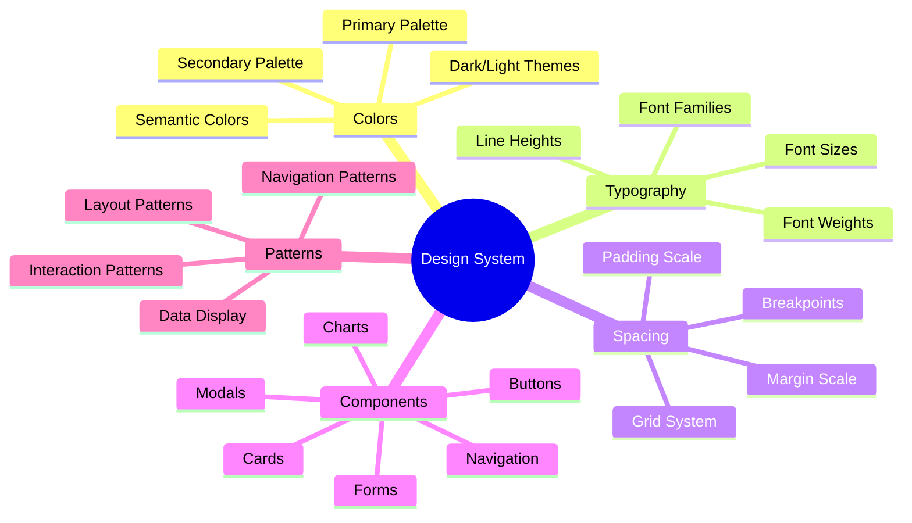
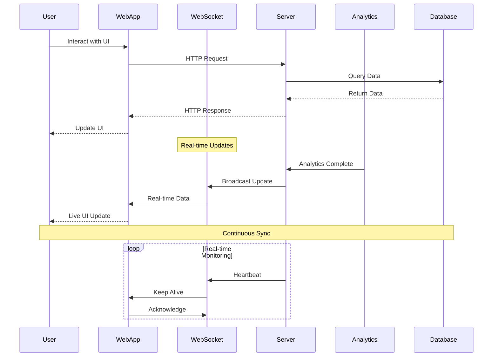
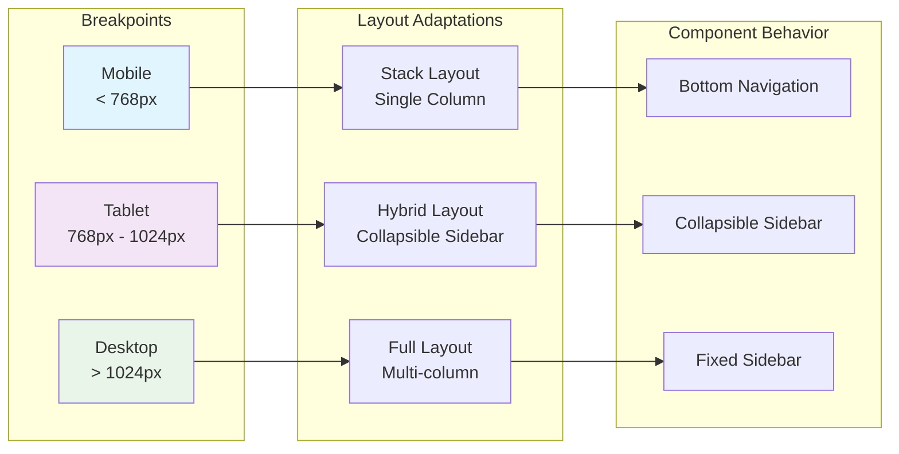
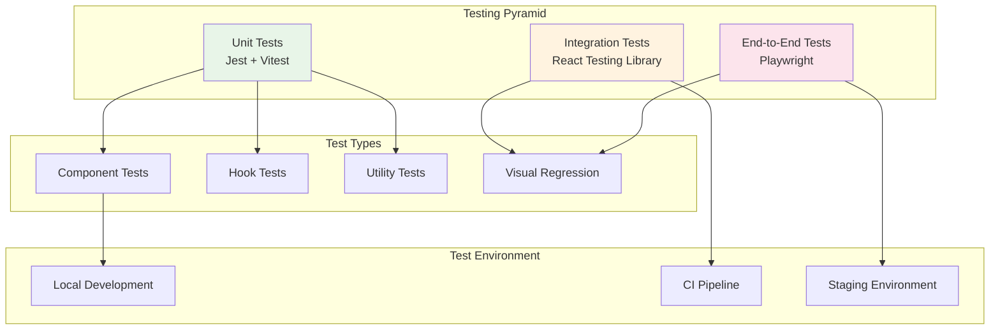
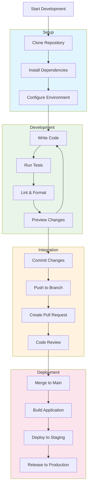

# Frontend Documentation

Welcome to the GraphMemory-IDE frontend documentation. This module covers all client-side development including web interfaces, IDE plugins, and user interaction patterns.

## 🏗️ Frontend Architecture Overview

```mermaid
graph TB
    subgraph "User Interfaces"
        WebUI[Web Interface]
        CLI[Command Line Interface]
        Plugins[IDE Plugins]
    end
    
    subgraph "IDE Plugin Ecosystem"
        VSCode[VSCode Extension]
        Cursor[Cursor Extension]
        Windsurf[Windsurf Extension]
        Shared[Shared Plugin Core]
    end
    
    subgraph "Web Application"
        React[React Components]
        State[State Management]
        Router[React Router]
        Charts[Chart Components]
    end
    
    subgraph "Communication Layer"
        HTTP[HTTP Client]
        WebSocket[WebSocket Client]
        SSE[Server-Sent Events]
        MCP[MCP Protocol]
    end
    
    subgraph "Backend Services"
        API[FastAPI Server]
        Analytics[Analytics Engine]
        Auth[Authentication]
    end
    
    WebUI --> React
    React --> State
    React --> Router
    React --> Charts
    
    Plugins --> Shared
    VSCode --> Shared
    Cursor --> Shared
    Windsurf --> Shared
    
    Web Application --> HTTP
    Web Application --> WebSocket
    Web Application --> SSE
    Plugins --> MCP
    
    Communication Layer --> API
    Communication Layer --> Analytics
    Communication Layer --> Auth
    
    style "User Interfaces" fill:#e1f5fe
    style "IDE Plugin Ecosystem" fill:#f3e5f5
    style "Web Application" fill:#e8f5e8
    style "Communication Layer" fill:#fff3e0
```

## 📚 Module Contents

### 🎨 [Web Interface Architecture](./web-interface.md)
Complete guide to the React-based web application.

**Topics Covered:**
- Component hierarchy and design patterns
- State management with Redux/Context
- Real-time data visualization
- Responsive design and accessibility

### 🔌 [Plugin Development](./plugin-development.md)
Comprehensive guide to developing IDE plugins.

**Topics Covered:**
- Plugin architecture and shared core
- VSCode extension development
- Cursor extension development
- Windsurf extension development
- MCP protocol integration

### 🧩 [Component Library](./components.md)
Reusable UI components and design system.

**Topics Covered:**
- Design system principles
- Component documentation
- Styling and theming
- Testing strategies

### 🔄 [State Management](./state-management.md)
Frontend state management patterns and real-time updates.

**Topics Covered:**
- Application state architecture
- Real-time data synchronization
- Caching strategies
- Performance optimization

## 🎯 Component Hierarchy

```mermaid
graph TD
    App[App Component]
    
    subgraph "Layout Components"
        Header[Header]
        Sidebar[Sidebar]
        Main[Main Content]
        Footer[Footer]
    end
    
    subgraph "Feature Components"
        Dashboard[Dashboard]
        Analytics[Analytics View]
        Memory[Memory Browser]
        Settings[Settings Panel]
    end
    
    subgraph "Shared Components"
        Graph[Graph Visualizer]
        Charts[Chart Components]
        Forms[Form Components]
        Modal[Modal System]
    end
    
    subgraph "Data Components"
        MemoryCard[Memory Card]
        NodeView[Node View]
        EdgeView[Edge View]
        MetricsPanel[Metrics Panel]
    end
    
    App --> Header
    App --> Sidebar
    App --> Main
    App --> Footer
    
    Main --> Dashboard
    Main --> Analytics
    Main --> Memory
    Main --> Settings
    
    Dashboard --> Graph
    Analytics --> Charts
    Memory --> MemoryCard
    Settings --> Forms
    
    Graph --> NodeView
    Graph --> EdgeView
    Charts --> MetricsPanel
    Memory --> Modal
    
    style App fill:#e1f5fe
    style "Layout Components" fill:#f3e5f5
    style "Feature Components" fill:#e8f5e8
    style "Shared Components" fill:#fff3e0
    style "Data Components" fill:#fce4ec
```

## 🔄 State Management Flow

```mermaid
flowchart TD
    subgraph "User Actions"
        Click[User Click]
        Input[User Input]
        Navigation[Navigation]
    end
    
    subgraph "Action Dispatchers"
        UIActions[UI Actions]
        DataActions[Data Actions]
        AsyncActions[Async Actions]
    end
    
    subgraph "State Store"
        UIState[UI State]
        DataState[Data State]
        CacheState[Cache State]
    end
    
    subgraph "Side Effects"
        APICall[API Calls]
        WebSocketMsg[WebSocket Messages]
        LocalStorage[Local Storage]
    end
    
    subgraph "Component Updates"
        Rerender[Component Re-render]
        UIUpdate[UI Updates]
        Notification[Notifications]
    end
    
    Click --> UIActions
    Input --> DataActions
    Navigation --> UIActions
    
    UIActions --> UIState
    DataActions --> DataState
    AsyncActions --> APICall
    AsyncActions --> WebSocketMsg
    
    APICall --> DataState
    WebSocketMsg --> DataState
    DataState --> CacheState
    
    UIState --> Rerender
    DataState --> UIUpdate
    CacheState --> LocalStorage
    
    Rerender --> Notification
    UIUpdate --> Notification
    
    style "User Actions" fill:#e1f5fe
    style "Action Dispatchers" fill:#f3e5f5
    style "State Store" fill:#e8f5e8
    style "Side Effects" fill:#fff3e0
    style "Component Updates" fill:#fce4ec
```

## 🔌 Plugin Architecture

```mermaid
graph TB
    subgraph "Plugin Core"
        SharedCore[Shared Plugin Core]
        Protocol[MCP Protocol Handler]
        Config[Configuration Manager]
        Utils[Utility Functions]
    end
    
    subgraph "IDE Specific Implementations"
        VSCodeExt[VSCode Extension]
        CursorExt[Cursor Extension]
        WindsurfExt[Windsurf Extension]
    end
    
    subgraph "Plugin Features"
        MemoryView[Memory View Panel]
        Search[Search Interface]
        Analytics[Analytics Dashboard]
        Commands[Command Palette]
    end
    
    subgraph "IDE Integration"
        VSCodeAPI[VSCode API]
        CursorAPI[Cursor API]
        WindsurfAPI[Windsurf API]
    end
    
    subgraph "Backend Communication"
        MCPServer[MCP Server]
        GraphDB[Graph Database]
        AnalyticsEngine[Analytics Engine]
    end
    
    SharedCore --> Protocol
    SharedCore --> Config
    SharedCore --> Utils
    
    VSCodeExt --> SharedCore
    CursorExt --> SharedCore
    WindsurfExt --> SharedCore
    
    SharedCore --> MemoryView
    SharedCore --> Search
    SharedCore --> Analytics
    SharedCore --> Commands
    
    VSCodeExt --> VSCodeAPI
    CursorExt --> CursorAPI
    WindsurfExt --> WindsurfAPI
    
    Protocol --> MCPServer
    MCPServer --> GraphDB
    MCPServer --> AnalyticsEngine
    
    style "Plugin Core" fill:#e1f5fe
    style "IDE Specific Implementations" fill:#f3e5f5
    style "Plugin Features" fill:#e8f5e8
    style "IDE Integration" fill:#fff3e0
    style "Backend Communication" fill:#fce4ec
```

## 🎨 Design System



## 🚀 Real-time Data Flow



## 📱 Responsive Design Strategy



## 🧪 Testing Strategy



## 🔧 Development Workflow



## 📖 Quick Reference

### Essential Commands
```bash
# Development
npm start          # Start development server
npm test           # Run test suite
npm run lint       # Lint code
npm run build      # Build for production

# Plugin Development
npm run build:vscode    # Build VSCode extension
npm run build:cursor    # Build Cursor extension
npm run build:windsurf  # Build Windsurf extension
```

### Key Files
- `src/components/` - React components
- `src/hooks/` - Custom React hooks
- `src/store/` - State management
- `src/services/` - API services
- `plugins/` - IDE plugin source code

### Integration Points
- **Backend API**: `/api/v1/` endpoints
- **WebSocket**: `/ws/` for real-time updates
- **MCP Server**: Plugin communication protocol
- **Analytics**: Real-time analytics streaming

---

**Next Steps:**
- [Web Interface Architecture](./web-interface.md)
- [Plugin Development Guide](./plugin-development.md)
- [Component Library](./components.md)
- [State Management](./state-management.md) 