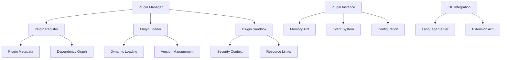

# Plugin Development Guide

## Table of Contents
- [Overview](#overview)
- [Plugin Architecture](#plugin-architecture)
- [Development Environment Setup](#development-environment-setup)
- [Creating Your First Plugin](#creating-your-first-plugin)
- [Plugin SDK Reference](#plugin-sdk-reference)
- [IDE Integration](#ide-integration)
- [Testing and Debugging](#testing-and-debugging)
- [Publishing and Distribution](#publishing-and-distribution)
- [Best Practices](#best-practices)
- [Examples](#examples)
- [Troubleshooting](#troubleshooting)

## Overview

GraphMemory-IDE provides a powerful plugin system that allows developers to extend the functionality of the memory management system. Plugins can add new memory types, custom processing algorithms, IDE integrations, and workflow automations.

### Plugin Types

1. **Memory Processors**: Custom algorithms for memory processing and analysis
2. **IDE Integrations**: Extensions for specific IDEs (VS Code, IntelliJ, etc.)
3. **Data Connectors**: Integrations with external data sources
4. **Workflow Automations**: Custom automation and CI/CD integrations
5. **UI Extensions**: Custom interfaces and visualizations

### Plugin Capabilities

- **Memory System Access**: Full access to the Kuzu graph database
- **MCP Protocol**: Integration with Model Context Protocol
- **Event System**: Subscribe to and emit system events
- **Configuration Management**: Plugin-specific configuration
- **Security Context**: Secure execution environment
- **Resource Management**: Controlled resource allocation

## Plugin Architecture

### Core Components



### Plugin Lifecycle

1. **Discovery**: Plugin manager scans for available plugins
2. **Validation**: Plugin metadata and dependencies are validated
3. **Loading**: Plugin code is loaded into secure sandbox
4. **Initialization**: Plugin initialization hooks are called
5. **Registration**: Plugin registers its capabilities and handlers
6. **Execution**: Plugin responds to events and API calls
7. **Cleanup**: Plugin cleanup hooks are called on shutdown

### Plugin Manifest

Every plugin must include a `plugin.json` manifest file:

```json
{
  "name": "my-awesome-plugin",
  "version": "1.0.0",
  "description": "An awesome plugin for GraphMemory-IDE",
  "author": "Your Name <your.email@example.com>",
  "license": "MIT",
  "main": "src/index.js",
  "type": "memory-processor",
  "capabilities": [
    "memory.read",
    "memory.write",
    "events.subscribe"
  ],
  "dependencies": {
    "graphmemory-sdk": "^1.0.0"
  },
  "engines": {
    "node": ">=18.0.0",
    "graphmemory": "^1.0.0"
  },
  "keywords": ["memory", "processing", "ai"],
  "repository": "https://github.com/username/my-awesome-plugin",
  "bugs": "https://github.com/username/my-awesome-plugin/issues",
  "homepage": "https://github.com/username/my-awesome-plugin#readme"
}
```

## Development Environment Setup

### Prerequisites

- Node.js 18+ or Python 3.9+
- GraphMemory-IDE development environment
- Plugin SDK installed

### SDK Installation

#### Node.js
```bash
npm install @graphmemory/plugin-sdk
```

#### Python
```bash
pip install graphmemory-plugin-sdk
```

### Development Tools

```bash
# Install plugin development CLI
npm install -g @graphmemory/plugin-cli

# Create new plugin project
graphmemory-plugin create my-plugin --type memory-processor

# Development server with hot reload
graphmemory-plugin dev

# Build and package plugin
graphmemory-plugin build

# Test plugin
graphmemory-plugin test
```

### Project Structure

```
my-plugin/
├── plugin.json              # Plugin manifest
├── src/
│   ├── index.js             # Main plugin entry point
│   ├── handlers/            # Event handlers
│   ├── processors/          # Memory processors
│   └── utils/               # Utility functions
├── tests/
│   ├── unit/                # Unit tests
│   ├── integration/         # Integration tests
│   └── fixtures/            # Test data
├── docs/
│   ├── README.md            # Plugin documentation
│   └── API.md               # API documentation
├── examples/                # Usage examples
├── .gitignore
├── package.json             # Node.js dependencies
└── requirements.txt         # Python dependencies (if applicable)
```

## Creating Your First Plugin

### Step 1: Initialize Plugin Project

```bash
# Create new plugin
graphmemory-plugin create hello-world --type memory-processor

# Navigate to plugin directory
cd hello-world
```

### Step 2: Implement Plugin Logic

```javascript
// src/index.js
const { Plugin, MemoryAPI, EventSystem } = require('@graphmemory/plugin-sdk');

class HelloWorldPlugin extends Plugin {
  constructor() {
    super();
    this.name = 'hello-world';
    this.version = '1.0.0';
  }

  async initialize() {
    console.log('Hello World Plugin initialized!');
    
    // Register memory processor
    this.registerProcessor('hello-processor', this.processMemory.bind(this));
    
    // Subscribe to events
    EventSystem.subscribe('memory.created', this.onMemoryCreated.bind(this));
  }

  async processMemory(memory) {
    // Add greeting to memory content
    return {
      ...memory,
      content: `Hello! ${memory.content}`,
      metadata: {
        ...memory.metadata,
        processed_by: 'hello-world-plugin',
        processed_at: new Date().toISOString()
      }
    };
  }

  async onMemoryCreated(event) {
    console.log('New memory created:', event.data.id);
    
    // Optionally process the new memory
    const memory = await MemoryAPI.getMemory(event.data.id);
    const processed = await this.processMemory(memory);
    await MemoryAPI.updateMemory(event.data.id, processed);
  }

  async cleanup() {
    console.log('Hello World Plugin cleaned up!');
  }
}

module.exports = HelloWorldPlugin;
```

### Step 3: Configure Plugin Manifest

```json
{
  "name": "hello-world",
  "version": "1.0.0",
  "description": "A simple hello world plugin",
  "main": "src/index.js",
  "type": "memory-processor",
  "capabilities": [
    "memory.read",
    "memory.write",
    "events.subscribe"
  ],
  "dependencies": {
    "@graphmemory/plugin-sdk": "^1.0.0"
  }
}
```

### Step 4: Test Plugin

```javascript
// tests/unit/index.test.js
const HelloWorldPlugin = require('../../src/index');
const { MockMemoryAPI, MockEventSystem } = require('@graphmemory/plugin-sdk/testing');

describe('HelloWorldPlugin', () => {
  let plugin;

  beforeEach(() => {
    plugin = new HelloWorldPlugin();
  });

  test('should process memory correctly', async () => {
    const memory = {
      id: 'test-123',
      content: 'World!',
      metadata: {}
    };

    const result = await plugin.processMemory(memory);
    
    expect(result.content).toBe('Hello! World!');
    expect(result.metadata.processed_by).toBe('hello-world-plugin');
  });

  test('should handle memory creation events', async () => {
    const spy = jest.spyOn(plugin, 'processMemory');
    
    await plugin.onMemoryCreated({
      data: { id: 'test-123' }
    });
    
    expect(spy).toHaveBeenCalled();
  });
});
```

### Step 5: Build and Install

```bash
# Build plugin
graphmemory-plugin build

# Install locally for testing
graphmemory-plugin install ./dist/hello-world-1.0.0.tgz

# Verify installation
graphmemory-plugin list
```

## Plugin SDK Reference

### Core Classes

#### Plugin Base Class

```javascript
class Plugin {
  constructor()
  async initialize()
  async cleanup()
  registerProcessor(name, handler)
  registerHandler(event, handler)
  getConfig(key, defaultValue)
  setConfig(key, value)
  log(level, message, metadata)
}
```

#### Memory API

```javascript
class MemoryAPI {
  static async getMemory(id)
  static async createMemory(data)
  static async updateMemory(id, data)
  static async deleteMemory(id)
  static async searchMemories(query)
  static async getRelatedMemories(id)
  static async createRelation(fromId, toId, type)
  static async deleteRelation(fromId, toId, type)
}
```

#### Event System

```javascript
class EventSystem {
  static subscribe(event, handler)
  static unsubscribe(event, handler)
  static emit(event, data)
  static once(event, handler)
}
```

#### Configuration Manager

```javascript
class ConfigManager {
  static get(key, defaultValue)
  static set(key, value)
  static has(key)
  static delete(key)
  static getAll()
  static watch(key, callback)
}
```

### Available Events

#### Memory Events
- `memory.created` - New memory created
- `memory.updated` - Memory updated
- `memory.deleted` - Memory deleted
- `memory.accessed` - Memory accessed

#### Relation Events
- `relation.created` - New relation created
- `relation.deleted` - Relation deleted

#### System Events
- `system.startup` - System starting up
- `system.shutdown` - System shutting down
- `plugin.loaded` - Plugin loaded
- `plugin.unloaded` - Plugin unloaded

#### IDE Events
- `ide.file.opened` - File opened in IDE
- `ide.file.saved` - File saved in IDE
- `ide.project.opened` - Project opened
- `ide.selection.changed` - Text selection changed

### Security Context

Plugins run in a secure sandbox with controlled access to system resources:

```javascript
// Available security contexts
const SecurityContext = {
  MEMORY_READ: 'memory.read',
  MEMORY_WRITE: 'memory.write',
  MEMORY_DELETE: 'memory.delete',
  EVENTS_SUBSCRIBE: 'events.subscribe',
  EVENTS_EMIT: 'events.emit',
  CONFIG_READ: 'config.read',
  CONFIG_WRITE: 'config.write',
  NETWORK_ACCESS: 'network.access',
  FILE_SYSTEM: 'filesystem.access'
};

// Check permissions
if (this.hasPermission(SecurityContext.MEMORY_WRITE)) {
  await MemoryAPI.updateMemory(id, data);
}
```

## IDE Integration

### VS Code Extension

```javascript
// vscode-extension/src/extension.js
const vscode = require('vscode');
const { GraphMemoryClient } = require('@graphmemory/vscode-sdk');

function activate(context) {
  const client = new GraphMemoryClient();
  
  // Register commands
  const disposable = vscode.commands.registerCommand(
    'graphmemory.captureSelection',
    async () => {
      const editor = vscode.window.activeTextEditor;
      if (editor) {
        const selection = editor.document.getText(editor.selection);
        await client.createMemory({
          content: selection,
          source: 'vscode-selection',
          file: editor.document.fileName
        });
      }
    }
  );
  
  context.subscriptions.push(disposable);
  
  // Listen for file changes
  vscode.workspace.onDidSaveTextDocument(async (document) => {
    await client.emit('ide.file.saved', {
      file: document.fileName,
      content: document.getText()
    });
  });
}

exports.activate = activate;
```

### IntelliJ Plugin

```kotlin
// intellij-plugin/src/main/kotlin/GraphMemoryPlugin.kt
class GraphMemoryPlugin : ApplicationComponent {
    private val client = GraphMemoryClient()
    
    override fun initComponent() {
        // Register file change listener
        EditorFactory.getInstance().addEditorFactoryListener(
            object : EditorFactoryListener {
                override fun editorCreated(event: EditorFactoryEvent) {
                    val editor = event.editor
                    val document = editor.document
                    
                    client.emit("ide.file.opened", mapOf(
                        "file" to document.text,
                        "editor" to "intellij"
                    ))
                }
            }
        )
    }
}
```

### Sublime Text Plugin

```python
# sublime-plugin/graph_memory.py
import sublime
import sublime_plugin
from .client import GraphMemoryClient

class GraphMemoryCommand(sublime_plugin.TextCommand):
    def __init__(self, view):
        super().__init__(view)
        self.client = GraphMemoryClient()
    
    def run(self, edit):
        selection = self.view.substr(self.view.sel()[0])
        if selection:
            self.client.create_memory({
                'content': selection,
                'source': 'sublime-selection',
                'file': self.view.file_name()
            })

class GraphMemoryEventListener(sublime_plugin.EventListener):
    def __init__(self):
        self.client = GraphMemoryClient()
    
    def on_post_save(self, view):
        self.client.emit('ide.file.saved', {
            'file': view.file_name(),
            'content': view.substr(sublime.Region(0, view.size()))
        })
```

## Testing and Debugging

### Unit Testing

```javascript
// tests/unit/memory-processor.test.js
const { MockMemoryAPI } = require('@graphmemory/plugin-sdk/testing');
const MyPlugin = require('../../src/index');

describe('Memory Processor', () => {
  let plugin;
  let mockAPI;

  beforeEach(() => {
    plugin = new MyPlugin();
    mockAPI = new MockMemoryAPI();
  });

  test('should process memory correctly', async () => {
    const memory = { id: '1', content: 'test' };
    mockAPI.setMemory('1', memory);
    
    const result = await plugin.processMemory(memory);
    
    expect(result).toBeDefined();
    expect(result.content).toContain('test');
  });
});
```

### Integration Testing

```javascript
// tests/integration/plugin-lifecycle.test.js
const { TestEnvironment } = require('@graphmemory/plugin-sdk/testing');
const MyPlugin = require('../../src/index');

describe('Plugin Lifecycle', () => {
  let env;
  let plugin;

  beforeEach(async () => {
    env = new TestEnvironment();
    await env.start();
    
    plugin = new MyPlugin();
    await env.loadPlugin(plugin);
  });

  afterEach(async () => {
    await env.stop();
  });

  test('should handle full lifecycle', async () => {
    // Test initialization
    expect(plugin.isInitialized()).toBe(true);
    
    // Test memory processing
    const memory = await env.createMemory({ content: 'test' });
    const processed = await env.processMemory(memory.id);
    
    expect(processed).toBeDefined();
    
    // Test cleanup
    await env.unloadPlugin(plugin);
    expect(plugin.isInitialized()).toBe(false);
  });
});
```

### Debugging

#### Enable Debug Logging

```javascript
// Set debug environment
process.env.GRAPHMEMORY_DEBUG = 'plugin:*';

// Use debug logging in plugin
this.log('debug', 'Processing memory', { memoryId: memory.id });
```

#### Debug Configuration

```json
// .vscode/launch.json
{
  "version": "0.2.0",
  "configurations": [
    {
      "name": "Debug Plugin",
      "type": "node",
      "request": "launch",
      "program": "${workspaceFolder}/node_modules/@graphmemory/plugin-cli/bin/cli.js",
      "args": ["dev", "--debug"],
      "env": {
        "GRAPHMEMORY_DEBUG": "plugin:*"
      },
      "console": "integratedTerminal"
    }
  ]
}
```

#### Performance Profiling

```javascript
// Enable performance monitoring
const { performance } = require('perf_hooks');

class MyPlugin extends Plugin {
  async processMemory(memory) {
    const start = performance.now();
    
    try {
      const result = await this.doProcessing(memory);
      return result;
    } finally {
      const duration = performance.now() - start;
      this.log('info', 'Memory processing completed', {
        memoryId: memory.id,
        duration: `${duration.toFixed(2)}ms`
      });
    }
  }
}
```

## Publishing and Distribution

### NPM Package

```json
// package.json
{
  "name": "@username/graphmemory-plugin-name",
  "version": "1.0.0",
  "description": "Plugin description",
  "main": "dist/index.js",
  "files": [
    "dist/",
    "plugin.json",
    "README.md"
  ],
  "keywords": [
    "graphmemory",
    "plugin",
    "memory"
  ],
  "peerDependencies": {
    "@graphmemory/plugin-sdk": "^1.0.0"
  }
}
```

### Publishing Steps

```bash
# Build plugin
npm run build

# Test plugin
npm test

# Publish to NPM
npm publish

# Register with GraphMemory registry
graphmemory-plugin register @username/graphmemory-plugin-name
```

### Plugin Registry

```bash
# Search for plugins
graphmemory-plugin search memory-processor

# Install plugin
graphmemory-plugin install @username/graphmemory-plugin-name

# Update plugin
graphmemory-plugin update @username/graphmemory-plugin-name

# Uninstall plugin
graphmemory-plugin uninstall @username/graphmemory-plugin-name
```

## Best Practices

### Performance

1. **Async Operations**: Use async/await for all I/O operations
2. **Batch Processing**: Process multiple memories in batches
3. **Caching**: Cache frequently accessed data
4. **Resource Cleanup**: Always clean up resources in cleanup hooks

```javascript
class EfficientPlugin extends Plugin {
  constructor() {
    super();
    this.cache = new Map();
    this.batchSize = 100;
  }

  async processBatch(memories) {
    const results = await Promise.all(
      memories.map(memory => this.processMemory(memory))
    );
    return results;
  }

  async cleanup() {
    this.cache.clear();
    await super.cleanup();
  }
}
```

### Security

1. **Input Validation**: Validate all input data
2. **Permission Checks**: Check permissions before operations
3. **Sanitization**: Sanitize user input
4. **Error Handling**: Handle errors gracefully

```javascript
async processMemory(memory) {
  // Validate input
  if (!memory || !memory.id) {
    throw new Error('Invalid memory object');
  }

  // Check permissions
  if (!this.hasPermission('memory.write')) {
    throw new Error('Insufficient permissions');
  }

  // Sanitize content
  const sanitized = this.sanitizeContent(memory.content);
  
  try {
    return await this.doProcessing({ ...memory, content: sanitized });
  } catch (error) {
    this.log('error', 'Processing failed', { error: error.message });
    throw error;
  }
}
```

### Error Handling

```javascript
class RobustPlugin extends Plugin {
  async processMemory(memory) {
    try {
      return await this.doProcessing(memory);
    } catch (error) {
      // Log error with context
      this.log('error', 'Memory processing failed', {
        memoryId: memory.id,
        error: error.message,
        stack: error.stack
      });

      // Return safe fallback
      return {
        ...memory,
        metadata: {
          ...memory.metadata,
          processing_error: error.message,
          processed_at: new Date().toISOString()
        }
      };
    }
  }
}
```

### Configuration Management

```javascript
class ConfigurablePlugin extends Plugin {
  async initialize() {
    // Load configuration with defaults
    this.config = {
      batchSize: this.getConfig('batchSize', 100),
      timeout: this.getConfig('timeout', 5000),
      retries: this.getConfig('retries', 3)
    };

    // Watch for configuration changes
    ConfigManager.watch('batchSize', (newValue) => {
      this.config.batchSize = newValue;
      this.log('info', 'Batch size updated', { newValue });
    });
  }
}
```

## Examples

### Memory Analyzer Plugin

```javascript
// Advanced memory analysis plugin
class MemoryAnalyzerPlugin extends Plugin {
  async initialize() {
    this.registerProcessor('analyze', this.analyzeMemory.bind(this));
    this.registerProcessor('summarize', this.summarizeMemories.bind(this));
  }

  async analyzeMemory(memory) {
    const analysis = {
      wordCount: this.countWords(memory.content),
      sentiment: await this.analyzeSentiment(memory.content),
      topics: await this.extractTopics(memory.content),
      complexity: this.calculateComplexity(memory.content)
    };

    return {
      ...memory,
      metadata: {
        ...memory.metadata,
        analysis,
        analyzed_at: new Date().toISOString()
      }
    };
  }

  async summarizeMemories(memories) {
    const summary = {
      totalMemories: memories.length,
      averageWordCount: this.calculateAverage(
        memories.map(m => this.countWords(m.content))
      ),
      commonTopics: this.findCommonTopics(memories),
      sentimentDistribution: this.analyzeSentimentDistribution(memories)
    };

    return summary;
  }

  countWords(text) {
    return text.split(/\s+/).length;
  }

  async analyzeSentiment(text) {
    // Implement sentiment analysis
    // This could use external APIs or local models
    return { score: 0.5, label: 'neutral' };
  }

  async extractTopics(text) {
    // Implement topic extraction
    return ['general', 'development'];
  }

  calculateComplexity(text) {
    // Simple complexity metric
    const sentences = text.split(/[.!?]+/).length;
    const words = this.countWords(text);
    return words / sentences;
  }
}
```

### IDE Integration Plugin

```javascript
// VS Code integration plugin
class VSCodeIntegrationPlugin extends Plugin {
  async initialize() {
    EventSystem.subscribe('ide.file.saved', this.onFileSaved.bind(this));
    EventSystem.subscribe('ide.selection.changed', this.onSelectionChanged.bind(this));
    
    this.registerHandler('capture-selection', this.captureSelection.bind(this));
    this.registerHandler('find-related', this.findRelatedCode.bind(this));
  }

  async onFileSaved(event) {
    const { file, content } = event.data;
    
    // Create memory for saved file
    const memory = await MemoryAPI.createMemory({
      content,
      type: 'code-file',
      source: 'vscode',
      metadata: {
        file,
        language: this.detectLanguage(file),
        saved_at: new Date().toISOString()
      }
    });

    // Analyze code structure
    const analysis = await this.analyzeCode(content);
    await MemoryAPI.updateMemory(memory.id, {
      ...memory,
      metadata: {
        ...memory.metadata,
        analysis
      }
    });
  }

  async captureSelection(data) {
    const { selection, file, line, column } = data;
    
    const memory = await MemoryAPI.createMemory({
      content: selection,
      type: 'code-selection',
      source: 'vscode-selection',
      metadata: {
        file,
        line,
        column,
        captured_at: new Date().toISOString()
      }
    });

    return { memoryId: memory.id };
  }

  async findRelatedCode(data) {
    const { query } = data;
    
    const memories = await MemoryAPI.searchMemories({
      query,
      type: 'code-file',
      limit: 10
    });

    return memories.map(memory => ({
      id: memory.id,
      file: memory.metadata.file,
      relevance: memory.score,
      snippet: memory.content.substring(0, 200)
    }));
  }

  detectLanguage(file) {
    const ext = file.split('.').pop();
    const languageMap = {
      js: 'javascript',
      ts: 'typescript',
      py: 'python',
      java: 'java',
      cpp: 'cpp',
      c: 'c'
    };
    return languageMap[ext] || 'unknown';
  }

  async analyzeCode(content) {
    // Simple code analysis
    return {
      lines: content.split('\n').length,
      functions: (content.match(/function\s+\w+/g) || []).length,
      classes: (content.match(/class\s+\w+/g) || []).length,
      imports: (content.match(/import\s+.*from/g) || []).length
    };
  }
}
```

### Workflow Automation Plugin

```javascript
// CI/CD workflow automation plugin
class WorkflowAutomationPlugin extends Plugin {
  async initialize() {
    EventSystem.subscribe('memory.created', this.onMemoryCreated.bind(this));
    
    this.registerHandler('trigger-workflow', this.triggerWorkflow.bind(this));
    this.registerHandler('get-workflow-status', this.getWorkflowStatus.bind(this));
  }

  async onMemoryCreated(event) {
    const memory = event.data;
    
    // Check if memory should trigger workflow
    if (this.shouldTriggerWorkflow(memory)) {
      await this.triggerWorkflow({
        memoryId: memory.id,
        type: 'auto-trigger'
      });
    }
  }

  async triggerWorkflow(data) {
    const { memoryId, type, parameters = {} } = data;
    
    const workflow = {
      id: this.generateWorkflowId(),
      memoryId,
      type,
      parameters,
      status: 'running',
      startedAt: new Date().toISOString()
    };

    // Store workflow state
    await this.storeWorkflowState(workflow);

    // Execute workflow steps
    try {
      await this.executeWorkflowSteps(workflow);
      workflow.status = 'completed';
      workflow.completedAt = new Date().toISOString();
    } catch (error) {
      workflow.status = 'failed';
      workflow.error = error.message;
      workflow.failedAt = new Date().toISOString();
    }

    await this.storeWorkflowState(workflow);
    return workflow;
  }

  shouldTriggerWorkflow(memory) {
    // Check memory type and metadata
    return memory.type === 'code-file' && 
           memory.metadata.file?.endsWith('.js');
  }

  async executeWorkflowSteps(workflow) {
    const steps = this.getWorkflowSteps(workflow.type);
    
    for (const step of steps) {
      await this.executeStep(step, workflow);
    }
  }

  getWorkflowSteps(type) {
    const workflows = {
      'auto-trigger': [
        'validate-memory',
        'analyze-code',
        'run-tests',
        'update-documentation'
      ],
      'manual-deploy': [
        'validate-memory',
        'build-artifact',
        'deploy-to-staging',
        'run-integration-tests',
        'deploy-to-production'
      ]
    };
    
    return workflows[type] || [];
  }

  async executeStep(step, workflow) {
    this.log('info', `Executing workflow step: ${step}`, {
      workflowId: workflow.id,
      step
    });

    switch (step) {
      case 'validate-memory':
        await this.validateMemory(workflow.memoryId);
        break;
      case 'analyze-code':
        await this.analyzeCode(workflow.memoryId);
        break;
      case 'run-tests':
        await this.runTests(workflow.memoryId);
        break;
      default:
        this.log('warn', `Unknown workflow step: ${step}`);
    }
  }
}
```

## Troubleshooting

### Common Issues

#### Plugin Not Loading

**Problem**: Plugin fails to load with "Module not found" error

**Solution**:
```bash
# Check plugin manifest
cat plugin.json

# Verify main file exists
ls -la src/index.js

# Check dependencies
npm install

# Rebuild plugin
graphmemory-plugin build
```

#### Permission Denied

**Problem**: Plugin operations fail with permission errors

**Solution**:
```javascript
// Check required capabilities in plugin.json
{
  "capabilities": [
    "memory.read",
    "memory.write",
    "events.subscribe"
  ]
}

// Verify permissions in code
if (!this.hasPermission('memory.write')) {
  throw new Error('Insufficient permissions for memory write');
}
```

#### Memory Leaks

**Problem**: Plugin consumes increasing memory over time

**Solution**:
```javascript
class MemoryEfficientPlugin extends Plugin {
  constructor() {
    super();
    this.cache = new Map();
    this.maxCacheSize = 1000;
  }

  addToCache(key, value) {
    // Implement LRU cache
    if (this.cache.size >= this.maxCacheSize) {
      const firstKey = this.cache.keys().next().value;
      this.cache.delete(firstKey);
    }
    this.cache.set(key, value);
  }

  async cleanup() {
    this.cache.clear();
    await super.cleanup();
  }
}
```

#### Event Handler Issues

**Problem**: Event handlers not receiving events

**Solution**:
```javascript
// Ensure proper event subscription
async initialize() {
  // Subscribe to events after initialization
  EventSystem.subscribe('memory.created', this.onMemoryCreated.bind(this));
  
  // Verify event names match exactly
  this.log('debug', 'Subscribed to events', {
    events: ['memory.created']
  });
}

// Check event handler binding
onMemoryCreated(event) {
  this.log('debug', 'Memory created event received', {
    memoryId: event.data.id
  });
}
```

### Debug Commands

```bash
# Enable verbose logging
export GRAPHMEMORY_DEBUG=plugin:*

# Check plugin status
graphmemory-plugin status

# Validate plugin
graphmemory-plugin validate ./plugin.json

# Test plugin in isolation
graphmemory-plugin test --isolated

# Profile plugin performance
graphmemory-plugin profile --duration 60s
```

### Performance Monitoring

```javascript
// Add performance monitoring to plugins
class MonitoredPlugin extends Plugin {
  constructor() {
    super();
    this.metrics = {
      processedMemories: 0,
      averageProcessingTime: 0,
      errors: 0
    };
  }

  async processMemory(memory) {
    const start = Date.now();
    
    try {
      const result = await this.doProcessing(memory);
      
      // Update metrics
      this.metrics.processedMemories++;
      const duration = Date.now() - start;
      this.updateAverageProcessingTime(duration);
      
      return result;
    } catch (error) {
      this.metrics.errors++;
      throw error;
    }
  }

  updateAverageProcessingTime(duration) {
    const count = this.metrics.processedMemories;
    const current = this.metrics.averageProcessingTime;
    this.metrics.averageProcessingTime = 
      (current * (count - 1) + duration) / count;
  }

  getMetrics() {
    return this.metrics;
  }
}
```

---

## Support and Community

- **Documentation**: [https://docs.graphmemory.dev/plugins](https://docs.graphmemory.dev/plugins)
- **GitHub**: [https://github.com/graphmemory/plugin-sdk](https://github.com/graphmemory/plugin-sdk)
- **Discord**: [https://discord.gg/graphmemory](https://discord.gg/graphmemory)
- **Stack Overflow**: Tag questions with `graphmemory-plugin`

For additional help, please refer to the [main documentation](../README.md) or open an issue on GitHub. 