# GraphMemory Windsurf Plugin

Transform your Windsurf IDE into a powerful knowledge management workspace with GraphMemory integration. This plugin brings your personal knowledge graph directly into Windsurf's Cascade, enabling seamless memory management, graph analysis, and knowledge discovery within your development environment.

## 🌊 Windsurf Integration Features

### 🤖 Cascade-Optimized Experience
- **Native MCP Integration**: Seamless integration with Windsurf's Model Context Protocol support
- **Agentic Workflows**: Leverage Cascade's autonomous capabilities for knowledge management
- **Turbo Mode Support**: Enhanced performance for rapid knowledge operations
- **Intelligent Formatting**: Results optimized for Cascade's conversational interface

### 🧠 Knowledge Management Tools
Access all 10 GraphMemory tools directly within Cascade:

```mermaid
graph LR
    subgraph "Memory Operations"
        SEARCH[🔍 Memory Search]
        CREATE[➕ Memory Create]
        UPDATE[✏️ Memory Update]
        DELETE[🗑️ Memory Delete]
        RELATE[🔗 Memory Relate]
    end
    
    subgraph "Graph Operations"
        QUERY[📊 Graph Query]
        ANALYZE[🔬 Graph Analyze]
    end
    
    subgraph "Knowledge Discovery"
        CLUSTER[🎯 Knowledge Cluster]
        INSIGHTS[💡 Knowledge Insights]
        RECOMMEND[🎯 Knowledge Recommend]
    end
    
    SEARCH --> CLUSTER
    CREATE --> RELATE
    ANALYZE --> INSIGHTS
    INSIGHTS --> RECOMMEND
```



## 🚀 Quick Setup

### Prerequisites
- Windsurf IDE (Wave 3 or later recommended)
- GraphMemory-IDE server running
- Node.js 18+ installed

### 1. Install Dependencies
```bash
cd ide-plugins
npm install
```

### 2. Build the Plugin
```bash
npm run build:windsurf
```

### 3. Configure Windsurf MCP

#### Option A: Automatic Configuration
```bash
# Copy the configuration to Windsurf's config directory
cp windsurf/mcp-config.json ~/.codeium/windsurf/mcp_config.json
```

#### Option B: Manual Configuration
1. Open Windsurf IDE
2. Press `⌘L` (Mac) or `Ctrl+L` (Windows/Linux) to open Cascade
3. Click the hammer icon (🔨) in the Cascade toolbar
4. Click "Configure" to open the MCP configuration file
5. Add the GraphMemory server configuration:

```json
{
  "mcpServers": {
    "graphmemory": {
      "command": "node",
      "args": ["server.js"],
      "cwd": "/path/to/GraphMemory-IDE/ide-plugins/windsurf",
      "env": {
        "GRAPHMEMORY_SERVER_URL": "http://localhost:8000",
        "GRAPHMEMORY_AUTH_METHOD": "jwt",
        "GRAPHMEMORY_AUTH_TOKEN": "your-jwt-token-here",
        "GRAPHMEMORY_DEBUG": "false"
      }
    }
  }
}
```

### 4. Set Environment Variables
```bash
# Add to your shell profile (.zshrc, .bashrc, etc.)
export GRAPHMEMORY_JWT_TOKEN="your-jwt-token-here"
export GRAPHMEMORY_SERVER_URL="http://localhost:8000"
export GRAPHMEMORY_AUTH_METHOD="jwt"
```

### 5. Refresh Windsurf MCP
1. In Cascade, click the refresh button (🔄) in the MCP toolbar
2. Verify GraphMemory tools are available by typing: "What GraphMemory tools are available?"

## 🎯 Using GraphMemory in Cascade

### Basic Memory Operations

#### Search Your Knowledge
```
Search for memories about "machine learning algorithms"
```

#### Create New Memories
```
Create a memory about the new authentication system we implemented today. 
Title: "JWT Authentication Implementation"
Tags: authentication, security, backend
```

#### Update Existing Memories
```
Update the memory about our API design to include the new rate limiting feature
```

### Advanced Knowledge Discovery

#### Analyze Your Knowledge Graph
```
Analyze my knowledge graph to show the relationships between my programming projects
```

#### Generate Insights
```
Generate insights from my memories about React development patterns
```

#### Get Recommendations
```
Recommend related memories for my current work on database optimization
```

### Windsurf-Specific Features

#### Leverage Turbo Mode
When Turbo Mode is enabled, GraphMemory operations can be chained automatically:
```
Search for memories about "API design", then analyze the relationships, and generate insights about common patterns
```

#### Agentic Workflows
Cascade can autonomously manage your knowledge:
```
Monitor my coding session and automatically create memories for significant code changes, then relate them to existing project memories
```

## 🔧 Configuration

### Environment Variables

| Variable | Description | Default | Required |
|----------|-------------|---------|----------|
| `GRAPHMEMORY_SERVER_URL` | GraphMemory server URL | `http://localhost:8000` | Yes |
| `GRAPHMEMORY_AUTH_METHOD` | Authentication method | `jwt` | Yes |
| `GRAPHMEMORY_AUTH_TOKEN` | JWT token for authentication | - | Yes* |
| `GRAPHMEMORY_AUTH_API_KEY` | API key for authentication | - | Yes* |
| `GRAPHMEMORY_DEBUG` | Enable debug logging | `false` | No |

*Either `GRAPHMEMORY_AUTH_TOKEN` or `GRAPHMEMORY_AUTH_API_KEY` is required

### Advanced Configuration

#### Performance Tuning
```json
{
  "mcpServers": {
    "graphmemory": {
      "command": "node",
      "args": ["server.js"],
      "cwd": "./ide-plugins/windsurf",
      "env": {
        "GRAPHMEMORY_SERVER_URL": "http://localhost:8000",
        "GRAPHMEMORY_AUTH_METHOD": "jwt",
        "GRAPHMEMORY_AUTH_TOKEN": "${GRAPHMEMORY_JWT_TOKEN}",
        "GRAPHMEMORY_DEBUG": "false",
        "GRAPHMEMORY_CACHE_SIZE": "200",
        "GRAPHMEMORY_MAX_CONCURRENT": "10",
        "GRAPHMEMORY_TIMEOUT": "45000"
      }
    }
  }
}
```

#### Security Configuration
For production environments:
```json
{
  "mcpServers": {
    "graphmemory": {
      "command": "node",
      "args": ["server.js"],
      "cwd": "./ide-plugins/windsurf",
      "env": {
        "GRAPHMEMORY_SERVER_URL": "https://your-graphmemory-server.com",
        "GRAPHMEMORY_AUTH_METHOD": "mtls",
        "GRAPHMEMORY_CERT_PATH": "/path/to/client.crt",
        "GRAPHMEMORY_KEY_PATH": "/path/to/client.key",
        "GRAPHMEMORY_CA_PATH": "/path/to/ca.crt"
      }
    }
  }
}
```

## 🛠️ Tool Reference

### Memory Management Tools

#### `memory_search`
Search through your knowledge graph with semantic and keyword search.

**Parameters:**
- `query` (string): Search query
- `limit` (number, optional): Maximum results (default: 10)
- `filters` (object, optional): Additional filters

**Example:**
```
Search for memories about "React hooks" with limit 5
```

#### `memory_create`
Create new memories in your knowledge graph.

**Parameters:**
- `title` (string): Memory title
- `content` (string): Memory content
- `tags` (array, optional): Tags for categorization
- `type` (string, optional): Memory type

**Example:**
```
Create a memory titled "GraphQL Best Practices" with content about query optimization and caching strategies
```

#### `memory_update`
Update existing memories with new information.

**Parameters:**
- `id` (string): Memory ID to update
- `title` (string, optional): New title
- `content` (string, optional): New content
- `tags` (array, optional): New tags

#### `memory_delete`
Remove memories from your knowledge graph.

**Parameters:**
- `id` (string): Memory ID to delete

#### `memory_relate`
Create relationships between memories.

**Parameters:**
- `source_id` (string): Source memory ID
- `target_id` (string): Target memory ID
- `relationship_type` (string): Type of relationship

### Graph Analysis Tools

#### `graph_query`
Execute Cypher queries on your knowledge graph.

**Parameters:**
- `query` (string): Cypher query
- `parameters` (object, optional): Query parameters

**Example:**
```
Query the graph to find all memories connected to my "Machine Learning" project
```

#### `graph_analyze`
Analyze graph structure and relationships.

**Parameters:**
- `analysis_type` (string): Type of analysis
- `filters` (object, optional): Analysis filters

### Knowledge Discovery Tools

#### `knowledge_cluster`
Discover clusters and themes in your knowledge.

**Parameters:**
- `algorithm` (string, optional): Clustering algorithm
- `min_cluster_size` (number, optional): Minimum cluster size

#### `knowledge_insights`
Generate insights from your knowledge patterns.

**Parameters:**
- `focus_area` (string, optional): Specific area to analyze
- `insight_types` (array, optional): Types of insights to generate

#### `knowledge_recommend`
Get personalized recommendations based on your knowledge.

**Parameters:**
- `context` (string, optional): Current context
- `recommendation_types` (array, optional): Types of recommendations

## 🔍 Troubleshooting

### Common Issues

#### MCP Server Not Found
**Symptoms:** Cascade shows "No MCP servers available" or GraphMemory tools are missing

**Solutions:**
1. Verify the `cwd` path in your MCP configuration points to the correct directory
2. Ensure `server.js` exists in the windsurf plugin directory
3. Check that Node.js is installed and accessible
4. Refresh the MCP configuration in Cascade (🔄 button)

#### Authentication Errors
**Symptoms:** "Authentication failed" or "Invalid token" errors

**Solutions:**
1. Verify your JWT token is valid and not expired
2. Check that `GRAPHMEMORY_AUTH_TOKEN` environment variable is set
3. Ensure the GraphMemory server is running and accessible
4. Try regenerating your authentication token

#### Connection Timeouts
**Symptoms:** "Connection timeout" or "Server unreachable" errors

**Solutions:**
1. Verify the GraphMemory server URL is correct
2. Check that the server is running on the specified port
3. Test connectivity: `curl http://localhost:8000/health`
4. Increase timeout values in configuration

#### Performance Issues
**Symptoms:** Slow responses or timeouts during operations

**Solutions:**
1. Enable caching in configuration
2. Reduce concurrent request limits
3. Increase timeout values
4. Check server performance and resources

### Debug Mode

Enable debug logging for detailed troubleshooting:

```json
{
  "env": {
    "GRAPHMEMORY_DEBUG": "true"
  }
}
```

Check Windsurf's developer console for detailed logs:
1. Open Windsurf
2. Press `Cmd+Shift+I` (Mac) or `Ctrl+Shift+I` (Windows/Linux)
3. Check the Console tab for GraphMemory logs

### Getting Help

1. **Documentation**: Check the main [GraphMemory-IDE documentation](../../README.md)
2. **Issues**: Report bugs on [GitHub Issues](https://github.com/your-org/GraphMemory-IDE/issues)
3. **Discussions**: Join the community discussions
4. **Support**: Contact support for enterprise users

## 🎨 Windsurf-Specific Tips

### Maximize Cascade Integration

#### Use Natural Language
Cascade excels at understanding natural language requests:
```
"Show me all my memories about database design patterns and create a summary of the key insights"
```

#### Chain Operations
Leverage Cascade's ability to chain multiple operations:
```
"Search for React memories, analyze their relationships, and recommend related learning resources"
```

#### Context Awareness
Cascade can maintain context across multiple interactions:
```
User: "Search for my API design memories"
Cascade: [Shows results]
User: "Now analyze the relationships between these"
Cascade: [Analyzes the previous search results]
```

### Turbo Mode Optimization

When Turbo Mode is enabled, GraphMemory operations can be automated:
- Automatic memory creation from code comments
- Intelligent tagging based on file context
- Proactive relationship suggestions
- Contextual knowledge recommendations

### Best Practices

1. **Use Descriptive Queries**: Be specific about what you're looking for
2. **Leverage Tags**: Use consistent tagging for better organization
3. **Create Relationships**: Connect related memories for better discovery
4. **Regular Analysis**: Periodically analyze your knowledge graph for insights
5. **Backup Important Memories**: Export critical knowledge regularly

## 🔄 Updates and Maintenance

### Updating the Plugin
```bash
cd ide-plugins
git pull origin main
npm install
npm run build:windsurf
```

### Configuration Updates
After updating configuration:
1. Refresh MCP in Cascade (🔄 button)
2. Restart Windsurf if needed
3. Test GraphMemory tools availability

### Version Compatibility

| Windsurf Version | Plugin Version | Features |
|------------------|----------------|----------|
| Wave 3.0+ | 1.0.0+ | Full MCP support, Turbo Mode |
| Wave 2.5+ | 1.0.0+ | Basic MCP support |
| Wave 2.0+ | 0.9.0+ | Limited MCP support |

---

**Ready to supercharge your development workflow with GraphMemory in Windsurf? Start by following the Quick Setup guide above!** 🚀 