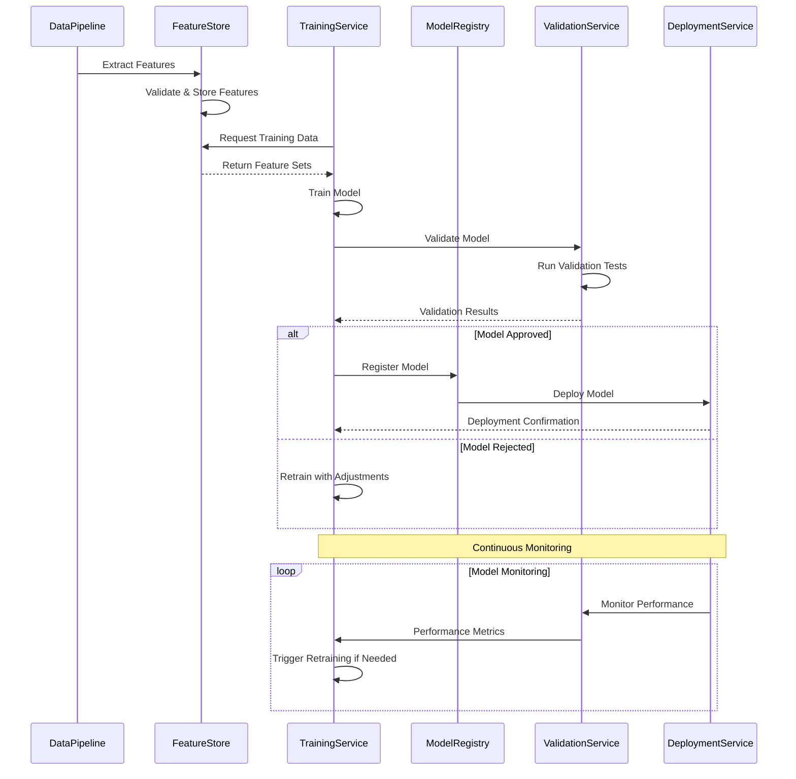
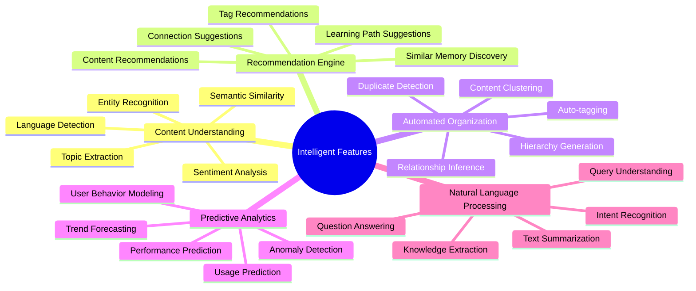
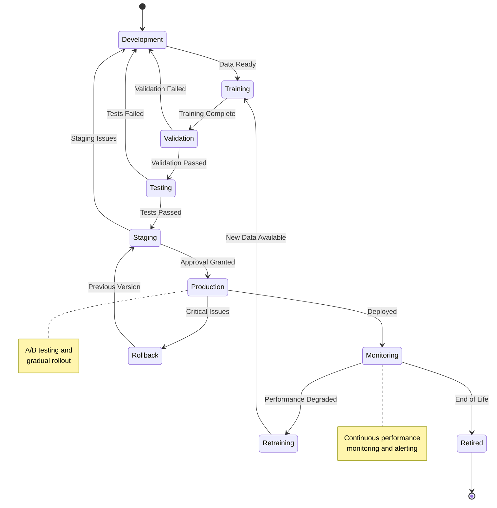

# Machine Learning Documentation

Welcome to the GraphMemory-IDE machine learning documentation. This module covers the ML pipeline, model training, feature extraction, and intelligent features that enhance the graph-based memory system.

## 🏗️ ML Pipeline Architecture

```mermaid
graph TB
    subgraph "Data Ingestion"
        TextInput[Text Input]
        GraphData[Graph Data]
        UserBehavior[User Behavior]
        Metadata[Metadata]
    end
    
    subgraph "Feature Engineering"
        TextProcessor[Text Processor]
        GraphFeatures[Graph Feature Extractor]
        BehaviorAnalyzer[Behavior Analyzer]
        FeatureCombiner[Feature Combiner]
    end
    
    subgraph "Model Pipeline"
        Embeddings[Embedding Models]
        Classification[Classification Models]
        Clustering[Clustering Models]
        Recommendation[Recommendation Models]
    end
    
    subgraph "Model Training"
        DataPrep[Data Preparation]
        Training[Model Training]
        Validation[Model Validation]
        Deployment[Model Deployment]
    end
    
    subgraph "Inference Engine"
        RealTimeInference[Real-time Inference]
        BatchInference[Batch Inference]
        ModelServing[Model Serving]
        ResultCache[Result Cache]
    end
    
    subgraph "Model Storage"
        ModelRegistry[Model Registry]
        VersionControl[Version Control]
        ModelArtifacts[Model Artifacts]
        Metrics[Performance Metrics]
    end
    
    TextInput --> TextProcessor
    GraphData --> GraphFeatures
    UserBehavior --> BehaviorAnalyzer
    Metadata --> FeatureCombiner
    
    TextProcessor --> Embeddings
    GraphFeatures --> Classification
    BehaviorAnalyzer --> Clustering
    FeatureCombiner --> Recommendation
    
    Embeddings --> DataPrep
    Classification --> Training
    Clustering --> Validation
    Recommendation --> Deployment
    
    DataPrep --> RealTimeInference
    Training --> BatchInference
    Validation --> ModelServing
    Deployment --> ResultCache
    
    RealTimeInference --> ModelRegistry
    BatchInference --> VersionControl
    ModelServing --> ModelArtifacts
    ResultCache --> Metrics
    
    style "Data Ingestion" fill:#e1f5fe
    style "Feature Engineering" fill:#e8f5e8
    style "Model Pipeline" fill:#fff3e0
    style "Model Training" fill:#fce4ec
    style "Inference Engine" fill:#f3e5f5
    style "Model Storage" fill:#e0f2f1
```

## 📚 Module Contents

### 🧠 [Model Architecture](./models.md)
Complete guide to ML models and neural network architectures.

**Topics Covered:**
- Embedding models (BERT, Sentence Transformers)
- Graph neural networks (GCN, GraphSAGE)
- Classification and clustering models
- Recommendation system architectures

### 🔧 [Feature Engineering](./features.md)
Comprehensive feature extraction and engineering pipeline.

**Topics Covered:**
- Text feature extraction
- Graph-based features
- User behavior features
- Feature selection and dimensionality reduction

### 🎯 [Model Training](./training.md)
Model training, validation, and optimization strategies.

**Topics Covered:**
- Training pipeline design
- Hyperparameter optimization
- Cross-validation strategies
- Model evaluation metrics

### 🚀 [Inference & Deployment](./inference.md)
Model deployment and real-time inference capabilities.

**Topics Covered:**
- Model serving architecture
- Real-time inference optimization
- Batch processing pipelines
- A/B testing and model monitoring

## 🔄 ML Training Pipeline

```mermaid
flowchart TD
    subgraph "Data Collection"
        RawData[Raw Data Collection]
        DataValidation[Data Validation]
        DataCleaning[Data Cleaning]
        DataSplitting[Train/Val/Test Split]
    end
    
    subgraph "Feature Engineering"
        FeatureExtraction[Feature Extraction]
        FeatureSelection[Feature Selection]
        FeatureScaling[Feature Scaling]
        FeatureStore[Feature Store]
    end
    
    subgraph "Model Development"
        ModelSelection[Model Selection]
        HyperparameterTuning[Hyperparameter Tuning]
        ModelTraining[Model Training]
        ModelValidation[Model Validation]
    end
    
    subgraph "Model Evaluation"
        PerformanceMetrics[Performance Metrics]
        ModelComparison[Model Comparison]
        ErrorAnalysis[Error Analysis]
        ModelApproval[Model Approval]
    end
    
    subgraph "Deployment"
        ModelPackaging[Model Packaging]
        ModelDeployment[Model Deployment]
        MonitoringSetup[Monitoring Setup]
        ProductionValidation[Production Validation]
    end
    
    RawData --> DataValidation
    DataValidation --> DataCleaning
    DataCleaning --> DataSplitting
    DataSplitting --> FeatureExtraction
    
    FeatureExtraction --> FeatureSelection
    FeatureSelection --> FeatureScaling
    FeatureScaling --> FeatureStore
    FeatureStore --> ModelSelection
    
    ModelSelection --> HyperparameterTuning
    HyperparameterTuning --> ModelTraining
    ModelTraining --> ModelValidation
    ModelValidation --> PerformanceMetrics
    
    PerformanceMetrics --> ModelComparison
    ModelComparison --> ErrorAnalysis
    ErrorAnalysis --> ModelApproval
    ModelApproval --> ModelPackaging
    
    ModelPackaging --> ModelDeployment
    ModelDeployment --> MonitoringSetup
    MonitoringSetup --> ProductionValidation
    
    style "Data Collection" fill:#e1f5fe
    style "Feature Engineering" fill:#e8f5e8
    style "Model Development" fill:#fff3e0
    style "Model Evaluation" fill:#fce4ec
    style "Deployment" fill:#f3e5f5
```

## 🧠 Model Architecture Overview

```mermaid
graph TB
    subgraph "Text Models"
        BERT[BERT Embeddings]
        SentenceTransformers[Sentence Transformers]
        TextClassifier[Text Classifier]
        TopicModeling[Topic Modeling]
    end
    
    subgraph "Graph Models"
        GCN[Graph Convolutional Network]
        GraphSAGE[GraphSAGE]
        NodeEmbeddings[Node Embeddings]
        LinkPrediction[Link Prediction]
    end
    
    subgraph "Recommendation Models"
        CollaborativeFiltering[Collaborative Filtering]
        ContentBased[Content-Based Filtering]
        HybridModel[Hybrid Recommendation]
        MatrixFactorization[Matrix Factorization]
    end
    
    subgraph "Clustering Models"
        KMeans[K-Means Clustering]
        DBSCAN[DBSCAN]
        HierarchicalClustering[Hierarchical Clustering]
        CommunityDetection[Community Detection]
    end
    
    subgraph "Ensemble Models"
        RandomForest[Random Forest]
        GradientBoosting[Gradient Boosting]
        VotingClassifier[Voting Classifier]
        StackingEnsemble[Stacking Ensemble]
    end
    
    BERT --> NodeEmbeddings
    SentenceTransformers --> ContentBased
    TextClassifier --> HybridModel
    TopicModeling --> CommunityDetection
    
    GCN --> LinkPrediction
    GraphSAGE --> CollaborativeFiltering
    NodeEmbeddings --> MatrixFactorization
    LinkPrediction --> KMeans
    
    CollaborativeFiltering --> RandomForest
    ContentBased --> GradientBoosting
    HybridModel --> VotingClassifier
    MatrixFactorization --> StackingEnsemble
    
    style "Text Models" fill:#e1f5fe
    style "Graph Models" fill:#e8f5e8
    style "Recommendation Models" fill:#fff3e0
    style "Clustering Models" fill:#fce4ec
    style "Ensemble Models" fill:#f3e5f5
```

## 🔧 Feature Engineering Pipeline

```mermaid
flowchart TD
    subgraph "Text Features"
        TextInput[Text Input]
        Tokenization[Tokenization]
        Embeddings[Word/Sentence Embeddings]
        TFIDFFeatures[TF-IDF Features]
        NERFeatures[Named Entity Features]
    end
    
    subgraph "Graph Features"
        GraphStructure[Graph Structure]
        NodeFeatures[Node Features]
        EdgeFeatures[Edge Features]
        CentralityFeatures[Centrality Features]
        CommunityFeatures[Community Features]
    end
    
    subgraph "Behavioral Features"
        UserActions[User Actions]
        AccessPatterns[Access Patterns]
        TimeFeatures[Temporal Features]
        InteractionFeatures[Interaction Features]
        PreferenceFeatures[Preference Features]
    end
    
    subgraph "Feature Processing"
        FeatureNormalization[Feature Normalization]
        FeatureSelection[Feature Selection]
        DimensionalityReduction[Dimensionality Reduction]
        FeatureCombination[Feature Combination]
    end
    
    subgraph "Feature Store"
        FeatureValidation[Feature Validation]
        FeatureVersioning[Feature Versioning]
        FeatureCaching[Feature Caching]
        FeatureServing[Feature Serving]
    end
    
    TextInput --> Tokenization
    Tokenization --> Embeddings
    Embeddings --> TFIDFFeatures
    TFIDFFeatures --> NERFeatures
    
    GraphStructure --> NodeFeatures
    NodeFeatures --> EdgeFeatures
    EdgeFeatures --> CentralityFeatures
    CentralityFeatures --> CommunityFeatures
    
    UserActions --> AccessPatterns
    AccessPatterns --> TimeFeatures
    TimeFeatures --> InteractionFeatures
    InteractionFeatures --> PreferenceFeatures
    
    NERFeatures --> FeatureNormalization
    CommunityFeatures --> FeatureSelection
    PreferenceFeatures --> DimensionalityReduction
    
    FeatureNormalization --> FeatureCombination
    FeatureSelection --> FeatureCombination
    DimensionalityReduction --> FeatureCombination
    
    FeatureCombination --> FeatureValidation
    FeatureValidation --> FeatureVersioning
    FeatureVersioning --> FeatureCaching
    FeatureCaching --> FeatureServing
    
    style "Text Features" fill:#e1f5fe
    style "Graph Features" fill:#e8f5e8
    style "Behavioral Features" fill:#fff3e0
    style "Feature Processing" fill:#fce4ec
    style "Feature Store" fill:#f3e5f5
```

## 🎯 Model Training Workflow



## 🚀 Real-time Inference Architecture

```mermaid
graph TB
    subgraph "Input Processing"
        APIRequest[API Request]
        InputValidation[Input Validation]
        FeatureExtraction[Feature Extraction]
        FeatureNormalization[Feature Normalization]
    end
    
    subgraph "Model Serving"
        ModelRouter[Model Router]
        ModelA[Model A v1.2]
        ModelB[Model B v2.1]
        ModelC[Model C v1.0]
        EnsembleModel[Ensemble Model]
    end
    
    subgraph "Inference Engine"
        BatchInference[Batch Inference]
        StreamInference[Stream Inference]
        CachedInference[Cached Inference]
        FallbackModel[Fallback Model]
    end
    
    subgraph "Post-processing"
        ResultAggregation[Result Aggregation]
        ConfidenceScoring[Confidence Scoring]
        ResultFiltering[Result Filtering]
        ResponseFormatting[Response Formatting]
    end
    
    subgraph "Monitoring & Feedback"
        PerformanceMonitoring[Performance Monitoring]
        ModelDrift[Model Drift Detection]
        FeedbackCollection[Feedback Collection]
        RetrainingTrigger[Retraining Trigger]
    end
    
    APIRequest --> InputValidation
    InputValidation --> FeatureExtraction
    FeatureExtraction --> FeatureNormalization
    FeatureNormalization --> ModelRouter
    
    ModelRouter --> ModelA
    ModelRouter --> ModelB
    ModelRouter --> ModelC
    ModelRouter --> EnsembleModel
    
    ModelA --> BatchInference
    ModelB --> StreamInference
    ModelC --> CachedInference
    EnsembleModel --> FallbackModel
    
    BatchInference --> ResultAggregation
    StreamInference --> ConfidenceScoring
    CachedInference --> ResultFiltering
    FallbackModel --> ResponseFormatting
    
    ResultAggregation --> PerformanceMonitoring
    ConfidenceScoring --> ModelDrift
    ResultFiltering --> FeedbackCollection
    ResponseFormatting --> RetrainingTrigger
    
    style "Input Processing" fill:#e1f5fe
    style "Model Serving" fill:#e8f5e8
    style "Inference Engine" fill:#fff3e0
    style "Post-processing" fill:#fce4ec
    style "Monitoring & Feedback" fill:#f3e5f5
```

## 🎨 Intelligent Features



## 📊 Model Performance Monitoring

```mermaid
graph TD
    subgraph "Performance Metrics"
        Accuracy[Accuracy Metrics]
        Precision[Precision/Recall]
        F1Score[F1 Score]
        AUC[AUC-ROC]
        Latency[Inference Latency]
    end
    
    subgraph "Data Quality Metrics"
        DataDrift[Data Drift]
        FeatureDrift[Feature Drift]
        LabelDrift[Label Drift]
        DataVolume[Data Volume]
        DataFreshness[Data Freshness]
    end
    
    subgraph "Model Health Metrics"
        ModelDrift[Model Drift]
        PredictionDrift[Prediction Drift]
        ConfidenceDistribution[Confidence Distribution]
        ErrorRate[Error Rate]
        BiasMetrics[Bias Metrics]
    end
    
    subgraph "Business Metrics"
        UserSatisfaction[User Satisfaction]
        EngagementMetrics[Engagement Metrics]
        ConversionRate[Conversion Rate]
        RevenueImpact[Revenue Impact]
        CostMetrics[Cost Metrics]
    end
    
    subgraph "Alerting & Actions"
        ThresholdAlerts[Threshold Alerts]
        AnomalyDetection[Anomaly Detection]
        AutoRetraining[Auto Retraining]
        ModelRollback[Model Rollback]
        HumanReview[Human Review]
    end
    
    Accuracy --> ThresholdAlerts
    DataDrift --> AnomalyDetection
    ModelDrift --> AutoRetraining
    UserSatisfaction --> ModelRollback
    
    ThresholdAlerts --> HumanReview
    AnomalyDetection --> AutoRetraining
    AutoRetraining --> ModelRollback
    ModelRollback --> HumanReview
    
    style "Performance Metrics" fill:#e1f5fe
    style "Data Quality Metrics" fill:#e8f5e8
    style "Model Health Metrics" fill:#fff3e0
    style "Business Metrics" fill:#fce4ec
    style "Alerting & Actions" fill:#f3e5f5
```

## 🔄 Model Lifecycle Management



## 🧪 Experimentation Framework

```mermaid
graph TB
    subgraph "Experiment Design"
        Hypothesis[Hypothesis Formation]
        ExperimentPlan[Experiment Plan]
        MetricDefinition[Metric Definition]
        SampleSize[Sample Size Calculation]
    end
    
    subgraph "Experiment Execution"
        TrafficSplitting[Traffic Splitting]
        ControlGroup[Control Group]
        TreatmentGroup[Treatment Group]
        DataCollection[Data Collection]
    end
    
    subgraph "Analysis & Evaluation"
        StatisticalAnalysis[Statistical Analysis]
        EffectSize[Effect Size Calculation]
        SignificanceTesting[Significance Testing]
        ConfidenceIntervals[Confidence Intervals]
    end
    
    subgraph "Decision Making"
        ResultInterpretation[Result Interpretation]
        BusinessImpact[Business Impact Assessment]
        RiskAssessment[Risk Assessment]
        GoNoGoDecision[Go/No-Go Decision]
    end
    
    Hypothesis --> ExperimentPlan
    ExperimentPlan --> MetricDefinition
    MetricDefinition --> SampleSize
    SampleSize --> TrafficSplitting
    
    TrafficSplitting --> ControlGroup
    TrafficSplitting --> TreatmentGroup
    ControlGroup --> DataCollection
    TreatmentGroup --> DataCollection
    
    DataCollection --> StatisticalAnalysis
    StatisticalAnalysis --> EffectSize
    EffectSize --> SignificanceTesting
    SignificanceTesting --> ConfidenceIntervals
    
    ConfidenceIntervals --> ResultInterpretation
    ResultInterpretation --> BusinessImpact
    BusinessImpact --> RiskAssessment
    RiskAssessment --> GoNoGoDecision
    
    style "Experiment Design" fill:#e1f5fe
    style "Experiment Execution" fill:#e8f5e8
    style "Analysis & Evaluation" fill:#fff3e0
    style "Decision Making" fill:#fce4ec
```

## 📖 Quick Reference

### Essential Commands
```bash
# Model Training
python -m server.ml.train --model embedding --data latest
python -m server.ml.train --model classifier --config config.yaml
python -m server.ml.evaluate --model-id model_123 --test-data test.csv

# Model Deployment
python -m server.ml.deploy --model-id model_123 --environment staging
python -m server.ml.serve --model embedding --port 8080
python -m server.ml.monitor --model-id model_123 --metrics all

# Feature Engineering
python -m server.ml.features --extract --source graph
python -m server.ml.features --validate --feature-set latest
python -m server.ml.features --serve --feature-store redis
```

### Key Configuration
```yaml
# ML Configuration
ML_MODEL_REGISTRY: "s3://models/"
ML_FEATURE_STORE: "redis://localhost:6379"
ML_TRAINING_DATA: "data/training/"
ML_BATCH_SIZE: 32
ML_LEARNING_RATE: 0.001
ML_MAX_EPOCHS: 100
```

### API Examples
```python
# Model Inference
POST /api/v1/ml/predict
{
    "model": "text_classifier",
    "input": {"text": "Sample text for classification"},
    "options": {"confidence_threshold": 0.8}
}

# Feature Extraction
POST /api/v1/ml/features
{
    "input_type": "text",
    "input_data": "Sample text",
    "feature_types": ["embeddings", "tfidf", "ner"]
}
```

---

**Next Steps:**
- [Model Architecture Guide](./models.md)
- [Feature Engineering Pipeline](./features.md)
- [Model Training & Validation](./training.md)
- [Inference & Deployment](./inference.md) 