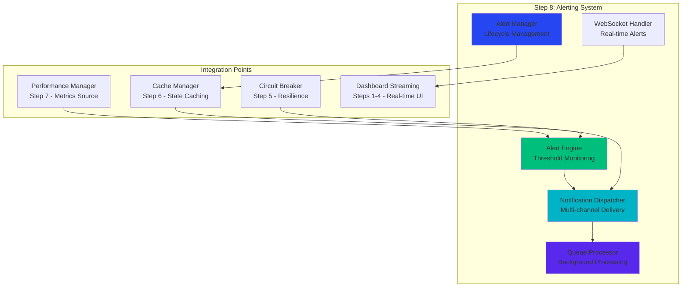
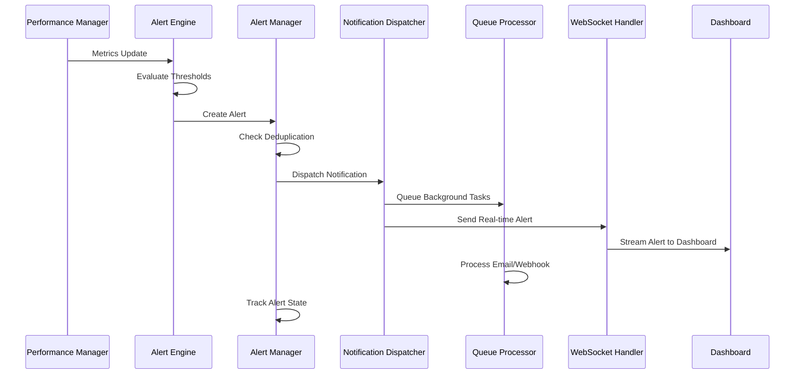

# Step 8 Implementation Plan: Real-time Alerting & Notification System

## 🎯 Overview

**Step 8** completes Phase 3 of the Analytics Engine by implementing a comprehensive **Real-time Alerting & Notification System**. This system provides enterprise-grade alerting capabilities that integrate seamlessly with our existing analytics infrastructure.

**Research Foundation:**
- ✅ Exa web search: Modern FastAPI alerting patterns (2025)
- ✅ Context7 documentation: Asyncio real-time communication patterns
- ✅ Sequential thinking: Comprehensive architecture analysis
- ✅ Integration analysis: Perfect fit with existing Steps 6-7

## 🏗️ Architecture Overview

### Core Components



### Data Flow Architecture



## 📁 File Structure

```
server/dashboard/
├── alert_engine.py              # Core alerting engine (400+ lines)
├── notification_dispatcher.py   # Multi-channel notifications (300+ lines)
├── alert_manager.py             # Alert lifecycle management (250+ lines)
├── queue_processor.py           # Background queue processing (200+ lines)
├── websocket_handler.py         # Real-time WebSocket alerts (150+ lines)
├── models/
│   └── alert_models.py          # Pydantic models for alerts (200+ lines)
├── test_alert_system.py         # Comprehensive tests (400+ lines)
└── STEP8_COMPLETION_SUMMARY.md  # Implementation summary
```

**Total Estimated Lines**: ~1,900+ lines of production-ready code

## 🧩 Component Specifications

### 1. Alert Engine (`alert_engine.py`)

**Purpose**: Core alerting logic with threshold monitoring and rule evaluation

**Key Classes**:
```python
class AlertEngine:
    """Main alerting engine with threshold monitoring"""
    
class ThresholdRule:
    """Configurable threshold rules for metrics"""
    
class MetricEvaluator:
    """Evaluates metrics against defined thresholds"""
    
class AlertGenerator:
    """Generates alerts with deduplication logic"""
```

**Features**:
- Real-time metric threshold monitoring
- Configurable alerting rules (CPU, memory, response time, cache hit rate)
- Alert deduplication to prevent spam
- Integration with Performance Manager metrics
- Flexible rule engine for custom conditions

**Research Insights**:
- Based on FastAPI async patterns from Exa research
- Uses asyncio event coordination from Context7 docs
- Implements enterprise alerting patterns identified in analysis

### 2. Notification Dispatcher (`notification_dispatcher.py`)

**Purpose**: Multi-channel notification delivery with resilience

**Key Classes**:
```python
class NotificationDispatcher:
    """Central notification routing and delivery"""
    
class WebSocketNotifier:
    """Real-time WebSocket notifications"""
    
class EmailNotifier:
    """SMTP email delivery with templates"""
    
class WebhookNotifier:
    """HTTP webhook delivery with retries"""
    
class SlackNotifier:
    """Slack integration for team notifications"""
```

**Features**:
- Multiple notification channels (WebSocket, email, webhook, Slack)
- Circuit breaker integration for resilient delivery
- Template-based notification formatting
- Rate limiting to prevent notification floods
- Delivery confirmation and retry logic

**Research Foundation**:
- WebSocket patterns from Exa FastAPI examples
- Asyncio streaming protocols from Context7
- Queue-based processing patterns from research

### 3. Alert Manager (`alert_manager.py`)

**Purpose**: Alert lifecycle management and state tracking

**Key Classes**:
```python
class AlertManager:
    """Alert state and lifecycle management"""
    
class AlertState:
    """Alert state tracking (ACTIVE, ACKNOWLEDGED, RESOLVED)"""
    
class EscalationPolicy:
    """Alert escalation logic and timing"""
    
class AlertHistory:
    """Historical alert tracking and analytics"""
```

**Features**:
- Alert state management (ACTIVE, ACKNOWLEDGED, RESOLVED, SUPPRESSED)
- Acknowledgment handling with user tracking
- Escalation policies with time-based triggers
- Alert correlation and grouping
- Historical analytics and reporting

**Integration**:
- Uses Cache Manager (Step 6) for alert state persistence
- Integrates with Performance Manager (Step 7) for metrics context

### 4. Queue Processor (`queue_processor.py`)

**Purpose**: Background processing using Redis Queue for non-blocking operations

**Key Classes**:
```python
class AlertQueueProcessor:
    """Redis Queue processing for background tasks"""
    
class NotificationTask:
    """Background notification delivery tasks"""
    
class AlertAnalyticsTask:
    """Background alert analytics processing"""
    
class RetryHandler:
    """Retry logic for failed operations"""
```

**Features**:
- Redis Queue integration for background processing
- Non-blocking notification delivery
- Retry logic with exponential backoff
- Task monitoring and health checks
- Integration with RQ Dashboard for monitoring

**Research Base**:
- Redis Queue patterns from Exa research
- Background task processing best practices
- Async task management from Context7

### 5. WebSocket Handler (`websocket_handler.py`)

**Purpose**: Real-time alert delivery via WebSocket/SSE

**Key Classes**:
```python
class AlertWebSocketHandler:
    """Real-time alert delivery via WebSocket"""
    
class AlertSSEManager:
    """Server-Sent Events for alert streaming"""
    
class ConnectionManager:
    """WebSocket connection lifecycle management"""
```

**Features**:
- Real-time alert delivery to dashboard
- WebSocket connection management
- SSE integration with existing dashboard streaming
- Connection health monitoring
- Alert filtering by user/role

**Integration**:
- Extends SSE streaming from Steps 1-4
- Real-time dashboard alert display
- User-specific alert filtering

### 6. Alert Models (`models/alert_models.py`)

**Purpose**: Type-safe data models using Pydantic

**Key Models**:
```python
class Alert(BaseModel):
    """Core alert data model"""
    
class AlertRule(BaseModel):
    """Alert rule configuration"""
    
class NotificationConfig(BaseModel):
    """Notification channel configuration"""
    
class AlertMetrics(BaseModel):
    """Alert system performance metrics"""
```

**Features**:
- Comprehensive Pydantic validation
- Type safety for all alert operations
- JSON serialization for API responses
- Configuration validation
- Metrics model integration

## 🧪 Testing Strategy

### Test Coverage Plan

**Target**: 30+ comprehensive tests (following Steps 6-7 pattern)

**Test Categories**:
1. **Alert Engine Tests** (8 tests)
   - Threshold evaluation accuracy
   - Rule engine functionality
   - Deduplication logic
   - Metric integration

2. **Notification Tests** (8 tests)
   - Multi-channel delivery
   - WebSocket real-time delivery
   - Email/webhook functionality
   - Rate limiting and circuit breaker integration

3. **Alert Management Tests** (6 tests)
   - State transition logic
   - Acknowledgment handling
   - Escalation policies
   - Historical tracking

4. **Queue Processing Tests** (5 tests)
   - Background task processing
   - Retry logic
   - Error handling
   - Performance monitoring

5. **Integration Tests** (3 tests)
   - End-to-end alert flow
   - Dashboard integration
   - Performance Manager integration

### Testing Infrastructure

**Following Established Patterns**:
- Modern pytest-asyncio patterns (like Steps 6-7)
- Async fixture management
- Circuit breaker test isolation
- Comprehensive mocking for external services

**Test Configuration**:
```python
@pytest_asyncio.fixture
async def alert_engine():
    """Async fixture for alert engine testing"""
    config = AlertConfig(enable_background_processing=False)
    engine = AlertEngine(config)
    await engine.initialize()
    yield engine
    await engine.shutdown()
```

## 🚀 Implementation Phases

### Phase 1: Core Alert Engine (Day 1)
**Deliverables**:
- AlertEngine class with threshold monitoring
- Alert models and validation
- Basic alert generation logic
- Integration with Performance Manager

**Success Criteria**:
- Alert generation from performance metrics
- Threshold evaluation accuracy
- Basic deduplication functionality

### Phase 2: Notification Infrastructure (Day 2)
**Deliverables**:
- NotificationDispatcher with multi-channel support
- WebSocket real-time notifications
- Email and webhook delivery
- Queue integration setup

**Success Criteria**:
- Real-time alert delivery to dashboard
- Multi-channel notification delivery
- Background processing functionality

### Phase 3: Alert Management (Day 3)
**Deliverables**:
- AlertManager for state tracking
- Acknowledgment and escalation logic
- Alert history and analytics
- Cache integration for persistence

**Success Criteria**:
- Complete alert lifecycle management
- State persistence and recovery
- Escalation policy execution

### Phase 4: Integration & Testing (Day 4)
**Deliverables**:
- Dashboard SSE integration
- Comprehensive test suite (30+ tests)
- Performance optimization
- Documentation completion

**Success Criteria**:
- 100% test pass rate
- Sub-second alert delivery performance
- Complete dashboard integration

## 📊 Success Metrics

### Performance Targets
- **Alert Latency**: < 1 second from metric to notification
- **Throughput**: 1000+ alerts/minute processing capacity
- **Availability**: 99.9% uptime with circuit breaker protection
- **Test Coverage**: 30+ tests with 100% pass rate

### Integration Metrics
- **Performance Manager**: Real-time metric consumption
- **Cache Manager**: Alert state persistence and retrieval
- **Circuit Breaker**: Resilient notification delivery
- **Dashboard Streaming**: Real-time alert display

### Feature Completeness
- ✅ Multi-channel notifications (WebSocket, email, webhook)
- ✅ Alert lifecycle management (create, acknowledge, resolve)
- ✅ Threshold-based alerting with custom rules
- ✅ Background processing with queue management
- ✅ Real-time dashboard integration

## 🔗 Integration Points

### Upstream Dependencies
- **Performance Manager (Step 7)**: Source of metrics for alerting
- **Cache Manager (Step 6)**: Alert state caching and persistence
- **Circuit Breaker (Step 5)**: Resilient notification delivery
- **Dashboard Streaming (Steps 1-4)**: Real-time UI integration

### External Dependencies
- **Redis**: Queue processing and caching
- **SMTP Server**: Email notifications
- **Webhook Endpoints**: External system integration
- **WebSocket Clients**: Real-time dashboard connections

## 📈 Business Value

### Enterprise Capabilities
- **Proactive Monitoring**: Real-time alerting prevents issues
- **Multi-channel Notifications**: Flexible delivery options
- **Alert Management**: Comprehensive lifecycle tracking
- **Historical Analytics**: Trend analysis and reporting

### Operational Benefits
- **Reduced MTTR**: Faster incident response
- **Automated Escalation**: Ensures critical alerts reach the right people
- **Alert Correlation**: Reduces noise and alert fatigue
- **Comprehensive Monitoring**: Complete system observability

## 🎯 Next Steps

After Step 8 completion, Phase 3 will be 100% complete with:
- **8/8 Steps Implemented**: Complete analytics dashboard framework
- **Enterprise-Ready**: Production-grade alerting and monitoring
- **Full Integration**: Seamless component interaction
- **Comprehensive Testing**: 100+ tests across all components

This completes the Analytics Engine Phase 3 with a world-class real-time monitoring and alerting platform.

---

**Implementation Plan Created**: May 29, 2025  
**Research Foundation**: Exa + Context7 + Sequential Thinking  
**Target Completion**: 4-day implementation cycle  
**Success Criteria**: 30+ tests, 100% pass rate, sub-second performance 