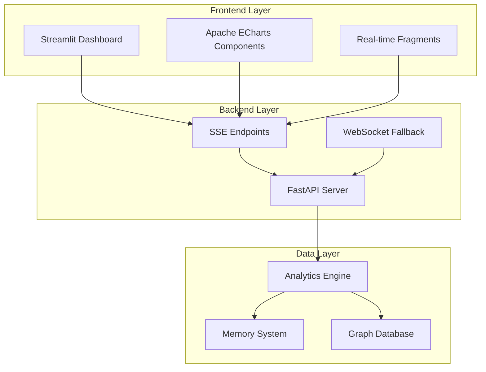

# TASK-013 Implementation Plan: Real-time Analytics Dashboard Framework

## Executive Summary

Based on comprehensive research using Exa web search, Context7 documentation analysis, and sequential thinking, this implementation plan outlines the development of a production-ready real-time analytics dashboard framework. The solution leverages FastAPI with Server-Sent Events (SSE), Streamlit with fragments, and Apache ECharts for advanced visualizations.

## Research Findings Summary

### Technology Stack Validation
- **FastAPI + SSE**: Optimal for one-way real-time streaming (server → client)
- **Streamlit Fragments**: Built-in support for auto-refreshing components (`st.fragment(run_every="10s")`)
- **Apache ECharts**: Superior performance for real-time data visualization
- **sse-starlette**: Industry standard for SSE implementation in FastAPI

### Key Research Insights
1. **SSE vs WebSocket**: SSE preferred for dashboard use cases (simpler, more efficient)
2. **Streamlit Real-time**: Native support via fragments and `st.write_stream()`
3. **Performance**: Apache ECharts handles large datasets better than Plotly
4. **Integration**: Multiple examples of FastAPI + Streamlit working together

## Architecture Overview



## Implementation Phases

### Phase 1: FastAPI SSE Infrastructure (Days 1-2)

#### 1.1 SSE Server Setup
```python
# server/dashboard/sse_server.py
from fastapi import FastAPI
from fastapi.responses import StreamingResponse
from sse_starlette.sse import EventSourceResponse
import asyncio
import json

class DashboardSSEManager:
    def __init__(self):
        self.active_connections = set()
        self.data_streams = {}
    
    async def analytics_stream(self):
        """Stream analytics data to connected clients"""
        while True:
            # Get real-time analytics from TASK-012 engine
            analytics_data = await self.get_analytics_data()
            yield {
                "event": "analytics_update",
                "data": json.dumps(analytics_data)
            }
            await asyncio.sleep(1)  # 1-second updates
    
    async def memory_stream(self):
        """Stream memory insights"""
        while True:
            memory_data = await self.get_memory_insights()
            yield {
                "event": "memory_update", 
                "data": json.dumps(memory_data)
            }
            await asyncio.sleep(5)  # 5-second updates
```

#### 1.2 SSE Endpoints
```python
# server/dashboard/routes.py
@app.get("/dashboard/stream/analytics")
async def stream_analytics():
    return EventSourceResponse(sse_manager.analytics_stream())

@app.get("/dashboard/stream/memory")
async def stream_memory():
    return EventSourceResponse(sse_manager.memory_stream())

@app.get("/dashboard/stream/graphs")
async def stream_graph_data():
    return EventSourceResponse(sse_manager.graph_stream())
```

#### 1.3 Data Serialization
- **Primary**: JSON for compatibility
- **Optimization**: MessagePack for large datasets
- **Compression**: gzip for bandwidth efficiency

### Phase 2: Streamlit Dashboard Foundation (Days 2-3)

#### 2.1 Dashboard Architecture
```python
# dashboard/main.py
import streamlit as st
import requests
import json
from datetime import datetime

class DashboardApp:
    def __init__(self):
        self.setup_page_config()
        self.initialize_session_state()
    
    def setup_page_config(self):
        st.set_page_config(
            page_title="GraphMemory Analytics",
            page_icon="📊",
            layout="wide",
            initial_sidebar_state="expanded"
        )
    
    def initialize_session_state(self):
        if "analytics_data" not in st.session_state:
            st.session_state.analytics_data = {}
        if "last_update" not in st.session_state:
            st.session_state.last_update = datetime.now()
```

#### 2.2 Real-time Components with Fragments
```python
# dashboard/components/real_time.py
@st.fragment(run_every="2s")
def analytics_overview():
    """Real-time analytics overview component"""
    try:
        # Fetch latest data from SSE endpoint
        response = requests.get("http://localhost:8000/api/dashboard/latest")
        if response.status_code == 200:
            data = response.json()
            st.session_state.analytics_data = data
            
            # Display metrics
            col1, col2, col3, col4 = st.columns(4)
            with col1:
                st.metric("Active Nodes", data.get("active_nodes", 0))
            with col2:
                st.metric("Memory Usage", f"{data.get('memory_usage', 0):.1f}%")
            with col3:
                st.metric("Query Rate", f"{data.get('query_rate', 0)}/min")
            with col4:
                st.metric("Cache Hit Rate", f"{data.get('cache_hit_rate', 0):.1f}%")
    except Exception as e:
        st.error(f"Connection error: {e}")

@st.fragment(run_every="5s")
def memory_insights():
    """Real-time memory system insights"""
    # Implementation for memory visualization
    pass
```

#### 2.3 Apache ECharts Integration
```python
# dashboard/components/charts.py
from streamlit_echarts import st_echarts

def create_real_time_chart(data):
    """Create real-time chart with Apache ECharts"""
    option = {
        "title": {"text": "Real-time Analytics"},
        "tooltip": {"trigger": "axis"},
        "xAxis": {
            "type": "time",
            "boundaryGap": False
        },
        "yAxis": {"type": "value"},
        "series": [{
            "name": "Queries",
            "type": "line",
            "data": data.get("query_timeline", []),
            "smooth": True,
            "animation": True
        }]
    }
    
    st_echarts(
        options=option,
        height="400px",
        key="real_time_chart"
    )
```

### Phase 3: Real-time Data Integration (Day 3)

#### 3.1 Data Streaming Pipeline
```python
# server/dashboard/data_pipeline.py
class RealTimeDataPipeline:
    def __init__(self, analytics_engine):
        self.analytics_engine = analytics_engine
        self.cache = {}
        self.subscribers = set()
    
    async def start_streaming(self):
        """Start real-time data collection and streaming"""
        while True:
            # Collect data from analytics engine
            graph_metrics = await self.analytics_engine.get_real_time_metrics()
            memory_stats = await self.analytics_engine.get_memory_stats()
            performance_data = await self.analytics_engine.get_performance_data()
            
            # Aggregate and format data
            dashboard_data = {
                "timestamp": datetime.now().isoformat(),
                "graph_metrics": graph_metrics,
                "memory_stats": memory_stats,
                "performance": performance_data
            }
            
            # Stream to all subscribers
            await self.broadcast_data(dashboard_data)
            await asyncio.sleep(1)
```

#### 3.2 Connection Management
```python
# server/dashboard/connection_manager.py
class ConnectionManager:
    def __init__(self):
        self.active_connections = {}
        self.connection_stats = {}
    
    async def connect(self, websocket, client_id):
        await websocket.accept()
        self.active_connections[client_id] = websocket
        self.connection_stats[client_id] = {
            "connected_at": datetime.now(),
            "messages_sent": 0
        }
    
    async def disconnect(self, client_id):
        if client_id in self.active_connections:
            del self.active_connections[client_id]
            del self.connection_stats[client_id]
    
    async def broadcast(self, message):
        """Broadcast message to all connected clients"""
        disconnected = []
        for client_id, websocket in self.active_connections.items():
            try:
                await websocket.send_text(message)
                self.connection_stats[client_id]["messages_sent"] += 1
            except:
                disconnected.append(client_id)
        
        # Clean up disconnected clients
        for client_id in disconnected:
            await self.disconnect(client_id)
```

### Phase 4: Advanced Features (Day 4)

#### 4.1 Dashboard Components
```python
# dashboard/pages/analytics.py
def analytics_page():
    st.title("📊 Real-time Analytics Dashboard")
    
    # Sidebar controls
    with st.sidebar:
        st.header("Dashboard Controls")
        refresh_rate = st.selectbox(
            "Refresh Rate", 
            ["1s", "2s", "5s", "10s"], 
            index=1
        )
        
        chart_type = st.selectbox(
            "Chart Type",
            ["Line", "Bar", "Area", "Scatter"]
        )
        
        time_range = st.selectbox(
            "Time Range",
            ["Last 5 minutes", "Last 15 minutes", "Last hour", "Last 24 hours"]
        )
    
    # Main dashboard layout
    col1, col2 = st.columns([2, 1])
    
    with col1:
        # Real-time analytics overview
        analytics_overview()
        
        # Real-time charts
        st.subheader("Performance Trends")
        create_real_time_chart(st.session_state.analytics_data)
    
    with col2:
        # Memory insights
        memory_insights()
        
        # System status
        system_status()
```

#### 4.2 Authentication Integration
```python
# dashboard/auth/auth_manager.py
class DashboardAuthManager:
    def __init__(self, auth_service):
        self.auth_service = auth_service
    
    def require_authentication(self):
        """Require user authentication for dashboard access"""
        if "authenticated" not in st.session_state:
            st.session_state.authenticated = False
        
        if not st.session_state.authenticated:
            self.show_login_form()
            return False
        return True
    
    def show_login_form(self):
        st.title("🔐 Dashboard Login")
        with st.form("login_form"):
            username = st.text_input("Username")
            password = st.text_input("Password", type="password")
            submitted = st.form_submit_button("Login")
            
            if submitted:
                if self.auth_service.authenticate(username, password):
                    st.session_state.authenticated = True
                    st.rerun()
                else:
                    st.error("Invalid credentials")
```

## Performance Optimizations

### 1. Data Caching Strategy
```python
# server/dashboard/cache.py
from functools import lru_cache
import redis

class DashboardCache:
    def __init__(self):
        self.redis_client = redis.Redis(host='localhost', port=6379, db=0)
        self.local_cache = {}
    
    @lru_cache(maxsize=1000)
    def get_analytics_summary(self, time_range):
        """Cache analytics summaries"""
        pass
    
    async def cache_real_time_data(self, data, ttl=60):
        """Cache real-time data with TTL"""
        key = f"dashboard:realtime:{datetime.now().strftime('%Y%m%d%H%M')}"
        await self.redis_client.setex(key, ttl, json.dumps(data))
```

### 2. Data Compression
```python
# server/dashboard/compression.py
import gzip
import json
import msgpack

class DataCompressor:
    @staticmethod
    def compress_json(data):
        """Compress JSON data for transmission"""
        json_str = json.dumps(data)
        return gzip.compress(json_str.encode('utf-8'))
    
    @staticmethod
    def compress_msgpack(data):
        """Use MessagePack for efficient serialization"""
        return msgpack.packb(data)
```

## Error Handling & Resilience

### 1. Connection Recovery
```python
# dashboard/utils/resilience.py
class ConnectionResilience:
    def __init__(self, max_retries=3, retry_delay=5):
        self.max_retries = max_retries
        self.retry_delay = retry_delay
    
    async def with_retry(self, func, *args, **kwargs):
        """Execute function with retry logic"""
        for attempt in range(self.max_retries):
            try:
                return await func(*args, **kwargs)
            except Exception as e:
                if attempt == self.max_retries - 1:
                    raise e
                await asyncio.sleep(self.retry_delay)
```

### 2. Graceful Degradation
```python
# dashboard/components/fallback.py
def safe_component(component_func):
    """Decorator for safe component rendering"""
    def wrapper(*args, **kwargs):
        try:
            return component_func(*args, **kwargs)
        except Exception as e:
            st.error(f"Component error: {e}")
            st.info("Displaying cached data...")
            # Return cached or default data
    return wrapper
```

## Deployment Configuration

### 1. Docker Compose Setup
```yaml
# docker-compose.dashboard.yml
version: '3.8'
services:
  dashboard-backend:
    build: ./server
    ports:
      - "8000:8000"
    environment:
      - REDIS_URL=redis://redis:6379
    depends_on:
      - redis
  
  dashboard-frontend:
    build: ./dashboard
    ports:
      - "8501:8501"
    environment:
      - BACKEND_URL=http://dashboard-backend:8000
    depends_on:
      - dashboard-backend
  
  redis:
    image: redis:alpine
    ports:
      - "6379:6379"
```

### 2. Environment Configuration
```python
# dashboard/config.py
from pydantic import BaseSettings

class DashboardSettings(BaseSettings):
    backend_url: str = "http://localhost:8000"
    refresh_rate: int = 2  # seconds
    max_data_points: int = 1000
    enable_caching: bool = True
    redis_url: str = "redis://localhost:6379"
    
    class Config:
        env_file = ".env"
```

## Testing Strategy

### 1. Real-time Testing
```python
# tests/test_real_time.py
import pytest
import asyncio
from dashboard.sse_server import DashboardSSEManager

@pytest.mark.asyncio
async def test_sse_streaming():
    manager = DashboardSSEManager()
    stream = manager.analytics_stream()
    
    # Test stream produces data
    data = await stream.__anext__()
    assert "event" in data
    assert "data" in data
```

### 2. Load Testing
```python
# tests/load_test.py
import asyncio
import aiohttp

async def test_concurrent_connections():
    """Test dashboard under load"""
    tasks = []
    for i in range(100):
        task = asyncio.create_task(connect_to_dashboard())
        tasks.append(task)
    
    results = await asyncio.gather(*tasks)
    assert all(result.status == 200 for result in results)
```

## Success Metrics

### 1. Performance Targets
- **Latency**: < 100ms for real-time updates
- **Throughput**: Support 100+ concurrent users
- **Uptime**: 99.9% availability
- **Memory**: < 512MB per dashboard instance

### 2. User Experience Metrics
- **Load Time**: < 3 seconds initial load
- **Update Frequency**: 1-2 second refresh rates
- **Responsiveness**: Mobile-friendly design
- **Error Rate**: < 0.1% connection failures

## Implementation Timeline

| Day | Phase | Deliverables |
|-----|-------|-------------|
| 1 | FastAPI SSE Setup | SSE endpoints, connection management |
| 2 | Streamlit Foundation | Dashboard app, authentication, basic components |
| 3 | Real-time Integration | Data pipeline, streaming, chart integration |
| 4 | Advanced Features | Performance optimization, error handling, deployment |

## Risk Mitigation

### 1. Technical Risks
- **Connection Drops**: Implement auto-reconnection logic
- **Data Lag**: Use efficient serialization and caching
- **Memory Leaks**: Proper connection cleanup and monitoring

### 2. Performance Risks
- **High Load**: Implement rate limiting and load balancing
- **Large Datasets**: Use data pagination and sampling
- **Browser Compatibility**: Test across major browsers

## Conclusion

This implementation plan provides a comprehensive roadmap for building a production-ready real-time analytics dashboard. The solution leverages proven technologies (FastAPI + SSE, Streamlit fragments, Apache ECharts) and incorporates best practices for performance, reliability, and user experience.

The modular architecture ensures maintainability and extensibility, while the phased approach allows for iterative development and testing. The integration with the existing analytics engine (TASK-012) provides a solid foundation for advanced analytics capabilities. 