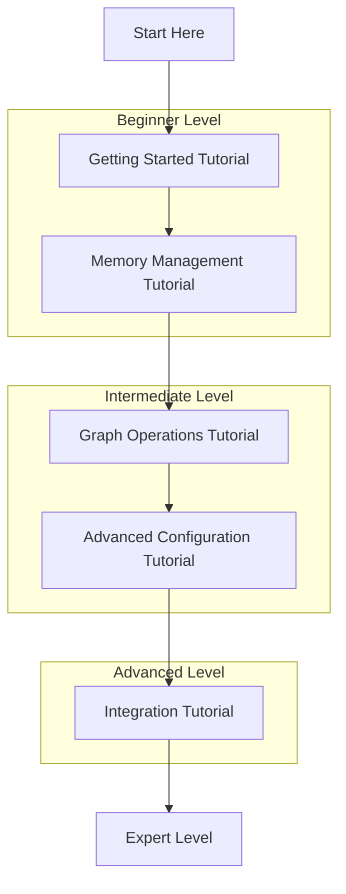

# GraphMemory-IDE Tutorials

Welcome to the GraphMemory-IDE tutorial collection! These step-by-step guides will help you learn how to use GraphMemory-IDE effectively, from basic setup to advanced features.

## 🎯 Learning Path

## 📚 Available Tutorials

### 🌱 Beginner Level

#### [Getting Started Tutorial](getting-started.md)
**Time: 15 minutes** | **Prerequisites: None**

Learn the basics of GraphMemory-IDE by setting up your first memory system and creating your initial memories. You'll understand the core concepts and be ready to explore more advanced features.

**What you'll learn:**
- Install and configure GraphMemory-IDE
- Create your first memories
- Understand memory types and tags
- Use basic search functionality

---

#### [Memory Management Tutorial](memory-management.md)
**Time: 20 minutes** | **Prerequisites: Getting Started**

Master the art of organizing and managing your memories effectively. Learn best practices for structuring your knowledge and maintaining a clean memory system.

**What you'll learn:**
- Organize memories with tags and categories
- Create meaningful relationships between memories
- Use metadata effectively
- Implement memory lifecycle management

---

### 🚀 Intermediate Level

#### [Graph Operations Tutorial](graph-operations.md)
**Time: 30 minutes** | **Prerequisites: Memory Management**

Dive deep into the graph database capabilities of GraphMemory-IDE. Learn how to query, visualize, and manipulate your knowledge graph for powerful insights.

**What you'll learn:**
- Write Cypher queries for complex data retrieval
- Create and manage relationships
- Visualize your knowledge graph
- Perform graph analytics

---

#### [Advanced Configuration Tutorial](advanced-configuration.md)
**Time: 25 minutes** | **Prerequisites: Graph Operations**

Configure GraphMemory-IDE for production use with security, performance optimization, and advanced features.

**What you'll learn:**
- Set up mTLS authentication
- Configure performance optimization
- Implement backup strategies
- Monitor system health

---

### 🎓 Advanced Level

#### [Integration Tutorial](integration.md)
**Time: 45 minutes** | **Prerequisites: Advanced Configuration**

Learn how to integrate GraphMemory-IDE with external systems, build custom plugins, and create automated workflows.

**What you'll learn:**
- Build custom integrations
- Create automated memory workflows
- Develop plugins and extensions
- Implement CI/CD pipelines

---

## 🎯 Tutorial Guidelines

### How to Use These Tutorials

1. **Follow the order**: Tutorials build upon each other, so start with the basics
2. **Hands-on learning**: Each tutorial includes practical exercises
3. **Take your time**: Don't rush - understanding is more important than speed
4. **Practice**: Try variations of the examples to deepen your understanding

### What You'll Need

- **Computer**: Mac, Windows, or Linux
- **Docker**: For containerized deployment
- **Text Editor**: VS Code, Vim, or your preferred editor
- **Terminal**: Command line access
- **Time**: 15-45 minutes per tutorial

### Learning Approach

These tutorials follow the **learning-oriented** approach:

- **Step-by-step guidance**: Clear, sequential instructions
- **Practical examples**: Real-world scenarios you can relate to
- **Immediate feedback**: See results as you progress
- **Safe environment**: Learn without fear of breaking anything

## 🆘 Getting Help

If you get stuck during any tutorial:

1. **Check the troubleshooting section** in each tutorial
2. **Review the [Troubleshooting Guide](../../TROUBLESHOOTING.md)**
3. **Ask questions** in [GitHub Discussions](https://github.com/elementalcollision/GraphMemory-IDE/discussions)
4. **Report issues** if you find errors in the tutorials

## 🔄 Tutorial Feedback

Help us improve these tutorials:

- **Rate tutorials** after completion
- **Suggest improvements** via GitHub issues
- **Share your experience** in discussions
- **Contribute** additional tutorials

## 📖 Related Documentation

- **[User Guide](../USER_GUIDE.md)** - Comprehensive feature documentation
- **[API Guide](../API_GUIDE.md)** - Complete API reference
- **[Developer Guide](../DEVELOPER_GUIDE.md)** - Development and contribution guide
- **[Troubleshooting](../../TROUBLESHOOTING.md)** - Problem-solving guide

---

*Ready to start learning? Begin with the [Getting Started Tutorial](getting-started.md) and embark on your GraphMemory-IDE journey!* 