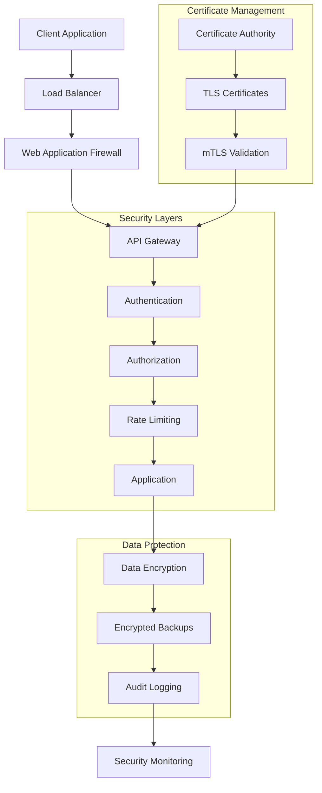
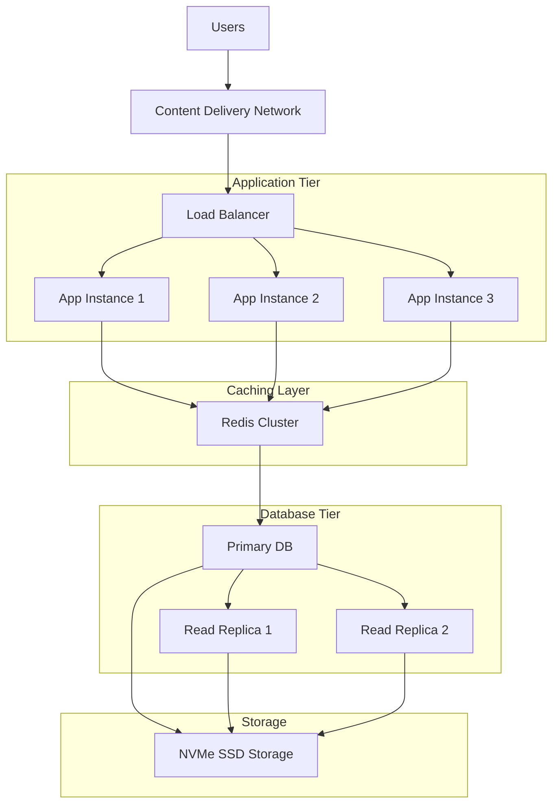
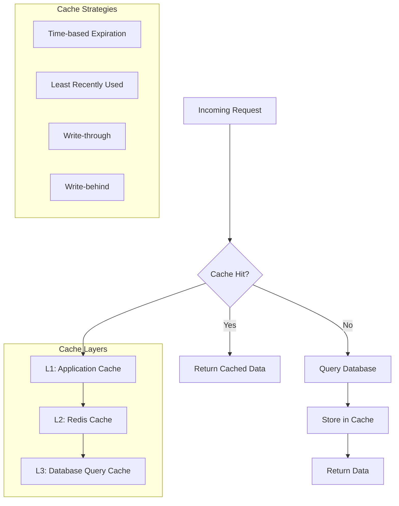
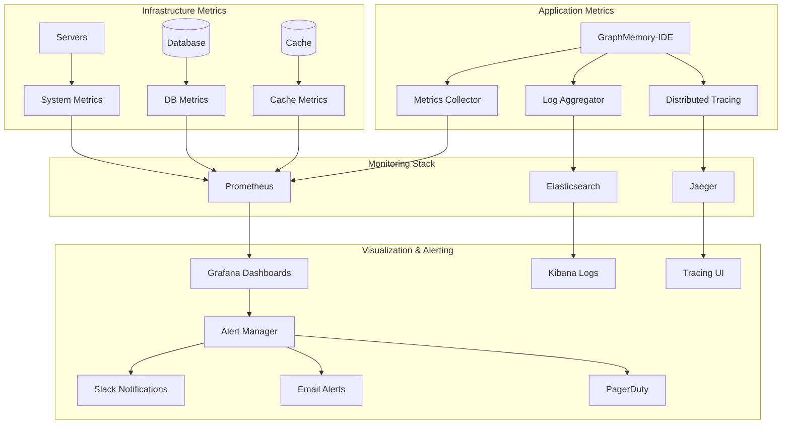
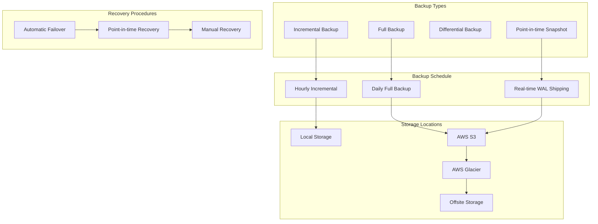
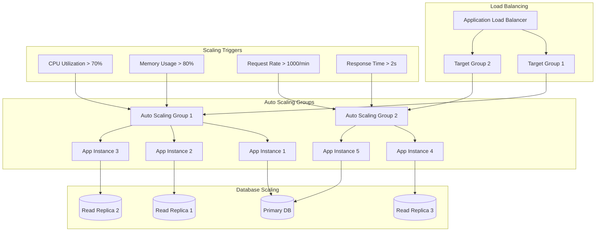
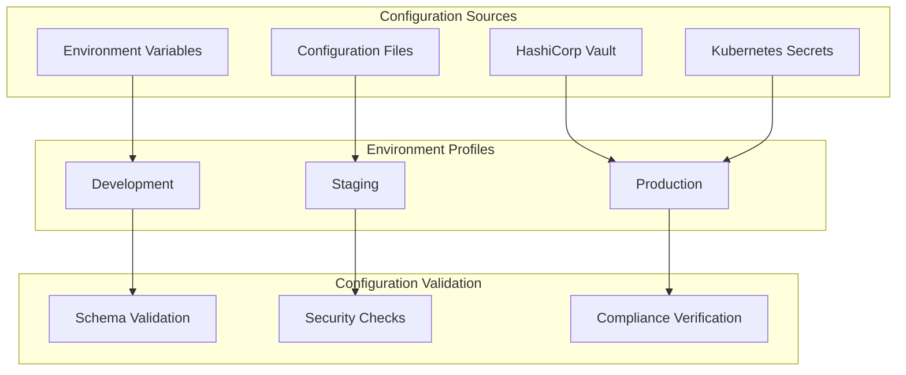
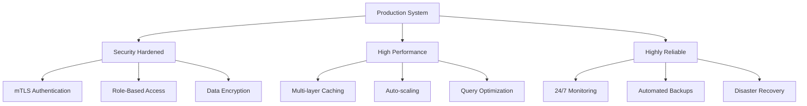

# Advanced Configuration Tutorial

**Time Required:** 25 minutes  
**Prerequisites:** [Graph Operations Tutorial](graph-operations.md)  
**Difficulty:** Advanced

Welcome to the Advanced Configuration Tutorial! You've mastered graph operations, and now it's time to prepare GraphMemory-IDE for production use. You'll learn security hardening, performance optimization, monitoring setup, and scaling strategies.

## 🎯 What You'll Learn

- Configure production-grade security with mTLS
- Optimize performance for large-scale deployments
- Set up comprehensive monitoring and alerting
- Implement backup and disaster recovery
- Configure auto-scaling and load balancing
- Harden the system against security threats

## 📋 What You'll Need

- GraphMemory-IDE development environment
- Production server or cloud environment
- SSL certificates for mTLS (or ability to generate them)
- 25 minutes of focused time
- Basic understanding of system administration

## 🔒 Step 1: Security Hardening

Let's start by implementing production-grade security measures.

### Security Architecture Overview



### 1.1 Configure mTLS Authentication

Create the mTLS configuration:

```bash
# Generate Certificate Authority
openssl genrsa -out ca-key.pem 4096
openssl req -new -x509 -days 365 -key ca-key.pem -out ca-cert.pem \
    -subj "/C=US/ST=CA/L=San Francisco/O=GraphMemory/CN=GraphMemory-CA"

# Generate server certificate
openssl genrsa -out server-key.pem 4096
openssl req -new -key server-key.pem -out server-csr.pem \
    -subj "/C=US/ST=CA/L=San Francisco/O=GraphMemory/CN=api.graphmemory.local"
openssl x509 -req -days 365 -in server-csr.pem -CA ca-cert.pem \
    -CAkey ca-key.pem -CAcreateserial -out server-cert.pem

# Generate client certificate
openssl genrsa -out client-key.pem 4096
openssl req -new -key client-key.pem -out client-csr.pem \
    -subj "/C=US/ST=CA/L=San Francisco/O=GraphMemory/CN=client"
openssl x509 -req -days 365 -in client-csr.pem -CA ca-cert.pem \
    -CAkey ca-key.pem -CAcreateserial -out client-cert.pem
```

Update your production configuration:

```yaml
# config/production.yml
security:
  mtls:
    enabled: true
    ca_cert_path: "/etc/ssl/certs/ca-cert.pem"
    server_cert_path: "/etc/ssl/certs/server-cert.pem"
    server_key_path: "/etc/ssl/private/server-key.pem"
    client_verification: "require"
    
  authentication:
    jwt:
      secret_key: "${JWT_SECRET_KEY}"
      algorithm: "RS256"
      expiration: 3600
      refresh_expiration: 86400
    
  authorization:
    rbac_enabled: true
    default_role: "viewer"
    admin_users: ["admin@company.com"]
    
  rate_limiting:
    enabled: true
    requests_per_minute: 100
    burst_size: 20
    
  cors:
    allowed_origins: ["https://app.company.com"]
    allowed_methods: ["GET", "POST", "PUT", "DELETE"]
    allowed_headers: ["Authorization", "Content-Type"]
```

### 1.2 Implement Security Headers

```python
# security/middleware.py
from fastapi import FastAPI, Request, Response
from fastapi.middleware.base import BaseHTTPMiddleware

class SecurityHeadersMiddleware(BaseHTTPMiddleware):
    async def dispatch(self, request: Request, call_next):
        response = await call_next(request)
        
        # Security headers
        response.headers["X-Content-Type-Options"] = "nosniff"
        response.headers["X-Frame-Options"] = "DENY"
        response.headers["X-XSS-Protection"] = "1; mode=block"
        response.headers["Strict-Transport-Security"] = "max-age=31536000; includeSubDomains"
        response.headers["Content-Security-Policy"] = "default-src 'self'"
        response.headers["Referrer-Policy"] = "strict-origin-when-cross-origin"
        
        return response
```

## ⚡ Step 2: Performance Optimization

Configure GraphMemory-IDE for high-performance production workloads.

### Performance Architecture



### 2.1 Database Optimization

Configure Kuzu for production performance:

```yaml
# config/database.yml
kuzu:
  performance:
    # Memory configuration
    buffer_pool_size: "8GB"
    max_memory_usage: "16GB"
    
    # Threading
    num_threads: 16
    parallel_execution: true
    
    # Storage optimization
    checkpoint_frequency: 300  # 5 minutes
    wal_flush_frequency: 1     # Immediate
    compression_enabled: true
    
    # Query optimization
    query_timeout: 30
    max_query_memory: "2GB"
    enable_query_cache: true
    cache_size: "1GB"
    
  indexes:
    # Automatic index creation
    auto_index: true
    index_memory_limit: "512MB"
    
    # Custom indexes for common queries
    memory_indexes:
      - property: "type"
      - property: "created_at"
      - property: "tags"
      - fulltext: "content"
```

### 2.2 Application Performance Tuning

```python
# config/performance.py
import asyncio
from fastapi import FastAPI
from contextlib import asynccontextmanager

@asynccontextmanager
async def lifespan(app: FastAPI):
    # Startup optimizations
    
    # Connection pooling
    app.state.db_pool = await create_connection_pool(
        min_size=10,
        max_size=50,
        max_queries=1000,
        max_inactive_connection_lifetime=300
    )
    
    # Cache warming
    await warm_cache()
    
    # Background tasks
    asyncio.create_task(background_maintenance())
    
    yield
    
    # Cleanup
    await app.state.db_pool.close()

# Memory management
MEMORY_CONFIG = {
    "max_memory_per_request": "100MB",
    "request_timeout": 30,
    "connection_timeout": 5,
    "read_timeout": 25,
    "write_timeout": 10
}

# Async optimization
ASYNC_CONFIG = {
    "max_concurrent_requests": 1000,
    "worker_processes": 4,
    "worker_connections": 1000,
    "keepalive_timeout": 65,
    "max_requests": 10000,
    "max_requests_jitter": 1000
}
```

### 2.3 Caching Strategy



Implement multi-layer caching:

```python
# caching/strategy.py
import redis
from typing import Any, Optional
import json
import hashlib

class CacheManager:
    def __init__(self):
        self.redis_client = redis.Redis(
            host='redis-cluster',
            port=6379,
            decode_responses=True,
            max_connections=100
        )
        self.local_cache = {}
        
    async def get(self, key: str) -> Optional[Any]:
        # L1: Local cache
        if key in self.local_cache:
            return self.local_cache[key]
            
        # L2: Redis cache
        cached = self.redis_client.get(key)
        if cached:
            data = json.loads(cached)
            self.local_cache[key] = data  # Populate L1
            return data
            
        return None
        
    async def set(self, key: str, value: Any, ttl: int = 300):
        # Store in both layers
        self.local_cache[key] = value
        self.redis_client.setex(
            key, 
            ttl, 
            json.dumps(value, default=str)
        )
        
    def cache_key(self, *args) -> str:
        """Generate consistent cache keys"""
        key_string = "|".join(str(arg) for arg in args)
        return hashlib.md5(key_string.encode()).hexdigest()
```

## 📊 Step 3: Monitoring and Observability

Set up comprehensive monitoring for production operations.

### Monitoring Architecture



### 3.1 Application Metrics

```python
# monitoring/metrics.py
from prometheus_client import Counter, Histogram, Gauge, start_http_server
import time
from functools import wraps

# Define metrics
REQUEST_COUNT = Counter(
    'graphmemory_requests_total',
    'Total requests',
    ['method', 'endpoint', 'status']
)

REQUEST_DURATION = Histogram(
    'graphmemory_request_duration_seconds',
    'Request duration',
    ['method', 'endpoint']
)

ACTIVE_CONNECTIONS = Gauge(
    'graphmemory_active_connections',
    'Active database connections'
)

MEMORY_USAGE = Gauge(
    'graphmemory_memory_usage_bytes',
    'Memory usage in bytes'
)

GRAPH_SIZE = Gauge(
    'graphmemory_graph_size',
    'Number of nodes and edges',
    ['type']
)

def monitor_performance(func):
    @wraps(func)
    async def wrapper(*args, **kwargs):
        start_time = time.time()
        try:
            result = await func(*args, **kwargs)
            REQUEST_COUNT.labels(
                method=request.method,
                endpoint=request.url.path,
                status='success'
            ).inc()
            return result
        except Exception as e:
            REQUEST_COUNT.labels(
                method=request.method,
                endpoint=request.url.path,
                status='error'
            ).inc()
            raise
        finally:
            REQUEST_DURATION.labels(
                method=request.method,
                endpoint=request.url.path
            ).observe(time.time() - start_time)
    return wrapper
```

### 3.2 Health Checks

```python
# monitoring/health.py
from fastapi import APIRouter, HTTPException
from typing import Dict, Any
import asyncio

router = APIRouter()

@router.get("/health")
async def health_check() -> Dict[str, Any]:
    """Comprehensive health check"""
    checks = await asyncio.gather(
        check_database(),
        check_cache(),
        check_memory(),
        check_disk_space(),
        return_exceptions=True
    )
    
    health_status = {
        "status": "healthy",
        "timestamp": datetime.utcnow().isoformat(),
        "checks": {
            "database": checks[0],
            "cache": checks[1],
            "memory": checks[2],
            "disk": checks[3]
        }
    }
    
    # Determine overall status
    if any(check.get("status") == "unhealthy" for check in checks if isinstance(check, dict)):
        health_status["status"] = "unhealthy"
        raise HTTPException(status_code=503, detail=health_status)
    
    return health_status

async def check_database() -> Dict[str, Any]:
    try:
        # Test database connectivity
        result = await db.execute("SELECT 1")
        return {
            "status": "healthy",
            "response_time_ms": 5,
            "connections": get_active_connections()
        }
    except Exception as e:
        return {
            "status": "unhealthy",
            "error": str(e)
        }
```

### 3.3 Alerting Configuration

```yaml
# monitoring/alerts.yml
groups:
  - name: graphmemory_alerts
    rules:
      - alert: HighErrorRate
        expr: rate(graphmemory_requests_total{status="error"}[5m]) > 0.1
        for: 2m
        labels:
          severity: warning
        annotations:
          summary: "High error rate detected"
          description: "Error rate is {{ $value }} errors per second"
          
      - alert: DatabaseConnectionsHigh
        expr: graphmemory_active_connections > 80
        for: 1m
        labels:
          severity: critical
        annotations:
          summary: "Database connections near limit"
          description: "Active connections: {{ $value }}"
          
      - alert: MemoryUsageHigh
        expr: graphmemory_memory_usage_bytes / (1024^3) > 14
        for: 5m
        labels:
          severity: warning
        annotations:
          summary: "High memory usage"
          description: "Memory usage: {{ $value }}GB"
          
      - alert: SlowQueries
        expr: histogram_quantile(0.95, rate(graphmemory_request_duration_seconds_bucket[5m])) > 2
        for: 3m
        labels:
          severity: warning
        annotations:
          summary: "Slow queries detected"
          description: "95th percentile response time: {{ $value }}s"
```

## 💾 Step 4: Backup and Disaster Recovery

Implement robust backup and recovery procedures.

### Backup Strategy



### 4.1 Automated Backup System

```bash
#!/bin/bash
# scripts/backup.sh

set -euo pipefail

BACKUP_DIR="/backups"
S3_BUCKET="graphmemory-backups"
RETENTION_DAYS=30
DATE=$(date +%Y%m%d_%H%M%S)

# Full database backup
backup_database() {
    echo "Starting database backup..."
    
    # Create backup directory
    mkdir -p "${BACKUP_DIR}/${DATE}"
    
    # Backup Kuzu database
    kuzu_backup \
        --source-path "/data/kuzu" \
        --backup-path "${BACKUP_DIR}/${DATE}/kuzu_backup" \
        --compression gzip
    
    # Backup configuration
    tar -czf "${BACKUP_DIR}/${DATE}/config_backup.tar.gz" \
        /etc/graphmemory/
    
    # Backup certificates
    tar -czf "${BACKUP_DIR}/${DATE}/certs_backup.tar.gz" \
        /etc/ssl/certs/ /etc/ssl/private/
    
    echo "Database backup completed"
}

# Upload to S3
upload_to_s3() {
    echo "Uploading backup to S3..."
    
    aws s3 sync "${BACKUP_DIR}/${DATE}" \
        "s3://${S3_BUCKET}/${DATE}/" \
        --storage-class STANDARD_IA \
        --server-side-encryption AES256
    
    echo "Upload completed"
}

# Cleanup old backups
cleanup_old_backups() {
    echo "Cleaning up old backups..."
    
    # Local cleanup
    find "${BACKUP_DIR}" -type d -mtime +7 -exec rm -rf {} +
    
    # S3 cleanup (lifecycle policy handles this)
    aws s3api put-bucket-lifecycle-configuration \
        --bucket "${S3_BUCKET}" \
        --lifecycle-configuration file://lifecycle.json
    
    echo "Cleanup completed"
}

# Main execution
main() {
    backup_database
    upload_to_s3
    cleanup_old_backups
    
    # Send notification
    curl -X POST "${SLACK_WEBHOOK}" \
        -H 'Content-type: application/json' \
        --data "{\"text\":\"✅ Backup completed successfully: ${DATE}\"}"
}

main "$@"
```

### 4.2 Disaster Recovery Plan

```yaml
# disaster_recovery/plan.yml
recovery_procedures:
  rto: 15  # Recovery Time Objective (minutes)
  rpo: 5   # Recovery Point Objective (minutes)
  
  scenarios:
    - name: "Database Corruption"
      steps:
        - "Stop application services"
        - "Restore from latest backup"
        - "Apply WAL logs since backup"
        - "Verify data integrity"
        - "Restart services"
      estimated_time: "10 minutes"
      
    - name: "Complete Server Failure"
      steps:
        - "Provision new server"
        - "Install GraphMemory-IDE"
        - "Restore from S3 backup"
        - "Update DNS records"
        - "Verify functionality"
      estimated_time: "30 minutes"
      
    - name: "Data Center Outage"
      steps:
        - "Activate secondary region"
        - "Restore from cross-region backup"
        - "Update load balancer"
        - "Notify users of temporary service"
      estimated_time: "45 minutes"

  testing:
    frequency: "monthly"
    last_test: "2025-01-15"
    next_test: "2025-02-15"
    success_criteria:
      - "RTO < 15 minutes"
      - "RPO < 5 minutes"
      - "100% data integrity"
      - "All services functional"
```

## 🚀 Step 5: Auto-Scaling and Load Balancing

Configure automatic scaling for varying workloads.

### Scaling Architecture



### 5.1 Auto-Scaling Configuration

```yaml
# infrastructure/autoscaling.yml
apiVersion: autoscaling/v2
kind: HorizontalPodAutoscaler
metadata:
  name: graphmemory-hpa
spec:
  scaleTargetRef:
    apiVersion: apps/v1
    kind: Deployment
    name: graphmemory-api
  minReplicas: 3
  maxReplicas: 20
  metrics:
    - type: Resource
      resource:
        name: cpu
        target:
          type: Utilization
          averageUtilization: 70
    - type: Resource
      resource:
        name: memory
        target:
          type: Utilization
          averageUtilization: 80
    - type: Pods
      pods:
        metric:
          name: requests_per_second
        target:
          type: AverageValue
          averageValue: "100"
  behavior:
    scaleUp:
      stabilizationWindowSeconds: 60
      policies:
        - type: Percent
          value: 100
          periodSeconds: 15
    scaleDown:
      stabilizationWindowSeconds: 300
      policies:
        - type: Percent
          value: 10
          periodSeconds: 60
```

### 5.2 Load Balancer Configuration

```nginx
# nginx/load_balancer.conf
upstream graphmemory_backend {
    least_conn;
    server app1.internal:8000 max_fails=3 fail_timeout=30s;
    server app2.internal:8000 max_fails=3 fail_timeout=30s;
    server app3.internal:8000 max_fails=3 fail_timeout=30s;
    
    # Health check
    keepalive 32;
}

server {
    listen 443 ssl http2;
    server_name api.graphmemory.com;
    
    # SSL configuration
    ssl_certificate /etc/ssl/certs/server-cert.pem;
    ssl_certificate_key /etc/ssl/private/server-key.pem;
    ssl_client_certificate /etc/ssl/certs/ca-cert.pem;
    ssl_verify_client on;
    
    # Security headers
    add_header Strict-Transport-Security "max-age=31536000; includeSubDomains" always;
    add_header X-Content-Type-Options nosniff always;
    add_header X-Frame-Options DENY always;
    
    # Rate limiting
    limit_req_zone $binary_remote_addr zone=api:10m rate=10r/s;
    limit_req zone=api burst=20 nodelay;
    
    location / {
        proxy_pass http://graphmemory_backend;
        proxy_set_header Host $host;
        proxy_set_header X-Real-IP $remote_addr;
        proxy_set_header X-Forwarded-For $proxy_add_x_forwarded_for;
        proxy_set_header X-Forwarded-Proto $scheme;
        
        # Timeouts
        proxy_connect_timeout 5s;
        proxy_send_timeout 60s;
        proxy_read_timeout 60s;
        
        # Health check
        proxy_next_upstream error timeout http_500 http_502 http_503;
    }
    
    location /health {
        access_log off;
        proxy_pass http://graphmemory_backend/health;
    }
}
```

## 🔧 Step 6: Environment-Specific Configuration

Set up configuration management for different environments.

### Configuration Management



### 6.1 Production Configuration Template

```yaml
# config/production.yml
environment: production

server:
  host: "0.0.0.0"
  port: 8000
  workers: 4
  max_requests: 10000
  timeout: 30
  keepalive: 2

database:
  kuzu:
    path: "/data/kuzu"
    buffer_pool_size: "8GB"
    num_threads: 16
    checkpoint_frequency: 300
    
security:
  mtls:
    enabled: true
    ca_cert_path: "${CA_CERT_PATH}"
    server_cert_path: "${SERVER_CERT_PATH}"
    server_key_path: "${SERVER_KEY_PATH}"
    
  jwt:
    secret_key: "${JWT_SECRET_KEY}"
    algorithm: "RS256"
    expiration: 3600
    
  rate_limiting:
    enabled: true
    requests_per_minute: 100
    burst_size: 20

monitoring:
  metrics:
    enabled: true
    port: 9090
    path: "/metrics"
    
  logging:
    level: "INFO"
    format: "json"
    file: "/var/log/graphmemory/app.log"
    max_size: "100MB"
    backup_count: 10
    
  tracing:
    enabled: true
    jaeger_endpoint: "http://jaeger:14268/api/traces"
    sample_rate: 0.1

backup:
  enabled: true
  schedule: "0 2 * * *"  # Daily at 2 AM
  retention_days: 30
  s3_bucket: "graphmemory-backups"
  encryption: true

performance:
  cache:
    redis:
      host: "redis-cluster"
      port: 6379
      max_connections: 100
      ttl: 300
      
  connection_pool:
    min_size: 10
    max_size: 50
    max_queries: 1000
    max_inactive_lifetime: 300
```

### 6.2 Configuration Validation

```python
# config/validator.py
from pydantic import BaseModel, validator
from typing import Optional, List
import os

class SecurityConfig(BaseModel):
    mtls_enabled: bool = True
    ca_cert_path: str
    server_cert_path: str
    server_key_path: str
    jwt_secret_key: str
    
    @validator('ca_cert_path', 'server_cert_path', 'server_key_path')
    def validate_cert_files(cls, v):
        if not os.path.exists(v):
            raise ValueError(f"Certificate file not found: {v}")
        return v
    
    @validator('jwt_secret_key')
    def validate_jwt_secret(cls, v):
        if len(v) < 32:
            raise ValueError("JWT secret key must be at least 32 characters")
        return v

class DatabaseConfig(BaseModel):
    path: str
    buffer_pool_size: str = "8GB"
    num_threads: int = 16
    
    @validator('path')
    def validate_db_path(cls, v):
        os.makedirs(v, exist_ok=True)
        return v

class ProductionConfig(BaseModel):
    environment: str = "production"
    security: SecurityConfig
    database: DatabaseConfig
    
    @validator('environment')
    def validate_environment(cls, v):
        if v not in ['development', 'staging', 'production']:
            raise ValueError("Invalid environment")
        return v

def load_config() -> ProductionConfig:
    """Load and validate production configuration"""
    config_data = load_yaml_config()
    return ProductionConfig(**config_data)
```

## 🎉 What You've Accomplished

Congratulations! You've configured GraphMemory-IDE for production:

✅ **Security Hardening** - mTLS, authentication, authorization, security headers  
✅ **Performance Optimization** - Database tuning, caching, connection pooling  
✅ **Monitoring Setup** - Metrics, logging, alerting, health checks  
✅ **Backup & Recovery** - Automated backups, disaster recovery procedures  
✅ **Auto-Scaling** - Load balancing, horizontal scaling, resource optimization  
✅ **Configuration Management** - Environment-specific configs, validation  

### Your Production-Ready System

You now have a robust, scalable production deployment:



## 🚀 Next Steps

Your production system is ready for enterprise use:

1. **[Integration Tutorial](integration.md)** - Custom integrations and workflows
2. **Deploy to production** - Apply your configuration to live environment
3. **Set up monitoring dashboards** - Create operational visibility
4. **Train your team** - Share operational procedures and troubleshooting

## 🛠️ Troubleshooting

### Common Production Issues

**Problem**: High memory usage
```bash
# Solution: Adjust buffer pool size
# Edit config/production.yml
database:
  kuzu:
    buffer_pool_size: "4GB"  # Reduce if needed
    max_memory_usage: "8GB"
```

**Problem**: SSL certificate errors
```bash
# Solution: Verify certificate chain
openssl verify -CAfile ca-cert.pem server-cert.pem
openssl x509 -in server-cert.pem -text -noout

# Check certificate expiration
openssl x509 -in server-cert.pem -noout -dates
```

**Problem**: Database connection timeouts
```yaml
# Solution: Adjust connection pool settings
performance:
  connection_pool:
    min_size: 5      # Reduce minimum
    max_size: 25     # Reduce maximum
    timeout: 10      # Increase timeout
```

### Getting Help

For production issues:
1. Check the [Troubleshooting Guide](../../TROUBLESHOOTING.md) for detailed solutions
2. Review monitoring dashboards for system health
3. Contact support with production logs and metrics

## 📚 Additional Resources

- **[Integration Tutorial](integration.md)** - Custom integrations and automated workflows
- **[Operations Guide](../../OPERATIONS.md)** - Complete production operations manual
- **[Troubleshooting Guide](../../TROUBLESHOOTING.md)** - Production issue resolution

---

**🎯 Ready for integrations?** Continue with the [Integration Tutorial](integration.md) to learn custom integrations and automated workflows.

*Outstanding work! You now have a production-ready GraphMemory-IDE deployment with enterprise-grade security, performance, and reliability.* 