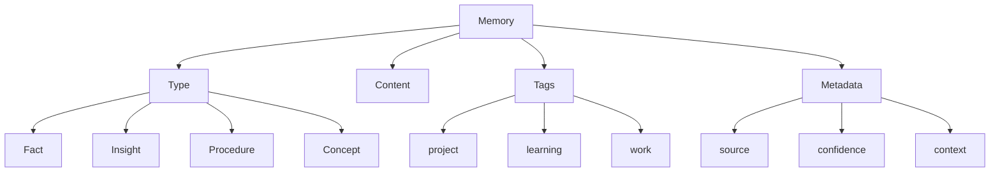
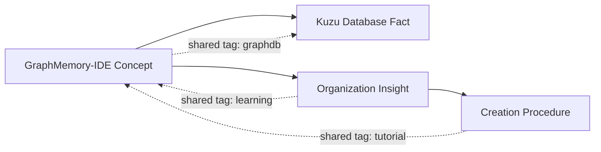
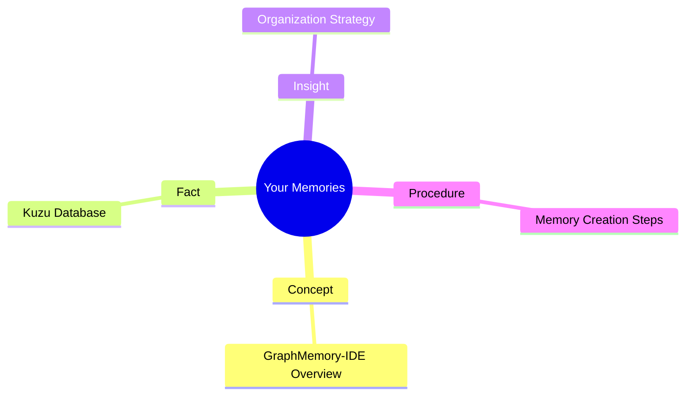

# Getting Started with GraphMemory-IDE

**Time Required:** 15 minutes  
**Prerequisites:** None  
**Difficulty:** Beginner

Welcome to GraphMemory-IDE! In this tutorial, you'll learn the basics of setting up and using GraphMemory-IDE to create and manage your first memories. By the end, you'll understand the core concepts and be ready to explore more advanced features.

## 🎯 What You'll Learn

- Install and configure GraphMemory-IDE
- Create your first memories
- Understand memory types and tags
- Use basic search functionality
- Navigate the web interface

## 📋 What You'll Need

- Computer with Docker installed
- Terminal/command line access
- Web browser
- 15 minutes of your time

## 🚀 Step 1: Installation

Let's start by getting GraphMemory-IDE running on your system.

### Download and Setup

1. **Clone the repository:**
   ```bash
   git clone https://github.com/elementalcollision/GraphMemory-IDE.git
   cd GraphMemory-IDE
   ```

2. **Start the services:**
   ```bash
   docker-compose up -d
   ```

3. **Verify everything is running:**
   ```bash
   docker-compose ps
   ```

   You should see services running on these ports:
   - **API Server**: http://localhost:8080
   - **Web Interface**: http://localhost:8081

### Quick Health Check

Let's make sure everything is working:

```bash
# Check API health
curl http://localhost:8080/health

# Expected response: {"status": "healthy"}
```

**🎉 Congratulations!** GraphMemory-IDE is now running on your system.

## 🧠 Step 2: Understanding Memory Concepts

Before we create memories, let's understand the key concepts:



### Memory Types

- **Fact**: Objective information (e.g., "The API runs on port 8080")
- **Insight**: Personal understanding (e.g., "Using tags helps organize memories")
- **Procedure**: Step-by-step instructions (e.g., "How to deploy the application")
- **Concept**: Abstract ideas (e.g., "Graph databases enable relationship queries")

### Tags

Tags help categorize and find memories. Use them to group related information:
- `project-name` for project-specific memories
- `learning` for educational content
- `troubleshooting` for problem-solving information

## 📝 Step 3: Creating Your First Memory

Now let's create your first memory using the web interface.

### Using the Web Interface

1. **Open your browser** and go to http://localhost:8081

2. **Create a new memory** by clicking the "New Memory" button

3. **Fill in the details:**
   ```
   Content: "GraphMemory-IDE helps organize knowledge using graph databases"
   Type: concept
   Tags: learning, graphdb, knowledge-management
   ```

4. **Click "Save"** to create your memory

### Using the CLI (Alternative)

If you prefer the command line:

```bash
# Install the CLI (if not already installed)
npm install -g @graphmemory/cli

# Create your first memory
graphmemory memory create \
  --content "GraphMemory-IDE helps organize knowledge using graph databases" \
  --type "concept" \
  --tags "learning,graphdb,knowledge-management"
```

**✅ Success!** You've created your first memory.

## 🔍 Step 4: Exploring Your Memory

Let's see what you've created and learn how to find it.

### View Your Memory

1. **In the web interface**, you should see your memory listed on the main page

2. **Click on the memory** to view its details

3. **Notice the information displayed:**
   - Content
   - Type
   - Tags
   - Creation timestamp
   - Unique ID

### Search for Your Memory

Let's try searching:

1. **Use the search box** at the top of the page

2. **Search for "graph"** - your memory should appear

3. **Try searching by tag**: Click on one of the tags to see all memories with that tag

## 📚 Step 5: Creating Related Memories

Let's create a few more memories to see how they connect.

### Memory 2: A Fact

Create a second memory:
```
Content: "Kuzu is the graph database used by GraphMemory-IDE"
Type: fact
Tags: graphdb, technical, kuzu
```

### Memory 3: An Insight

Create a third memory:
```
Content: "Organizing memories with consistent tags makes them easier to find later"
Type: insight
Tags: learning, organization, best-practices
```

### Memory 4: A Procedure

Create a fourth memory:
```
Content: "To create a memory: 1) Click New Memory, 2) Fill in content and type, 3) Add relevant tags, 4) Click Save"
Type: procedure
Tags: tutorial, how-to, basic-usage
```

## 🔗 Step 6: Understanding Relationships

GraphMemory-IDE automatically creates relationships between memories based on shared tags and content similarity.

### Viewing Relationships

1. **Click on any memory** to view its details

2. **Look for the "Related Memories" section** - you should see connections to other memories

3. **Click on related memories** to explore the connections

### Relationship Visualization



## 🎯 Step 7: Basic Search and Discovery

Now let's explore how to find information in your growing memory collection.

### Search Types

1. **Text Search**: Search for specific words or phrases
   - Try searching for "database"
   - Try searching for "organize"

2. **Tag Search**: Find memories by tags
   - Click on the "learning" tag
   - Click on the "graphdb" tag

3. **Type Filter**: Filter by memory type
   - Look for a filter option to show only "facts"
   - Try filtering for "insights"

### Search Tips

- **Use specific terms** for better results
- **Combine tags** to narrow down results
- **Use quotes** for exact phrase matching: "graph database"

## 🎉 Step 8: What You've Accomplished

Congratulations! You've successfully:

✅ **Installed GraphMemory-IDE**  
✅ **Created your first memories**  
✅ **Learned about memory types and tags**  
✅ **Explored relationships between memories**  
✅ **Used basic search functionality**  

### Your Memory Collection

You now have a small but functional memory collection:



## 🚀 Next Steps

Now that you understand the basics, you're ready to:

1. **[Memory Management Tutorial](memory-management.md)** - Learn advanced organization techniques
2. **Explore the API** - Try the interactive documentation at http://localhost:8080/docs
3. **Import existing data** - Learn how to bulk import your existing notes
4. **Customize your setup** - Configure GraphMemory-IDE for your specific needs

## 🛠️ Troubleshooting

### Common Issues

**Problem**: Services won't start
```bash
# Solution: Check if ports are available
lsof -i :8080
lsof -i :8081

# Kill processes if needed
sudo kill -9 $(lsof -t -i:8080)
```

**Problem**: Can't access web interface
```bash
# Solution: Check service status
docker-compose logs web-interface
```

**Problem**: Memory creation fails
- Check that all required fields are filled
- Ensure tags don't contain spaces (use hyphens instead)
- Verify the API is responding: `curl http://localhost:8080/health`

### Getting Help

If you encounter issues:
1. Check the [Troubleshooting Guide](../../TROUBLESHOOTING.md)
2. Review the logs: `docker-compose logs`
3. Ask for help in [GitHub Discussions](https://github.com/elementalcollision/GraphMemory-IDE/discussions)

## 📚 Additional Resources

- **[User Guide](../USER_GUIDE.md)** - Complete feature documentation
- **[API Guide](../API_GUIDE.md)** - API reference and examples
- **[CLI Documentation](../../cli/README.md)** - Command-line interface guide

---

**🎯 Ready for the next level?** Continue with the [Memory Management Tutorial](memory-management.md) to learn advanced organization techniques and best practices.

*Great job completing your first tutorial! You're well on your way to mastering GraphMemory-IDE.* 