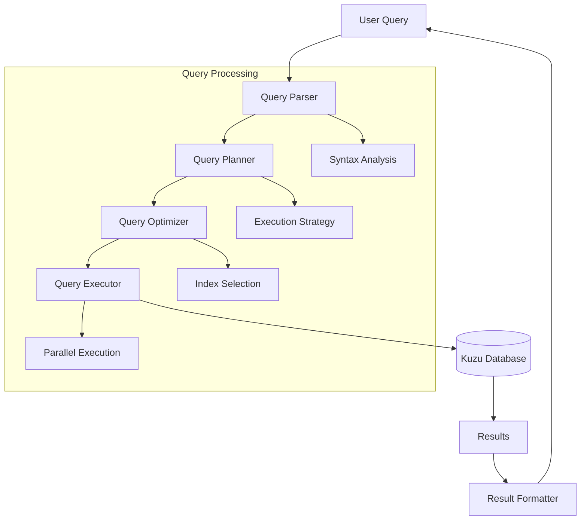
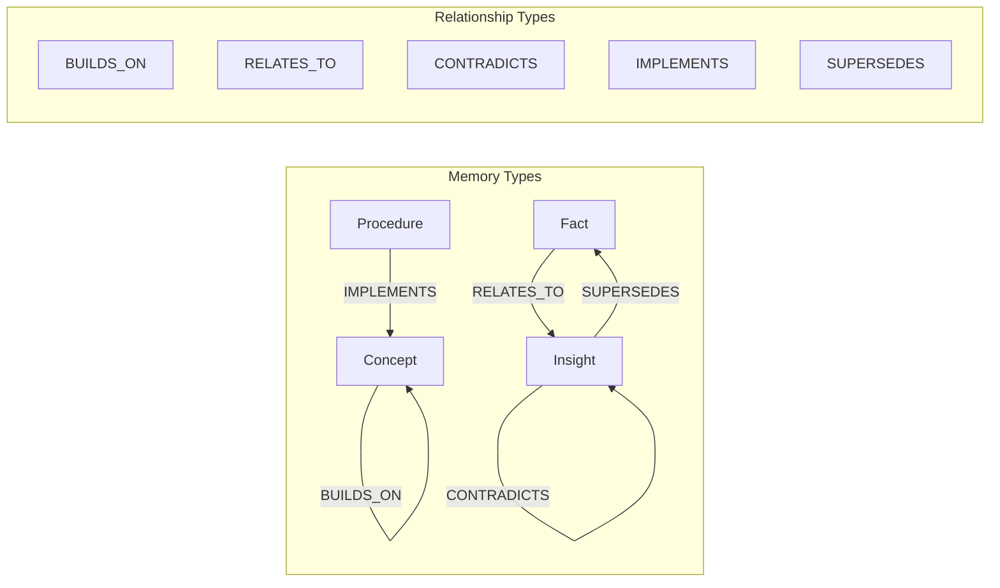
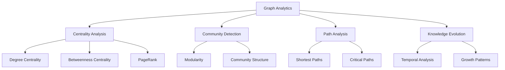
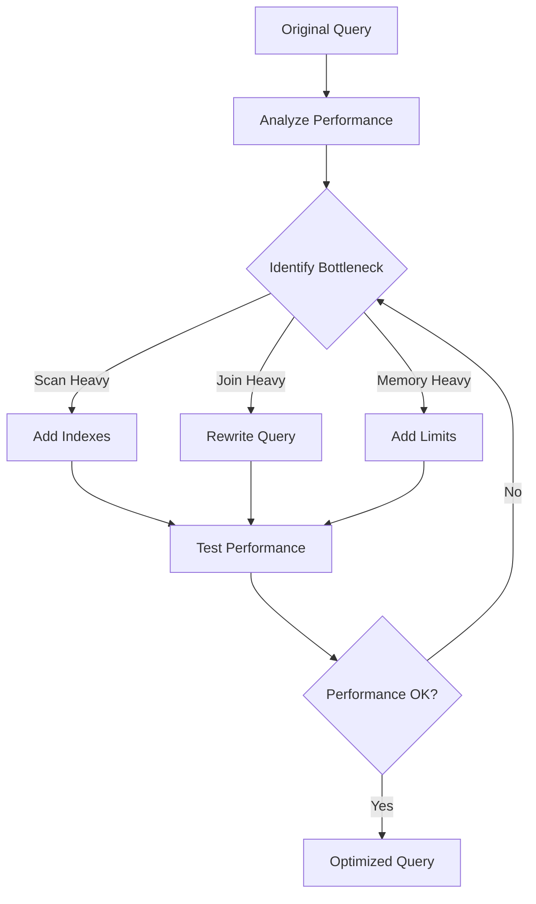
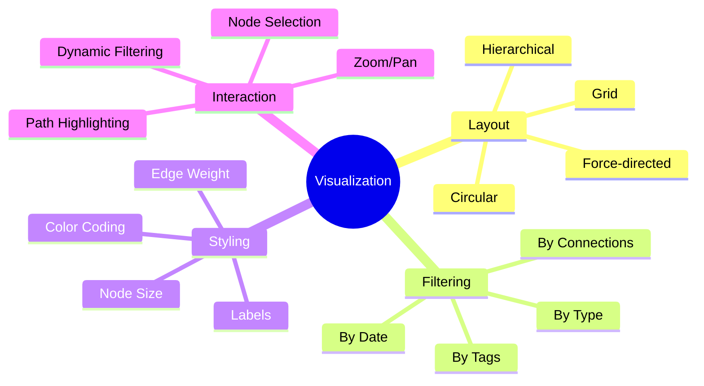
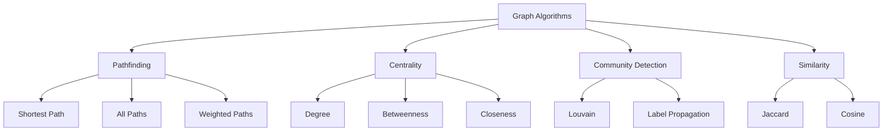
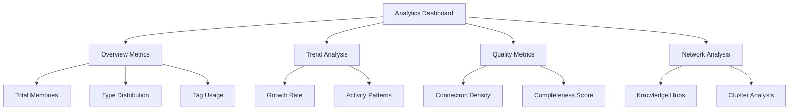
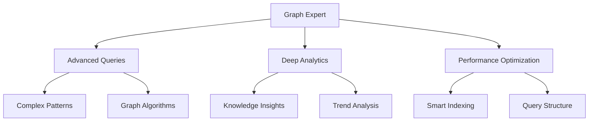

# Graph Operations Tutorial

**Time Required:** 30 minutes  
**Prerequisites:** [Memory Management Tutorial](memory-management.md)  
**Difficulty:** Intermediate

Welcome to the Graph Operations Tutorial! Now that you've mastered memory management, it's time to unlock the full power of GraphMemory-IDE's graph database capabilities. You'll learn how to write complex queries, perform graph analytics, and visualize your knowledge relationships.

## 🎯 What You'll Learn

- Write advanced Cypher queries for complex data retrieval
- Create and analyze relationship patterns
- Perform graph analytics and discover insights
- Visualize your knowledge graph effectively
- Optimize query performance
- Use graph algorithms for knowledge discovery

## 📋 What You'll Need

- GraphMemory-IDE running with your organized memory collection
- At least 20 memories with relationships (from previous tutorials)
- 30 minutes of focused time
- Basic understanding of graph concepts

## 🔍 Step 1: Understanding Graph Query Patterns

Let's start by understanding how graph queries work in GraphMemory-IDE.

### Query Flow Architecture



### Basic Query Patterns

Let's explore fundamental query patterns:

#### 1. Pattern Matching

```cypher
// Find all memories related to a specific topic
MATCH (m:Memory)-[r:RELATES_TO]->(topic:Memory)
WHERE topic.content CONTAINS 'machine learning'
RETURN m, r, topic
```

#### 2. Path Traversal

```cypher
// Find learning paths between concepts
MATCH path = (start:Memory)-[:BUILDS_ON*1..3]->(end:Memory)
WHERE start.type = 'concept' AND end.type = 'skill'
RETURN path, length(path) as steps
ORDER BY steps
```

#### 3. Aggregation Queries

```cypher
// Count memories by type and tag
MATCH (m:Memory)
UNWIND m.tags as tag
RETURN m.type, tag, count(*) as memory_count
ORDER BY memory_count DESC
```

## 📊 Step 2: Advanced Relationship Analysis

Now let's dive into analyzing the relationships in your knowledge graph.

### Relationship Types and Patterns



### Creating Complex Relationship Queries

Let's create some advanced relationship queries:

#### 1. Find Knowledge Clusters

```cypher
// Identify tightly connected knowledge clusters
MATCH (m:Memory)-[r]-(connected:Memory)
WITH m, count(connected) as connections
WHERE connections >= 3
MATCH (m)-[r]-(cluster:Memory)
RETURN m.content as center, 
       collect(cluster.content) as connected_memories,
       connections
ORDER BY connections DESC
LIMIT 10
```

#### 2. Discover Learning Dependencies

```cypher
// Find prerequisite chains for learning
MATCH path = (prerequisite:Memory)-[:BUILDS_ON*]->(target:Memory)
WHERE target.content CONTAINS 'advanced'
WITH prerequisite, target, length(path) as depth
ORDER BY depth DESC
RETURN prerequisite.content as start,
       target.content as goal,
       depth as learning_steps
```

#### 3. Identify Knowledge Gaps

```cypher
// Find concepts that lack supporting facts
MATCH (concept:Memory {type: 'concept'})
WHERE NOT (concept)<-[:SUPPORTS]-(fact:Memory {type: 'fact'})
RETURN concept.content as unsupported_concept,
       concept.tags as topics
```

## 🔬 Step 3: Graph Analytics and Insights

Let's perform analytics to discover patterns in your knowledge.

### Knowledge Graph Analytics



### Implementing Analytics Queries

#### 1. Find Central Knowledge Nodes

```cypher
// Identify the most connected memories (knowledge hubs)
MATCH (m:Memory)-[r]-(connected:Memory)
WITH m, count(r) as degree
ORDER BY degree DESC
LIMIT 10
RETURN m.content as knowledge_hub,
       m.type as type,
       degree as connections,
       m.tags as topics
```

#### 2. Discover Knowledge Communities

```cypher
// Find groups of related memories
MATCH (m1:Memory)-[r1]-(bridge:Memory)-[r2]-(m2:Memory)
WHERE m1 <> m2
WITH m1, m2, count(bridge) as shared_connections
WHERE shared_connections >= 2
RETURN m1.content as memory1,
       m2.content as memory2,
       shared_connections as strength
ORDER BY strength DESC
```

#### 3. Analyze Knowledge Evolution

```cypher
// Track how knowledge builds over time
MATCH (old:Memory)-[:SUPERSEDES]->(new:Memory)
RETURN old.content as previous_understanding,
       new.content as updated_understanding,
       old.created_at as old_date,
       new.created_at as new_date
ORDER BY new_date DESC
```

## 📈 Step 4: Performance Optimization

Learn how to optimize your graph queries for better performance.

### Query Optimization Strategies



### Optimization Techniques

#### 1. Use Indexes Effectively

```cypher
// Create indexes for frequently queried properties
CREATE INDEX ON :Memory(type);
CREATE INDEX ON :Memory(created_at);
CREATE FULLTEXT INDEX memory_content FOR (m:Memory) ON EACH [m.content];
```

#### 2. Optimize Query Structure

```cypher
// Instead of this (slow):
MATCH (m:Memory)
WHERE m.content CONTAINS 'search_term'
RETURN m;

// Use this (faster with full-text index):
CALL db.index.fulltext.queryNodes('memory_content', 'search_term')
YIELD node
RETURN node;
```

#### 3. Limit Result Sets

```cypher
// Always use LIMIT for large datasets
MATCH (m:Memory)-[r]->(related:Memory)
RETURN m, r, related
ORDER BY m.created_at DESC
LIMIT 100;
```

## 🎨 Step 5: Graph Visualization Techniques

Learn how to visualize your knowledge graph effectively.

### Visualization Strategies



### Creating Visualization Queries

#### 1. Prepare Data for Visualization

```cypher
// Get graph structure for visualization
MATCH (m:Memory)-[r]-(connected:Memory)
RETURN {
  nodes: collect(DISTINCT {
    id: m.id,
    label: substring(m.content, 0, 50),
    type: m.type,
    tags: m.tags,
    size: size((m)-[]-())
  }),
  edges: collect({
    source: m.id,
    target: connected.id,
    type: type(r),
    weight: coalesce(r.strength, 1.0)
  })
}
```

#### 2. Create Filtered Views

```cypher
// Visualize only high-value connections
MATCH (m:Memory)-[r]-(connected:Memory)
WHERE r.strength >= 0.7 OR size((m)-[]-()) >= 5
RETURN m, r, connected
```

## 🔍 Step 6: Advanced Graph Algorithms

Explore sophisticated graph algorithms for knowledge discovery.

### Algorithm Applications



### Implementing Graph Algorithms

#### 1. Find Shortest Learning Paths

```cypher
// Find the shortest path between two concepts
MATCH (start:Memory {content: 'basic programming'}),
      (end:Memory {content: 'advanced algorithms'})
MATCH path = shortestPath((start)-[:BUILDS_ON*]-(end))
RETURN path, length(path) as steps
```

#### 2. Calculate Knowledge Centrality

```cypher
// Find memories that bridge different knowledge domains
MATCH (m:Memory)
MATCH (m)-[r1]-(neighbor1:Memory),
      (m)-[r2]-(neighbor2:Memory)
WHERE neighbor1.tags[0] <> neighbor2.tags[0]
WITH m, count(DISTINCT neighbor1.tags[0]) as domain_connections
WHERE domain_connections >= 3
RETURN m.content as bridge_knowledge,
       domain_connections as domains_connected
ORDER BY domains_connected DESC
```

#### 3. Detect Knowledge Communities

```cypher
// Group memories by shared characteristics
MATCH (m:Memory)
WITH m.tags[0] as primary_tag, collect(m) as memories
WHERE size(memories) >= 3
UNWIND memories as memory
MATCH (memory)-[r]-(related:Memory)
WHERE related.tags[0] = primary_tag
RETURN primary_tag as community,
       count(DISTINCT memory) as community_size,
       count(r) as internal_connections
ORDER BY community_size DESC
```

## 🎯 Step 7: Real-World Analytics Examples

Let's apply what you've learned to practical scenarios.

### Scenario 1: Project Knowledge Audit

```cypher
// Analyze knowledge coverage for a project
MATCH (m:Memory)
WHERE 'project-alpha' IN m.tags
WITH m.type as knowledge_type, count(*) as count
RETURN knowledge_type, count,
       round(100.0 * count / sum(count)) as percentage
ORDER BY count DESC
```

### Scenario 2: Learning Progress Tracking

```cypher
// Track learning progression over time
MATCH (m:Memory)
WHERE 'learning' IN m.tags
WITH date(m.created_at) as learning_date, 
     m.type as knowledge_type,
     count(*) as daily_count
ORDER BY learning_date
RETURN learning_date, knowledge_type, daily_count,
       sum(daily_count) OVER (
         PARTITION BY knowledge_type 
         ORDER BY learning_date
       ) as cumulative_count
```

### Scenario 3: Knowledge Gap Analysis

```cypher
// Identify areas needing more documentation
MATCH (m:Memory)
UNWIND m.tags as tag
WITH tag, 
     collect(DISTINCT m.type) as types_present,
     count(*) as total_memories
WHERE size(types_present) < 3  // Missing some knowledge types
RETURN tag as topic,
       types_present as available_types,
       ['fact', 'insight', 'procedure', 'concept'] as needed_types,
       total_memories
ORDER BY total_memories DESC
```

## 📊 Step 8: Building Analytics Dashboards

Create reusable analytics queries for ongoing insights.

### Dashboard Query Collection



### Dashboard Queries

#### 1. Knowledge Overview

```cypher
// Get comprehensive knowledge statistics
MATCH (m:Memory)
OPTIONAL MATCH (m)-[r]-()
RETURN {
  total_memories: count(DISTINCT m),
  total_relationships: count(r) / 2,  // Undirected count
  avg_connections: avg(size((m)-[]-())),
  knowledge_types: collect(DISTINCT m.type),
  most_used_tags: [tag IN collect(m.tags) WHERE size(tag) > 0 | tag[0]][0..10]
} as overview
```

#### 2. Growth Trends

```cypher
// Analyze knowledge growth over time
MATCH (m:Memory)
WITH date(m.created_at) as creation_date, count(*) as daily_count
ORDER BY creation_date
RETURN creation_date,
       daily_count,
       sum(daily_count) OVER (ORDER BY creation_date) as cumulative_total
```

#### 3. Quality Metrics

```cypher
// Calculate knowledge quality indicators
MATCH (m:Memory)
OPTIONAL MATCH (m)-[r]-()
WITH m, count(r) as connections
RETURN {
  well_connected: count(CASE WHEN connections >= 3 THEN 1 END),
  isolated: count(CASE WHEN connections = 0 THEN 1 END),
  avg_connections: avg(connections),
  connection_distribution: percentileDisc(connections, 0.5)
} as quality_metrics
```

## 🎉 What You've Accomplished

Congratulations! You've mastered advanced graph operations:

✅ **Complex Query Patterns** - Pattern matching, path traversal, aggregations  
✅ **Relationship Analysis** - Knowledge clusters, dependencies, gaps  
✅ **Graph Analytics** - Centrality, communities, evolution tracking  
✅ **Performance Optimization** - Indexes, query structure, result limiting  
✅ **Visualization Techniques** - Data preparation, filtering, styling  
✅ **Graph Algorithms** - Pathfinding, centrality, community detection  
✅ **Real-World Applications** - Project audits, progress tracking, gap analysis  
✅ **Analytics Dashboards** - Reusable metrics and trend analysis  

### Your Advanced Knowledge Graph

You now have sophisticated graph analysis capabilities:



## 🚀 Next Steps

You're ready for production-level graph operations:

1. **[Advanced Configuration Tutorial](advanced-configuration.md)** - Production optimization and security
2. **Explore graph algorithms** - Implement custom analytics for your domain
3. **Build automated insights** - Create scheduled analytics reports
4. **Integrate with visualization tools** - Connect to graph visualization platforms

## 🛠️ Troubleshooting

### Common Graph Query Issues

**Problem**: Queries are slow or timeout
```cypher
-- Solution: Add appropriate indexes
CREATE INDEX ON :Memory(type);
CREATE INDEX ON :Memory(created_at);

-- Use EXPLAIN to analyze query performance
EXPLAIN MATCH (m:Memory)-[r]->(related) RETURN m, r, related;
```

**Problem**: Memory usage is high during complex queries
```cypher
-- Solution: Use LIMIT and pagination
MATCH (m:Memory)-[r*1..3]-(related)
RETURN m, related
ORDER BY m.created_at DESC
LIMIT 100;
```

**Problem**: Relationship queries return unexpected results
```cypher
-- Solution: Be explicit about relationship direction
MATCH (m:Memory)-[:BUILDS_ON]->(target)  -- Directed
-- vs
MATCH (m:Memory)-[:BUILDS_ON]-(target)   -- Undirected
```

### Getting Help

For advanced graph operations:
1. Check the [API Guide](../API_GUIDE.md) for query syntax reference
2. Review [Kuzu documentation](https://kuzudb.com/docs/) for advanced features
3. Ask questions in [GitHub Discussions](https://github.com/elementalcollision/GraphMemory-IDE/discussions)

## 📚 Additional Resources

- **[Advanced Configuration Tutorial](advanced-configuration.md)** - Production setup and optimization
- **[API Guide](../API_GUIDE.md)** - Complete API reference for graph operations
- **[Troubleshooting Guide](../../TROUBLESHOOTING.md)** - Database and performance issues

---

**🎯 Ready for production?** Continue with the [Advanced Configuration Tutorial](advanced-configuration.md) to learn production optimization and security hardening.

*Excellent work! You now have the skills to perform sophisticated graph analytics and unlock deep insights from your knowledge graph.* 