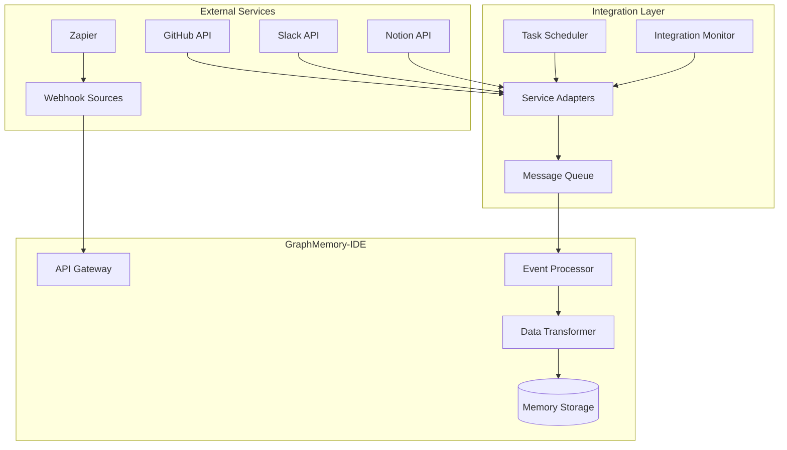
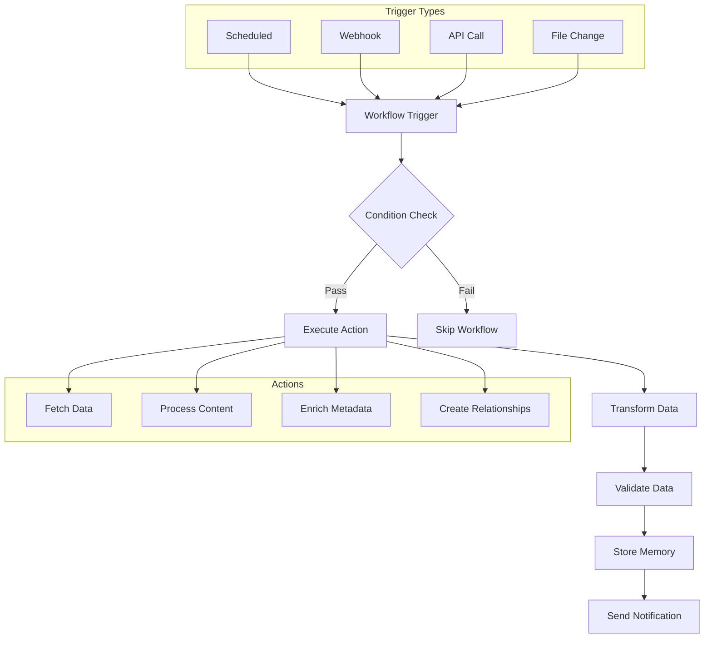
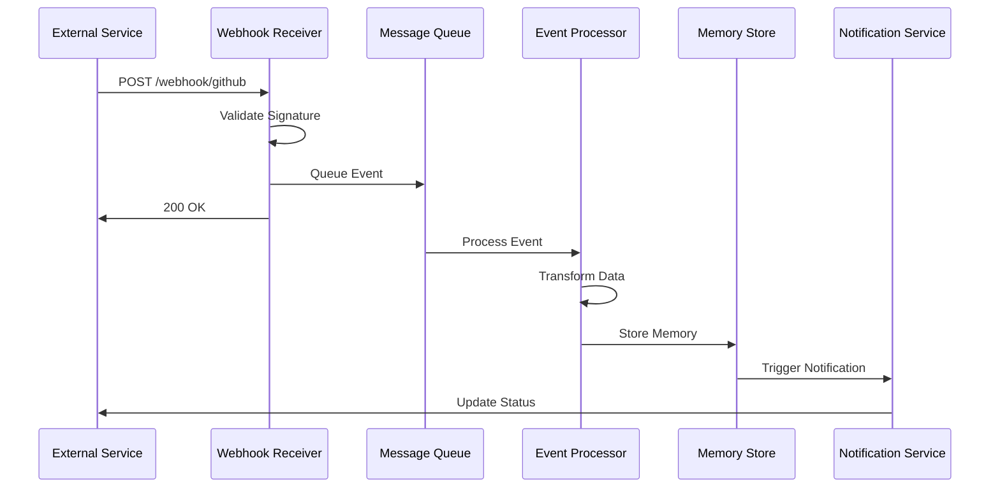
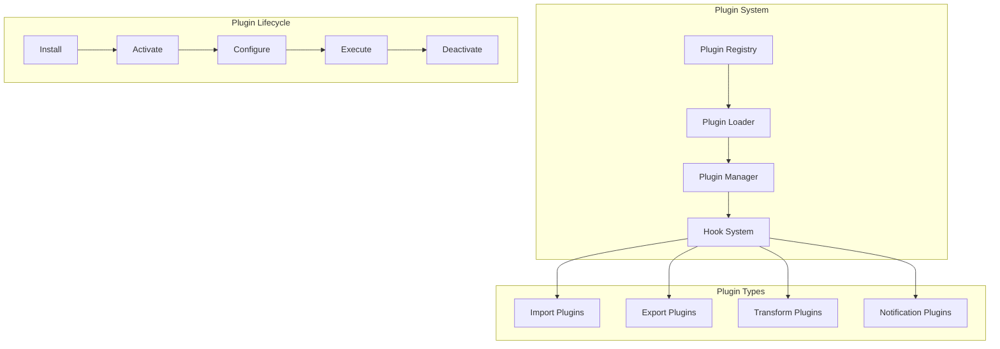
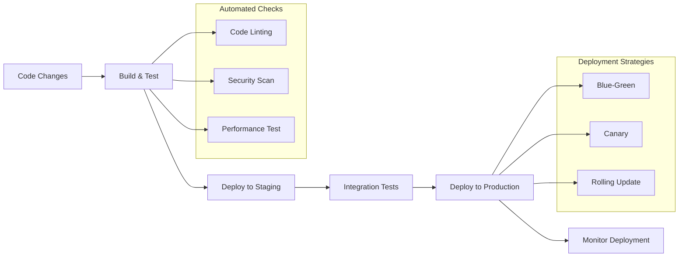
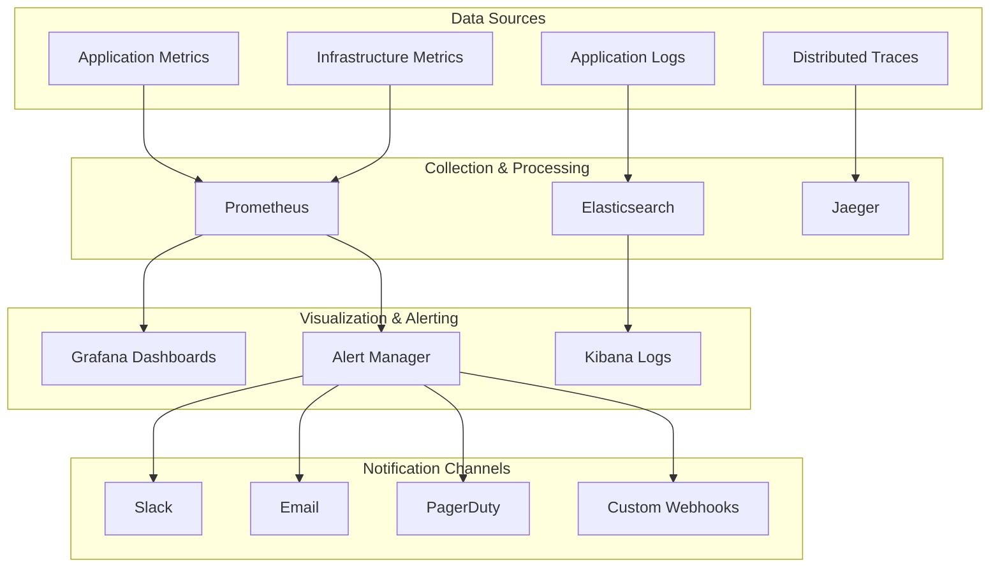
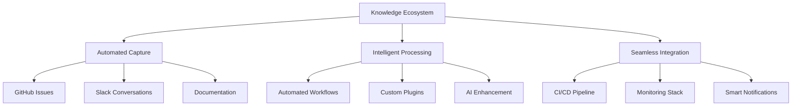

# Integration Tutorial

**Time Required:** 45 minutes  
**Prerequisites:** [Advanced Configuration Tutorial](advanced-configuration.md)  
**Difficulty:** Advanced

Welcome to the Integration Tutorial! You've mastered production configuration, and now it's time to integrate GraphMemory-IDE with external systems. You'll learn to build custom integrations, automate workflows, and create seamless data pipelines.

## 🎯 What You'll Learn

- Build custom API integrations with external services
- Create automated workflows and data pipelines
- Implement webhook systems for real-time updates
- Develop custom plugins and extensions
- Set up CI/CD integration for automated deployments
- Configure monitoring and alerting integrations

## 📋 What You'll Need

- Production GraphMemory-IDE deployment
- Access to external services (GitHub, Slack, etc.)
- API keys and authentication credentials
- 45 minutes of focused time
- Understanding of REST APIs and webhooks

## 🔌 Step 1: API Integration Architecture

Let's start by understanding how to integrate GraphMemory-IDE with external systems.

### Integration Architecture Overview



### 1.1 GitHub Integration

Create a GitHub integration for automatic knowledge capture:

```python
# integrations/github_integration.py
import asyncio
import aiohttp
from typing import Dict, List, Any
from datetime import datetime

class GitHubIntegration:
    def __init__(self, token: str, repo: str):
        self.token = token
        self.repo = repo
        self.base_url = "https://api.github.com"
        
    async def sync_issues_to_memories(self) -> List[Dict[str, Any]]:
        """Convert GitHub issues to memories"""
        issues = await self._fetch_issues()
        memories = []
        
        for issue in issues:
            memory = {
                "content": f"GitHub Issue: {issue['title']}\n\n{issue['body']}",
                "type": "task" if "bug" in issue.get("labels", []) else "insight",
                "tags": ["github", "issue"] + [label["name"] for label in issue.get("labels", [])],
                "metadata": {
                    "source": "github",
                    "issue_number": issue["number"],
                    "url": issue["html_url"],
                    "state": issue["state"],
                    "created_at": issue["created_at"]
                }
            }
            memories.append(memory)
            
        return memories
    
    async def _fetch_issues(self) -> List[Dict[str, Any]]:
        """Fetch issues from GitHub API"""
        headers = {
            "Authorization": f"token {self.token}",
            "Accept": "application/vnd.github.v3+json"
        }
        
        async with aiohttp.ClientSession() as session:
            async with session.get(
                f"{self.base_url}/repos/{self.repo}/issues",
                headers=headers
            ) as response:
                return await response.json()
```

### 1.2 Slack Integration

Build a Slack bot for interactive memory management:

```python
# integrations/slack_integration.py
from slack_bolt.async_app import AsyncApp
from slack_bolt.adapter.fastapi.async_handler import AsyncSlackRequestHandler
import re

class SlackBot:
    def __init__(self, bot_token: str, signing_secret: str):
        self.app = AsyncApp(
            token=bot_token,
            signing_secret=signing_secret
        )
        self._setup_handlers()
    
    def _setup_handlers(self):
        @self.app.message(re.compile(r"remember (.+)"))
        async def handle_remember(message, say, context):
            """Handle 'remember' commands"""
            content = context["matches"][0]
            
            memory = await self._create_memory(
                content=content,
                user_id=message["user"],
                channel=message["channel"]
            )
            
            await say(f"✅ Remembered: {content[:50]}...")
        
        @self.app.command("/search-memory")
        async def handle_search(ack, respond, command):
            """Handle memory search commands"""
            await ack()
            
            query = command["text"]
            results = await self._search_memories(query)
            
            blocks = self._format_search_results(results)
            await respond(blocks=blocks)
    
    async def _create_memory(self, content: str, user_id: str, channel: str) -> Dict[str, Any]:
        """Create memory from Slack message"""
        return {
            "content": content,
            "type": "insight",
            "tags": ["slack", "conversation"],
            "metadata": {
                "source": "slack",
                "user_id": user_id,
                "channel": channel,
                "timestamp": datetime.utcnow().isoformat()
            }
        }
```

## 🔄 Step 2: Automated Workflows

Create automated workflows for continuous knowledge capture.

### Workflow Architecture



### 2.1 Workflow Engine

```python
# workflows/engine.py
from typing import Dict, Any, Callable, List
import asyncio
from datetime import datetime, timedelta
import json

class WorkflowEngine:
    def __init__(self):
        self.workflows: Dict[str, Workflow] = {}
        self.running = False
    
    async def register_workflow(self, workflow: 'Workflow'):
        """Register a new workflow"""
        self.workflows[workflow.id] = workflow
        
    async def start(self):
        """Start the workflow engine"""
        self.running = True
        await asyncio.gather(*[
            self._run_scheduled_workflows(),
            self._process_webhook_queue()
        ])
    
    async def _run_scheduled_workflows(self):
        """Execute scheduled workflows"""
        while self.running:
            for workflow in self.workflows.values():
                if workflow.should_run():
                    await self._execute_workflow(workflow)
            await asyncio.sleep(60)  # Check every minute
    
    async def _execute_workflow(self, workflow: 'Workflow'):
        """Execute a single workflow"""
        try:
            context = WorkflowContext()
            
            # Check conditions
            if not await workflow.check_conditions(context):
                return
            
            # Execute actions
            for action in workflow.actions:
                await action.execute(context)
                
            # Update last run
            workflow.last_run = datetime.utcnow()
            
        except Exception as e:
            await self._handle_workflow_error(workflow, e)

class Workflow:
    def __init__(self, id: str, name: str, schedule: str = None):
        self.id = id
        self.name = name
        self.schedule = schedule
        self.conditions: List[Callable] = []
        self.actions: List['WorkflowAction'] = []
        self.last_run: datetime = None
    
    def should_run(self) -> bool:
        """Check if workflow should run based on schedule"""
        if not self.schedule:
            return False
            
        # Simple cron-like scheduling
        if self.schedule == "hourly":
            return not self.last_run or \
                   datetime.utcnow() - self.last_run > timedelta(hours=1)
        elif self.schedule == "daily":
            return not self.last_run or \
                   datetime.utcnow() - self.last_run > timedelta(days=1)
        
        return False
```

### 2.2 Example Workflows

```python
# workflows/examples.py

# Daily GitHub sync workflow
github_sync_workflow = Workflow(
    id="github_sync",
    name="Daily GitHub Sync",
    schedule="daily"
)

github_sync_workflow.actions = [
    FetchGitHubIssuesAction(repo="company/project"),
    TransformToMemoriesAction(),
    StoreMemoriesAction(),
    NotifySlackAction(channel="#knowledge")
]

# Real-time documentation workflow
docs_workflow = Workflow(
    id="docs_update",
    name="Documentation Update",
    schedule=None  # Webhook triggered
)

docs_workflow.actions = [
    ExtractDocumentationAction(),
    AnalyzeChangesAction(),
    CreateMemoryAction(type="documentation"),
    UpdateRelationshipsAction()
]

# Learning progress workflow
learning_workflow = Workflow(
    id="learning_progress",
    name="Learning Progress Tracking",
    schedule="weekly"
)

learning_workflow.actions = [
    AnalyzeLearningProgressAction(),
    GenerateInsightsAction(),
    CreateProgressReportAction(),
    ScheduleReviewAction()
]
```

## 📡 Step 3: Webhook System

Implement a robust webhook system for real-time integrations.

### Webhook Architecture



### 3.1 Webhook Receiver

```python
# webhooks/receiver.py
from fastapi import APIRouter, Request, HTTPException, Depends
from typing import Dict, Any
import hmac
import hashlib
import json

router = APIRouter()

class WebhookReceiver:
    def __init__(self):
        self.handlers: Dict[str, Callable] = {}
        
    def register_handler(self, source: str, handler: Callable):
        """Register a webhook handler for a specific source"""
        self.handlers[source] = handler
    
    async def process_webhook(self, source: str, payload: Dict[str, Any], headers: Dict[str, str]):
        """Process incoming webhook"""
        if source not in self.handlers:
            raise HTTPException(status_code=404, detail=f"No handler for {source}")
        
        # Validate signature
        if not await self._validate_signature(source, payload, headers):
            raise HTTPException(status_code=401, detail="Invalid signature")
        
        # Queue for processing
        await self._queue_event(source, payload)
        
        return {"status": "accepted"}

@router.post("/webhook/{source}")
async def receive_webhook(
    source: str,
    request: Request,
    receiver: WebhookReceiver = Depends()
):
    """Receive webhook from external service"""
    payload = await request.json()
    headers = dict(request.headers)
    
    return await receiver.process_webhook(source, payload, headers)

# GitHub webhook handler
async def handle_github_webhook(payload: Dict[str, Any]):
    """Handle GitHub webhook events"""
    event_type = payload.get("action")
    
    if event_type == "opened" and "issue" in payload:
        # New issue created
        issue = payload["issue"]
        memory = {
            "content": f"New GitHub Issue: {issue['title']}\n\n{issue['body']}",
            "type": "task",
            "tags": ["github", "issue", "new"],
            "metadata": {
                "source": "github_webhook",
                "issue_number": issue["number"],
                "url": issue["html_url"]
            }
        }
        await create_memory(memory)
    
    elif event_type == "closed" and "issue" in payload:
        # Issue closed - update existing memory
        issue = payload["issue"]
        await update_memory_status(
            source_id=f"github_issue_{issue['number']}",
            status="completed"
        )
```

### 3.2 Event Processing Pipeline

```python
# webhooks/processor.py
import asyncio
from typing import Dict, Any, List
from dataclasses import dataclass

@dataclass
class WebhookEvent:
    source: str
    event_type: str
    payload: Dict[str, Any]
    timestamp: datetime
    processed: bool = False

class EventProcessor:
    def __init__(self):
        self.queue: asyncio.Queue = asyncio.Queue()
        self.processors: Dict[str, Callable] = {}
        
    async def start_processing(self):
        """Start the event processing loop"""
        while True:
            event = await self.queue.get()
            await self._process_event(event)
            self.queue.task_done()
    
    async def _process_event(self, event: WebhookEvent):
        """Process a single webhook event"""
        try:
            processor = self.processors.get(event.source)
            if processor:
                await processor(event)
            
            event.processed = True
            
        except Exception as e:
            await self._handle_processing_error(event, e)
    
    async def queue_event(self, source: str, payload: Dict[str, Any]):
        """Queue an event for processing"""
        event = WebhookEvent(
            source=source,
            event_type=payload.get("action", "unknown"),
            payload=payload,
            timestamp=datetime.utcnow()
        )
        await self.queue.put(event)
```

## 🔧 Step 4: Custom Plugin Development

Create custom plugins to extend GraphMemory-IDE functionality.

### Plugin Architecture



### 4.1 Plugin Framework

```python
# plugins/framework.py
from abc import ABC, abstractmethod
from typing import Dict, Any, List, Optional
import importlib
import inspect

class Plugin(ABC):
    """Base plugin class"""
    
    def __init__(self):
        self.name: str = ""
        self.version: str = "1.0.0"
        self.description: str = ""
        self.author: str = ""
        self.enabled: bool = False
    
    @abstractmethod
    async def initialize(self, config: Dict[str, Any]):
        """Initialize the plugin"""
        pass
    
    @abstractmethod
    async def execute(self, context: Dict[str, Any]) -> Dict[str, Any]:
        """Execute the plugin"""
        pass
    
    async def cleanup(self):
        """Cleanup plugin resources"""
        pass

class PluginManager:
    def __init__(self):
        self.plugins: Dict[str, Plugin] = {}
        self.hooks: Dict[str, List[Plugin]] = {}
    
    async def load_plugin(self, plugin_path: str, config: Dict[str, Any] = None):
        """Load a plugin from file"""
        module = importlib.import_module(plugin_path)
        
        # Find plugin class
        for name, obj in inspect.getmembers(module):
            if inspect.isclass(obj) and issubclass(obj, Plugin) and obj != Plugin:
                plugin = obj()
                await plugin.initialize(config or {})
                self.plugins[plugin.name] = plugin
                break
    
    async def register_hook(self, hook_name: str, plugin: Plugin):
        """Register a plugin for a specific hook"""
        if hook_name not in self.hooks:
            self.hooks[hook_name] = []
        self.hooks[hook_name].append(plugin)
    
    async def execute_hook(self, hook_name: str, context: Dict[str, Any]) -> List[Dict[str, Any]]:
        """Execute all plugins registered for a hook"""
        results = []
        
        if hook_name in self.hooks:
            for plugin in self.hooks[hook_name]:
                if plugin.enabled:
                    result = await plugin.execute(context)
                    results.append(result)
        
        return results
```

### 4.2 Example Plugins

```python
# plugins/notion_importer.py
class NotionImporterPlugin(Plugin):
    def __init__(self):
        super().__init__()
        self.name = "notion_importer"
        self.description = "Import pages from Notion"
    
    async def initialize(self, config: Dict[str, Any]):
        self.notion_token = config.get("notion_token")
        self.database_id = config.get("database_id")
    
    async def execute(self, context: Dict[str, Any]) -> Dict[str, Any]:
        """Import Notion pages as memories"""
        pages = await self._fetch_notion_pages()
        memories = []
        
        for page in pages:
            memory = {
                "content": page["content"],
                "type": "note",
                "tags": ["notion", "imported"],
                "metadata": {
                    "source": "notion",
                    "page_id": page["id"],
                    "url": page["url"]
                }
            }
            memories.append(memory)
        
        return {"memories": memories, "count": len(memories)}

# plugins/ai_summarizer.py
class AISummarizerPlugin(Plugin):
    def __init__(self):
        super().__init__()
        self.name = "ai_summarizer"
        self.description = "Generate AI summaries of memories"
    
    async def execute(self, context: Dict[str, Any]) -> Dict[str, Any]:
        """Generate summary for memory content"""
        content = context.get("content", "")
        
        if len(content) > 500:  # Only summarize long content
            summary = await self._generate_summary(content)
            return {
                "summary": summary,
                "original_length": len(content),
                "summary_length": len(summary)
            }
        
        return {"summary": content}
```

## 🚀 Step 5: CI/CD Integration

Integrate GraphMemory-IDE with your CI/CD pipeline for automated deployments.

### CI/CD Pipeline



### 5.1 GitHub Actions Workflow

```yaml
# .github/workflows/deploy.yml
name: Deploy GraphMemory-IDE

on:
  push:
    branches: [main]
  pull_request:
    branches: [main]

jobs:
  test:
    runs-on: ubuntu-latest
    steps:
      - uses: actions/checkout@v3
      
      - name: Set up Python
        uses: actions/setup-python@v4
        with:
          python-version: '3.11'
      
      - name: Install dependencies
        run: |
          pip install -r requirements.txt
          pip install -r requirements-dev.txt
      
      - name: Run tests
        run: |
          pytest tests/ --cov=graphmemory --cov-report=xml
      
      - name: Security scan
        run: |
          bandit -r graphmemory/
          safety check
      
      - name: Upload coverage
        uses: codecov/codecov-action@v3

  deploy-staging:
    needs: test
    runs-on: ubuntu-latest
    if: github.ref == 'refs/heads/main'
    
    steps:
      - uses: actions/checkout@v3
      
      - name: Deploy to staging
        run: |
          # Deploy to staging environment
          kubectl apply -f k8s/staging/
          kubectl rollout status deployment/graphmemory-api -n staging
      
      - name: Run integration tests
        run: |
          pytest tests/integration/ --env=staging

  deploy-production:
    needs: deploy-staging
    runs-on: ubuntu-latest
    environment: production
    
    steps:
      - uses: actions/checkout@v3
      
      - name: Deploy to production
        run: |
          # Blue-green deployment
          kubectl apply -f k8s/production/
          kubectl rollout status deployment/graphmemory-api -n production
      
      - name: Health check
        run: |
          curl -f https://api.graphmemory.com/health
      
      - name: Notify team
        uses: 8398a7/action-slack@v3
        with:
          status: ${{ job.status }}
          channel: '#deployments'
```

## 📊 Step 6: Monitoring Integration

Set up comprehensive monitoring and alerting integrations.

### Monitoring Integration Flow



### 6.1 Custom Monitoring Integration

```python
# monitoring/integrations.py
import asyncio
import aiohttp
from typing import Dict, Any, List

class MonitoringIntegration:
    def __init__(self, config: Dict[str, Any]):
        self.slack_webhook = config.get("slack_webhook")
        self.pagerduty_key = config.get("pagerduty_key")
        self.custom_webhooks = config.get("custom_webhooks", [])
    
    async def send_alert(self, alert: Dict[str, Any]):
        """Send alert to all configured channels"""
        tasks = []
        
        if self.slack_webhook:
            tasks.append(self._send_slack_alert(alert))
        
        if self.pagerduty_key:
            tasks.append(self._send_pagerduty_alert(alert))
        
        for webhook in self.custom_webhooks:
            tasks.append(self._send_webhook_alert(webhook, alert))
        
        await asyncio.gather(*tasks, return_exceptions=True)
    
    async def _send_slack_alert(self, alert: Dict[str, Any]):
        """Send alert to Slack"""
        severity_colors = {
            "critical": "#FF0000",
            "warning": "#FFA500",
            "info": "#00FF00"
        }
        
        payload = {
            "attachments": [{
                "color": severity_colors.get(alert["severity"], "#808080"),
                "title": f"🚨 {alert['title']}",
                "text": alert["description"],
                "fields": [
                    {"title": "Severity", "value": alert["severity"], "short": True},
                    {"title": "Service", "value": alert.get("service", "GraphMemory-IDE"), "short": True},
                    {"title": "Time", "value": alert["timestamp"], "short": True}
                ]
            }]
        }
        
        async with aiohttp.ClientSession() as session:
            await session.post(self.slack_webhook, json=payload)
```

## 🎉 What You've Accomplished

Congratulations! You've mastered advanced GraphMemory-IDE integrations:

✅ **API Integrations** - GitHub, Slack, Notion, and custom services  
✅ **Automated Workflows** - Scheduled tasks and event-driven processes  
✅ **Webhook System** - Real-time event processing and notifications  
✅ **Custom Plugins** - Extensible plugin architecture and development  
✅ **CI/CD Integration** - Automated testing, deployment, and monitoring  
✅ **Monitoring Integration** - Comprehensive alerting and notification systems  

### Your Integrated Knowledge Ecosystem

You now have a fully integrated knowledge management system:



## 🚀 Next Steps

Your integration mastery opens new possibilities:

1. **Build domain-specific integrations** - Create integrations for your specific tools and workflows
2. **Develop advanced plugins** - Build sophisticated AI-powered plugins
3. **Create integration templates** - Share reusable integration patterns
4. **Contribute to the community** - Share your integrations with other users

## 🛠️ Troubleshooting

### Common Integration Issues

**Problem**: Webhook timeouts
```python
# Solution: Implement async processing
@router.post("/webhook/{source}")
async def receive_webhook(source: str, request: Request):
    payload = await request.json()
    
    # Queue for async processing
    await event_queue.put({"source": source, "payload": payload})
    
    # Return immediately
    return {"status": "accepted"}
```

**Problem**: API rate limiting
```python
# Solution: Implement rate limiting and retry logic
import asyncio
from tenacity import retry, stop_after_attempt, wait_exponential

@retry(stop=stop_after_attempt(3), wait=wait_exponential(multiplier=1, min=4, max=10))
async def api_call_with_retry(url: str, headers: Dict[str, str]):
    async with aiohttp.ClientSession() as session:
        async with session.get(url, headers=headers) as response:
            if response.status == 429:  # Rate limited
                await asyncio.sleep(int(response.headers.get("Retry-After", 60)))
                raise Exception("Rate limited")
            return await response.json()
```

**Problem**: Plugin conflicts
```python
# Solution: Implement plugin isolation
class IsolatedPluginRunner:
    async def run_plugin(self, plugin: Plugin, context: Dict[str, Any]):
        try:
            # Run plugin in isolated context
            isolated_context = context.copy()
            result = await plugin.execute(isolated_context)
            return result
        except Exception as e:
            # Log error but don't affect other plugins
            logger.error(f"Plugin {plugin.name} failed: {e}")
            return {"error": str(e)}
```

### Getting Help

For integration support:
1. Check the [API Guide](../API_GUIDE.md) for integration endpoints
2. Review [Plugin Development Guide](../../PLUGIN_DEVELOPMENT.md) for custom plugins
3. Join [GitHub Discussions](https://github.com/elementalcollision/GraphMemory-IDE/discussions) for community support

## 📚 Additional Resources

- **[API Guide](../API_GUIDE.md)** - Complete API reference for integrations
- **[Plugin Development Guide](../../PLUGIN_DEVELOPMENT.md)** - Advanced plugin development
- **[Operations Guide](../../OPERATIONS.md)** - Production operations and monitoring

---

**🎯 Congratulations!** You've completed the comprehensive GraphMemory-IDE tutorial series. You now have the skills to build, deploy, and integrate a production-ready knowledge management system.

*Exceptional work! You're now ready to create sophisticated integrations and automated workflows that will transform how you capture, process, and leverage knowledge.* 