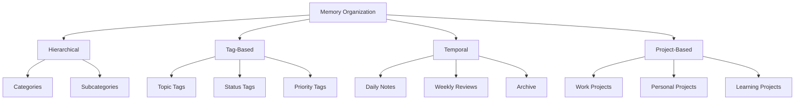
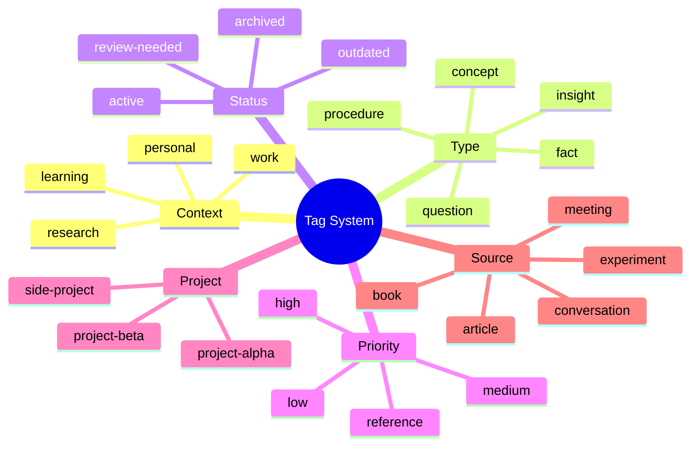
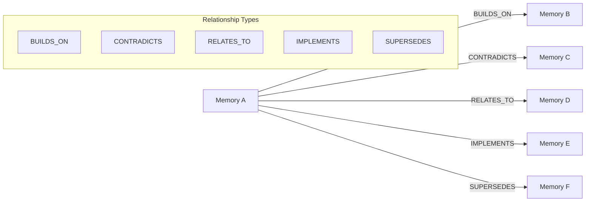
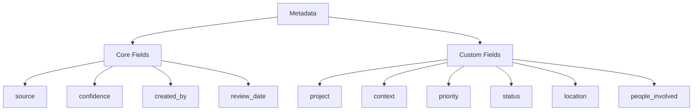
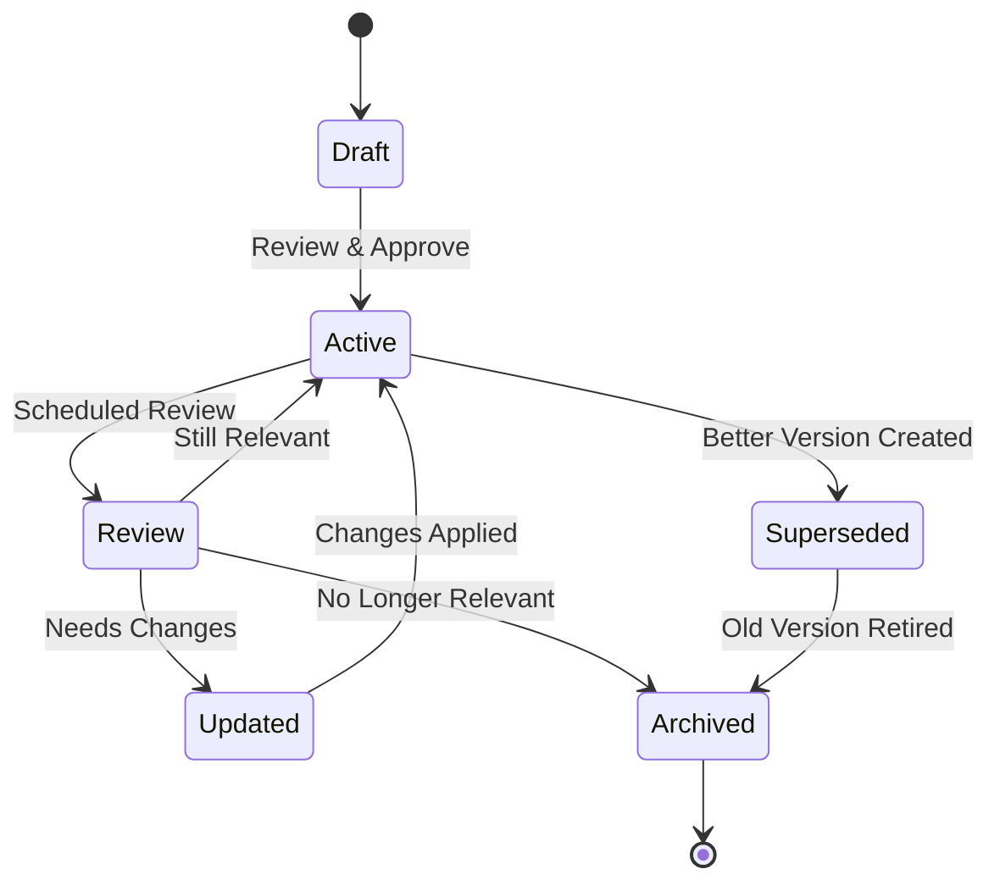
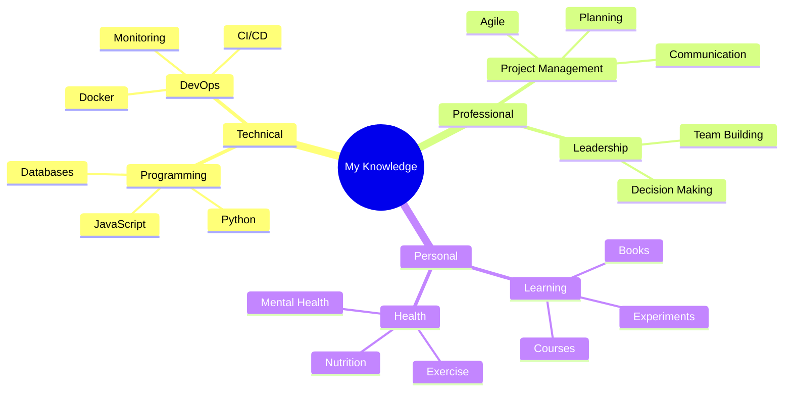
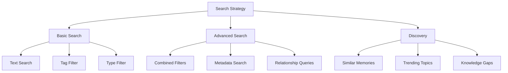
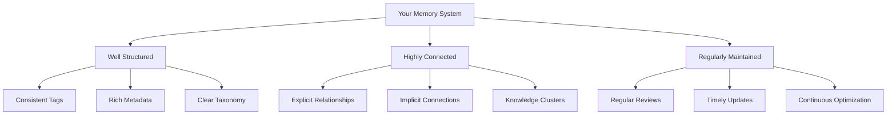

# Memory Management Tutorial

**Time Required:** 20 minutes  
**Prerequisites:** [Getting Started Tutorial](getting-started.md)  
**Difficulty:** Beginner to Intermediate

Now that you know the basics of creating memories, let's learn how to organize and manage them effectively. This tutorial will teach you advanced techniques for structuring your knowledge and maintaining a clean, searchable memory system.

## 🎯 What You'll Learn

- Organize memories with tags and categories
- Create meaningful relationships between memories
- Use metadata effectively
- Implement memory lifecycle management
- Design a personal knowledge taxonomy

## 📋 What You'll Need

- GraphMemory-IDE running (from previous tutorial)
- The memories you created in the Getting Started tutorial
- 20 minutes of focused time

## 🏗️ Step 1: Understanding Memory Organization

Effective memory management is like organizing a library. Let's explore different organizational strategies:



### Organization Strategies

1. **Hierarchical**: Use nested categories (e.g., `work/project-a/meetings`)
2. **Tag-Based**: Use multiple tags for flexible categorization
3. **Temporal**: Organize by time periods
4. **Project-Based**: Group by specific projects or goals

## 🏷️ Step 2: Advanced Tagging Strategies

Let's develop a comprehensive tagging system for your memories.

### Tag Categories

Create a structured approach to tagging:



### Implementing Your Tag System

Let's update your existing memories with better tags:

1. **Find your first memory** (the GraphMemory-IDE concept)

2. **Update its tags** to include:
   ```
   Tags: learning, concept, graphdb, knowledge-management, tutorial, active
   ```

3. **Add metadata** to provide more context:
   ```json
   {
     "source": "tutorial",
     "confidence": 0.9,
     "project": "learning-graphmemory",
     "review_date": "2025-02-27"
   }
   ```

### Tag Naming Conventions

Follow these conventions for consistency:

- **Use lowercase**: `machine-learning` not `Machine-Learning`
- **Use hyphens**: `project-alpha` not `project_alpha`
- **Be specific**: `python-debugging` not just `debugging`
- **Use prefixes**: `proj:alpha`, `status:active`, `priority:high`

## 🔗 Step 3: Creating Meaningful Relationships

Let's learn how to explicitly create relationships between memories.

### Relationship Types



### Creating Explicit Relationships

Let's create some relationships between your memories:

1. **Create a new memory** about graph database benefits:
   ```
   Content: "Graph databases excel at finding complex relationships between data points"
   Type: insight
   Tags: graphdb, database-theory, insight, learning
   ```

2. **Link it to your existing memories** using the API or CLI:
   ```bash
   # Using CLI to create relationship
   graphmemory relationship create \
     --from "memory-id-1" \
     --to "memory-id-2" \
     --type "BUILDS_ON" \
     --properties '{"strength": 0.8, "context": "database-concepts"}'
   ```

### Relationship Best Practices

- **Be selective**: Don't over-connect memories
- **Use meaningful types**: Choose relationship types that add value
- **Add context**: Use properties to explain the relationship
- **Review regularly**: Update relationships as your understanding evolves

## 📊 Step 4: Using Metadata Effectively

Metadata adds rich context to your memories. Let's explore advanced metadata strategies.

### Metadata Schema

Design a consistent metadata structure:



### Practical Metadata Examples

Let's add rich metadata to a new memory:

```json
{
  "content": "Daily standup meetings should be timeboxed to 15 minutes maximum",
  "type": "insight",
  "tags": ["meetings", "productivity", "team-management", "best-practices"],
  "metadata": {
    "source": "team-retrospective",
    "confidence": 0.85,
    "project": "team-efficiency",
    "context": "remote-work",
    "people_involved": ["team-lead", "developers"],
    "location": "virtual",
    "review_date": "2025-03-27",
    "priority": "medium",
    "status": "active",
    "evidence": "observed 20% productivity increase"
  }
}
```

### Metadata for Different Memory Types

**Facts**: Include source, verification date, accuracy confidence
**Insights**: Include confidence level, supporting evidence, review date
**Procedures**: Include last tested date, success rate, prerequisites
**Concepts**: Include learning source, understanding level, related concepts

## 🔄 Step 5: Memory Lifecycle Management

Implement a system for managing memories over time.

### Memory Lifecycle



### Implementing Lifecycle Management

1. **Create a review schedule**:
   ```bash
   # Tag memories that need regular review
   graphmemory memory update <memory-id> \
     --add-tags "review-monthly" \
     --metadata '{"next_review": "2025-02-27"}'
   ```

2. **Archive outdated memories**:
   ```bash
   # Archive old memories
   graphmemory memory update <memory-id> \
     --add-tags "archived" \
     --metadata '{"archived_date": "2025-01-27", "reason": "superseded"}'
   ```

3. **Create superseding relationships**:
   ```bash
   # Link new memory to old one
   graphmemory relationship create \
     --from "new-memory-id" \
     --to "old-memory-id" \
     --type "SUPERSEDES"
   ```

## 📚 Step 6: Building a Knowledge Taxonomy

Let's create a structured approach to organizing your domain knowledge.

### Personal Knowledge Domains

Identify your key knowledge areas:



### Creating Domain-Specific Memories

Let's create memories for each domain:

1. **Technical Domain Memory**:
   ```
   Content: "Python's asyncio library enables concurrent programming without threads"
   Type: concept
   Tags: python, asyncio, concurrency, programming, technical
   Metadata: {"domain": "technical", "subdomain": "programming", "language": "python"}
   ```

2. **Professional Domain Memory**:
   ```
   Content: "Regular 1-on-1 meetings improve team communication and identify issues early"
   Type: insight
   Tags: management, communication, team-building, professional
   Metadata: {"domain": "professional", "subdomain": "leadership", "evidence": "team-feedback"}
   ```

3. **Personal Domain Memory**:
   ```
   Content: "Reading for 30 minutes before bed improves sleep quality"
   Type: insight
   Tags: health, sleep, reading, personal, habits
   Metadata: {"domain": "personal", "subdomain": "health", "experiment_duration": "30-days"}
   ```

## 🔍 Step 7: Advanced Search and Discovery

Now let's explore powerful ways to find and discover information in your organized memory system.

### Search Strategies



### Complex Queries

Try these advanced search patterns:

1. **Find memories needing review**:
   ```cypher
   MATCH (m:Memory) 
   WHERE m.metadata.review_date <= date() 
   AND 'active' IN m.tags
   RETURN m
   ```

2. **Discover knowledge clusters**:
   ```cypher
   MATCH (m1:Memory)-[r]-(m2:Memory)
   WHERE m1.type = 'concept' AND m2.type = 'insight'
   RETURN m1, r, m2
   ```

3. **Find learning progression**:
   ```cypher
   MATCH path = (start:Memory)-[:BUILDS_ON*]->(end:Memory)
   WHERE 'learning' IN start.tags
   RETURN path ORDER BY length(path) DESC
   ```

## 🎯 Step 8: Maintenance and Optimization

Keep your memory system healthy with regular maintenance.

### Weekly Review Process

1. **Review new memories** (check tags and metadata)
2. **Update relationships** (add missing connections)
3. **Archive outdated content** (mark as superseded)
4. **Identify knowledge gaps** (areas needing more memories)

### Monthly Optimization

1. **Analyze tag usage** (consolidate similar tags)
2. **Review metadata consistency** (standardize formats)
3. **Optimize search performance** (remove unused memories)
4. **Update taxonomy** (refine organization structure)

### Maintenance Commands

```bash
# Find memories without tags
graphmemory search --filter "tags:empty"

# Find orphaned memories (no relationships)
graphmemory graph query "MATCH (m:Memory) WHERE NOT (m)-[]-() RETURN m"

# List most used tags
graphmemory analytics tags --sort-by-usage

# Find duplicate content
graphmemory analytics duplicates --threshold 0.8
```

## 🎉 What You've Accomplished

Congratulations! You've learned:

✅ **Advanced tagging strategies**  
✅ **Relationship management**  
✅ **Metadata best practices**  
✅ **Memory lifecycle management**  
✅ **Knowledge taxonomy design**  
✅ **Advanced search techniques**  
✅ **Maintenance procedures**  

### Your Organized Memory System

You now have a well-structured memory system:



## 🚀 Next Steps

You're ready for more advanced topics:

1. **[Graph Operations Tutorial](graph-operations.md)** - Learn complex graph queries
2. **[Advanced Configuration Tutorial](advanced-configuration.md)** - Optimize for production
3. **Explore automation** - Set up automated memory creation from external sources
4. **Build integrations** - Connect with your existing tools and workflows

## 🛠️ Troubleshooting

### Common Organization Issues

**Problem**: Too many tags, hard to find memories
- **Solution**: Consolidate similar tags, use tag hierarchies

**Problem**: Relationships become overwhelming
- **Solution**: Focus on the most important connections, use relationship types

**Problem**: Metadata inconsistency
- **Solution**: Create metadata templates, use validation rules

### Getting Help

For organization and management questions:
1. Check the [User Guide](../USER_GUIDE.md) for detailed feature documentation
2. Browse [GitHub Discussions](https://github.com/elementalcollision/GraphMemory-IDE/discussions) for community tips
3. Review the [API Guide](../API_GUIDE.md) for automation possibilities

## 📚 Additional Resources

- **[Graph Operations Tutorial](graph-operations.md)** - Advanced graph database techniques
- **[User Guide](../USER_GUIDE.md)** - Complete feature reference
- **[API Guide](../API_GUIDE.md)** - Automation and integration guide

---

**🎯 Ready to dive deeper?** Continue with the [Graph Operations Tutorial](graph-operations.md) to master complex queries and graph analytics.

*Excellent work! You now have the skills to build and maintain a powerful personal knowledge management system.* 