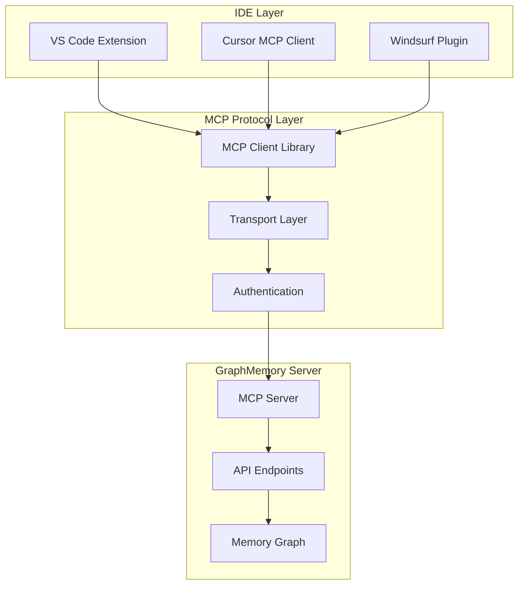
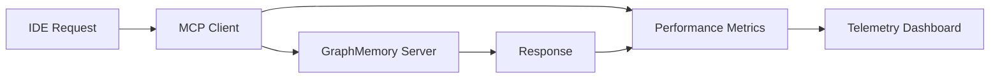

# GraphMemory-IDE Plugins

This directory contains IDE plugin implementations for GraphMemory-IDE using the Model Context Protocol (MCP). These plugins enable seamless integration with popular IDEs including VS Code, Cursor, and Windsurf.

## 🏗️ Architecture Overview



## 📁 Directory Structure

```
ide-plugins/
├── README.md                    # This file
├── shared/                      # Shared MCP client library
│   ├── mcp-client.ts           # Core MCP client implementation
│   ├── types.ts                # TypeScript type definitions
│   ├── auth.ts                 # Authentication handling
│   └── utils.ts                # Utility functions
├── vscode/                     # VS Code extension
│   ├── package.json            # Extension manifest
│   ├── src/                    # Extension source code
│   └── README.md               # VS Code specific setup
├── cursor/                     # Cursor IDE integration
│   ├── mcp-config.json         # Cursor MCP configuration
│   ├── server.ts               # MCP server for Cursor
│   └── README.md               # Cursor specific setup
├── windsurf/                   # Windsurf IDE integration
│   ├── plugin.ts               # Windsurf plugin implementation
│   └── README.md               # Windsurf specific setup
└── tests/                      # Integration tests
    ├── mcp-client.test.ts      # Client library tests
    ├── integration.test.ts     # End-to-end tests
    └── fixtures/               # Test fixtures
```

## 🚀 Quick Start

### Prerequisites

- Node.js 18+ and npm
- GraphMemory-IDE server running (see main README.md)
- One of the supported IDEs installed

### Installation

1. **Install dependencies:**
   ```bash
   cd ide-plugins
   npm install
   ```

2. **Build the shared library:**
   ```bash
   npm run build
   ```

3. **Choose your IDE and follow the specific setup:**
   - [VS Code Setup](vscode/README.md)
   - [Cursor Setup](cursor/README.md)
   - [Windsurf Setup](windsurf/README.md)

## 🔧 Available Tools

The MCP client provides these tools to IDEs:

### Memory Management
- `memory_search` - Semantic search across your memory graph
- `memory_create` - Create new memory entries
- `memory_update` - Update existing memories
- `memory_delete` - Remove memories
- `memory_relate` - Create relationships between memories

### Graph Operations
- `graph_query` - Execute Cypher queries
- `graph_analyze` - Analyze graph structure and patterns
- `graph_visualize` - Generate graph visualizations

### Knowledge Discovery
- `knowledge_cluster` - Find related knowledge clusters
- `knowledge_insights` - Generate insights from memory patterns
- `knowledge_recommend` - Get recommendations based on context

## 🔐 Authentication

All plugins support multiple authentication methods:

1. **JWT Token Authentication** (Recommended)
2. **API Key Authentication**
3. **mTLS Certificate Authentication** (Enterprise)

Configure authentication in your IDE's settings or configuration file.

## 🧪 Testing

Run the test suite to verify your setup:

```bash
# Run all tests
npm test

# Run specific test suites
npm run test:client
npm run test:integration

# Run tests with coverage
npm run test:coverage
```

## 📊 Performance Monitoring

The plugins include built-in performance monitoring:



Metrics tracked:
- Request latency
- Success/error rates
- Memory usage
- Cache hit rates

## 🔧 Configuration

### Global Configuration

Create a `.graphmemory` config file in your home directory:

```json
{
  "server": {
    "url": "http://localhost:8000",
    "timeout": 30000
  },
  "auth": {
    "method": "jwt",
    "token": "your-jwt-token"
  },
  "features": {
    "autoComplete": true,
    "semanticSearch": true,
    "graphVisualization": true
  },
  "performance": {
    "cacheEnabled": true,
    "batchRequests": true,
    "maxConcurrentRequests": 5
  }
}
```

### IDE-Specific Configuration

Each IDE has its own configuration format:

- **VS Code**: Settings in `settings.json`
- **Cursor**: MCP configuration in `.cursor/mcp.json`
- **Windsurf**: Plugin settings in workspace configuration

## 🐛 Troubleshooting

### Common Issues

1. **Connection Failed**
   ```bash
   # Check server status
   curl http://localhost:8000/health
   
   # Verify authentication
   curl -H "Authorization: Bearer YOUR_TOKEN" http://localhost:8000/api/v1/status
   ```

2. **Authentication Errors**
   - Verify token is valid and not expired
   - Check server logs for authentication failures
   - Ensure correct authentication method is configured

3. **Performance Issues**
   - Enable request batching in configuration
   - Increase cache size
   - Check network latency to server

### Debug Mode

Enable debug logging in your IDE configuration:

```json
{
  "graphmemory.debug": true,
  "graphmemory.logLevel": "debug"
}
```

## 🤝 Contributing

1. Fork the repository
2. Create a feature branch
3. Add tests for new functionality
4. Ensure all tests pass
5. Submit a pull request

### Development Setup

```bash
# Install development dependencies
npm install --include=dev

# Run in development mode
npm run dev

# Run linting
npm run lint

# Format code
npm run format
```

## 📚 Resources

- [Model Context Protocol Specification](https://spec.modelcontextprotocol.io/)
- [GraphMemory-IDE API Documentation](../docs/API_GUIDE.md)
- [VS Code Extension Development](https://code.visualstudio.com/api)
- [Cursor MCP Integration Guide](https://docs.cursor.com/mcp)

## 📄 License

This project is licensed under the MIT License - see the [LICENSE](../LICENSE) file for details.

## 🆘 Support

- [GitHub Issues](https://github.com/elementalcollision/GraphMemory-IDE/issues)
- [Documentation](../docs/)
- [Community Discord](https://discord.gg/graphmemory) 